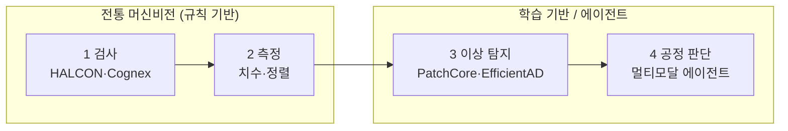

## 0. 검사 카메라는 오래됐다, 에이전트는 새롭다

제조 현장에서 카메라로 불량을 거르는 일은 새롭지 않다. 머신비전(machine vision)이라는 이름으로 수십 년간 쓰여 왔고, 설치 기반은 2025년 기준 거의 1억 대에 이른다. Cognex In-Sight, Keyence 비전 시스템처럼 카메라·조명·판정 소프트웨어를 묶은 턴키 장비가 라인마다 박혀 있다. 이들의 강점은 빠르고 일관된 규칙 기반 판정이고, 약점은 규칙 밖의 상황에 약하다는 것이다. 새 불량 유형이 나타나면 규칙을 사람이 다시 짜야 한다.

비전 기반 제조공정 에이전트는 이 그림을 한 칸 옮긴다. 카메라가 보는 것은 같지만, 그 뒤에 붙는 것이 고정 규칙이 아니라 학습된 모델과 판단 로직이다. 불량을 거르는 데서 멈추지 않고, 공정 상태를 읽고 다음 행동을 정하는 데까지 간다.

> **검사 카메라는 "이 부품이 합격인가"를 묻는다. 공정 에이전트는 "지금 공정에 무슨 일이 일어나는가"를 묻는다.**

이 글은 그 전환이 어떤 단계를 밟는지, 각 단계에서 어떤 모델·도구·데이터셋이 실제로 쓰이는지, 그리고 사람이 무엇을 정해야 하는지를 정리한 스터디 노트다.

## 1. 네 단계로 보는 비전의 역할 상승

제조 비전의 역할은 네 단계로 올라간다. 단계마다 실제로 쓰는 기술이 다르다.

| 단계 | 하는 일 | 대표 기술·도구 | 질문 |
|---|---|---|---|
| 1. 검사 | 불량/정상 분류 | 규칙 기반 머신비전(Cognex, Keyence), MVTec HALCON, OpenCV | 이 부품은 합격인가 |
| 2. 측정 | 치수·위치·정렬 정량화 | 캘리브레이션 + 에지/블롭 검출(HALCON, OpenCV) | 규격 안에 들어오는가 |
| 3. 이상 탐지 | 정상 분포에서 벗어남 감지 | PatchCore·PaDiM·EfficientAD (Anomalib) | 평소와 다른가 |
| 4. 공정 판단 | 원인 추정·조치 제안 | 멀티모달 에이전트(이미지+공정로그+센서) | 왜 이렇고 무엇을 바꿔야 하는가 |

*그림. 검사·측정은 규칙 기반(HALCON·Cognex), 이상 탐지·공정 판단은 학습 기반. 앞 단계가 안정돼야 뒷 단계를 신뢰한다.*

1·2단계는 전통 머신비전의 영역이다. 라벨이 분명하고 규칙이 명시적이라, MVTec HALCON이나 OpenCV로 에지·블롭·템플릿 매칭을 짜면 된다. 3단계부터 학습 기반이 힘을 받는다. 모든 불량 유형을 미리 정의할 수 없을 때, 정상 데이터만 학습해 두고 거기서 벗어나는 패턴을 잡는 이상 탐지(anomaly detection)가 들어온다. 4단계가 에이전트의 자리다. 카메라가 본 이미지에 공정 로그·설비 센서값을 함께 읽고 원인 추정과 조치까지 연결한다.

핵심은 단계를 건너뛰지 않는 것이다. 4단계 에이전트는 1·2·3단계가 안정적으로 돌 때만 신뢰할 수 있다. 검사·측정이 흔들리면 그 위에 얹은 판단은 모래 위의 집이다.

## 2. 이상 탐지 — 불량이 드물 때의 정석

제조 비전 모델의 가장 큰 제약은 데이터의 비대칭이다. 잘 돌아가는 공정일수록 불량 샘플이 적다. 양품 사진은 수만 장인데 특정 불량은 몇 장뿐인 상황이 흔하다. 불량 샘플이 충분하면 분류 모델(양품 대 불량)이 정석이지만, 불량이 드물면 접근을 뒤집는다. 양품의 정상 분포만 학습하고 거기서 멀어지는 것을 불량 후보로 보는 비지도 이상 탐지로 간다.

이 분야의 표준 벤치마크가 MVTec AD다. 5,354장의 고해상도 이미지에 15개 카테고리(나사·캡슐·직물 등)와 70여 종의 결함(스크래치·찍힘·오염 등)이 들어 있다. 주요 방법은 이 데이터셋에서 이렇게 비교된다.

| 방법 | 핵심 아이디어 | MVTec AD 이미지 AUROC | 속도 | 엣지 적합성 |
|---|---|---|---|---|
| PatchCore | 양품 패치 특징을 메모리뱅크에 저장, 추론 시 최근접 비교(kNN) | ~99.1% (SOTA급) | 중간 | PatchCore-Lite |
| PaDiM | 패치 위치별 다변량 가우시안 + 마할라노비스 거리 | ~95% | 중간 | PaDiM-Lite |
| EfficientAD | student-teacher + 오토인코더, 저지연 설계 | ~99% | 매우 빠름(밀리초급) | 우수 |

이 모델들은 Intel이 공개한 오픈소스 라이브러리 **Anomalib**로 묶여 있다. PatchCore·PaDiM·EfficientAD·FastFlow·STFPM을 같은 인터페이스로 학습·평가하고, OpenVINO로 내보내 엣지에 올린다. 라인 속도가 중요하면 EfficientAD처럼 밀리초급 모델을, 국소 위치 정확도가 중요하면 PatchCore를 고르는 식으로 갈린다.

여기서 사람이 정할 것이 분명하다. 정상의 경계를 어디에 그을지, 즉 이상 점수의 임계값(threshold)이다. 빡빡하게 잡으면 멀쩡한 부품을 버리고(과검출), 느슨하게 잡으면 불량을 흘려보낸다(미검출). 이 균형점은 공정의 비용 구조가 정한다. 불량 한 개가 후공정에서 일으키는 손해와 양품 한 개를 잘못 버리는 손해를 견줘서 사람이 정한다.

## 3. 합성 데이터와 도메인 갭

불량 샘플이 부족할 때 쓰는 또 하나의 길이 합성 데이터다. 정상 이미지에 인공 결함을 그려 넣는 방식이 흔한데, DRAEM은 Perlin 노이즈로 결함 패턴을 합성하고, CutPaste는 이미지 일부를 잘라 다른 위치에 붙여 비정상을 만든다. 결함 GAN으로 다양한 조명·각도의 불량 장면을 생성하기도 한다.

합성 데이터는 양을 빠르게 늘리지만 도메인 갭(domain gap)을 같이 가져온다. 합성한 결함이 실제 현장의 결함과 통계적으로 다르면, 모델은 합성 세계에서만 잘하고 현장에서 무너진다. 그래서 합성 데이터는 실제 데이터를 대체하는 게 아니라 보강하는 자리에 둔다. 적은 양의 실제 불량으로 도메인 갭을 점검하고 합성으로 변형을 늘리는 조합이 현실적이다. 무엇을 합성하고 어디까지 믿을지의 판단은 자동화되지 않는다.

## 4. 에이전트로 가는 다리 — 이미지 너머의 맥락

4단계 공정 에이전트가 검사기와 갈리는 지점은 입력의 폭이다. 검사기는 이미지 한 장으로 판정한다. 에이전트는 이미지에 더해 공정 조건(온도·압력·속도), 설비 이력, 직전 로트의 결과를 함께 본다. 같은 외관 불량이라도 그 앞뒤 맥락이 다르면 원인이 다르기 때문이다.

이 단계에서 비전 모델은 전체 시스템의 한 부품이 된다. EfficientAD가 "표면 결함, 이상 점수 0.87"을 내면, 에이전트는 그 출력과 공정 로그를 엮어 "이 결함은 3호기 가열 온도 이상과 함께 나타난다"는 가설을 만든다. 이미지와 시계열 센서를 같이 다루는 멀티모달 구조, 또는 비전-언어 모델(VLM)이 제조에 들어오는 이유가 여기 있다.

> **검사 모델의 출력은 이상 점수 한 줄이다. 에이전트의 출력은 그 점수를 공정의 언어로 통역한 문장이다.**

다만 이 통역에는 위험이 따른다. 에이전트가 만든 인과 가설은 상관에서 출발한 추정이지 검증된 인과가 아니다. "함께 나타난다"가 "원인이다"는 아니다. 그래서 에이전트의 제안은 조치 자동 실행이 아니라 사람의 확인을 거치는 의사결정 지원으로 두는 것이 안전하다.

## 5. 현장 배치 — 카메라와 추론 하드웨어

제조 비전은 라인 속도를 따라가야 한다. 컨베이어가 초당 수십 개를 흘려보내는 라인에서 클라우드로 이미지를 보내 판정을 기다릴 여유는 없다. 그래서 카메라와 추론 칩을 현장에 둔다.

카메라부터 보면, 면적 스캔에는 Sony Pregius 센서를 쓴 Basler ace2 계열이 가격 대비 성능으로 흔히 쓰이고, 고속 연속 소재(필름·강판)에는 라인 스캔 카메라를 쓴다. 인터페이스는 GigE Vision(케이블 길고 저렴), USB3 Vision(근거리 고속), CoaXPress(초고속)로 갈린다. Cognex·Keyence는 카메라·조명·판정을 묶은 턴키를, Basler·Teledyne·FLIR은 카메라 모듈을 공급한다. 무엇을 보느냐(결함 크기·소재·속도)가 센서 해상도와 인터페이스를 정한다.

추론 칩은 단계별로 갈린다. 1·2단계의 빠른 판정과 EfficientAD급 이상 탐지는 엣지에서, 3·4단계의 무거운 분석은 중앙에서 도는 이층 구조가 자리잡는다. 엣지 추론에는 Hailo-8(26 TOPS@2.5~3W)이나 NVIDIA Jetson Orin, 국산으로는 DeepX DX-M1(25 TOPS@5W) 같은 NPU를 쓴다. 이 칩 선택이 모델의 양자화 비트수와 크기 상한을 정한다는 점은 [NPU 글](/ax/ax-06-npu-edge-inference/)에서 따로 다뤘다. 자원이 제한된 장비에서 실시간 검사를 하려고 이상 탐지 모델을 경량화하는 연구도 활발하다.

엣지가 실시간으로 거르고, 중앙이 누적 데이터로 패턴을 읽어 모델을 다시 학습해 엣지로 내려보낸다. 이 구조에서 사람이 정할 것은 무엇을 엣지에 둘지의 경계, 그리고 모델을 얼마나 자주 다시 학습해 현장 변화(조명 변화·신소재·계절)를 따라잡을지의 주기다.

## 6. 사람에게 남는 일

비전 기반 제조 에이전트에서 모델이 맡는 부분은 빠르게 넓어진다. PatchCore가 이상을 잡고, 에이전트가 가설을 세우고, Anomalib이 학습·배포를 자동화한다. 그럴수록 사람의 일은 판정 자체에서 판정의 조건을 정하는 쪽으로 옮겨간다.

이상 점수의 임계값을 어디에 둘지, 과검출과 미검출 중 어느 손해를 더 무겁게 볼지, 합성 데이터를 어디까지 믿을지, 어느 카메라·어느 NPU에 맞춰 모델을 설계할지, 에이전트의 인과 가설을 조치로 옮기기 전에 무엇으로 검증할지. 이 결정들은 공정의 비용과 위험을 아는 사람만 내릴 수 있다.

> **모델은 불량을 찾는다. 무엇을 불량으로 칠지는 사람이 정한다.**

도구가 검사하고 판단까지 거드는 시대에 제조 현장의 사람에게 남는 일은, 비전이 무엇을 봐야 하는지 정의하는 능력과 비전이 내놓은 판단을 공정 지식으로 검증하는 능력이다.

---

## 출처

- Roth et al., "Towards Total Recall in Industrial Anomaly Detection (PatchCore)", arXiv 2106.08265, https://arxiv.org/pdf/2106.08265
- MVTec, "MVTec AD — A Comprehensive Real-World Dataset for Unsupervised Anomaly Detection", https://www.mvtec.com/company/research/datasets/mvtec-ad
- Datature, "Visual Anomaly Detection with Anomalib: A Hands-On Guide (2026)", https://datature.io/blog/visual-anomaly-detection-with-anomalib-a-hands-on-guide-2026
- arXiv, "Efficient Visual Anomaly Detection at the Edge: Real-Time Industrial Inspection on Resource-Constrained Devices" (2603.20288), https://arxiv.org/html/2603.20288
- ABI Research, "Basler, Cognex, and FLIR Systems Take Top Spots in Industrial Machine Vision Camera Assessment", https://www.abiresearch.com/press/basler-cognex-and-flir-systems-take-top-spots-in-abi-researchs-industrial-machine-vision-camera-vendor-competitive-assessment
- Elementary, "Complete Guide to Industrial Camera Selection for Machine Vision", https://www.elementaryml.com/blog/complete-guide-to-industrial-camera-selection-for-machine-vision

*※ MVTec AD 규모(5,354장·15카테고리·70여 결함)와 PatchCore의 ~99.1% AUROC는 위 원논문·데이터셋 출처값이다. PaDiM·EfficientAD의 AUROC·속도는 공개 벤치마크의 대략값이며 구현·해상도에 따라 달라진다.*
