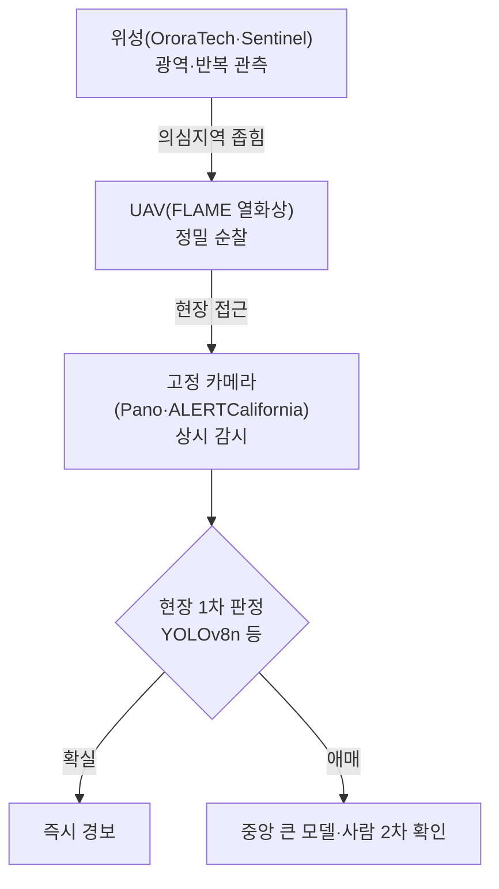

## 0. 재난은 네트워크를 기다려주지 않는다

산불 초기 1분과 10분의 차이는 크다. 재난 탐지에서 지연(latency)은 곧 피해 규모다. 그런데 카메라 영상을 클라우드로 보내 판정을 받아오는 구조는 그 지연을 구조적으로 안고 간다. 산간·해안·재난 현장은 통신이 가장 먼저 끊기는 곳이기도 하다.

온디바이스 비전(on-device vision)은 이 문제를 정면으로 푼다. 판정 모델을 현장 장비 안에 넣어, 영상을 바깥으로 보내지 않고 그 자리에서 결과를 낸다. 이 글은 추상론이 아니라 2026년 현재 실제로 깔려 돌아가는 시스템·데이터셋·모델을 수치로 정리한 자료조사 노트다.

> **클라우드로 보내 판정하면 네트워크가 끊긴 순간 눈이 먼다. 현장에서 판정하면 끊겨도 본다.**

## 1. 이미 깔려 있다 — 2026년 실전 배치

산불 탐지는 연구 단계를 넘어 대규모로 운영 중이다.

- **ALERTCalifornia**: UC San Diego가 운영하는 AI 카메라 네트워크로, 캘리포니아 전역 봉우리·고탑에 약 1,240대(약 1,211대 배치 기준)가 깔려 있다. CAL FIRE와 협력하며 2023년 TIME 올해의 발명에 선정됐다. 카메라가 연기를 1차 탐지하면 사람이 확인하는 구조다.
- **Pano AI**: 360° 회전 카메라에 AI 연기 탐지를 결합한 상용 서비스로, 작년 한 해 미국에서 725건의 산불을 탐지했다. Arizona Public Service·PG&E·Portland General 같은 전력회사가 송전망 인근에 설치해 쓴다.
- **OroraTech**: 열화상 나노위성으로 전 지구 산불을 모니터링한다. 위성 온보드에서 열 이상을 1차 판정해 다운링크 부담을 줄인다.
- **SDG&E Edge Alert Sentinel(EAS)**: 2026년 6월 SDG&E·Qualcomm·UC San Diego Scripps가 발표한 협업으로, 산불·극한기상을 위험 지점에서 엣지 추론한다. 전력 인프라 사업자가 직접 엣지 AI를 끌어들인 사례다.

대비되는 접근도 있다. Dryad Networks의 Silvanet은 비전이 아니라 태양광 IoT 가스 센서로 연소 가스를 잡아 초조기 탐지를 노린다. 카메라가 연기를 "보기" 전에 센서가 가스를 "맡는" 셈이다. 비전과 센서는 경쟁이 아니라 다른 시간대를 메운다.

## 2. 무엇으로 학습하나 — 공개 데이터셋과 모델

온디바이스 모델도 학습 데이터가 있어야 한다. 산불·홍수 분야에는 공개 벤치마크가 쌓여 있다.

| 데이터셋 | 대상 | 규모 | 특징 |
|---|---|---|---|
| FASDD | 화염·연기 | 10만 장급 | VOC/YOLO/COCO 주석, YOLOv5x가 mAP@0.5 ~80% |
| D-Fire | 화염·연기 | 21,527장(화재 1,164·연기 5,867·둘다 4,658·없음 9,838) | YOLOv8 학습에 널리 쓰임 |
| FLAME / FLAME 3 | 항공 산불 | UAV 영상 | FLAME 3은 라디오메트릭 열화상 제공 |
| FIgLib + SmokeyNet | 연기(고정 카메라) | HPWREN 카메라 시계열 | 실시간 연기 탐지 전용 모델 |
| FloodNet | 홍수(UAV) | 2,434장, 9개 클래스, 최대 1.5cm 해상도 | 허리케인 후 건물·도로 피해 |
| Sen1Floods11 | 홍수(위성 SAR) | 4,831장 Sentinel-1(VV·VH) | NASA 벤치마크, UNet 계열 분할 |

모델은 용도가 갈린다. 고정 카메라·UAV의 실시간 탐지에는 YOLO 계열, 그중에서도 엣지용 경량 변형(YOLOv5n·v8n·v11n)을 쓴다. FASDD나 D-Fire에서 사전학습한 뒤 현장 데이터로 미세조정하는 흐름이다. 고정 카메라의 연기는 시간에 따라 번지므로 SmokeyNet처럼 연속 프레임을 보는 모델이 유리하다. 위성 SAR 홍수는 이미지 분할 문제라 UNet·Nested UNet 계열이 표준이다.

## 3. 세 층위 — 지상·공중·궤도

같은 재난도 보는 위치가 다르면 쓰는 장비와 데이터셋이 다르다.

| 층위 | 대표 시스템 | 데이터셋 결 | 강점 / 제약 |
|---|---|---|---|
| 지상 고정 | Pano AI·ALERTCalifornia 카메라 | D-Fire·FIgLib | 24시간 한 지점 / 시야 고정 |
| 공중 | UAV(열화상) | FLAME 3 | 넓은 면적 순찰·열 탐지 / 무게·전력·비행시간 |
| 궤도 | OroraTech·Sentinel 위성 | Sen1Floods11 | 광역·반복 관측 / 통신 지연·해상도 |

*그림. 위성이 광역에서 의심 지역을 좁히고, UAV가 정밀 순찰하고, 고정 카메라가 지점을 상시 감시한다. 각 층위가 온디바이스로 1차 판정한다.*

세 층위는 경쟁이 아니라 보완이다. 무엇을 어느 층위에 맡길지는 감시 면적과 요구 반응 속도가 정한다.

## 4. 엣지에서 돌린다 — 경량 모델과 추론 칩

문제는 이 모델들을 현장 장비에서 실시간으로 돌리는 것이다. UAV는 무거운 모델을 실으면 비행 시간이 줄고 발열이 센서를 방해한다. 그래서 두 방향으로 줄인다. 하나는 처음부터 작은 모델(YOLOv8n·v11n의 nano 변형)을 쓰는 것이고, 다른 하나는 큰 모델의 탐지 능력을 작은 모델로 옮기는 지식 증류다. 자원이 제한된 장비에서 실시간 항공 화재 탐지를 하려고 증류로 모델을 줄이는 연구, 엣지에서 화염·연기를 탐지하는 연구가 이 맥락에서 나온다.

추론 칩은 NVIDIA Jetson Orin(40~275 TOPS)이 UAV·고정 카메라에서 흔히 쓰이고, 상시 전력이 빡빡한 카메라에는 Hailo-8(26 TOPS@2.5~3W)이나 국산 DeepX DX-M1(25 TOPS@5W)이 후보가 된다. 위성은 온보드 전력·방열 제약이 가장 커서 모델을 가장 작게 줄인다. 어느 칩에 맞춰 어떤 정밀도로 양자화할지는 [NPU 글](/ax/ax-06-npu-edge-inference/)에서 다뤘다.

## 5. 온디바이스가 푸는 것과 못 푸는 것

온디바이스 비전이 분명히 푸는 것은 지연과 연결성이다. 현장에서 즉시 판정하고, 통신이 끊겨도 동작하며, 영상을 밖으로 보내지 않아 대역폭·프라이버시 부담도 던다.

못 푸는 것도 분명하다. 작은 모델은 큰 모델보다 덜 똑똑하고, 산불 연기는 안개·구름·먼지와 닮아 오탐이 잦다. 그래서 ALERTCalifornia가 카메라 탐지 뒤에 사람 확인을 두듯, 실전 시스템은 두 단계로 간다. 현장 모델이 1차로 거르고, 의심스러운 것만 중앙의 큰 모델이나 사람에게 올려 2차 확인을 받는다.

> **온디바이스의 일은 모든 답을 내는 게 아니라, 무엇을 중앙에 물어볼지 빠르게 추리는 것이다.**

## 6. 사람에게 남는 일

재난 탐지에서 모델이 맡는 부분은 넓어진다. 열 이상 감지, 연기 탐지, 수면 변화 분할까지 장비가 현장에서 자동으로 한다. 그럴수록 사람의 일은 탐지 자체에서 경보의 설계로 옮겨간다.

오경보(false alarm)를 몇 번까지 허용할 것인가가 핵심 결정이다. 미탐지는 인명 피해로 직결되지만, 오경보가 잦으면 경보를 아무도 믿지 않게 된다. 임계값을 어디에 둘지, 어느 층위·어느 칩의 판정을 신뢰할지, 현장 모델과 중앙 모델이 갈릴 때 무엇을 따를지는 재난의 비용을 아는 사람이 정한다.

도구가 현장에서 재난을 먼저 보는 시대에 사람에게 남는 일은, 무엇을 위험으로 정의할지 정하는 능력과 그 경보 체계가 실제 재난에서 작동하는지 검증하는 능력이다.

---

## 출처

- ALERTCalifornia (UC San Diego), https://en.wikipedia.org/wiki/ALERTCalifornia / Fast Company, "Wildfire-prone Western states tap AI to spot fires early", https://www.fastcompany.com/91536312/ai-wildfire-detection-cameras
- FASDD, "An Open-access 100,000-level Flame and Smoke Detection Dataset", ESSD, https://essd.copernicus.org/preprints/essd-2023-73/
- D-Fire dataset (GAIA), https://www.emergentmind.com/topics/d-fire-dataset
- FLAME 3 Dataset (Radiometric Thermal UAV Imagery), arXiv 2412.02831, https://arxiv.org/pdf/2412.02831
- FIgLib & SmokeyNet, arXiv 2112.08598, https://arxiv.org/pdf/2112.08598
- FloodNet, arXiv 2012.02951, https://arxiv.org/abs/2012.02951
- Sen1Floods11 (NASA/Cloud to Street), https://www.semanticscholar.org/paper/Sen1Floods11
- arXiv, "Detecting Wildfire Flame and Smoke through Edge Computing" (2501.08639), https://arxiv.org/pdf/2501.08639
- arXiv, "Real-Time Aerial Fire Detection on Resource-Constrained Devices Using Knowledge Distillation" (2502.20979), https://arxiv.org/pdf/2502.20979
- Sempra/SDG&E, "Edge AI Collaboration ... Wildfire and Extreme-Weather Response" (2026-06), https://www.sempra.com/newsroom/press-releases/sdge-qualcomm-and-uc-san-diego-launch-edge-ai-collaboration-advance

*※ ALERTCalifornia 카메라 수(~1,240대)와 Pano AI 탐지 건수(725건)는 인용 보도 기준값이며 시점에 따라 변한다. 데이터셋 규모(FASDD 10만급·D-Fire 21,527·FloodNet 2,434·Sen1Floods11 4,831)는 각 공개 출처값이다.*
