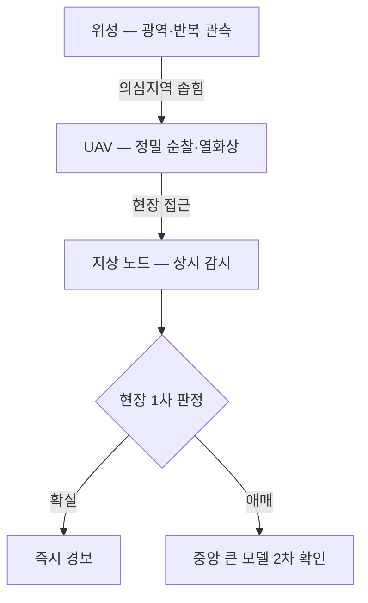

## 0. 재난은 네트워크를 기다려주지 않는다

산불 초기 1분과 10분의 차이는 크다. 홍수의 수위가 계단을 한 칸 올라서는 순간은 짧다. 재난 탐지에서 지연(latency)은 곧 피해 규모다. 그런데 카메라가 찍은 영상을 클라우드로 보내 판정을 받아오는 구조는 그 지연을 구조적으로 안고 간다. 산간·해안·재난 현장은 통신이 가장 먼저 끊기는 곳이기도 하다.

온디바이스 비전(on-device vision)은 이 문제를 정면으로 푼다. 판정 모델을 현장 장비 안에 넣어, 영상을 바깥으로 보내지 않고 그 자리에서 결과를 낸다. 위험 지점에서 데이터를 직접 처리해 핵심 신호만 몇 분 안에 의사결정자에게 전달하는 구조다.

> **클라우드로 보내 판정하면 네트워크가 끊긴 순간 눈이 먼다. 현장에서 판정하면 끊겨도 본다.**

이 글은 2026년 현재 온디바이스 비전 재난 탐지가 어디까지 와 있는지를 사례 중심으로 정리한 자료조사 노트다. 모델을 어떻게 작게 만드는지의 기술 방법론은 다음 글에서 따로 다룬다.

## 1. 2026년의 대표 사례 — 송전망과 엣지 센티넬

2026년 6월, 미국 San Diego Gas & Electric(SDG&E)과 Qualcomm Technologies, UC San Diego의 Scripps 해양연구소가 'Edge Alert Sentinel(EAS)'을 발표했다. 산불과 극한기상 대응을 위해 AI를 현장 최전선에 직접 가져가는 협업이다. 빠르게 바뀌는 조건을 위험 지점에서 실시간으로 탐지·분석해, 전력회사와 응급 대응 인력이 더 빨리 움직이게 하는 것이 목표다.

이 사례의 의미는 주체에 있다. 전력 인프라 사업자가 직접 엣지 AI를 산불 대응에 끌어들였다. 송전망은 산불의 발화원이자 피해 대상이라, 송전 설비 인근의 조기 탐지 수요가 크다. 통신 사업자(Qualcomm)의 엣지 추론 칩과 연구기관의 기상·해양 데이터가 한자리에 모인 구성이 2026년형 재난 탐지 협업의 전형을 보여준다.

## 2. UAV — 연기보다 먼저 열을 본다

무인기(UAV)에 열화상·적외선 센서와 AI 탐지 알고리즘을 실으면, 눈에 보이는 연기가 피어오르기 전 단계의 발화도 잡아낸다. 가시광 카메라만으로는 연기가 나야 보이지만, 열화상은 온도 이상을 먼저 읽는다. UAV가 순찰하며 현장에서 바로 판정하는 구조는 고정 카메라가 닿지 않는 넓은 산림을 훑는 데 유리하다.

UAV 기반 산불 관리에 대해서는 종합 서베이가 나와 있을 만큼 연구가 누적됐다. 다만 UAV에는 무게·전력·발열이라는 제약이 붙는다. 무거운 모델을 실으면 비행 시간이 줄고 발열이 센서를 방해한다. 그래서 UAV 비전은 작고 빠른 모델을 요구한다. 자원이 제한된 장비에서 실시간 항공 화재 탐지를 하기 위해 지식 증류(knowledge distillation)로 모델을 줄이는 연구가 이 맥락에서 나온다.

## 3. 위성 — 궤도 위에서 판정한다

엣지의 극단은 위성이다. 위성이 찍은 영상을 전부 지상으로 내려보내 분석하면 대역폭과 시간을 크게 쓴다. 그래서 위성 안(온보드)에서 AI가 먼저 중요한 사건을 탐지하고, 가치 높은 영상만 골라 핵심 통찰을 몇 분 안에 내려보내는 방향으로 간다.

홍수 쪽에서는 위성 온보드에서 연속 변화 탐지(continuous change detection)를 수행하는 연구가 진행 중이다. 같은 지역을 반복 촬영하며 수면 경계의 변화를 궤도 위에서 직접 잡아내는 접근이다. UN-SPIDER 같은 재난관리 지식 플랫폼도 위성 온보드 엣지 컴퓨팅을 재난 대응의 흐름으로 정리하고 있다. 위성은 통신 지연이 가장 큰 장비라, 온디바이스 처리의 이득이 가장 분명하게 나타나는 자리다.

## 4. 세 층위의 배치 — 어디에 눈을 둘 것인가

재난 탐지의 온디바이스 배치는 세 층위로 나뉜다.

| 층위 | 장비 | 강점 | 제약 |
|---|---|---|---|
| 지상 고정 | 감시 카메라·센서 노드 | 24시간 한 지점 감시 | 시야가 고정됨 |
| 공중 | UAV·드론 | 넓은 면적 순찰, 열화상 | 무게·전력·비행시간 |
| 궤도 | 위성 | 광역·반복 관측 | 통신 지연·해상도 |

*그림. 세 층위가 광역에서 지점으로 범위를 좁히고, 현장에서 1차 판정한 뒤 애매한 것만 중앙으로 올린다.*

세 층위는 경쟁이 아니라 보완이다. 위성이 광역에서 의심 지역을 좁히면, UAV가 그 지역을 정밀 순찰하고, 지상 노드가 특정 지점을 상시 감시한다. 각 층위가 자기 자리에서 온디바이스로 1차 판정을 하고, 중앙은 그 신호들을 모아 전체 상황을 그린다. 무엇을 어느 층위에 맡길지는 감시 대상의 면적과 요구 반응 속도가 정한다.

## 5. 온디바이스가 푸는 것과 못 푸는 것

온디바이스 비전이 분명히 푸는 것은 지연과 연결성이다. 현장에서 즉시 판정하고, 통신이 끊겨도 동작하며, 영상을 밖으로 보내지 않아 대역폭과 프라이버시 부담도 던다.

못 푸는 것도 분명하다. 작은 모델은 큰 모델보다 덜 똑똑하다. 현장의 모델이 애매한 장면을 만나면, 그 판단의 신뢰도는 클라우드의 큰 모델보다 낮다. 그래서 실전 시스템은 대개 두 단계로 간다. 현장 모델이 1차로 거르고, 의심스러운 것만 중앙의 큰 모델로 올려 2차 확인을 받는다. 온디바이스는 모든 판정을 끝내는 자리가 아니라, 빠르게 1차로 좁히는 자리다.

> **온디바이스의 일은 모든 답을 내는 게 아니라, 무엇을 중앙에 물어볼지 빠르게 추리는 것이다.**

## 6. 사람에게 남는 일

재난 탐지에서 모델이 맡는 부분은 넓어진다. 열 이상 감지, 수면 변화 탐지, 영상 분류까지 장비가 현장에서 자동으로 한다. 그럴수록 사람의 일은 탐지 자체에서 경보의 설계로 옮겨간다.

오경보(false alarm)를 몇 번까지 허용할 것인가가 핵심 결정이다. 재난 탐지에서 미탐지는 인명 피해로 직결되지만, 오경보가 잦으면 경보를 아무도 믿지 않게 된다. 임계값을 어디에 둘지, 어느 층위의 판정을 신뢰할지, 현장 모델과 중앙 모델의 의견이 갈릴 때 무엇을 따를지는 재난의 비용을 아는 사람이 정한다.

도구가 현장에서 재난을 먼저 보는 시대에 사람에게 남는 일은, 무엇을 위험으로 정의할지 정하는 능력과 그 경보 체계가 실제 재난에서 작동하는지 검증하는 능력이다.

---

## 출처

- Sempra/SDG&E, "SDG&E, Qualcomm and UC San Diego Launch Edge AI Collaboration to Advance Wildfire and Extreme-Weather Response" (2026-06), https://www.sempra.com/newsroom/press-releases/sdge-qualcomm-and-uc-san-diego-launch-edge-ai-collaboration-advance
- arXiv, "Towards Onboard Continuous Change Detection for Floods" (2601.13751), https://arxiv.org/pdf/2601.13751
- arXiv, "Real-Time Aerial Fire Detection on Resource-Constrained Devices Using Knowledge Distillation" (2502.20979), https://arxiv.org/pdf/2502.20979
- Springer Nature, "Intelligent real-time wildfire detection using image processing techniques with edge-AI integration", Discover Computing (2026), https://link.springer.com/article/10.1007/s10791-026-09989-9
- Springer Nature, "Vision-based fire management system using autonomous unmanned aerial vehicles: a comprehensive survey", Artificial Intelligence Review, https://link.springer.com/article/10.1007/s10462-025-11415-3
- UN-SPIDER Knowledge Portal, "AI-Enabled Onboard Edge Computing for Satellite Intelligence in Disaster Management", https://www.un-spider.org/news-and-events/news/ai-enabled-onboard-edge-computing-satellite-intelligence-disaster-management
- Assured Systems, "Small Disaster Prevention: Edge AI for Wildlife and Flood Management", https://www.assured-systems.com/case-studies/small-disaster-prevention-edge-ai-for-wildlife-and-flood-management/
