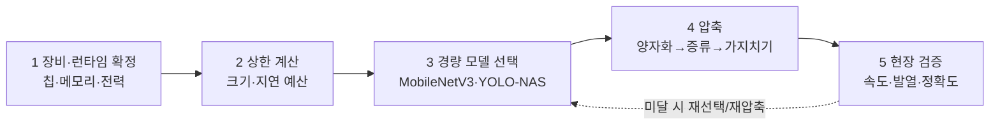

## 0. "잘 되는 모델"과 "장비에 들어가는 모델"은 다르다

클라우드에서 잘 도는 비전 모델을 그대로 현장 장비에 올리면 대개 둘 중 하나다. 메모리가 모자라 안 올라가거나, 올라가도 느려 실시간을 못 맞춘다. 온디바이스 개발의 출발점은 이걸 인정하는 데 있다. 큰 모델을 작은 장비에 욱여넣는 게 아니라, 장비 제약을 먼저 정하고 거기에 맞춰 모델을 설계한다.

목표는 명확하다. 2026년 기준으로 MobileNetV3는 INT8 양자화로 모바일에서 이미지 분류를 4~8ms에, 경량 YOLO 계열은 객체 검출을 12~20ms에 끝낸다. 30fps 카메라가 프레임당 33ms를 주니, 이 안에 들어와야 실시간이다.

> **온디바이스 개발은 정확도를 높이는 일이 아니라, 정해진 지연·메모리·전력 안에서 정확도를 가장 덜 잃는 길을 찾는 일이다.**

이 글은 경량 모델 선택 → 양자화 → 증류·가지치기 → 런타임 순으로 2026년 표준 흐름을 짚는다. 실제 변환 코드까지 파고드는 건 별도 글에서 다룬다.

## 1. 먼저 작은 모델을 고른다

큰 모델을 줄이기 전에, 처음부터 엣지용으로 설계된 모델을 고르는 게 먼저다. 대표 모델군은 이렇게 갈린다.

| 모델군 | 용도 | 특징 | 비고 |
|---|---|---|---|
| MobileNetV3 | 분류 | inverted residual, 양자화 친화 활성, MobileNetEdgeTPU 변형 | 분류 4~8ms(INT8) |
| EfficientDet-Lite | 검출 | EfficientDet의 모바일판 | TFLite 공식 지원 |
| YOLO-NAS | 검출 | QSP·QCI 양자화 인식 모듈, 8비트 재파라미터화, 작은 물체에 강함 | 검출 12~20ms급 |
| MobileViT | 분류 | 경량 비전 트랜스포머 | CNN+ViT 혼합 |
| LeYOLO | 검출 | 임베디드 전용 YOLO 구조 | 초경량 |

선택 기준은 작업(분류냐 검출이냐)과 정밀도 친화성이다. 특히 YOLO-NAS는 양자화를 모델 설계 단계에 넣어, 8비트로 줄여도 정확도 손실이 작도록 QSP·QCI 모듈로 부분 양자화한다. "나중에 줄일 모델"이 아니라 "줄여도 버티게 설계된 모델"을 고르는 게 1단계다.

## 2. 양자화 — 가장 확실한 압축

양자화(quantization)는 가중치의 숫자 정밀도를 낮춘다. FP32·FP16으로 저장하던 값을 INT8, INT4로 줄인다. 4비트까지 내리면 FP16 대비 메모리를 약 1/4로 줄인다. 메모리·전력 제약이 빡빡할수록 양자화가 가지치기·증류보다 안정적으로 효과를 낸다는 게 2026년의 통설이다. 양자화 인식 학습이 성숙해, 대부분의 비전 모델은 FP16·INT8로 줄여도 정확도를 95% 이상 유지한다.

두 갈래가 있다. **사후 양자화(PTQ)**는 학습 끝난 모델을 보정 데이터로 스케일만 추정해 변환한다. 빠르고, LLM 쪽 GPTQ·AWQ가 대표적이다. **양자화 인식 학습(QAT)**은 학습 중에 양자화를 시뮬레이션해 손실을 더 줄인다. 정확도가 빠듯하면 QAT로 간다.

PTQ는 TensorFlow Lite 변환기로 몇 줄이면 된다.

```python
# TensorFlow Lite 사후 양자화(PTQ): FP32 SavedModel → INT8 .tflite
converter = tf.lite.TFLiteConverter.from_saved_model("model/")
converter.optimizations = [tf.lite.Optimize.DEFAULT]          # 양자화 활성화
converter.representative_dataset = rep_data                    # 보정용 샘플로 스케일 추정
converter.target_spec.supported_ops = [tf.lite.OpsSet.TFLITE_BUILTINS_INT8]
converter.inference_input_type = tf.int8                       # 입출력도 INT8
tflite_int8 = converter.convert()                              # 결과: 약 1/4 크기
```

`representative_dataset`이 핵심이다. 실제 현장과 닮은 샘플 수백 장을 넣어야 양자화 스케일이 제대로 잡힌다. 이 샘플이 현장 분포와 어긋나면 정확도가 떨어진다. 무엇을 보정 샘플로 줄지가 사람의 결정이다.

## 3. 지식 증류 — 큰 모델의 답을 작은 모델에 베껴 넣기

지식 증류(knowledge distillation)는 크고 똑똑한 교사 모델의 출력을 작은 학생 모델이 따라 배우게 한다. 정답 라벨만이 아니라 교사가 각 입력에 어떤 확신으로 답했는지(soft label)까지 배운다. 잘 증류된 작은 모델이 자기 크기로는 닿기 어려운 성능에 이르고, 때로는 몇 배 큰 기본 모델을 특정 벤치마크에서 앞서기도 한다.

앞 글에서 본 UAV 화재 탐지가 전형적 자리다. 무게·전력 때문에 큰 모델을 못 싣는 장비에서, 큰 모델의 탐지 능력을 작은 모델로 옮겨 실시간을 맞춘다.

## 4. 가지치기 — 안 쓰는 연결을 잘라낸다

가지치기(pruning)는 기여가 작은 가중치·연결을 제거해 모델을 성기게 만든다. PyTorch의 `torch.ao.pruning`이나 Intel NNCF 같은 도구로 한다. 다만 2026년의 분석은 한계를 솔직히 말한다. 메모리·전력이 빡빡한 환경에서 가지치기·증류의 이득은 제한적이고 양자화가 더 확실하다. 성긴 구조를 하드웨어가 빠른 연산으로 받아주지 못하면 속도 이득이 안 난다. 그래서 가지치기는 단독보다 양자화와 함께, 성긴 연산을 지원하는 하드웨어에서 쓴다.

## 5. 어디서 돌리나 — 런타임과 하드웨어

줄인 모델은 런타임 위에서 돈다. 목표 플랫폼에 따라 갈린다.

| 런타임 | 강점 | 주 타깃 |
|---|---|---|
| TensorFlow Lite (LiteRT) | 모바일 표준, INT8 PTQ/QAT, TFLite Micro로 MCU까지 | Android·MCU |
| ONNX Runtime | 여러 프레임워크를 잇는 허브, 크로스 플랫폼 | 범용 |
| ExecuTorch (Meta) | PyTorch→엣지, 작은 런타임, CoreML·Qualcomm QNN delegate | iOS·Android·엣지 |
| OpenVINO (Intel) | Intel CPU/iGPU/NPU 최적화, Anomalib 내보내기 대상 | Intel·산업 엣지 |
| TensorRT (NVIDIA) | FP16·INT8 엔진 빌드, 넓은 연산자 지원 | Jetson·GPU |

런타임 선택은 칩 선택과 묶인다. Jetson이면 TensorRT, iPhone이면 ExecuTorch+CoreML, Intel 산업 PC면 OpenVINO다. 그리고 그 칩의 NPU가 어떤 정밀도·연산자를 받는지가 양자화 방식을 규정한다. 이 하드웨어 쪽 이야기는 [NPU 글](/ax/ax-06-npu-edge-inference/)에서 따로 다뤘다.

## 6. 개발 순서 — 제약에서 거꾸로 내려온다

온디바이스 개발 순서는 클라우드와 방향이 반대다. 정확도부터 올리고 나중에 줄이는 게 아니라, 제약부터 못 박고 거꾸로 내려온다.



*그림. 장비·런타임을 먼저 못 박고, 경량 모델을 고르고, 압축하고, 현장에서 검증한다. 미달하면 모델 선택이나 압축으로 되돌아간다.*

5단계가 자주 빠진다. 압축한 모델의 정확도를 노트북에서 확인하고 끝내면 실제 장비의 발열·전력 거동을 놓친다. 온디바이스의 진짜 시험장은 책상이 아니라 현장 장비다.

## 7. 사람에게 남는 일

양자화도, 증류도, 가지치기도, 런타임 변환도 대부분 도구가 자동으로 한다. 코딩 에이전트에게 "이 모델을 INT8로 양자화해 TFLite로 내보내라"고 하면 절차는 도구가 처리한다. 그럴수록 사람의 일은 절차 실행에서 제약과 균형의 결정으로 옮겨간다.

어느 칩·런타임을 목표로 잡을지, 어느 경량 모델군에서 출발할지, 정확도를 얼마나 포기하고 속도를 얼마나 살지, 양자화 보정 샘플로 무엇을 줄지, 현장 검증의 합격선을 어디에 둘지. 이 결정들은 장비 제약과 응용 목적을 함께 아는 사람만 내린다.

> **압축은 도구가 한다. 무엇을 얼마나 포기할지는 사람이 정한다.**

도구가 모델을 자동으로 줄여 주는 시대에 사람에게 남는 일은, 어떤 제약 안에서 무엇을 우선할지 정의하는 능력과 줄인 모델이 현장에서 실제로 작동하는지 검증하는 능력이다.

---

## 출처

- Google Research, "Introducing the Next Generation of On-Device Vision Models: MobileNetV3 and MobileNetEdgeTPU", https://research.google/blog/introducing-the-next-generation-of-on-device-vision-models-mobilenetv3-and-mobilenetedgetpu/
- Deci/arXiv, "A Comprehensive Review of YOLO Architectures ... to YOLO-NAS", arXiv 2304.00501, https://arxiv.org/pdf/2304.00501
- AlephZero Labs, "On-Device AI Inference in 2026: Sub-20ms on Android, Real Benchmarks", https://www.alephzerolabs.com/blog/on-device-ai-2026-sub-20ms/
- Edge AI and Vision Alliance, "On-Device LLMs in 2026: What Changed, What Matters, What's Next", https://www.edge-ai-vision.com/2026/01/on-device-llms-in-2026-what-changed-what-matters-whats-next/
- Nature Scientific Reports, "Optimising TinyML with quantization and distillation ... on edge devices", https://www.nature.com/articles/s41598-025-94205-9
- TensorFlow, "Post-training quantization", https://www.tensorflow.org/lite/performance/post_training_quantization

*※ 지연 수치(분류 4~8ms·검출 12~20ms, INT8)와 "FP16/INT8에서 정확도 95%+ 유지"는 위 2026 벤치마크·동향 출처의 일반값이며, 모델·해상도·칩에 따라 달라진다. TFLite 코드는 공식 PTQ 패턴이다.*
