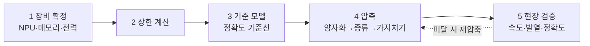

## 0. "잘 되는 모델"과 "장비에 들어가는 모델"은 다르다

클라우드에서 잘 도는 비전 모델을 그대로 현장 장비에 올리면 대개 두 가지 중 하나가 일어난다. 메모리가 모자라 아예 안 올라가거나, 올라가도 추론이 느려 실시간을 못 맞춘다. 온디바이스 비전 개발의 출발점은 이 사실을 인정하는 데 있다. 큰 모델을 작은 장비에 욱여넣는 게 아니라, 장비의 제약을 먼저 정하고 거기에 맞춰 모델을 설계한다.

장비의 제약은 네 가지다. 메모리, 연산량, 전력, 발열. 이 넷이 모델 크기의 상한을 정한다. 방법론은 그 상한 아래로 모델을 줄이는 기술의 묶음이다.

> **온디바이스 개발은 정확도를 높이는 일이 아니라, 정해진 제약 안에서 정확도를 가장 덜 잃는 길을 찾는 일이다.**

이 글은 그 기술들을 양자화·증류·가지치기 순으로 정리하고, 2026년 현재의 표준 흐름을 짚는다.

## 1. 양자화 — 가장 확실한 압축

양자화(quantization)는 모델 가중치의 숫자 정밀도를 낮춘다. 32비트나 16비트로 저장하던 가중치를 8비트, 4비트로 줄인다. 정밀도를 절반으로 낮추면 메모리도 대략 절반이 된다. 4비트까지 내리면 16비트 대비 메모리를 4분의 1로 줄인다.

2026년 현재 정리된 통설은 분명하다. 메모리·전력 제약이 빡빡할수록 양자화가 가장 안정적으로 효과를 낸다. 가지치기나 증류는 같은 조건에서 이득이 제한적인 반면, 양자화는 정확도 손실을 최소로 누르면서 배치를 가능하게 만든다.

실무 패턴은 "16비트로 학습하고 4비트로 배치"다. 학습은 충분한 정밀도로 하고, 배치 단계에서 정밀도를 낮춘다. 학습 후에 정밀도를 낮추는 사후 양자화(post-training quantization)에는 GPTQ·AWQ 같은 기법이 있어, 대부분의 품질을 지키면서 메모리를 4배 줄인다. 정확도가 더 중요하면 양자화를 학습 과정에 포함하는 양자화 인식 학습(quantization-aware training)으로 손실을 더 줄인다.

## 2. 지식 증류 — 큰 모델의 답을 작은 모델에 베껴 넣기

지식 증류(knowledge distillation)는 크고 똑똑한 모델(교사)의 출력을 작은 모델(학생)이 따라 배우게 한다. 학생 모델은 정답 라벨만 보고 배우는 게 아니라, 교사가 각 입력에 어떤 확신으로 어떤 답을 냈는지까지 따라 배운다. 교사의 "판단의 결"을 물려받는 셈이다.

증류의 강점은 작은 모델이 자기 크기로는 도달하기 어려운 성능에 닿게 한다는 점이다. 고품질 합성 데이터와 큰 교사로부터의 증류가, 파라미터를 늘리는 것보다 더 효과적일 때가 있다. 잘 증류된 작은 모델이 몇 배 큰 기본 모델을 특정 벤치마크에서 앞서기도 한다.

앞 글에서 본 UAV 화재 탐지가 증류의 전형적 자리다. 무게·전력 제약 때문에 큰 모델을 실을 수 없는 장비에서, 큰 모델의 탐지 능력을 작은 모델로 옮겨 실시간 추론을 맞춘다.

## 3. 가지치기 — 안 쓰는 연결을 잘라낸다

가지치기(pruning)는 모델에서 기여가 작은 가중치나 연결을 제거한다. 학습된 모델을 보면 출력에 거의 영향을 주지 않는 부분이 있는데, 그걸 잘라내 모델을 성기게 만든다. 개념은 직관적이지만 실전의 이득은 조건을 탄다.

2026년의 분석은 가지치기의 한계를 솔직하게 말한다. 메모리·전력이 빡빡한 환경에서는 가지치기와 증류의 이득이 제한적이고, 양자화가 더 확실하다. 가지치기로 연결을 줄여도 그 성긴 구조를 실제 하드웨어가 빠른 연산으로 받아주지 못하면 속도 이득이 안 난다. 그래서 가지치기는 단독으로 쓰기보다 양자화와 함께, 그리고 성긴 연산을 지원하는 하드웨어가 있을 때 쓴다.

## 4. NPU — 모델을 받아줄 하드웨어

모델을 줄이는 것만큼 중요한 게 그 모델을 받아줄 하드웨어다. 2026년 들어 NPU(Neural Processing Unit), 즉 AI 연산에 특화된 칩이 스마트폰·노트북·산업용 장비의 기본 부품이 됐다. 온디바이스 비전이 현실이 된 배경의 절반은 모델 압축 기술이고, 나머지 절반이 이 NPU의 보급이다.

다만 NPU는 지원하는 연산과 정밀도가 칩마다 다르다. 모델을 줄이는 단계에서 목표 NPU가 무엇을 빠르게 처리하는지를 먼저 알고, 그 칩이 잘 받는 형태로 양자화해야 한다. NPU의 구조와 "목표 칩을 먼저 알아야 하는 이유"는 별도 글에서 자세히 다룬다: [온디바이스 비전을 떠받치는 칩 — NPU란 무엇인가](/ax/ax-06-npu-edge-inference/).

## 5. 개발 순서 — 제약에서 거꾸로 내려온다

온디바이스 비전의 개발 순서는 클라우드 개발과 방향이 반대다. 정확도부터 올리고 나중에 줄이는 게 아니라, 제약부터 못 박고 거꾸로 내려온다.

| 단계 | 결정 |
|---|---|
| 1. 장비 확정 | 목표 NPU·메모리·전력 예산을 먼저 정한다 |
| 2. 상한 계산 | 그 예산이 허용하는 모델 크기·연산량 상한을 구한다 |
| 3. 기준 모델 | 상한을 무시하고 정확도 기준선을 내는 큰 모델을 만든다 |
| 4. 압축 | 양자화를 먼저, 필요하면 증류·가지치기를 더해 상한 아래로 줄인다 |
| 5. 현장 검증 | 실제 장비에서 속도·발열·정확도를 함께 측정한다 |

*그림. 정확도부터 올리는 게 아니라 장비 제약을 먼저 못 박고 거꾸로 내려온다. 현장 검증에서 미달하면 압축 단계로 되돌아간다.*

5단계가 자주 빠진다. 압축한 모델의 정확도를 노트북에서 확인하고 끝내면, 실제 장비의 발열·전력 거동을 놓친다. 온디바이스의 진짜 시험장은 책상이 아니라 현장 장비다.

## 6. 사람에게 남는 일

온디바이스 비전 개발에서 도구가 자동으로 하는 부분은 넓다. 양자화도, 증류 학습도, 가지치기도 대부분 자동화된 절차로 돈다. 코딩 에이전트에게 "이 모델을 4비트로 양자화해서 이 칩에 맞춰라"고 지시하면 절차 자체는 도구가 처리한다.

그럴수록 사람의 일은 절차 실행에서 제약과 균형의 결정으로 옮겨간다. 어느 장비를 목표로 잡을지, 정확도를 얼마나 포기하고 속도를 얼마나 살지, 어느 압축 기법을 어느 순서로 쌓을지, 현장 검증에서 무엇을 합격선으로 둘지. 이 결정들은 장비의 제약과 응용의 목적을 함께 아는 사람만 내린다.

> **압축은 도구가 한다. 무엇을 얼마나 포기할지는 사람이 정한다.**

도구가 모델을 자동으로 줄여주는 시대에 사람에게 남는 일은, 어떤 제약 안에서 무엇을 우선할지 정의하는 능력과 줄인 모델이 현장에서 실제로 작동하는지 검증하는 능력이다. 이 시리즈가 반복하는 명제가 온디바이스에서도 그대로다.

---

## 출처

- Edge AI and Vision Alliance, "On-Device LLMs in 2026: What Changed, What Matters, What's Next", https://www.edge-ai-vision.com/2026/01/on-device-llms-in-2026-what-changed-what-matters-whats-next/
- Nature Scientific Reports, "Optimising TinyML with quantization and distillation of transformer and mamba models for indoor localisation on edge devices", https://www.nature.com/articles/s41598-025-94205-9
- Nature Scientific Reports, "Deploying TinyML for energy-efficient object detection and communication in low-power edge AI systems", https://www.nature.com/articles/s41598-025-27818-9
- arXiv, "Real-Time Aerial Fire Detection on Resource-Constrained Devices Using Knowledge Distillation" (2502.20979), https://arxiv.org/pdf/2502.20979
- asappstudio, "The Future of Edge AI in 2026", https://asappstudio.com/the-future-of-edge-ai-in-2026/

*※ 양자화·증류·가지치기의 상대적 효과(메모리·전력 제약이 빡빡할수록 양자화가 가장 안정적)는 위 TinyML 비교 연구의 결론을 따랐다. 특정 칩·프레임워크 의존 수치는 목표 하드웨어에 따라 달라진다.*
