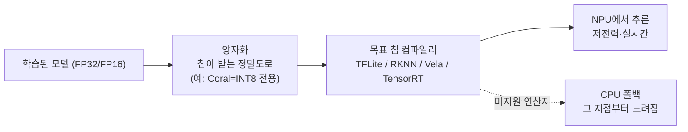

## 0. 모델을 줄이는 이야기의 나머지 절반

온디바이스 비전이 가능해진 배경을 둘로 나누면, 절반은 모델을 작게 만드는 기술(양자화·증류)이고 나머지 절반은 그 작은 모델을 빠르게 굴리는 하드웨어다. 그 하드웨어의 중심에 NPU(Neural Processing Unit), AI 추론에 특화된 칩이 있다.

문제는 "NPU"가 한 물건이 아니라는 점이다. 2W를 먹고 4 TOPS를 내는 Google Coral Edge TPU도 NPU고, 60W까지 먹고 275 TOPS를 내는 NVIDIA Jetson AGX Orin도 NPU다. 둘은 성능이 70배 차이 나는데도 같은 "엣지 AI 칩"으로 묶인다. 그래서 "NPU에 올리면 빨라진다"는 말은 거의 정보가 없다. 어느 NPU에, 어떤 정밀도로, 어떤 런타임으로 올리느냐가 전부다.

> **"NPU에 올린다"는 결정의 90%는 칩을 고르는 순간 정해진다. 그 칩이 무엇을 INT 몇 비트로 처리하는지가 모델 설계를 거꾸로 규정한다.**

이 글은 실제 제품군으로 NPU를 네 계층으로 나누고, 각 칩이 지원하는 정밀도·런타임·전력을 수치로 비교한다.

## 1. NPU는 CPU·GPU와 무엇이 다른가 — 구조로 본 차이

신경망 추론의 연산은 대부분 행렬곱과 누적(MAC: Multiply-Accumulate)이다. 같은 가중치 행렬에 입력을 곱하고 더하는 연산이 층마다 수백만~수십억 번 반복된다. 세 칩은 이 연산을 처리하는 구조가 다르다.

**CPU**는 소수의 강력한 코어로 짜여 있다. 분기 예측, 비순차 실행(out-of-order), 깊은 캐시 계층으로 "복잡하고 예측하기 어려운 명령 흐름"을 빠르게 처리하도록 설계됐다. 코어 하나하나는 똑똑하지만 수가 적다(데스크톱 CPU가 8~16코어 수준). 행렬곱처럼 단순 연산을 대량 반복하는 일에는 코어 수가 모자라고, 제어 회로에 쓴 트랜지스터가 연산에는 놀고 있는 셈이 된다.

**GPU**는 반대로 수천 개의 단순한 코어로 같은 연산을 한꺼번에 쏟아낸다. NVIDIA RTX 3080이 8,704개의 CUDA 코어를 갖는 식이다. FP32·FP16 부동소수 병렬 연산에 강해 학습에 적합하지만, 그만큼 전력을 많이 쓰고(수백 W) GDDR·HBM 고대역폭 메모리와 큰 냉각을 요구한다. 배터리 장비에는 부담이다.

**NPU**는 MAC 연산기 자체를 빽빽이 깐 칩이다. 대표 구조가 시스톨릭 배열(systolic array)로, 곱셈-덧셈기를 격자로 배열해 데이터가 격자를 한 번 통과하는 동안 행렬곱이 끝나도록 만든다. Google TPU가 256×256 규모의 MAC 격자를 썼고, ARM Ethos-U85는 128~2,048개의 MAC을 구성으로 고른다. NPU는 세 가지를 덜어내 전력당 성능을 끌어올린다.

1. **제어 회로**: 분기 예측·비순차 실행 같은 범용 제어를 거의 두지 않는다. 추론은 연산 흐름이 고정돼 있어 그런 제어가 필요 없다.
2. **정밀도**: FP32 대신 INT8·INT4 정수 연산기를 쓴다. 정수 MAC은 부동소수 연산기보다 회로가 작고 전력이 적어, 같은 면적에 훨씬 많이 깔린다.
3. **데이터 이동**: 가중치를 온칩 SRAM에 올려두고 데이터플로(dataflow)로 흘려 DRAM 왕복을 최소화한다. Hailo-8이 26 TOPS를 2.5~3W에 내는 비결이 이 데이터플로 구조다.

| 칩 | 구조 | 연산기·메모리 | 주 정밀도 | 강점 / 한계 |
|---|---|---|---|---|
| CPU | 소수의 복잡한 코어 | 8~16코어, 분기예측·OOO, 큰 캐시 | FP/INT 범용 | 복잡한 로직 / 행렬곱 느림 |
| GPU | 수천 SIMT 코어 | 수천 CUDA 코어, GDDR·HBM | FP32/FP16 | 학습·고처리량 / 고전력 |
| NPU | MAC 배열(시스톨릭·데이터플로) | 수백~수천 MAC, 온칩 SRAM | INT8/INT4 | 저전력 추론 / 학습 불가·연산자 한정 |

NPU는 "추론에 필요한 연산(저정밀 행렬곱)만 남기고 나머지를 덜어낸" 칩이다. 그래서 역전파·고정밀이 필요한 학습은 못 하지만, 추론은 CPU보다 빠르고 GPU보다 전력 효율이 높다. 비유로 좁히면 CPU는 무엇이든 만드는 요리사 몇 명, GPU는 같은 작업을 동시에 하는 수천 명, NPU는 한 공정만 처리하도록 깐 전용 컨베이어다. 다만 비유는 구조의 그림자일 뿐이고, 실제 차이는 위에 적은 연산기 종류·정밀도·데이터 이동 설계에 있다.

## 2. 제품군으로 보는 NPU 네 계층

온디바이스 비전에서 마주치는 NPU는 성능·전력대로 네 계층으로 나뉜다. 각 계층의 대표 제품과 스펙은 다음과 같다.

| 계층 | 대표 제품 | NPU 성능 | 지원 정밀도 | 전력 | 런타임/SDK | 전형적 용도 |
|---|---|---|---|---|---|---|
| MCU / TinyML | Arm Ethos-U85 (Cortex-M85 결합) | 0.25~4 TOPS | INT8 가중치, INT8/INT16 활성 | mW급 | Vela 컴파일러 + TFLite Micro | 상시 켜진 초저전력 센서, 단순 분류 |
| 임베디드 SoC | Rockchip RK3588 | 6 TOPS | INT4/INT8/INT16/FP16 혼합 | 수 W | RKNN-Toolkit | 저가 비전 보드, 산업용 IPC |
| 전용 비전 가속기 | Hailo-8 / Google Coral Edge TPU | 26 TOPS / 4 TOPS | INT8(Hailo 일부 INT4) / INT8 전용 | 2.5~3W / 2W | Hailo Dataflow Compiler / TFLite int8 | 상시 다중 카메라 / 배터리 카메라 |
| 고성능 엣지 | NVIDIA Jetson Orin (Nano~AGX) | 40~275 TOPS | INT8/FP16(+희소성) | 7~60W | TensorRT / CUDA | 멀티카메라, 로봇, 자율주행, 산업 검사 |

여기에 노트북·스마트폰의 내장 NPU가 한 축 더 있다. AI PC용으로는 Qualcomm Snapdragon X2 Elite의 Hexagon NPU 6가 80 TOPS로 현재 노트북 최고치이고, 1세대 Snapdragon X Elite는 약 45 TOPS, Intel Core Ultra(Lunar Lake)는 48 TOPS, AMD Ryzen AI(XDNA)는 50~75 TOPS, Apple M4/M5의 Neural Engine은 38~45 TOPS다. Microsoft의 Copilot+ PC 인증 기준선이 40 TOPS인 것도 이 수치들과 맞물린다.

같은 "NPU"라도 Ethos-U85(0.25 TOPS, mW)와 Jetson AGX Orin(275 TOPS, 60W)은 1,000배의 성능 격차가 있다. 재난 탐지 센서 노드에 Jetson을 넣을 수 없고, 자율주행 멀티카메라를 Coral 하나로 돌릴 수 없다. 계층 선택이 곧 설계 제약이다.

## 3. 국산 NPU는 어디에 서 있나

국산 AI 반도체도 이 지형 안에 있다. 다만 회사마다 겨누는 자리가 다르다. "국산 NPU"를 한 덩어리로 보면 틀린다.

- **DeepX(딥엑스) DX-M1**: 25 TOPS를 약 5W TDP에 내는 엣지 전용 NPU다. 위 표의 '전용 비전 가속기' 계층에서 Hailo-8·Jetson·MediaTek과 같은 소켓을 놓고 다툰다. 온디바이스 비전·피지컬 AI를 표방하며, 2026년 약 7억 달러 규모 IPO를 추진할 만큼 엣지에 집중한 회사다.
- **FuriosaAI(퓨리오사AI) Warboy**: 삼성 14nm 공정의 1세대 NPU로 최대 64 TOPS, 객체 인식·자율주행 같은 딥러닝 추론에 최적화됐다. 후속 Renegade(RNGD)는 INT8 2,000 TOPS급(약 150W)으로 데이터센터 LLM 추론을 겨눈다. 엣지가 아니라 서버 쪽이다.
- **Mobilint(모빌린트)**: ARIES 등 엣지 AI NPU로 DeepX와 비슷하게 엣지 소켓을 노린다.
- **Rebellions(리벨리온)**: Sapeon과 합병해 ATOM·REBEL로 데이터센터 추론 시장에서 Nvidia·AMD·Groq와 경쟁한다. 온디바이스보다 서버 인퍼런스 쪽이다.

> **국산 NPU도 엣지(DeepX·Mobilint)와 데이터센터(Rebellions·Furiosa Renegade)로 갈린다. 온디바이스 비전이면 후보는 DeepX DX-M1(25 TOPS@5W)·Mobilint, 좀 더 고성능 비전이면 FuriosaAI Warboy(64 TOPS)로 좁혀진다.**

정부도 2020년 이후 NPU 등 첨단 반도체에 4,700억 원이 넘는 R&D를 투입해 이 생태계를 키워 왔다. 온디바이스 비전 프로젝트에서 국산 칩을 검토한다면, 배터리 장비용으로는 DeepX·Mobilint급 엣지 NPU가 현실적인 출발점이다.

## 4. 칩마다 잘 받는 모델이 다르다 — 정밀도와 연산자

계층을 골랐다고 끝이 아니다. 같은 계층 안에서도 칩마다 지원하는 정밀도와 연산자가 다르다. 이게 모델 설계를 직접 규정한다.

- **Google Coral Edge TPU**: INT8 전용이다. 모델 전체를 INT8로 양자화한 TensorFlow Lite로만 돌아간다. FP16이나 INT4는 아예 못 받는다. 게다가 Edge TPU가 지원하지 않는 연산자가 모델에 하나라도 있으면, 그 연산자부터 끝까지가 통째로 CPU로 떨어진다.
- **Rockchip RK3588**: INT4/INT8/INT16/FP16을 혼합 지원한다. RKNN-Toolkit으로 변환하며, INT8에 가장 최적화돼 있다. Coral보다 유연하지만 변환 단계에서 미지원 연산자를 직접 걷어내야 한다.
- **Arm Ethos-U85**: INT8 가중치에 INT8/INT16 활성만 받는다. Vela 컴파일러가 모델을 훑어 NPU가 처리할 수 있는 연산자만 NPU에 올리고, 나머지는 짝을 이루는 Cortex-M85 코어로 넘긴다.
- **NVIDIA Jetson Orin**: TensorRT가 FP16·INT8 엔진을 빌드하며, 위 칩들 중 지원 연산자 범위가 가장 넓다. PyTorch 모델을 비교적 그대로 가져갈 수 있어 개발 부담이 가장 작다. 대신 전력과 단가가 가장 높다.

*그림. 같은 모델이라도 목표 칩의 정밀도·연산자에 맞춰 컴파일해야 한다. Coral은 INT8 전용이라 그 외 정밀도는 못 받고, 미지원 연산자는 CPU로 폴백돼 실시간이 깨진다.*

## 5. TOPS 숫자의 함정

칩을 고를 때 TOPS만 보면 틀린다. TOPS는 정점 정수 연산량일 뿐, 실제 추론 속도는 메모리 대역폭과 컴파일러 성숙도가 좌우한다.

대표적 사례가 Apple이다. M5의 Neural Engine은 raw TOPS가 80 TOPS짜리 Snapdragon보다 낮은데도, 로컬 LLM 추론에서 더 높은 TOPS의 Windows 칩을 앞서는 경우가 잦다. M5 Pro가 273 GB/s, M5 Max가 546 GB/s에 이르는 통합 메모리 대역폭으로 NPU·CPU·GPU가 같은 메모리 풀에 빠르게 접근하기 때문이다. 연산기가 아무리 빨라도 데이터가 못 따라오면 놀고 있는 것이다.

반대 방향의 함정도 있다. Coral Edge TPU의 4 TOPS와 Jetson AGX Orin의 275 TOPS는 70배 차이지만, 늘 켜져 있어야 하는 2W 배터리 카메라에는 4 TOPS Coral이 정답이고 275 TOPS Jetson은 전력 예산을 넘겨 오답이다. TOPS가 높다고 그 용도에 맞는 게 아니다. 비전 워크로드의 실시간 요구·전력 예산·카메라 수가 먼저고, TOPS는 그 다음이다.

> **TOPS는 칩의 정점 속도지 내 모델의 속도가 아니다. 전력 예산과 메모리 대역폭을 같이 보지 않으면 숫자에 속는다.**

## 6. 그래서 목표 칩을 먼저 정한다

이 제약들은 개발 순서를 뒤집는다. 모델을 먼저 만들고 나중에 칩을 고르면, 다 만든 모델이 목표 칩의 정밀도·연산자에 안 맞아 다시 설계해야 한다. 그래서 온디바이스 비전은 목표 칩을 먼저 못 박고 거꾸로 내려온다.

대략의 선택 기준은 이렇게 정리된다.

- **상시 배터리 센서, 단순 분류**: Ethos-U85급 MCU NPU 또는 Coral Edge TPU. INT8로 끝까지 양자화 가능한 모델만 설계한다.
- **저가 고정형 비전(IPC·키오스크)**: RK3588급 임베디드 SoC. 정밀도 선택지가 넓어 모델 제약이 덜하다.
- **상시 다중 카메라, 전력 민감**: Hailo-8. TOPS/W가 동급 최고라 항상 켜두는 감시에 맞는다.
- **멀티카메라·로봇·자율주행**: Jetson Orin. 전력·단가를 감수하는 대신 PyTorch 모델을 거의 그대로 올린다.

이 선택이 양자화 비트수, 쓸 수 있는 연산자, 모델 크기 상한을 한꺼번에 결정한다.

## 7. 사람에게 남는 일

양자화도, 컴파일도, 연산자 매핑도 도구가 자동으로 한다. 코딩 에이전트에게 "이 모델을 Jetson Orin용 TensorRT INT8 엔진으로 빌드하라"고 지시하면 절차는 도구가 처리한다. 그럴수록 사람의 일은 절차 실행에서 칩을 고르는 결정으로 옮겨간다.

배터리 예산이 2W인가 60W인가, 카메라가 한 대인가 여덟 대인가, 모델을 INT8로 끝까지 양자화할 수 있는가, 그 칩의 컴파일러가 내 모델의 연산자를 받는가. 이 질문들의 답이 Coral과 Jetson 사이 어디에 설지를 정한다. 도구는 주어진 칩에 맞춰 컴파일하지만, 어느 칩에 맞출지는 묻지 않으면 정해 주지 않는다.

도구가 모델을 자동으로 칩에 맞춰 주는 시대에 사람에게 남는 일은, 전력·카메라 수·정밀도 제약을 읽어 목표 칩을 고르는 능력과 그 칩에서 모델이 폴백 없이 실제로 빨라지는지 현장에서 검증하는 능력이다.

---

## 출처

- Notebookcheck, "Hexagon NPU 6 in the Snapdragon X2 Elite Extreme: 80 TOPS", https://www.notebookcheck.net/Hexagon-NPU-6-in-the-Snapdragon-X2-Elite-Extreme-80-TOPS-performance-that-is-up-to-95-faster-than-Apple-M4-and-122-faster-than-Intel-Lunar-Lake.1166576.0.html
- Local AI Master, "NPU Comparison 2026: Intel vs Qualcomm vs AMD vs Apple", https://localaimaster.com/blog/npu-comparison-2026
- SolidAITech, "NPU Guide 2026: TOPS, Copilot+ PCs & Memory Bandwidth Explained", https://www.solidaitech.com/2026/05/npu-neural-processing-unit-complete-guide.html
- ThinkRobotics, "Edge-AI Accelerators (Jetson vs Coral TPU): A Detailed Comparison for Developers", https://thinkrobotics.com/blogs/learn/edge-ai-accelerators-jetson-vs-coral-tpu-a-detailed-comparison-for-developers
- SumGuy's Ramblings, "Hailo-8 vs Coral: AI Accelerators for the Edge", https://sumguy.com/hailo-8-vs-coral-ai-accelerators/
- CNX Software, "Arm Ethos-U85 NPU delivers up to 4 TOPS for Edge AI applications", https://www.cnx-software.com/2024/04/09/arm-ethos-u85-npu-delivers-up-to-4-tops-for-edge-ai-applications-in-cortex-m7-to-cortex-a520-socs/
- Chipmall, "Rockchip RK3588 SoC, Mali-G610 GPU, and 6 TOPS NPU", https://www.chipmall.com/news/rockchip-rk3588-soc-mali-g610-gpu-and-6-tops-npu-for-8k-for-edge-ai-applications_435
- AIMultiple Research, "Top Edge AI Chip Makers with Use Cases in 2026", https://research.aimultiple.com/edge-ai-chips/

*※ 수치는 위 출처가 제시한 제품 사양값이다. Jetson Orin의 40~275 TOPS는 Orin Nano급부터 AGX Orin까지의 제품군 범위이며, 모듈·전력 모드에 따라 달라진다. Ethos-U85의 0.25~4 TOPS는 MAC 구성(128~2,048)과 클럭에 따른 범위다.*
