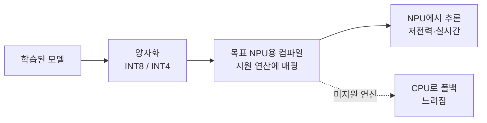

## 0. 모델을 줄이는 이야기의 나머지 절반

온디바이스 비전이 가능해진 배경을 둘로 나누면, 절반은 모델을 작게 만드는 기술(양자화·증류)이고 나머지 절반은 그 작은 모델을 빠르게 굴리는 하드웨어다. 모델 압축 쪽은 자주 이야기되지만, 하드웨어 쪽은 덜 다뤄진다. 그 하드웨어의 중심에 NPU가 있다.

NPU(Neural Processing Unit)는 AI 연산에 특화된 칩이다. 2026년 들어 스마트폰·노트북·산업용 장비의 기본 부품이 됐다. 예전에는 고급 사양이었지만 이제는 표준이다. 이 변화가 온디바이스 비전을 연구실 데모에서 현장 장비로 끌어내렸다.

> **온디바이스 추론의 현실성은 모델을 얼마나 줄였느냐만으로 정해지지 않는다. 그 모델을 받아줄 칩이 무엇이냐가 절반을 정한다.**

이 글은 NPU가 CPU·GPU와 무엇이 다른지, 왜 칩마다 잘 받는 모델이 다른지, 그래서 개발자가 무엇을 먼저 알아야 하는지를 정리한다.

## 1. NPU는 CPU·GPU와 무엇이 다른가

세 칩은 잘하는 일이 다르다.

| 칩 | 잘하는 일 | 비전 추론에서의 자리 |
|---|---|---|
| CPU | 복잡한 분기·순차 처리 | 범용. 추론은 느리고 전력 효율이 낮음 |
| GPU | 대규모 병렬 연산 | 학습·고처리량에 강하지만 전력·발열이 큼 |
| NPU | 행렬곱 같은 AI 고정 연산 | 저정밀·저전력으로 추론에 특화 |

신경망 추론의 연산은 대부분 행렬곱과 누적(MAC)이다. NPU는 이 연산을 전용 회로로 처리해, 같은 모델을 CPU보다 훨씬 적은 전력으로 빠르게 돌린다. GPU도 병렬 연산에 강하지만, 학습용 고처리량에 맞춰져 있어 작은 배터리 장비에는 전력·발열이 부담이다. NPU는 추론 한 가지에 집중해 전력당 성능을 끌어올린 칩이다.

## 2. 왜 2026년에 표준이 됐나

NPU가 특별한 칩에서 기본 부품으로 내려온 이유는 수요가 분명해졌기 때문이다. 스마트폰의 카메라 처리, 노트북의 온디바이스 AI 기능, 산업 장비의 실시간 검사가 모두 같은 것을 요구했다. 데이터를 클라우드로 보내지 않고 그 자리에서, 배터리를 적게 쓰며, 실시간으로 추론하기.

이 요구를 CPU·GPU만으로 맞추기는 어려웠다. CPU는 느리고 GPU는 전력을 많이 쓴다. 그 사이를 메우는 칩이 NPU였고, 수요가 충분히 커지자 칩 제조사들이 NPU를 기본 사양으로 넣기 시작했다. 결과적으로 2026년에는 새로 나오는 소비자·산업용 장비 대부분이 NPU를 달고 나온다.

## 3. 칩마다 잘 받는 모델이 다르다

여기서 온디바이스 개발의 핵심 제약이 나온다. NPU는 한 종류가 아니다. 칩마다 지원하는 연산과 정밀도가 다르다. 어떤 NPU는 INT8(8비트 정수) 연산에 최적화돼 있고, 어떤 칩은 INT4까지 빠르게 처리한다. 어떤 연산자(operator)는 NPU가 직접 처리하지만, 지원하지 않는 연산자를 만나면 그 부분만 CPU로 넘어간다.

CPU로 넘어가는 폴백(fallback)이 함정이다. 모델의 한 층이라도 NPU가 지원하지 않는 연산을 쓰면, 추론 중간에 NPU와 CPU를 오가며 데이터를 복사한다. 그 한 층 때문에 전체 추론이 느려진다. 모델을 아무리 작게 만들어도 이 폴백이 끼면 실시간이 깨진다.

*그림. 모델을 양자화해도 목표 NPU가 지원하지 않는 연산이 있으면 그 부분이 CPU로 넘어가 느려진다.*

## 4. 그래서 목표 칩을 먼저 알아야 한다

이 제약은 개발 순서를 바꾼다. 모델을 먼저 만들고 나중에 "어느 칩에 올릴까"를 정하면 늦다. 다 만든 모델이 목표 NPU가 지원하지 않는 연산을 쓰고 있으면, 그 부분을 다시 설계해야 한다.

그래서 온디바이스 비전 개발에서는 목표 NPU를 먼저 못 박는다. 그 칩이 어떤 연산자를 직접 처리하는지, 어떤 정밀도(INT8/INT4)에 최적화돼 있는지를 먼저 확인하고, 모델 구조와 양자화 방식을 거기에 맞춘다. 같은 정확도의 모델이라도 목표 칩이 잘 받는 형태로 설계한 것과 아닌 것은 현장 속도가 몇 배씩 갈린다.

> **하드웨어를 모르고 모델만 줄이면, 줄인 모델이 그 칩에서 안 빨라진다.**

## 5. 사람에게 남는 일

양자화도, 컴파일도, 연산자 매핑도 대부분 도구가 자동으로 한다. 코딩 에이전트에게 "이 모델을 이 NPU용으로 컴파일하라"고 지시하면 절차는 도구가 처리한다. 그럴수록 사람의 일은 절차 실행에서 목표를 정하는 쪽으로 옮겨간다.

어느 칩을 목표로 삼을지, 그 칩의 제약 안에서 모델 구조를 어떻게 가져갈지, 폴백이 생기는 연산을 쓸지 피할지는 사람이 정한다. 이 결정은 장비의 하드웨어 명세와 응용의 실시간 요구를 함께 아는 사람만 내린다. 도구는 주어진 칩에 맞춰 컴파일하지만, 어느 칩에 맞출지는 묻지 않으면 정해 주지 않는다.

도구가 모델을 자동으로 칩에 맞춰 주는 시대에 사람에게 남는 일은, 어떤 하드웨어를 목표로 무엇을 우선할지 정의하는 능력과 줄인 모델이 그 칩에서 실제로 빨라지는지 현장에서 검증하는 능력이다.

---

## 출처

- Edge AI and Vision Alliance, "On-Device LLMs in 2026: What Changed, What Matters, What's Next", https://www.edge-ai-vision.com/2026/01/on-device-llms-in-2026-what-changed-what-matters-whats-next/
- asappstudio, "The Future of Edge AI in 2026", https://asappstudio.com/the-future-of-edge-ai-in-2026/
- Nature Scientific Reports, "Deploying TinyML for energy-efficient object detection and communication in low-power edge AI systems", https://www.nature.com/articles/s41598-025-27818-9

*※ NPU의 표준화(2026년 소비자·산업 장비 기본 탑재)와 정밀도·연산자 지원이 칩마다 다르다는 서술은 위 엣지 AI 동향 자료를 따랐다. 구체적 연산자·정밀도 지원 범위는 칩·SDK 버전에 따라 다르므로 목표 하드웨어 문서를 확인해야 한다.*
