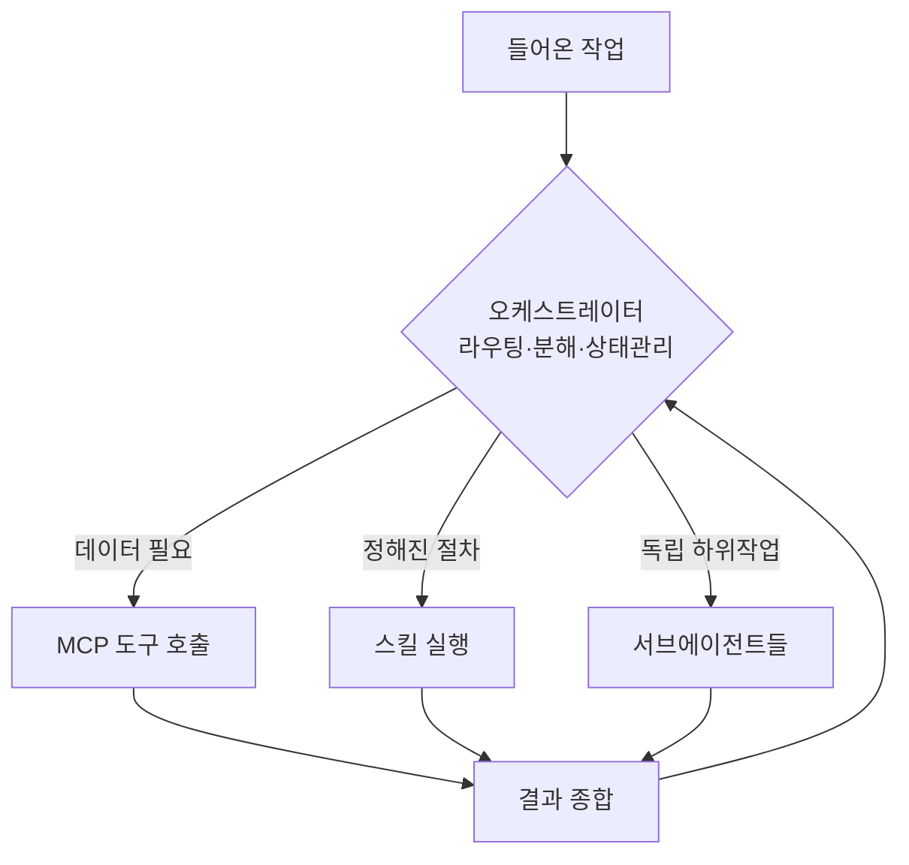
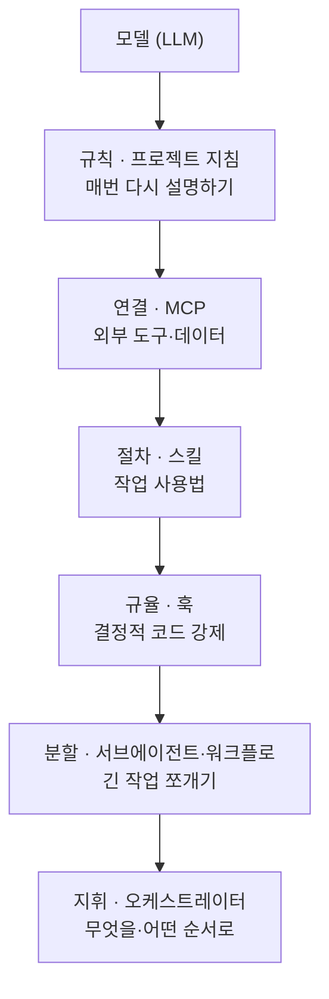

## 0. 채팅창에서 운영 시스템으로

코딩 에이전트를 처음 쓸 때는 대화 상자가 전부다. 질문을 적고, 답을 받고, 코드를 붙여 넣는다. 그런데 같은 도구로 며칠 작업을 굴리다 보면 대화만으로는 안 되는 구간이 생긴다. 매번 같은 규칙을 다시 설명해야 하고, 외부 데이터에 손이 닿지 않고, 위험한 명령이 그대로 실행되고, 긴 작업이 한 맥락 안에서 엉킨다.

2026년의 코딩 에이전트는 이 문제들을 각각 다른 부품으로 푼다. 부품은 네 개다. 훅(hook), 스킬(skill), MCP, 워크플로(workflow). 여기에 서브에이전트(subagent)와, 이 부품들을 지휘하는 오케스트레이터(orchestrator)를 더하면, 대화 상자는 작은 운영 시스템에 가까워진다.

> **에이전트의 실력은 모델만으로 정해지지 않는다. 그 둘레에 무엇을 끼웠는지가 정한다.**

이 글은 그 네 부품이 각각 무엇을 푸는지, 그리고 부품을 고르고 끼우는 판단이 왜 사람의 일로 남는지를 정리한다.

## 1. MCP — 에이전트가 바깥세상에 손을 뻗는 규격

MCP(Model Context Protocol)는 Anthropic이 공개한 개방형 규격이다. 에이전트가 외부 도구·데이터에 접근하는 방식을 표준화한다. 이전에는 에이전트마다, 연동 대상마다 따로 접착 코드를 짰다. MCP는 그 접착면을 하나의 약속으로 통일한다. 데이터베이스·파일 시스템·사내 API·검색 엔진을 MCP 서버로 감싸 두면, 그 규격을 아는 어떤 에이전트든 같은 방식으로 호출한다.

2026년 들어 MCP의 무게 중심은 "연결되느냐"에서 "안전하게 연결되느냐"로 옮겨갔다. 단순 API 키 대신 SSO 연동, 호출 감사 로그, 게이트웨이를 통한 권한 범위 제한이 표준 요구사항이 됐다. 데이터 노출 범위를 명시적으로 승인하고 기록으로 남기는 쪽으로 규격이 자란다. 다음 단계로는 MCP 서버 자체가 에이전트처럼 동작해 다른 에이전트와 직접 협상하는 A2A(Agent-to-Agent) 통신이 로드맵에 올라 있다.

실무에서 MCP의 의미는 분명하다. 에이전트가 내 작업 환경의 실제 데이터를 보고 움직이게 만드는 통로다. 사내 위키, 이슈 트래커, 사내 데이터 웨어하우스를 MCP로 붙이면 에이전트의 답이 일반론에서 내 맥락으로 내려온다.

## 2. 스킬 — "이건 이렇게 하는 거야"를 묶어 둔 묶음

스킬(Agent Skill)은 특정 작업의 절차와 도메인 지식을 한 묶음으로 정의해 둔 것이다. MCP가 "어떤 도구가 있는가"를 알려준다면, 스킬은 "그 도구를 언제, 어떤 순서로, 어떤 규칙으로 쓰는가"를 알려준다. 도구의 존재와 사용법은 다른 문제다. 스킬은 그 사용법 쪽을 채운다.

스킬의 핵심 성질은 필요할 때만 불러온다는 점이다. 모든 규칙을 매 대화에 욱여넣으면 맥락이 금세 포화한다. 스킬은 평소에는 이름과 한 줄 설명만 떠 있다가, 관련 작업이 들어올 때 본문이 펼쳐진다. 덕분에 수십 개의 전문 절차를 등록해 두고도 맥락을 가볍게 유지한다.

내 경우, 반복되는 문서 작업이나 특정 형식의 산출물 작성처럼 "매번 같은 규칙으로 처리해야 하는 일"이 스킬의 자리였다. 한 번 절차를 글로 정리해 스킬로 등록하면, 다음부터는 그 작업을 지목하는 것만으로 같은 규칙이 적용된다. 같은 설명을 반복하지 않는다는 것이 스킬이 주는 실질적 이득이다.

## 3. 훅 — 모델의 해석에 맡기지 않는 결정적 코드

훅(hook)은 에이전트 동작의 특정 시점에 자동으로 실행되는 스크립트다. 도구를 호출하기 직전, 작업을 마친 직후 같은 이벤트에 코드를 건다. 프롬프트와의 결정적 차이가 여기 있다. 프롬프트는 모델의 해석에 의존하지만, 훅은 정해진 코드를 그대로 실행한다.

이 차이가 중요한 자리는 안전과 규율이다. "민감한 파일은 건드리지 마"라고 프롬프트로 부탁하면 지켜질 확률이 높을 뿐이다. 훅으로 막으면 그 경로의 쓰기 시도를 코드가 차단한다. 커밋 전 자동 포맷팅, 테스트 자동 실행, 위험한 명령 차단처럼 "꼭 매번 같은 방식으로 일어나야 하는 일"은 모델의 선의가 아니라 훅에 맡긴다.

> **부탁은 확률을 높이고, 훅은 보장을 만든다.**

훅은 스킬 안에 넣을 수도 있다. 그 스킬이 호출될 때만 켜지는 훅이다. 평소에는 돌지 않다가 특정 작업 맥락에서만 작동하는 규율을 이렇게 건다.

## 4. 워크플로와 서브에이전트 — 큰 작업을 쪼개는 두 방식

긴 작업을 한 대화 안에서 끌고 가면 맥락이 엉킨다. 앞에서 읽은 파일 더미가 뒤 작업의 판단을 흐리고, 한 번에 다 떠안은 일이 서로 간섭한다. 이걸 푸는 부품이 둘이다.

서브에이전트(subagent)는 별도의 맥락 창을 가진 독립 세션이다. 본 작업과 분리해야 하거나 여러 갈래를 동시에 돌려야 할 때 띄운다. 예를 들어 코드를 비평하는 서브에이전트를 따로 띄워 지적사항이 사소해질 때까지 수정을 반복하는 식이다. 서브에이전트는 자기 밑에 또 서브에이전트를 띄울 수도 있어서, 작업이 트리 모양으로 갈라진다.

워크플로(workflow)는 그 갈래들을 결정적 순서로 엮는 틀이다. 무엇을 병렬로 펼치고, 무엇을 검증하고, 무엇을 합칠지를 코드로 적는다. 모델이 매번 다르게 판단하도록 두지 않고, 분기·반복·팬아웃을 정해진 제어 흐름으로 고정한다. "여러 관점으로 찾고, 찾은 것을 적대적으로 검증하고, 살아남은 것만 종합한다" 같은 구조가 워크플로의 전형이다.

둘의 분담은 이렇게 갈린다. 서브에이전트는 "맥락을 나눈다", 워크플로는 "나뉜 작업의 순서와 합류 지점을 정한다".

## 5. 오케스트레이터 — 부품을 지휘하는 층

부품이 갖춰져도 누군가는 "지금 무엇을, 어느 부품으로, 어떤 순서로 할지"를 정해야 한다. 그 지휘를 맡는 것이 오케스트레이터(orchestrator)다. 워크플로가 제어 흐름을 코드로 굳힌 틀이라면, 오케스트레이터는 그 틀을 실제로 돌리며 작업을 알맞은 도구·스킬·서브에이전트에 배분하는 조정자다.

오케스트레이터가 하는 일은 셋이다.

- 라우팅: 들어온 작업을 어느 부품이 처리할지 고른다. 데이터를 가져와야 하면 MCP로, 정해진 절차면 스킬로, 떼어내도 되는 하위 작업이면 서브에이전트로 보낸다.
- 분해와 위임: 큰 작업을 작은 작업으로 쪼개 여러 서브에이전트에 나눠 주고, 흩어진 결과를 다시 모은다. 계획을 세우는 부분과 실행하는 부분을 나누는 플래너-실행자 구조가 대표적이다.
- 상태 관리: 어디까지 됐는지, 무엇이 실패했는지, 무엇을 다시 시도할지를 추적한다.

*그림. 오케스트레이터는 들어온 작업을 알맞은 부품에 배분하고 흩어진 결과를 다시 모은다.*

단일 에이전트에서는 모델 자신이 암묵적 오케스트레이터다. 무엇을 먼저 할지 모델이 그때그때 판단한다. 멀티 에이전트로 가면 이 지휘가 별도 층으로 떨어져 나온다. 2026년 MCP 로드맵이 A2A(Agent-to-Agent) 통신으로 향하는 것도 같은 흐름이다. 한 에이전트가 다른 에이전트를 도구처럼 호출하기 시작하면, 그 협업을 지휘하는 자리가 반드시 생긴다.

> **부품은 무엇을 할 수 있는가를 정하고, 오케스트레이터는 지금 무엇을 할 것인가를 정한다.**

오케스트레이션을 모델의 즉흥 판단에 맡길수록 유연하지만 결과를 예측하기 어렵고, 코드(워크플로)로 굳힐수록 예측 가능하지만 경직된다. 어디까지 모델에 맡기고 어디부터 코드로 고정할지가 오케스트레이터 설계의 핵심 결정이다.

## 6. 부품이 쌓이는 층

정리하면 코딩 에이전트의 구성은 여섯 층으로 본다.

| 층 | 부품 | 푸는 문제 |
|---|---|---|
| 규칙 | 프로젝트 지침 파일 | 매번 다시 설명하기 |
| 연결 | MCP | 바깥 도구·데이터에 손이 안 닿음 |
| 절차 | 스킬 | 같은 작업의 사용법 반복 |
| 규율 | 훅 | 모델의 해석에 맡기면 불안한 일 |
| 분할 | 서브에이전트·워크플로 | 긴 작업이 한 맥락에서 엉킴 |
| 지휘 | 오케스트레이터 | 무엇을·어느 부품으로·어떤 순서로 할지 |

*그림. 모델 둘레에 한 층씩 쌓이는 여섯 부품. 아래로 갈수록 자동화 범위가 넓어진다.*

각 층은 독립적으로 끼우고 뺀다. 작은 작업은 규칙 파일 하나로 충분하고, 운영 단계로 가면 여섯 층이 모두 필요해진다. 부품이 많아질수록 도구가 자동으로 처리하는 범위가 넓어진다.

## 7. 사람에게 남는 일

부품이 많아진다는 건 사람이 손을 떼는 게 아니라 사람이 정해야 할 것이 바뀐다는 뜻이다. 어떤 데이터를 MCP로 열어줄지, 어떤 절차를 스킬로 굳힐지, 무엇을 훅으로 강제할지, 작업을 어디서 쪼갤지는 모두 사람의 결정이다. 이 결정들이 어긋나면 부품이 많을수록 더 빠르게 어긋난다.

특히 훅과 권한 설정은 한 번 잘못 걸면 자동화의 속도만큼 손해도 자동으로 커진다. 그래서 부품을 끼우는 일의 핵심은 "무엇을 자동에 맡기고 무엇을 사람의 승인 뒤에 둘 것인가"의 경계를 긋는 판단이다.

> **부품은 도구가 늘려 준다. 부품의 경계를 긋는 일은 사람이 한다.**

이 블로그가 반복해 온 명제가 여기서도 그대로다. 도구가 코드를 대신 짤 때 사람이 잘해야 하는 일은, 무엇을 만들지 정의하는 능력과 도구가 만든 결과를 검증하는 능력이다. 에이전트의 부품을 고르는 일은 그 정의 능력의 2026년판이다.

---

## 출처

- DEV Community, "2026 MCP Trends: The Shift to Enterprise-Ready Agentic Workflows", https://dev.to/chunxiaoxx/2026-mcp-trends-the-shift-to-enterprise-ready-agentic-workflows-48lp
- a2a-mcp.org, "MCP Roadmap 2026 — Official Priorities for Model Context Protocol Scalability & AI Agents", https://a2a-mcp.org/blog/mcp-2026-roadmap
- Ted Tschopp, "MCP's 2026 Roadmap: From Agent Integration Standard to Production Connectivity Layer", https://tedt.org/MCPs-2026-Roadmap/
- okhlopkov.com, "My Claude Code Setup: MCP Servers, Hooks, Skills and Agents (2026)", https://okhlopkov.com/claude-code-setup-mcp-hooks-skills-2026/
- ofox.ai, "Claude Code: Hooks, Subagents & Skills Complete Guide (2026)", https://ofox.ai/blog/claude-code-hooks-subagents-skills-complete-guide-2026/
- Medium (Prakash Kukanoor), "Designing agentic Workflows with Agent Skills, Instructions and Model Context Protocol (MCP)", https://medium.com/@prakashkop054/designing-agentic-workflows-with-agent-skills-instructions-and-model-context-protocol-mcp-eec7ae0a808b
