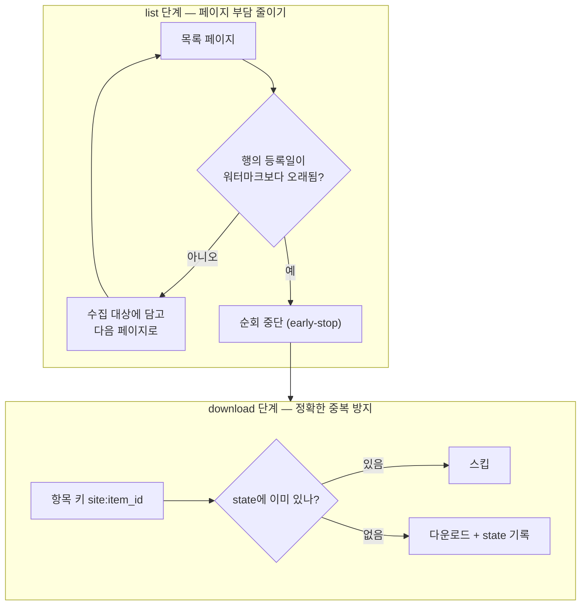

## 0. 매일 도는 수집기는 어제 것을 다시 받지 않아야 한다

공고 수집기를 매일 돌린다. 그런데 매번 처음부터 전체 목록을 받아 첨부까지 내려받으면, 어제 받은 수백 건을 오늘 또 받는다. 사이트에 부담을 주고, 같은 파일이 폴더에 쌓이고, 분석 단계는 중복을 다시 거른다. 증분 수집(incremental crawl)은 "새로 올라온 것만 가져온다"는 이 단순한 요구를 시스템으로 만드는 일이다.

요구는 단순하지만 함정이 있다. 무엇을 기준으로 "새것"을 가를지, 그 기준이 틀어지면 어떤 사고가 나는지를 미리 설계하지 않으면, 증분 수집기는 조용히 새 공고를 놓치기 시작한다.

> **증분 수집의 어려움은 "새것을 가져오는 것"이 아니라 "새것을 놓치지 않는 것"에 있다.**

이 글은 두 단계의 스킵 메커니즘과, 그 사이에 숨어 있던 미래 날짜 함정을 정리한다.

## 1. 두 단계 — list에서 멈추고, download에서 거른다

증분은 한 군데서 거르지 않는다. 두 단계로 나뉜다.

| 단계 | 거르는 방식 | 목적 |
|---|---|---|
| list | 등록일 기준 워터마크로 순회를 일찍 멈춤 | 목록 페이지 요청 자체를 줄임 |
| download | 항목 ID 기준 upsert로 이미 받은 것 스킵 | 첨부 중복 다운로드 방지 |



*그림. list 단계는 페이지 요청을 줄이려 일찍 멈추고, download 단계는 정확한 중복 방지를 한다. 두 단계의 목적이 다르다.*

왜 한 단계로는 부족한가. list 단계의 워터마크만 쓰면 목록은 빨리 끊지만, 같은 페이지 안에 새것과 헌것이 섞여 있을 때 헌것을 다시 받는다. download 단계의 ID 스킵만 쓰면 중복 다운로드는 막지만, 매번 전체 목록을 끝까지 순회해야 한다. 두 단계가 각자 다른 비용을 줄인다.

## 2. list 단계 — 등록일 워터마크로 일찍 멈추기

list 단계의 핵심은 "등록일이 이미 받은 가장 최신 날짜보다 오래되면 그 뒤는 볼 필요가 없다"는 가정이다. 목록이 등록일 내림차순으로 정렬돼 있으면, 워터마크보다 오래된 행을 만나는 순간 순회를 멈춰도 된다.

이 코드를 보이는 목적은, "멈춤 판단"이 한 줄의 비교로 끝난다는 점과 그 한 줄을 언제 믿을 수 있는지를 같이 보기 위해서다.

`core/incremental.py:72-90` — list 단계 조기 종료 판단:

```python
def should_stop_list(rows, watermark):
    # rows: 현재 목록 페이지에서 파싱한 행들 (등록일 내림차순 가정)
    # watermark: 직전 실행까지 받은 가장 최신 등록일
    for row in rows:
        if row.reg_date <= watermark:   # 워터마크보다 오래된 행을 만나면
            return True                 # 이 페이지 이후는 볼 필요 없음
    return False                        # 전부 새 행이면 다음 페이지로
```

Claude Code가 이 함수를 작성했다. 나는 "목록이 등록일 내림차순일 때만 이 조기 종료가 안전하다"는 전제를 명시하고, 그 전제가 깨지는 사이트(정렬이 보장되지 않는 곳)에는 이 최적화를 끄도록 지시했다. 도구는 비교 로직을 잘 짜지만, 그 비교가 성립하는 전제를 정하는 일은 사람이 한다.

## 3. 미래 날짜의 함정 — max를 그냥 믿으면 안 된다

여기서 실제 사고가 한 번 났다. 워터마크는 보통 "이번에 받은 행들의 등록일 중 최댓값"으로 갱신한다. 그런데 한 사이트의 예고공고에 **2102년**으로 찍힌 등록일이 있었다. 입력 실수였는지 예고용 더미 값이었는지는 알 수 없지만, 결과는 분명했다. 그 값을 그대로 max로 취하면 워터마크가 2102년이 되고, 그 이후 올라오는 모든 정상 공고(등록일 2026년)는 "워터마크보다 오래됨"으로 분류돼 영원히 차단된다.

증분 수집기가 조용히 멈추는 가장 위험한 형태가 이것이다. 에러도 안 나고, 로그도 정상이고, 그냥 새 공고가 안 들어온다.

> **자동화가 가장 위험할 때는 멈출 때가 아니라, 틀린 채로 조용히 계속 돌 때다.**

`core/incremental.py:37-46` — 워터마크 갱신 시 미래 날짜 배제:

```python
def update_watermark(rows, today):
    valid = [r.reg_date for r in rows
             if r.reg_date <= today]      # 오늘 이후 날짜는 워터마크 후보에서 제외
    if not valid:
        return None                       # 갱신할 유효 날짜가 없으면 워터마크 유지
    return max(valid)
```

Claude Code의 첫 초안은 `max(r.reg_date for r in rows)`였다. 명세대로면 맞는 코드다. 미래 날짜라는 더러운 데이터의 가능성은 명세에 없었다. 나는 실제 데이터에서 그 값을 발견하고 "오늘 이전" 필터를 추가하라고 지시했다. 도구는 깨끗한 입력을 가정하고, 사람은 더러운 입력을 본 적이 있다.

## 4. 보정 장치 — 효율이 놓친 것을 줄여 잡기

조기 종료는 효율적이지만 완벽하지 않다. 목록 정렬이 잠깐 흐트러지거나, 등록일이 소급 수정된 공고가 뒤늦게 끼어들면, 워터마크 기준으로는 영영 안 보인다. 효율을 위한 최적화가 정합성을 조금씩 갉아먹는다.

그래서 `--full-list` 보정 모드를 같이 뒀다. 평소에는 등록일 기반으로 일찍 멈추되, 주 1회는 조기 종료를 끄고 목록 전체를 강제로 순회한다. 이때도 download 단계의 ID 스킵이 살아 있으니, 전체를 훑어도 새것만 받는다. 효율 모드가 놓친 항목을 정합성 모드가 주기적으로 줄여 잡는 구조다.

이 보정 장치를 설계하라고 한 것은 사람이다. Claude Code는 "등록일 워터마크로 일찍 멈추는 효율적인 수집기"를 만들라고 하면 정확히 그것을 만든다. 그 효율이 어떤 정합성을 포기하는지, 그리고 그 포기를 어떻게 주기적으로 메울지는 묻지 않으면 나오지 않는다.

## 5. 사람에게 남는 일

증분 수집기의 코드는 거의 다 도구가 짰다. 워터마크 비교, upsert, 페이지네이션 루프, 보정 모드의 argparse까지 자동으로 나왔다. 그럴수록 사람의 일은 코드 작성에서 멀어지고 두 곳에 자리 잡았다.

하나는 전제를 정하는 일이다. 조기 종료가 성립하려면 목록이 정렬돼 있어야 한다는 전제, 워터마크 후보는 오늘 이전이어야 한다는 전제. 이 전제들은 명세가 아니라 실제 데이터를 본 사람의 경험에서 나온다.

또 하나는 정합성 보정을 같이 설계하는 일이다. 효율과 정합성은 서로를 배신할 수 있고, 자동화는 그 배신을 조용히 진행한다. 효율 모드 옆에 정합성 모드를 두는 결정은 사람이 한다.

> **도구는 효율적인 수집기를 만든다. 그 효율이 무엇을 놓치는지, 그리고 그 누락을 어떻게 메울지는 사람이 정한다.**

이 단계에서 코딩 에이전트가 보편화된 환경의 사람에게 새로 요구되는 능력은, 더러운 데이터를 가정하는 의심과 효율이 포기한 정합성을 다시 메우는 보정 장치를 설계하는 능력이다.
