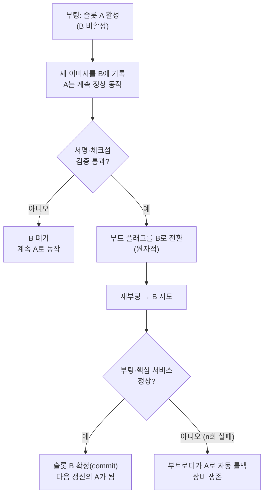

## 0. 모델을 잘 만든 다음의 문제

앞선 글에서 나는 어느 NPU(Neural Processing Unit, AI 추론 전용 칩)에 모델을 올릴지가 모델 설계를 거꾸로 규정한다고 적었다([엣지 NPU 글](/ax/ax-06-npu-edge-inference/)). 그런데 칩을 고르고 모델을 컴파일해 장비에 넣고 나면 진짜 문제가 시작된다. 그 장비가 한 대가 아니라 현장 곳곳에 흩어진 수천 대라는 점이다.

검사 라인의 비전 카메라, 변전소의 진단 단말, 농장의 센서 게이트웨이. 이런 장비는 사람이 USB를 들고 한 대씩 찾아갈 수 없는 자리에 박혀 있다. 모델 정확도를 0.5%p 올렸을 때, 그 새 모델을 어떻게 안전하게 그 수천 대에 내려보내느냐가 OTA(Over-The-Air, 무선 갱신)의 문제다.

> **현장 장비의 OTA는 "어떻게 내려보내느냐"가 아니라 "한 대도 못 쓰게 만들지 않으면서 어떻게 되돌릴 수 있게 내려보내느냐"의 문제다.**

이 글은 엣지 OTA가 왜 데스크톱 업데이트와 다른지, 벽돌(brick, 갱신 실패로 부팅 불능이 된 장비)을 막는 실제 기법은 무엇인지, 그리고 그걸 구현해 주는 실제 엔진과 플랫폼이 무엇에 강한지를 정리한다.

## 1. 엣지 OTA가 어려운 네 가지 이유

데스크톱이나 스마트폰 앱 업데이트와 엣지 장비 OTA는 제약이 다르다.

첫째, **벽돌 위험**이다. 펌웨어나 OS를 덮어쓰는 도중 전원이 끊기거나 이미지가 깨지면 장비가 부팅을 못 한다. 현장에 박힌 장비는 그 순간 죽은 쇳덩이가 된다. 사람을 보내 복구하는 비용이 장비값을 넘는 경우도 흔하다.

둘째, **통신 불안정**이다. 셀룰러나 약한 와이파이로 붙은 장비는 다운로드가 중간에 끊긴다. 수백 MB짜리 OS 이미지를 매번 통째로 받으면 데이터 요금과 실패율이 같이 올라간다.

셋째, **규모**다. 한 대를 고치는 절차가 수천 대로 곱해진다. 1%만 갱신에 실패해도 수십 대가 동시에 죽는다. "잘 되는지 한 대로 확인하고 전체에 푼다"는 절차가 필수가 된다.

넷째, **무인 운영**이다. 갱신이 실패했을 때 사람이 옆에서 "롤백" 버튼을 눌러 줄 수 없다. 장비 스스로 "이번 부팅이 정상인지" 판단하고, 아니면 자동으로 이전 버전으로 되돌아와야 한다.

이 네 제약이 엣지 OTA의 핵심 기법들을 거의 다 결정한다.

## 2. 벽돌을 막는 핵심 — A/B 파티션과 원자적 전환

가장 널리 쓰이는 방식이 A/B(듀얼) 파티션이다. 저장장치에 똑같은 시스템 슬롯을 두 개 둔다. 한쪽(A)이 지금 돌고 있는 활성 슬롯이고, 다른 쪽(B)은 비활성 슬롯이다.

갱신 절차는 이렇다. 지금 A로 돌아가는 동안, 새 이미지를 **노는 쪽인 B에 쓴다**. A는 멀쩡히 동작하고 있으므로, B에 쓰다가 전원이 끊겨도 장비는 그대로 A로 동작한다. B에 다 쓰고 서명·체크섬 검증까지 통과하면, 그제서야 부트로더에게 "다음 부팅은 B로" 한 줄을 바꾼다. 이 전환이 **원자적(atomic)**이다. 슬롯을 반쯤 바꾼 상태가 없다. A이거나 B이거나 둘 중 하나다.

재부팅한 뒤가 진짜 관문이다. B로 부팅한 새 시스템이 정상 동작하면 스스로 "이 슬롯을 확정(commit)"한다. 그런데 부팅에 실패하거나, 부팅은 됐는데 핵심 서비스가 안 뜨면, 부트로더가 정해진 횟수만큼 재시도한 뒤 **자동으로 A로 되돌아온다**(롤백). 사람이 개입하지 않아도 장비는 직전의 멀쩡한 상태로 살아 돌아온다. 무인 운영의 핵심이 여기 있다.

*그림. A/B 파티션 갱신과 자동 롤백 흐름. 검증 실패는 전환 전에, 부팅 실패는 전환 후에 각각 다른 안전장치가 잡는다.*

A/B의 대가는 저장공간이다. 시스템 슬롯을 두 벌 두므로 디스크가 두 배로 든다. 작은 MCU나 저가 보드에서는 이게 부담이라, 슬롯을 두 벌 두는 대신 현재 파티션에 차분만 덮어쓰는 방식(in-place)도 쓴다. 다만 그러면 롤백이 까다로워지는 맞교환이 있다.

## 3. 통신을 아끼는 법 — 델타 업데이트

매번 전체 이미지를 받으면 통신이 비싸다. 그래서 델타(차분) 업데이트를 쓴다. 새 버전 전체가 아니라, 지금 장비에 있는 버전과 새 버전 사이의 **달라진 부분만** 전송한다. 장비가 그 차분을 받아 현재 이미지에 적용해 새 이미지를 복원한다.

차분 생성에는 bsdiff나 xdelta3(VCDIFF, RFC 3284) 같은 바이너리 diff 알고리즘을 쓴다. 다만 bsdiff·xdelta3는 차분을 적용할 때 메모리를 많이 잡아, 메모리가 빠듯한 임베디드 장비에서는 그대로 못 돌리는 경우가 많다. 그래서 detools·heatshrink처럼 정적 메모리만 쓰는 임베디드 전용 차분 도구가 따로 있다.

규모가 클수록 효과가 크다. 컨테이너 기반인 balenaOS는 2.x 장비에서 컨테이너 이미지 갱신을 기본적으로 델타로 처리해, 바뀐 레이어의 바이너리 차분만 받아 현재 이미지 위에 적용한다([balena 델타 문서](https://docs.balena.io/learn/deploy/delta/)). Android의 A/B OTA도 bsdiff로 차분을 만들어 OS 갱신 전송량을 줄인다([Android OTA 문서](https://source.android.com/docs/core/ota/reduce_size)).

## 4. 위조를 막는 법 — 서명과 검증

무선으로 내려오는 이미지는 중간에 누가 바꿔치기할 수 있다. 그래서 모든 진지한 OTA 엔진은 이미지에 서명을 붙이고, 장비가 적용 전에 그 서명을 검증한다.

RAUC가 좋은 예다. 갱신 묶음(bundle)은 SquashFS 이미지 안에 실제 이미지들과 매니페스트를 담고, 그 전체에 대한 서명을 CMS(Cryptographic Message Syntax, RFC 5652) 형식으로 붙인다. 장비는 설치 전에 서명자의 인증서를 자기가 미리 갖고 있는 키링(keyring)과 대조해 검증하고, 그 공개키로 묶음 서명을 검증한다([RAUC 공식](https://rauc.io/)). Mender도 같은 발상으로 아티팩트(artifact)에 서명하며, RSA 3072비트 이상 또는 ECDSA P-256 곡선을 권장한다([Mender·RAUC 비교](https://raymo200915.github.io/2023/02/21/Research-of-OTA-solutions.html)).

이 서명 검증이 보안 부팅(secure boot)과 만나면, 부트로더가 서명 안 된 이미지로는 아예 부팅하지 않는다. 위조 펌웨어로 장비를 장악하는 경로가 막힌다.

## 5. 한 대로 확인하고 전체에 푸는 법 — 단계적 롤아웃

서명과 롤백이 한 대의 안전을 지킨다면, 단계적 롤아웃(staged rollout)은 함대 전체의 안전을 지킨다. 새 버전을 수천 대에 한꺼번에 풀지 않고, 작은 무리부터 단계로 넓힌다.

업계에서 굳어진 패턴은 이렇다. 먼저 사내 시험 장비에서 1~2주 돌린다. 그다음 프로덕션 함대의 아주 작은 슬라이스(흔히 카나리아 1~5%)에만 푼다. 이 카나리아 무리에서 재부팅 루프·배터리 급감 같은 이상이 없는지 지켜본 뒤, 5% → 25% → 50% → 전체로 몇 주에 걸쳐 단계로 비율을 올린다. 각 단계마다 멈춤 버튼이 있어, 카나리아에서 문제가 보이면 그 자리에서 롤아웃을 세운다([단계적 롤아웃 사례](https://coopboardgames.com/blog/safe-ota-updates-that-dont-brick-devices-staged-rollouts-and-rollback-plans)).

핵심은 비율이 아니라 멈춤 조건이다. 어떤 지표가 어떻게 나오면 다음 단계로 가고, 어떻게 나오면 멈출지를 사람이 미리 정해 둬야 한다. 이 부분은 7절에서 다시 짚는다.

## 6. 실제 엔진과 플랫폼 — 무엇에 강한가

엣지 OTA 도구는 크게 두 층이다. 하나는 장비에서 실제로 슬롯을 바꾸고 롤백하는 **갱신 엔진**이고, 다른 하나는 그 엔진을 수천 대에 걸쳐 배포·모니터링하는 **관리 플랫폼**이다. 둘은 겹치기도 한다.

먼저 리눅스 임베디드용 오픈소스 갱신 엔진을 비교하면 이렇다.

| 엔진 | 갱신 방식 | 부트로더 지원 | 서명 | 강점 / 특징 |
|---|---|---|---|---|
| RAUC | A/B(대칭)+비대칭 복구, 훅으로 확장 | Barebox·U-Boot·EFI 등 폭넓음 | X.509/CMS | 부트로더 지원 가장 넓음, 유연한 커스터마이즈 |
| SWUpdate | A/B 또는 현재 파티션에 델타 in-place | U-Boot·GRUB 등 | 지원 | in-place 델타로 슬롯 한 벌 절약(대신 롤백 복잡) |
| Mender | A/B 전용 | 자체 통합 | RSA3072+/ECDSA | 엔진+클라우드 서버를 한 세트로 제공 |
| OSTree | Git식 커밋·델타, 파일시스템 단위 원자적 | (부트로더 비의존적 배포) | 지원 | 버전을 커밋처럼 다룸, 델타 효율 |

*표. 오픈소스 리눅스 OTA 엔진 비교. RAUC·SWUpdate는 유연하고, Mender·OSTree는 A/B에 집중한다([엔진 비교](https://rugix.org/blog/2026-02-28-ota-update-engines-compared/), [RAUC vs SWUpdate vs Mender 2026](https://proteanos.com/doc/ota-updates-rauc-swupdate-mender-2026/)).*

관리 플랫폼은 겨누는 자리가 다르다.

| 플랫폼 | 단위 | 강점 | 어울리는 상황 |
|---|---|---|---|
| Mender | OS·앱 아티팩트 | OTA 신뢰성에 집중, 온프레미스 가능 | OS·펌웨어형 갱신, 함대 신뢰성이 1순위 |
| balenaCloud / balenaOS | 컨테이너(도커) | 컨테이너 델타·원격 접속·로깅 한 세트 | 리눅스 컨테이너 앱을 자주 굴리는 개발 친화 |
| AWS IoT Greengrass | 컴포넌트·람다 | AWS 생태계 깊은 통합, 대규모 | 이미 AWS를 쓰는 수백만 대급 함대 |
| Azure IoT Hub Device Update | 이미지·패키지 | Azure 통합, 컴플라이언스 | Azure 기반 엔터프라이즈 |

*표. OTA 관리 플랫폼 비교. Mender·hawkBit류는 OS·펌웨어 롤아웃에 강하지만 앱 런타임·원격접속 같은 나머지는 직접 붙여야 하고, Greengrass·Azure는 클라우드 생태계 통합이 강점이다([플랫폼 비교](https://www.ics.com/blog/iot-fleet-management-system-torizon-balena-mender)).*

호환되기도 한다. Mender는 NVIDIA Jetson용 OTA를 정식 지원해, Jetson의 BSP(Board Support Package)와 루트파일시스템을 A/B로 갱신한다([Mender Jetson](https://mender.io/partners/jetson-nvidia-ota-update)). Greengrass 위에 Mender를 얹어 OS는 Mender로, 앱 컴포넌트는 Greengrass로 나눠 갱신하는 구성도 실제로 쓴다.

## 7. 모델 OTA는 펌웨어 OTA와 어떻게 다른가

비전 NPU 장비에서 갱신 대상은 둘로 나뉜다. 하나는 OS·펌웨어, 다른 하나는 그 위에서 도는 모델 파일이다. 둘의 위험과 빈도가 다르다.

OS·펌웨어 갱신은 위험이 크고 빈도가 낮다. 잘못되면 장비가 부팅을 못 한다. 그래서 A/B 슬롯·서명·자동 롤백을 풀세트로 건다. 반대로 모델 갱신은 정확도를 조금씩 올리려고 자주 한다. 다행히 모델만 바꾸는 건 OS를 안 건드리므로 벽돌 위험이 낮다. 그래서 모델 파일 단위로 더 가볍게 자주 내려보낼 수 있다.

다만 모델도 그냥 덮어쓰면 안 된다. Edge Impulse는 "모델만 OTA로 바꾸는 것처럼 보여도, 임펄스(impulse)에는 모델뿐 아니라 전처리·DSP 블록이 같이 들어 있어 인프라 전반을 검토해야 한다"고 적는다([Edge Impulse OTA 모델 갱신](https://docs.edgeimpulse.com/knowledge/concepts/lifecycle/ota-model-updates)). 새 모델이 그 칩의 정밀도·연산자에 맞게 컴파일됐는지, 입력 전처리가 펌웨어 쪽과 어긋나지 않는지가 갱신 전 검증 대상이다.

그래서 현실적인 구성은 OS·펌웨어는 A/B 풀세트 OTA로 가끔, 모델은 서명·델타·작은 A/B(모델 슬롯 두 개)로 자주 내려보내는 분리다. 모델도 새 슬롯에 받아 검증한 뒤 전환하고, 추론 정확도가 카나리아 장비에서 기대만큼 안 나오면 이전 모델 슬롯으로 되돌린다. NPU 추론 검증의 방법론은 [엣지 NPU 글](/ax/ax-06-npu-edge-inference/)에서 다룬 "폴백 없이 실제로 빨라지는지 현장에서 확인"과 같은 줄에 있다.

## 8. 사람에게 남는 일

A/B 전환도, 델타 차분 계산도, 서명 검증도, 카나리아 비율 산정도 도구가 자동으로 한다. 코딩 에이전트에게 "RAUC로 A/B 묶음을 만들고 5%→25%→전체로 단계 롤아웃하라"고 지시하면 빌드·서명·배포 스크립트는 도구가 짠다. 그럴수록 사람의 일은 절차 실행에서 정책 결정으로 옮겨간다.

무엇을 자동 갱신에 맡기고 무엇을 사람 승인 뒤에 둘지가 그 결정이다. 보안 패치는 자동 롤아웃에 맡겨도, 추론 동작이 바뀌는 새 모델은 카나리아 통과 후 사람이 승인하고 전체에 풀지 정해야 한다. 카나리아에서 무슨 지표가 어떻게 나오면 멈출지, 롤백을 몇 번 실패에 발동할지, 모델이 바뀌었을 때 오탐이 늘었는지 누가 어떻게 확인할지. 이 기준들은 도구가 묻지 않으면 정해 주지 않는다.

도구가 갱신을 자동으로 흘려보내 주는 시대에 사람에게 남는 일은, 무엇을 자동에 맡기고 무엇을 승인 뒤에 둘지의 경계를 긋는 능력과, 카나리아 단계에서 새 버전이 멈출 조건을 미리 정의해 두는 능력이다.

---

## 출처

- Rugix, "Comparing Open-Source OTA Update Engines for Embedded Linux" (2026), https://rugix.org/blog/2026-02-28-ota-update-engines-compared/
- ProteanOS, "OTA Updates in 2026: RAUC vs SWUpdate vs Mender" (2026), https://proteanos.com/doc/ota-updates-rauc-swupdate-mender-2026/
- RAUC 공식, "Safe and Secure OTA Updates for Embedded Linux", https://rauc.io/
- Raymond Mao, "Research of OTA Solutions: RAUC, Mender and OSTree", https://raymo200915.github.io/2023/02/21/Research-of-OTA-solutions.html
- balena docs, "Delta updates", https://docs.balena.io/learn/deploy/delta/
- balena docs, "Update process details", https://docs.balena.io/reference/OS/updates/update-process/
- Android Open Source Project, "Reduce OTA size", https://source.android.com/docs/core/ota/reduce_size
- ICS, "Choosing the Right IoT Fleet Management System: Torizon, Balena and Mender", https://www.ics.com/blog/iot-fleet-management-system-torizon-balena-mender
- Mender, "OTA Updates for NVIDIA Jetson", https://mender.io/partners/jetson-nvidia-ota-update
- Edge Impulse Documentation, "OTA model updates", https://docs.edgeimpulse.com/knowledge/concepts/lifecycle/ota-model-updates
- coopboardgames, "Safe OTA Updates That Don't Brick Devices: Staged Rollouts and Rollback Plans", https://coopboardgames.com/blog/safe-ota-updates-that-dont-brick-devices-staged-rollouts-and-rollback-plans
- Memfault Interrupt, "Saving bandwidth with delta firmware updates", https://interrupt.memfault.com/blog/ota-delta-updates
