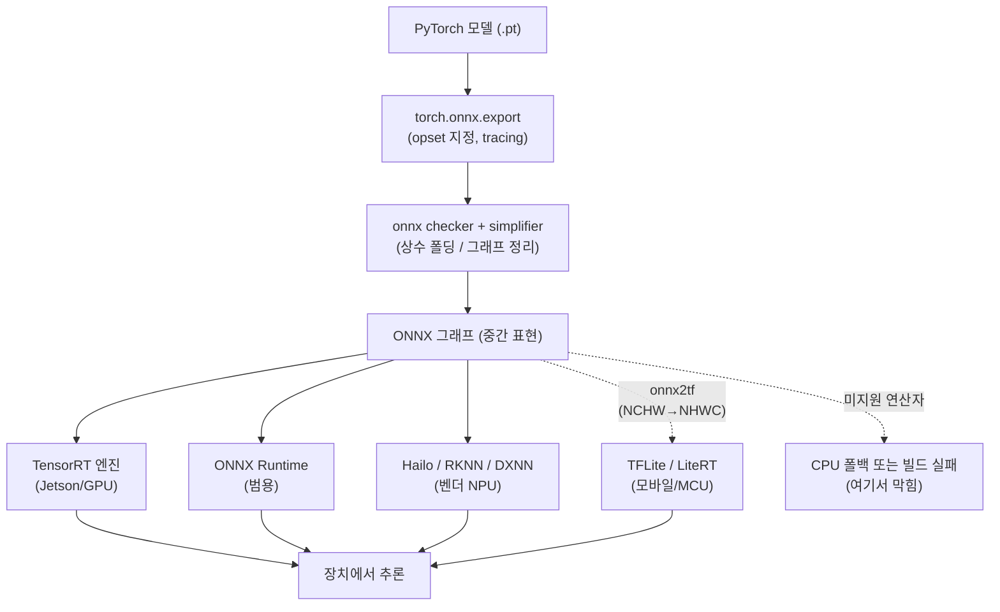

## 0. 학습이 끝나도 끝이 아니다

앞선 글들에서 모델을 작게 만드는 일(양자화·증류)과 그 모델을 빠르게 굴릴 칩(NPU)을 다뤘다. 둘 사이에 빠진 단계가 하나 있다. PyTorch로 학습을 끝낸 `.pt` 파일은 그 자체로는 Jetson에서도, Coral에서도, RK3588에서도 돌지 않는다. 학습 프레임워크가 쓰는 그래프 표현과 장치가 받는 그래프 표현이 다르기 때문이다. 그 둘을 잇는 변환 작업을 포팅(porting)이라 부른다.

포팅이 단순 파일 형식 변환이면 이 글을 쓸 이유가 없다. 실제로는 변환 도중에 연산자가 사라지거나, opset(ONNX 연산자 집합의 버전 번호)이 안 맞아 컴파일이 깨지거나, 텐서 축 순서가 뒤집혀 결과가 틀어진다. "ONNX로는 변환됐는데 TensorRT 빌드에서 죽는다"는 상황이 흔하다. 이 글은 PyTorch 모델이 장치에 도착하는 실제 경로와 그 길에서 부딪히는 난관을 다룬다.

> **포팅은 파일 변환이 아니라 그래프 번역이다. 한쪽 프레임워크의 연산을 다른 쪽 컴파일러가 아는 연산으로 다시 표현하는 일이고, 안 통하는 연산이 하나라도 있으면 거기서 막힌다.**

## 1. ONNX라는 중간 정거장

대부분의 포팅 경로는 ONNX(Open Neural Network Exchange)를 거친다. ONNX는 프레임워크 중립적인 모델 표현 형식이다. PyTorch·TensorFlow가 각자의 방식으로 저장한 신경망 그래프를, 연산자(operator)와 텐서의 표준 명세로 다시 적은 중간 표현(IR: Intermediate Representation)이다.

ONNX가 끼는 이유는 조합 폭발을 막기 위해서다. 학습 프레임워크가 N개, 타깃 런타임이 M개일 때 직접 변환기를 다 만들면 N×M개가 필요하지만, 중간에 ONNX를 두면 "프레임워크→ONNX" N개와 "ONNX→런타임" M개로 N+M개면 된다. 그래서 거의 모든 경로가 ONNX를 한 번 지난다.

PyTorch에서 ONNX로 내보내는 코드는 짧다.

```python
# 학습된 PyTorch 모델을 ONNX로 내보내기
import torch

model.eval()                                    # 추론 모드 고정 (dropout/BN 동결)
dummy = torch.randn(1, 3, 224, 224)             # 입력 형태를 알려줄 더미 텐서

torch.onnx.export(
    model, dummy, "model.onnx",
    opset_version=19,                           # 타깃 컴파일러가 받는 opset에 맞춘다
    input_names=["input"], output_names=["output"],
    dynamic_axes={"input": {0: "batch"}},       # 배치 축만 가변, 나머지는 고정
)
```

두 가지를 짚는다. `dummy` 텐서가 필요한 이유는 ONNX 내보내기가 모델에 입력을 한 번 흘려보내며 실제 실행된 연산만 그래프로 기록하는 방식(tracing)을 쓰기 때문이다. 그래서 입력 형태를 미리 줘야 한다. 그리고 PyTorch 2.9부터 `torch.onnx.export`의 `dynamo=True`가 기본값이 됐다. 기존 TorchScript 추적 대신 `torch.export` 기반의 새 경로로 내보내며, 코드는 거의 그대로지만 내부적으로 더 정확한 그래프를 뽑는다.

내보낸 뒤에는 검증과 정리를 한 번 거친다.

```python
import onnx
from onnxsim import simplify

m = onnx.load("model.onnx")
onnx.checker.check_model(m)                      # 그래프 구조가 ONNX 규격에 맞는지 점검
m_simplified, ok = simplify(m)                   # 상수 폴딩 등으로 그래프를 단순화
onnx.save(m_simplified, "model_sim.onnx")
```

`onnx-simplifier`(onnxsim)는 그래프 전체를 추론해 불필요한 연산자를 상수 출력으로 대체하는 상수 폴딩(constant folding)을 한다. tracing이 남긴 잡다한 Shape·Gather·Unsqueeze 연산 무더기가 정리되는데, 다음 단계 컴파일러가 못 받는 연산의 상당수가 이 단순화로 사라진다. 컴파일 성공률을 크게 좌우하는 단계다.

## 2. opset — 같은 ONNX인데 버전이 안 맞는다

ONNX 파일이라고 다 같은 게 아니다. ONNX는 연산자 집합을 opset이라는 번호로 버전 관리한다. opset 11과 opset 19는 같은 연산이라도 명세가 다르고, 새 opset에서만 생긴 연산자도 있다. 문제는 모델을 내보내는 쪽(PyTorch)과 받는 쪽(타깃 컴파일러)이 지원하는 opset 범위가 다르다는 점이다.

이게 가장 흔한 첫 좌절이다. 구체적인 사례를 들면, RKNN-Toolkit2(Rockchip RK3588용 변환기)는 opset 12~19를 지원하고 opset 19를 권장한다. 반대로 오래된 TensorRT 8.x는 최신 opset의 일부 연산을 못 받는다. 실제로 YOLO 계열 모델을 opset 11로 내보내 TensorRT 8.2에서 빌드하면 Mod 연산자를 파싱하지 못해 실패하고, TensorRT 8.6은 opset 17의 LayerNormalization을 파싱하지 못한다.

그래서 opset은 "최신으로 올리면 좋은 것"이 아니라 "타깃 컴파일러가 받는 범위 안에서 고르는 것"이다. 내보내는 사람이 타깃 컴파일러의 지원 표를 먼저 보고 opset을 거꾸로 정해야 한다. 이 결정은 도구가 대신 해주지 않는다.

## 3. 타깃별 컴파일러 — 무엇을 받고 무엇을 못 받나

ONNX까지 왔으면 이제 타깃 장치의 컴파일러로 넘긴다. 컴파일러마다 입력 형식과 지원 범위가 다르다.

| 타깃 컴파일러 | 주 타깃 | 입력 형식 | 지원 범위 | 못 받는 것 |
|---|---|---|---|---|
| TensorRT | NVIDIA Jetson·GPU | ONNX | 연산자 범위 가장 넓음, FP16·INT8 엔진 빌드 | 신·구 opset 경계의 일부 연산(Mod·LayerNorm 등 버전 의존) |
| ONNX Runtime | 범용(서버·PC·엣지) | ONNX | EP(실행 공급자)별로 다름, 미지원 시 CPU 폴백 | EP가 못 받는 연산은 CPU로 떨어짐(느려짐) |
| TFLite / LiteRT | 모바일·MCU | TF SavedModel(ONNX는 onnx2tf 경유) | INT8 양자화 성숙, TFLite Micro로 MCU까지 | ONNX 직접 입력 불가, NHWC 레이아웃 강제 |
| Hailo Dataflow Compiler | Hailo-8/15 | ONNX·TF·TFLite | 데이터플로 구조, 2025 릴리스에서 Einsum·group conv 지원 확장 | 미지원 연산자, 동적 shape에 민감 |
| RKNN-Toolkit2 | Rockchip RK3588 등 | ONNX(opset 12~19) | INT4/INT8/FP16 혼합, RK3588은 int4×int4→int16 | opset 범위 밖, 일부 정규화 연산 버전 의존 |
| DeepX DXNN | DeepX DX-M1 | ONNX 등 | 엣지 비전 NPU용 | 벤더 지원 연산자 목록에 한정 |

표에서 두 갈래가 보인다. TensorRT·ONNX Runtime은 연산자 지원 범위가 넓어 PyTorch 모델을 비교적 그대로 끌고 갈 수 있다. 반대로 TFLite·Hailo·RKNN·DXNN 같은 엣지 NPU 계열은 받는 연산자가 한정적이라, 변환 전에 모델을 그쪽이 아는 연산으로 다시 짜야 하는 경우가 많다. 같은 모델이라도 Jetson행이면 거의 안 건드리고, Hailo행이면 손이 많이 간다.

ONNX Runtime의 세션 생성 코드는 이 폴백 동작을 직접 보여준다.

```python
import onnxruntime as ort

# 실행 공급자(EP)를 우선순위 순으로 지정: TensorRT 우선, 안 되면 CUDA, 그래도 안 되면 CPU
sess = ort.InferenceSession(
    "model_sim.onnx",
    providers=["TensorrtExecutionProvider", "CUDAExecutionProvider", "CPUExecutionProvider"],
)
out = sess.run(None, {"input": x})
```

`providers` 목록은 우선순위다. 앞쪽 EP가 어떤 연산을 못 받으면 그 연산만 다음 EP로 떨어진다. 마지막이 보통 CPU다. 편리하지만 함정이 있다. 모델 일부가 조용히 CPU로 폴백되면 에러 없이 속도만 느려진다. GPU를 쓰는 줄 알았는데 절반이 CPU에서 도는 식이다. 그래서 진단할 때는 세션 옵션의 `disable_cpu_ep_fallback`을 켜서 폴백을 막고, 못 받는 연산이 있으면 차라리 즉시 실패하게(fail-fast) 만든다. 어느 연산이 문제인지가 그제야 드러난다.

## 4. 변환 파이프라인 전체 그림

지금까지의 경로를 한 장으로 모으면 이렇다.



*그림. PyTorch에서 출발해 ONNX를 중간 정거장으로 거쳐 타깃별 컴파일러로 갈라진다. TFLite행은 레이아웃 변환(onnx2tf)을 한 번 더 거치고, 어느 경로든 미지원 연산자를 만나면 CPU 폴백 또는 빌드 실패로 막힌다.*

## 5. 길에서 막히는 네 가지

파이프라인이 깨지는 자리는 대체로 정해져 있다.

**미지원 연산자와 CPU 폴백.** 가장 흔하다. 타깃 컴파일러의 지원 목록에 없는 연산이 그래프에 하나라도 있으면 그 연산은 NPU/GPU에서 못 돌고 CPU로 떨어진다. 한 연산만 폴백돼도 그 지점에서 데이터가 NPU 메모리와 CPU 메모리를 왕복해 실시간이 깨진다. Coral Edge TPU처럼 미지원 연산자부터 끝까지를 통째로 CPU로 넘기는 칩도 있다. 대응은 그 연산을 지원되는 연산들의 조합으로 모델 단계에서 다시 짜거나, 컴파일러가 받을 때까지 opset을 조정하는 것이다.

**동적 shape vs 고정 shape.** 학습 때는 배치·해상도를 자유롭게 바꾸지만 엣지 컴파일러는 대개 고정 shape를 요구한다. 입력 크기가 정해져야 메모리 배치와 커널을 미리 최적화하기 때문이다. `dynamic_axes`로 배치 축을 열어두면 TensorRT는 최소·최적·최대 shape를 받는 별도 설정(optimization profile)을 요구하고, Hailo·RKNN 같은 NPU 컴파일러는 동적 shape 자체에 민감하다. 그래서 엣지로 갈 때는 배치 1, 해상도 고정으로 못 박고 내보내는 게 안전하다.

**레이아웃 NCHW↔NHWC.** PyTorch와 ONNX는 텐서 축을 [배치, 채널, 높이, 너비] 순(NCHW)으로 두고, TFLite/TensorFlow는 [배치, 높이, 너비, 채널] 순(NHWC)을 쓴다. ONNX를 TFLite로 보낼 때 축을 통째로 재배치해야 하는데, 단순 변환기는 모든 연산 앞뒤에 Transpose(축 바꾸기) 연산을 끼워 넣어 그래프가 비대해지고 느려진다. onnx-tensorflow의 "Transpose 폭증" 문제다. `onnx2tf` 같은 전용 도구는 불필요한 Transpose를 소거해 NHWC 모델을 깔끔하게 뽑는다. TFLite행 포팅에서 onnx2tf를 거치는 이유다.

**커스텀 레이어.** 표준 ONNX 연산자로 표현 안 되는 직접 짠 연산이 있으면 ONNX 내보내기 자체가 막히거나 알 수 없는 노드로 기록된다. 해당 연산을 표준 연산 조합으로 다시 쓰거나, 타깃 런타임에 커스텀 연산자 플러그인을 따로 등록해야 풀린다. 자동 변환의 한계가 가장 분명하게 드러나는 자리다.

> **"ONNX로는 되는데 TensorRT에서 죽는다"의 정체는 거의 항상 셋 중 하나다. opset이 안 맞거나, 동적 shape를 못 받거나, 커스텀·미지원 연산자가 끼어 있는 것이다.**

## 6. 그래프 최적화 — 변환의 부산물이자 핵심

컴파일은 단순 번역이 아니다. 변환기는 그래프를 받아 동작이 같은 더 빠른 그래프로 다시 짠다. 두 가지가 핵심이다.

상수 폴딩(constant folding)은 입력에 무관하게 결과가 정해진 부분을 미리 계산해 상수로 박는다. 앞서 onnxsim이 하는 일이다. 연산 융합(operator fusion)은 줄지어 있는 여러 연산을 하나의 커널로 합친다. 대표적으로 Conv→BatchNorm→ReLU 세 연산을 TensorRT가 하나의 CBR 커널로 융합한다. 세 연산 사이 중간 결과를 GPU 전역 메모리에 쓰고 다시 읽는 왕복이 사라진다. 추론에서 연산 자체보다 메모리 왕복이 더 큰 병목인 경우가 많아 이 융합이 지연을 크게 줄인다. ReLU는 학습 파라미터가 없는 무상태 연산이라 앞 연산에 그냥 붙여 융합한다.

같은 모델을 같은 칩에 올려도 변환기가 융합을 잘 하느냐가 실제 속도를 가른다. "ONNX로 변환됐다"는 끝이 아니라 시작이다. 변환이 된 것과 빠르게 도는 것은 다른 문제다.

## 7. 사람에게 남는 일

이 파이프라인의 거의 모든 단계가 자동화돼 있다. 코딩 에이전트에게 "이 PyTorch 모델을 opset 19로 ONNX 내보내고 onnxsim으로 정리한 뒤 TensorRT INT8 엔진으로 빌드하라"고 지시하면 `torch.onnx.export`의 인자도, onnxsim 호출도, EP 우선순위 설정도 Claude Code가 자동으로 채워 실행한다. 그럴수록 사람의 일은 명령을 치는 데서 결정을 내리는 데로 옮겨간다.

타깃 컴파일러가 받는 opset을 확인해 내보낼 버전을 정하는 일, 동적 shape를 열어둘지 고정할지 정하는 일, 미지원 연산자가 나왔을 때 모델을 다시 짤지 opset을 조정할지 판단하는 일, 변환이 됐다고 끝내지 않고 일부가 CPU로 조용히 폴백되지 않았는지 장치에서 확인하는 일. 이 결정들은 타깃 장치의 제약과 모델 구조를 함께 아는 사람만 내린다. 도구는 주어진 경로를 실행하지만 어느 opset으로 어느 컴파일러를 향할지는 묻지 않으면 정해 주지 않고, 변환 성공 메시지가 모델이 빠르게 돈다는 뜻도 아니다.

도구가 모델을 자동으로 장치에 옮겨 주는 시대에 사람에게 남는 일은, 타깃 컴파일러의 제약을 읽어 변환 경로와 opset을 설계하는 능력과 변환된 모델이 폴백 없이 실제로 빠른지 장치에서 검증하는 능력이다.

---

## 출처

- PyTorch, "torch.onnx — PyTorch 2.12 documentation", https://docs.pytorch.org/docs/2.12/onnx.html
- PyTorch GitHub, "[ONNX] Flip `dynamo` default to True in torch.onnx.export (Issue #151693)", https://github.com/pytorch/pytorch/issues/151693
- onnxsim, "onnx-simplifier: Simplify your ONNX model", https://github.com/daquexian/onnx-simplifier
- Ultralytics GitHub, "TensorRT 8.2 Fails to Parse YOLO26 ONNX Model: Mod Operator Not Supported due to Opset 11 (Issue #24607)", https://github.com/ultralytics/ultralytics/issues/24607
- NVIDIA TensorRT GitHub, "TensorRT 8.6 cannot parse ONNX opset 17 model with LayerNormalization (Issue #3346)", https://github.com/NVIDIA/TensorRT/issues/3346
- ONNX Runtime, "Execution Providers", https://onnxruntime.ai/docs/execution-providers/
- onnx GitHub, "Addressing the Need for Disabled Fallback by Default in ONNX Runtime (Discussion #6623)", https://github.com/onnx/onnx/discussions/6623
- airockchip, "RKNN-Toolkit2", https://github.com/airockchip/rknn-toolkit2
- Hailo, "Hailo Dataflow Compiler / AI Software Suite", https://hailo.ai/products/hailo-software/hailo-ai-software-suite/
- PINTO0309, "onnx2tf: ONNX (NCHW) → TensorFlow/TFLite (NHWC) layout conversion", https://github.com/PINTO0309/onnx2tf
- Practical ML, "Faster Models with Graph Fusion: How Deep Learning Frameworks Optimize Your Computation", https://arikpoz.github.io/posts/2025-05-07-faster-models-with-graph-fusion-how-deep-learning-frameworks-optimize-your-computation/

*※ opset 호환·연산자 미지원 사례(YOLO26 opset 11 Mod, opset 17 LayerNormalization)는 위 GitHub 이슈가 보고한 실제 사례다. RKNN-Toolkit2 opset 12~19 권장 19, Hailo 2025 Einsum·group conv 지원 확장은 각 벤더 자료값이며 버전에 따라 달라진다.*
