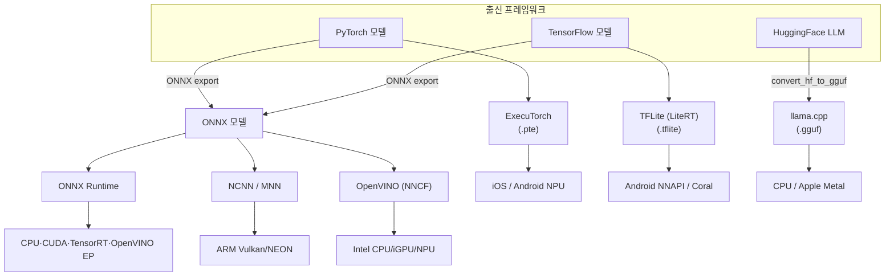

## 0. "양자화해서 올려라"가 가리지 않는 것

앞선 글들에서 온디바이스 비전의 방법론(경량 모델·양자화·증류)과 그걸 받아 줄 칩(NPU)을 다뤘다. 그 두 글이 공통으로 미뤄 둔 게 있다. 줄인 모델을 실제로 어느 런타임에, 어떤 명령으로 변환해 올리느냐다. "INT8로 양자화해서 NPU에 올려라"는 한 문장 안에는 서로 다른 프레임워크 대여섯 개와, 각각의 변환 API가 숨어 있다.

이 글은 그 변환을 실제 코드로 본다. 주요 런타임의 강점·타깃을 먼저 비교하고, 양자화 변환 코드를 네 가지 프레임워크(TFLite·ONNX Runtime·ExecuTorch·llama.cpp/OpenVINO)에서 실제로 인용한다. 개론은 앞 글에 있으니 여기서는 손에 잡히는 명령과 수치만 다룬다.

> **런타임은 칩이 정한다. 칩을 고르는 순간 변환 명령과 양자화 비트가 같이 정해진다. 사람이 결정하는 건 그 칩이지, 변환 절차가 아니다.**

## 1. 런타임 지형 — 누가 무엇을 겨누나

온디바이스 추론 런타임은 출신 프레임워크와 타깃 칩으로 갈린다. 2026년 현재 실무에서 마주치는 주요 후보는 일곱이다.

| 런타임 | 만든 곳 | 주 입력 포맷 | 강점 | 주 타깃 | 언어/바인딩 |
|---|---|---|---|---|---|
| TensorFlow Lite (LiteRT) | Google | TF SavedModel/Keras | 모바일 표준, INT8 PTQ/QAT, TFLite Micro로 MCU까지 | Android·MCU | C++/Java/Python |
| ONNX Runtime | Microsoft | ONNX | 프레임워크 중립 허브, 실행 공급자(EP)로 백엔드 교체 | 범용(서버~엣지) | C++/C#/Python |
| ExecuTorch | Meta | PyTorch (torch.export) | PyTorch→엣지 직행, 작은 런타임, delegate로 NPU 위임 | iOS·Android·엣지 | C++/Python |
| NCNN | Tencent | ONNX/자체 변환 | ARM NEON 손최적화, Vulkan GPU, 의존성 0 | ARM 모바일 | C++ |
| MNN | Alibaba | ONNX/TF/자체 | 다중 GPU 백엔드(OpenCL/Vulkan/OpenGL), LLM 추론 확장 | 모바일·임베디드 | C++ |
| OpenVINO | Intel | ONNX/IR | Intel CPU/iGPU/NPU 최적화, NNCF 양자화 | Intel·산업 엣지 | C++/Python |
| llama.cpp | 오픈소스(ggml) | GGUF | CPU에서 LLM 추론, K-quant 4비트, 의존성 가벼움 | 로컬 LLM(CPU/Metal) | C/C++ |

대략의 갈래는 이렇다. PyTorch에서 출발하면 ExecuTorch가 가장 자연스럽고, TensorFlow면 TFLite다. 어느 쪽도 아니거나 백엔드를 갈아끼우고 싶으면 중간 포맷인 ONNX로 모으고 ONNX Runtime을 쓴다. ARM 모바일에서 의존성 없이 작게 가져가려면 NCNN, Intel 하드웨어면 OpenVINO, 로컬 LLM이면 llama.cpp다. NCNN은 Tencent가 ARM NEON 어셈블리 수준으로 손최적화했고 GPU는 Vulkan만 받는다. MNN은 Alibaba가 만들었고 OpenCL·Vulkan·OpenGL을 모두 받아 백엔드 선택지가 더 넓다.

비유로 좁히면 ONNX Runtime은 여러 나라 플러그를 받는 멀티탭이고, ExecuTorch·TFLite는 한 콘센트 규격에 맞춘 전용 어댑터다. 다만 실제 차이는 입력 포맷과 백엔드 위임 구조에 있다. 그 위임을 결정하는 게 다음 절의 변환 코드다.

## 2. TFLite — 사후 양자화 INT8 변환

가장 먼저 볼 코드는 TensorFlow Lite의 사후 양자화(PTQ: 학습 끝난 모델을 보정 데이터로 스케일만 추정해 정수로 바꾸는 방식)다. 앞 글에서 뼈대만 보였으니, 여기서는 핵심인 `representative_dataset`을 실제 제너레이터로 채운 형태로 본다. 이 코드를 보이는 목적은 INT8 전용 칩(예: Google Coral)이 요구하는 "입출력까지 완전 INT8"를 어떻게 강제하는지 보이기 위해서다.

```python
# 출처 패턴: TensorFlow 공식 PTQ 가이드
# 목적: FP32 SavedModel을 Coral 등 INT8 전용 칩이 받는 완전 정수 .tflite로 변환
import tensorflow as tf
import numpy as np

def representative_dataset():
    # 현장 분포와 닮은 보정 샘플 수백 장을 하나씩 흘려보낸다(스케일 추정용)
    for _ in range(200):
        data = np.random.rand(1, 224, 224, 3).astype(np.float32)  # 실제로는 진짜 샘플
        yield [data]

converter = tf.lite.TFLiteConverter.from_saved_model("model/")
converter.optimizations = [tf.lite.Optimize.DEFAULT]            # 양자화 켜기
converter.representative_dataset = representative_dataset       # 보정 데이터 연결
converter.target_spec.supported_ops = [tf.lite.OpsSet.TFLITE_BUILTINS_INT8]  # 완전 정수만 허용
converter.inference_input_type = tf.int8                        # 입력도 INT8
converter.inference_output_type = tf.int8                       # 출력도 INT8
tflite_int8 = converter.convert()                               # 결과: 약 1/4 크기
open("model_int8.tflite", "wb").write(tflite_int8)
```

`supported_ops`에 `TFLITE_BUILTINS_INT8`만 넣고 입출력 타입을 `int8`로 못 박는 두 줄이 핵심이다. 이게 있어야 Coral Edge TPU처럼 부동소수를 아예 못 받는 칩에 올라간다. 둘 중 하나라도 빠지면 변환기는 일부 연산을 FP로 남기고, 그러면 그 연산부터 CPU로 폴백된다.

수치로 보면, FP32→INT8 변환은 비트 폭이 1/4이라 모델 크기도 약 1/4로 준다. 실측 사례에서 122.0MB 모델이 30.6MB로 줄었고, 정확도는 대개 1%p 안쪽 손실에 그친다. ONNX 분류 모델 한 사례에서는 94.3%→92.9%로 약 1.4%p 떨어졌다.

## 3. ONNX Runtime — 정적 양자화

ONNX Runtime은 입력 포맷이 ONNX 하나라, 다른 프레임워크에서 모델을 ONNX로 내보낸 뒤 여기서 양자화한다. 정적 양자화(static quantization)는 보정 데이터로 활성값 범위까지 미리 잡아 추론 시 추가 계산을 없앤다. 이 코드를 보이는 목적은 보정 데이터를 `CalibrationDataReader`라는 클래스로 주입하는, TFLite와 다른 방식을 보이기 위해서다.

```python
# 출처 패턴: onnxruntime.quantization 공식 README
# 목적: FP32 ONNX 모델을 QDQ 형식 INT8로 정적 양자화
from onnxruntime.quantization import (
    quantize_static, CalibrationDataReader, QuantFormat, QuantType,
)
import numpy as np

class MyReader(CalibrationDataReader):
    # 보정 샘플을 {입력이름: 배열} 형태로 하나씩 내놓는다
    def __init__(self, input_name):
        self.input_name = input_name
        self.data = iter([
            {input_name: np.random.rand(1, 3, 224, 224).astype(np.float32)}
            for _ in range(200)                                   # 실제로는 진짜 샘플
        ])
    def get_next(self):
        return next(self.data, None)                              # 끝나면 None

quantize_static(
    model_input="model.onnx",
    model_output="model_int8.onnx",
    calibration_data_reader=MyReader("input"),
    quant_format=QuantFormat.QDQ,         # QuantizeLinear/DeQuantizeLinear 삽입형
    weight_type=QuantType.QInt8,          # 가중치 INT8
    activation_type=QuantType.QUInt8,     # 활성 UINT8
    per_channel=True,                     # 채널별 스케일(정확도 유지에 유리)
)
```

`QuantFormat.QDQ`는 모델 그래프에 QuantizeLinear/DeQuantizeLinear 노드를 끼워 넣어, 어느 백엔드(실행 공급자)든 그 노드를 보고 정수 연산으로 융합하게 하는 형식이다. ONNX Runtime의 진짜 강점은 이 다음에 있다. 같은 INT8 모델을 코드 한 줄(`providers=[...]`)로 CPU·CUDA·TensorRT·OpenVINO 실행 공급자 사이에서 갈아끼운다. 모델을 ONNX로 모아 두면 타깃 칩이 바뀌어도 변환을 다시 안 한다.

## 4. ExecuTorch — PyTorch 모델을 .pte로

PyTorch에서 학습한 모델을 엣지로 보낼 때 Meta가 미는 경로가 ExecuTorch다. 흐름은 세 단계다. `torch.export.export`로 그래프를 고정하고, `to_edge_transform_and_lower`에 백엔드 위임자(partitioner)를 넣어 NPU가 받을 부분을 위임하고, `.to_executorch()`로 `.pte` 파일을 만든다. 이 코드를 보이는 목적은 "백엔드 위임"이 변환 코드 안에서 어떻게 한 줄로 표현되는지 보이기 위해서다.

```python
# 출처 패턴: ExecuTorch 공식 XNNPACK 튜토리얼
# 목적: torchvision MobileNetV2를 XNNPACK 백엔드용 .pte로 내보내기
import torch
from torch.export import export
import torchvision.models as models
from executorch.exir import to_edge_transform_and_lower
from executorch.backends.xnnpack.partition.xnnpack_partitioner import XnnpackPartitioner

model = models.mobilenet_v2(weights="DEFAULT").eval()
sample = (torch.randn(1, 3, 224, 224),)

exported = export(model, sample)                      # 1) 그래프 고정
edge = to_edge_transform_and_lower(
    exported,
    partitioner=[XnnpackPartitioner()],               # 2) XNNPACK이 받을 부분 위임(나머지는 CPU 폴백)
)
prog = edge.to_executorch()                           # 3) 실행 가능한 프로그램으로

with open("mobilenetv2.pte", "wb") as f:
    prog.write_to_file(f)                             # .pte 한 파일로 저장
```

`partitioner=[XnnpackPartitioner()]` 한 줄이 핵심이다. partitioner는 그래프를 훑어 해당 백엔드가 처리할 수 있는 부분그래프만 떼어 그 백엔드에 위임하고, 나머지는 CPU로 남긴다. 이 자리에 Apple CoreML, Qualcomm QNN 같은 다른 위임자를 넣으면 같은 모델이 다른 NPU로 간다. INT8 양자화를 더하려면 `export` 앞에 `XNNPACKQuantizer`와 `get_symmetric_quantization_config`로 양자화 단계를 한 번 거친 뒤 같은 흐름을 탄다.



*그림. 출신 프레임워크에서 각 런타임 포맷으로 가는 경로와, 그 포맷이 닿는 타깃 칩. ONNX가 여러 런타임으로 갈라지는 허브 역할을 한다.*

## 5. LLM은 다른 길 — llama.cpp/GGUF와 OpenVINO

비전 모델과 달리 로컬 LLM은 변환 경로가 따로 있다. llama.cpp는 HuggingFace 모델을 GGUF 포맷으로 바꾼 뒤 K-quant 방식으로 4비트까지 줄인다. 이 코드를 보이는 목적은 비전 양자화(Python API)와 달리 LLM 쪽은 CLI 두 줄로 끝난다는 점을 보이기 위해서다.

```bash
# 출처 패턴: llama.cpp 공식 + Qwen 문서
# 목적: HuggingFace 모델을 FP16 GGUF로 바꾼 뒤 4비트(Q4_K_M)로 양자화
# 1) HF 모델 → 중간 FP16 GGUF
python convert_hf_to_gguf.py meta-llama/Llama-3.2-3B-Instruct \
    --outtype f16 --outfile Llama-3.2-3B-f16.gguf
# 2) FP16 GGUF → 4비트 Q4_K_M (K-quant, 중간 품질)
./build/bin/llama-quantize Llama-3.2-3B-f16.gguf Llama-3.2-3B-Q4_K_M.gguf Q4_K_M
```

`Q4_K_M`은 4비트 K-quant의 "중간(Medium)" 등급으로, Q4_K_S(작음)보다 정확하고 Q5_K_M보다 작고 빠르다. INT8이 4x 축소라면 4비트는 약 8x다. 7B LLaMA가 FP16 14GB에서 Q4_K_M 약 4GB대로 줄어, 그래픽카드 없는 노트북 CPU에서도 돌아간다.

Intel 하드웨어를 겨눈다면 OpenVINO의 NNCF(Neural Network Compression Framework)를 쓴다. 이 코드를 보이는 목적은 보정 데이터셋 객체(`nncf.Dataset`)로 INT8 양자화를 한 호출에 끝내는 방식을 보이기 위해서다.

```python
# 출처 패턴: OpenVINO NNCF 기본 양자화 흐름 공식 문서
# 목적: OpenVINO IR 모델을 보정 데이터 약 300장으로 INT8 양자화
import nncf

# transform_fn: 데이터 항목에서 모델 입력 텐서를 뽑는 함수
calibration_dataset = nncf.Dataset(data_loader, transform_fn)   # 약 300 샘플 권장
quantized_model = nncf.quantize(ov_model, calibration_dataset)  # 8비트 양자화 한 방
import openvino as ov
ov.save_model(quantized_model, "model_int8.xml")               # IR로 저장
```

NNCF는 활성값 범위를 약 300개 보정 샘플로 추정한다는 점에서 TFLite·ONNX Runtime의 정적 양자화와 원리가 같다. 다른 건 입력이 OpenVINO IR이고 출력이 Intel CPU·iGPU·NPU에 맞춰진다는 점이다.

## 6. 그래서 어느 칩에 어느 런타임인가

네 가지 변환 코드를 관통하는 건 칩↔런타임 매핑이다. 변환 명령이 다 다른 이유는 타깃 칩이 다르기 때문이다. 실무에서 굳어진 매핑은 이렇다.

| 타깃 | 런타임 | 변환 산출물 | 양자화 |
|---|---|---|---|
| NVIDIA Jetson | TensorRT (또는 ONNX Runtime + TensorRT EP) | TensorRT 엔진 | FP16/INT8 |
| iOS / iPhone | ExecuTorch + CoreML delegate | .pte | INT8(대칭) |
| Android | TFLite(LiteRT) + NNAPI, 또는 NCNN | .tflite | INT8 PTQ |
| Intel CPU/iGPU/NPU | OpenVINO + NNCF | IR(.xml/.bin) | INT8 |
| Google Coral | TFLite 완전 INT8 + Edge TPU 컴파일러 | .tflite(edgetpu) | INT8 전용 |
| 로컬 LLM(CPU/Mac) | llama.cpp | .gguf | 4비트 K-quant |
| 백엔드 미정·교체 | ONNX Runtime | .onnx(QDQ) | INT8 정적 |

이 표가 변환 코드를 거꾸로 설명한다. Coral을 고르면 2절의 "완전 INT8" 두 줄이 강제되고, iPhone을 고르면 4절의 partitioner 자리에 CoreML이 들어가고, Intel PC를 고르면 5절의 NNCF가 답이다. 백엔드를 아직 못 정했으면 ONNX로 모아 두고 실행 공급자만 갈아끼우는 게 가장 손이 덜 간다.

## 7. 사람에게 남는 일

변환 자체는 도구가 한다. 코딩 에이전트에게 "이 PyTorch 모델을 iPhone용 ExecuTorch .pte로 INT8 양자화해 내보내라"고 지시하면 위 코드는 도구가 정확히 써 준다. `representative_dataset`의 루프도, `CalibrationDataReader`의 구조도, partitioner 한 줄도 도구가 채운다. 실제로 이 글의 코드 검증 과정에서, 각 API의 정확한 인자 이름과 호출 순서는 도구가 공식 문서에서 끌어와 맞춰 준 부분이 크다. 내가 한 일은 어느 프레임워크를 비교 대상에 넣을지 고르고, 끌어온 코드가 2026년 현재 API와 맞는지 출처로 대조한 것이다.

그럴수록 사람의 결정은 코드 위쪽으로 올라간다. 타깃 칩을 무엇으로 잡을지(그게 런타임과 양자화 비트를 한꺼번에 정한다), 보정 데이터에 무엇을 넣을지(여기서 정확도가 갈린다), INT8의 1%p 손실을 받아들일지 4비트의 8x 축소까지 갈지. 도구는 주어진 타깃에 맞는 변환 코드를 써 주지만, 어느 타깃에 맞출지는 묻지 않으면 정해 주지 않는다.

도구가 변환 명령을 자동으로 써 주는 시대에 사람에게 남는 일은, 칩과 응용 제약을 읽어 런타임·양자화 비트를 고르는 능력과 그 변환물이 목표 장비에서 폴백 없이 실제로 빨라지는지 검증하는 능력이다.

---

## 출처

- ONNX Runtime, "Quantization (quantize_static / CalibrationDataReader / QuantFormat)", https://github.com/microsoft/onnxruntime/blob/main/onnxruntime/python/tools/quantization/README.md
- TensorFlow, "Post-training quantization", https://www.tensorflow.org/lite/performance/post_training_quantization
- PyTorch ExecuTorch, "Building and Running ExecuTorch with XNNPACK Backend", https://docs.pytorch.org/executorch/stable/tutorial-xnnpack-delegate-lowering.html
- PyTorch ExecuTorch, "XNNPACK Backend overview", https://docs.pytorch.org/executorch/stable/backends-xnnpack.html
- llama.cpp, "quantize tool README", https://github.com/ggml-org/llama.cpp/blob/master/tools/quantize/README.md
- Qwen Docs, "Run with llama.cpp (convert_hf_to_gguf, Q4_K_M)", https://qwen.readthedocs.io/en/latest/quantization/llama.cpp.html
- OpenVINO, "Basic Quantization Flow (nncf.quantize)", https://docs.openvino.ai/2025/openvino-workflow/model-optimization-guide/quantizing-models-post-training/basic-quantization-flow.html
- Tencent ncnn, GitHub repository, https://github.com/Tencent/ncnn
- MNN, "A Universal and Efficient Inference Engine" (MLSys 2020), https://proceedings.mlsys.org/paper_files/paper/2020/file/bc19061f88f16e9ed4a18f0bbd47048a-Paper.pdf
- "Performance Characterization of using Quantization for DNN Inference on Edge Devices", arXiv 2303.05016, https://arxiv.org/pdf/2303.05016

*※ 코드는 각 프레임워크 공식 문서의 2026년 기준 API 패턴이며, 실제 사용 시 보정 데이터·입력 형상은 모델에 맞춰 바꿔야 한다. INT8 4x 축소·정확도 1%p 안쪽 손실, 122.0MB→30.6MB, ONNX 94.3%→92.9% 수치는 위 벤치마크 출처값이며 모델·칩에 따라 달라진다. llama.cpp Q4_K_M의 약 8x 축소는 4비트 기준 근사치다.*
