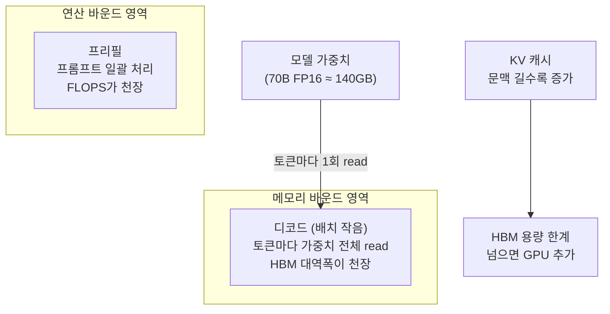

## 0. 같은 "AI 칩"의 반대쪽 끝

앞 글에서 온디바이스 NPU를 다뤘다. 2W를 먹고 4 TOPS를 내는 Google Coral, 60W에 275 TOPS의 Jetson AGX Orin까지가 그 세계였다. 폼팩터 기초편에서는 칩에서 SBC까지 손바닥 안에 들어가는 물건들을 정리했다. 이 글은 정확히 그 반대편 끝이다. 한 장에 700~1,400W를 먹고, 한 장에 141~288GB의 HBM을 얹고, 72장을 한 랙에 묶어 120kW를 끌어쓰는 데이터센터 가속기다.

같은 "AI 가속기"라는 말로 묶이지만 두 세계는 척도가 1,000배 다르다. 엣지는 전력 예산이 mW~수십 W이고 메모리가 수 GB다. 서버는 전력이 수백~수천 W이고 메모리가 수백 GB다. 엣지가 추론만 한다면, 서버는 거대 모델의 학습과 추론을 둘 다 한다. 그리고 대부분의 사람은 이 칩을 직접 사지 않는다. 클라우드에서 시간 단위로 빌린다. 그래서 이 글의 목적은 "무엇을 사라"가 아니라, 빌릴 때 무엇을 고르는지 판단할 수 있을 만큼 칩의 차이를 수치로 보는 것이다.

> **데이터센터 가속기를 가르는 축은 연산속도(FLOPS)가 아니라 HBM 용량·대역폭이다. LLM 추론은 연산이 아니라 메모리에서 막힌다.**

## 1. 비교의 축 — 왜 HBM이 먼저인가

가속기 스펙시트에는 숫자가 많다. FP64부터 FP4까지 정밀도별 연산량, HBM 용량과 대역폭, 인터커넥트, TDP. 이 중 LLM에서 가장 먼저 보는 건 HBM이다. 이유는 연산의 성격에 있다.

LLM 추론은 두 단계로 나뉜다. 프리필(prefill)은 입력 프롬프트 전체를 한 번에 처리하는 단계로 연산량이 많아 연산 바운드(compute-bound)다. 디코드(decode)는 토큰을 한 개씩 생성하는 단계인데, 토큰 하나를 만들 때마다 모델 가중치 전체를 HBM에서 한 번씩 읽어야 한다. 70B 모델을 FP16으로 올리면 가중치가 약 140GB다. 토큰 한 개당 이 140GB를 읽는 시간이 곧 생성 속도의 하한이고, 그 시간은 연산기 속도가 아니라 메모리 대역폭이 정한다. 이게 메모리 바운드(memory-bound)다.

루프라인 모델(roofline model)로 보면 분명하다. 가속기마다 연산 강도(arithmetic intensity, 메모리 1바이트당 수행하는 연산 횟수)에 임계점이 있고, 그 아래에서는 연산기를 아무리 늘려도 성능이 안 오른다. 대역폭이 천장이다. 배치 크기 1의 LLM 디코드는 이 영역에 깊이 들어가 있다.

*그림. LLM 추론에서 디코드 단계는 토큰마다 가중치 전체를 HBM에서 읽어 메모리 대역폭에 막힌다. 모델과 KV 캐시가 HBM 용량을 넘으면 GPU를 더 묶어야 한다.*

여기서 HBM 용량과 대역폭이 둘 다 결정적인 이유가 나온다. 용량이 모자라면 모델이 한 장에 안 올라가 여러 GPU에 쪼개야 하고(그만큼 비싸고 통신 부담이 생긴다), 대역폭이 낮으면 올라가도 토큰 생성이 느리다. 실측으로도 드러난다. 같은 70B FP16 모델의 단일 GPU 처리량 상한이 H100(HBM3, 3.35 TB/s)에서 약 24 tok/s, H200(HBM3e, 4.8 TB/s)에서 약 34 tok/s, B200(HBM3e, 8 TB/s)에서 약 57 tok/s로, 다른 조건 없이 대역폭만으로 갈린다. 연산 성능표보다 HBM 행을 먼저 보는 이유다.

## 2. NVIDIA — Hopper에서 Blackwell로

NVIDIA 라인은 세대로 끊긴다. Hopper(H100→H200)와 Blackwell(B200·GB200, 그리고 2025년의 Blackwell Ultra B300·GB300)이다.

**H100 → H200.** 둘은 같은 GH100 다이를 쓴다. 연산 회로가 같고 바뀐 건 메모리다. H100의 HBM3 80GB·3.35 TB/s가 H200에서 HBM3e 141GB·4.8 TB/s로 늘었다. 연산은 그대로인데 메모리만 키운 제품이 따로 나온 것 자체가 §1의 논리를 증명한다. H200의 연산은 FP16 dense 989 TFLOPS, FP8 dense 1,979 TFLOPS(2:4 희소성 적용 시 각각 2배), TDP 700W다.

**B200 (Blackwell).** 새 아키텍처다. HBM3e 192GB·8 TB/s로 용량과 대역폭이 한 단계 올랐고, 2세대 트랜스포머 엔진이 FP4를 네이티브로 지원한다. FP4 dense 9,000 TFLOPS, FP8 dense 4,500 TFLOPS로 H200 대비 추론 처리량이 크게 뛴다. 대신 TDP가 1,000W로 올라 사실상 액랭을 전제한다. 5세대 NVLink로 GPU당 1.8 TB/s 인터커넥트를 낸다(H200의 NVLink 4세대는 900 GB/s).

**GB200 / GB200 NVL72.** GB200은 Grace ARM CPU 1개에 B200 2개를 NVLink로 묶은 슈퍼칩 모듈이다. 이걸 36개 모아 한 랙에 넣은 게 GB200 NVL72로, B200 72장과 Grace 36개가 들어간다. 이 랙은 13.5TB HBM3e를 하나의 풀처럼 공유하고, 5세대 NVLink 패브릭이 72장을 130 TB/s로 전부 연결하며, 랙 전체로 FP4 1,440 PFLOPS(1.44 엑사플롭)를 낸다. 랙 소비전력은 약 120kW다. 한 칸짜리 가정용 차단기가 보통 2~3kW인 걸 생각하면 한 랙이 동네 수십 가구분 전기를 먹는 셈이다.

**B300 / GB300 (Blackwell Ultra, 2025).** B200의 추론 강화판이다. 12단 HBM3e 적층으로 GPU당 288GB(B200의 192GB보다 50% 증가), 8 TB/s, FP4 15 PFLOPS, TDP 1,400W다. GB300 NVL72 랙도 130 TB/s NVLink로 72장을 묶고 FP4 1,440 PFLOPS를 내며, 긴 문맥 추론·에이전트 워크로드를 겨냥해 메모리를 더 키운 방향이다.

## 3. AMD — Instinct MI300 계열

AMD는 Instinct MI 시리즈로 같은 시장을 친다. 전략이 분명하다. NVIDIA보다 HBM 용량을 더 준다. §1의 논리상 용량이 클수록 큰 모델을 적은 GPU 수로 올릴 수 있어 추론에서 유리하다.

**MI300X (CDNA3).** HBM3 192GB·5.3 TB/s, FP16 약 1,307 TFLOPS급, TDP 750W다. 같은 시기 H100이 80GB였으니 용량이 2배가 넘는다. 이게 MI300X의 판매 논리였다.

**MI325X (CDNA3).** MI300X와 같은 듀얼 칩렛 GPU에 메모리만 키웠다. HBM3e 256GB·6 TB/s, TDP 1,000W. AMD는 이걸 "H200 대비 1.8배 용량·1.3배 대역폭"으로 내세웠다.

**MI355X / MI350X (CDNA4, 2025년 6월).** 새 아키텍처다. N3P 공정에 3D 칩렛, 185억 트랜지스터, HBM3e 288GB·8 TB/s. FP6/FP4를 새로 지원한다. MI355X는 MXFP4 10.1 PFLOPS·MXFP8 5 PFLOPS에 액랭 1,400W, MI350X는 공랭 1,000W에 MXFP4 9.2 PFLOPS다. 288GB는 같은 시기 B200의 192GB보다 크다. AMD가 용량 우위를 CDNA4에서도 유지한 셈이다.

## 4. Google TPU — 직접 안 팔고 빌려준다

Google TPU는 성격이 다르다. 시장에 칩으로 팔지 않는다. Google Cloud에서만 빌려 쓴다. 구조도 NVIDIA·AMD의 범용 GPU와 달리 행렬곱에 특화된 시스톨릭 배열 기반이다.

**TPU v6e (Trillium).** 6세대다. 칩당 BF16 918 TFLOPS, INT8 1,836 TOPS, HBM 32GB·1,638 GB/s, 칩 간 인터커넥트(ICI) 800 GB/s. 행렬곱 유닛(MXU)이 v5e의 128×128에서 256×256으로 커졌다. 한 칩의 HBM이 32GB로 NVIDIA·AMD의 수백 GB와 비교하면 작아 보이지만, TPU의 설계 철학은 한 칩을 키우는 게 아니라 ICI로 수천 칩을 팟(pod)으로 묶어 모델을 잘게 나눠 올리는 쪽이다. v6e는 한 팟에 256칩까지 묶는다.

**TPU v5p.** 학습용 상위 라인이다. 칩당 BF16 약 459 TFLOPS, HBM 95GB·2,765 GB/s로, v6e보다 칩당 연산은 낮지만 메모리 용량·대역폭이 크다. v5e는 추론·소규모 학습용 보급형으로 BF16 197 TFLOPS, 800 GB/s다. v6 Trillium은 v5e 대비 칩당 연산이 약 4.7배다.

TPU 수치를 NVIDIA·AMD와 직접 비교할 때는 주의해야 한다. TPU는 칩 단위 절대 성능보다 팟 단위 총량과 클라우드 가격으로 따지는 물건이고, 빌리는 단위가 다르다.

## 5. 한 표로 — 칩별 스펙 비교

가속기 단품(칩 1장) 기준으로 핵심 수치를 나란히 둔다. 연산 성능은 별도 표기가 없으면 dense(비희소) 기준이다.

| 칩 | 아키텍처 | HBM 용량 | HBM 대역폭 | 주력 저정밀 연산 | FP8/FP16 | 인터커넥트(칩당) | TDP |
|---|---|---|---|---|---|---|---|
| NVIDIA H200 | Hopper | 141GB HBM3e | 4.8 TB/s | FP8 1,979 TFLOPS | FP16 989 TFLOPS | NVLink4 900 GB/s | 700W |
| NVIDIA B200 | Blackwell | 192GB HBM3e | 8 TB/s | FP4 9,000 TFLOPS | FP8 4,500 TFLOPS | NVLink5 1.8 TB/s | 1,000W |
| NVIDIA B300 | Blackwell Ultra | 288GB HBM3e | 8 TB/s | FP4 15 PFLOPS | (FP8 미상세) | NVLink5 1.8 TB/s | 1,400W |
| AMD MI300X | CDNA3 | 192GB HBM3 | 5.3 TB/s | FP8 지원 | FP16 1,307 TFLOPS | Infinity Fabric | 750W |
| AMD MI325X | CDNA3 | 256GB HBM3e | 6 TB/s | FP8 지원 | FP16 1,307 TFLOPS | Infinity Fabric | 1,000W |
| AMD MI355X | CDNA4 | 288GB HBM3e | 8 TB/s | MXFP4 10.1 PFLOPS | MXFP8 5 PFLOPS | Infinity Fabric | 1,400W(액랭) |
| Google TPU v6e | Trillium | 32GB HBM | 1,638 GB/s | INT8 1,836 TOPS | BF16 918 TFLOPS | ICI 800 GB/s | 미공개 |
| Google TPU v5p | TPU v5 | 95GB HBM | 2,765 GB/s | — | BF16 459 TFLOPS | ICI | 미공개 |

랙 단위로 묶으면 척도가 또 한 번 올라간다. GB200 NVL72는 B200 72장을 13.5TB HBM3e 풀로 묶어 130 TB/s NVLink로 연결하고 FP4 1,440 PFLOPS·120kW를 낸다. GB300 NVL72도 동일한 130 TB/s·1,440 PFLOPS FP4 구성에 GPU당 메모리를 288GB로 키웠다.

> **NVIDIA는 FP4 연산과 NVLink로, AMD는 HBM 용량(288GB)으로, Google은 클라우드 팟 단위 묶음으로 승부한다. 세 회사가 같은 "AI 가속기"를 서로 다른 축에서 만든다.**

## 6. FP8·FP4 저정밀이 왜 트렌드인가

표의 저정밀 연산 행이 세대마다 점점 아래로 내려간다. Hopper는 FP8까지였고 Blackwell·CDNA4는 FP4·FP6까지 네이티브로 받는다. 이유는 §1과 같다. 정밀도를 낮추면 같은 모델의 가중치 바이트 수가 줄어든다. FP16 대비 FP8은 절반, FP4는 4분의 1이다. 가중치가 작아지면 HBM에서 읽는 양이 줄어 메모리 바운드인 디코드가 빨라지고, 같은 HBM 용량에 더 큰 모델이 올라간다. 연산기도 저정밀일수록 회로가 작아 같은 면적에 더 많이 깔린다. B200의 FP4 9,000 TFLOPS가 FP8 4,500 TFLOPS의 정확히 2배인 게 이 구조를 보여준다.

저정밀이 공짜는 아니다. 비트를 줄이면 표현 가능한 수의 범위·정밀도가 떨어져 정확도가 깎일 수 있다. 그래서 Blackwell·CDNA4의 FP4는 마이크로스케일링(블록 단위로 스케일 값을 따로 두는 MXFP4 등) 기법과 함께 쓰여 정확도 손실을 억제한다. 추론에서 먼저 자리잡았고, 학습에도 FP8이 들어오는 중이다. 핵심은 더 낮은 정밀도를 정확도 손실 없이 쓸 수 있게 만드는 하드웨어·기법 경쟁이 곧 이 시장의 경쟁이라는 점이다.

## 7. 엣지와 서버, 같은 칩의 양 극단

앞 글의 엣지 칩과 이 글의 서버 가속기를 한 줄에 세우면 척도 차이가 드러난다.

| 축 | 엣지/온디바이스 | 데이터센터 서버 |
|---|---|---|
| 대표 제품 | Coral Edge TPU, Jetson Orin, Hailo-8 | H200, B200/GB200, MI355X, TPU v6 |
| 메모리 | 수 GB(LPDDR 공유 多) | 141~288GB HBM, 랙 13.5TB |
| 메모리 대역폭 | 수십~수백 GB/s | 4.8~8 TB/s |
| 전력 | mW ~ 수십 W | 700~1,400W(칩), 120kW(랙) |
| 정밀도 | INT8/INT4 중심 | FP4~FP16, FP64까지 |
| 하는 일 | 추론만 | 학습 + 추론 |
| 냉각 | 수동/소형 팬 | 대형 공랭, 사실상 액랭 |

같은 트랜지스터·같은 행렬곱 연산이라도 전력 예산이 mW인지 100kW인지에 따라 완전히 다른 물건이 된다. 엣지는 전력·발열 한계 안에서 추론만 쥐어짜고, 서버는 전력을 거의 무제한으로 쓰며 학습까지 끌어안는다. 둘 다 "AI 칩"이지만 한쪽 끝과 다른 쪽 끝이다.

## 8. 사람에게 남는 일

대부분의 사람은 이 칩을 직접 사지 않는다. B200 한 장이 수만 달러고 GB200 NVL72 랙은 수백만 달러다. 사는 건 클라우드 사업자와 대형 연구소뿐이다. 나머지는 시간당 요금으로 빌린다. 클라우드 콘솔에서 "H200 인스턴스"와 "B200 인스턴스"를 고르고, 코딩 에이전트에게 "이 모델을 vLLM으로 띄워라"라고 하면 배치·양자화·텐서 병렬 설정은 도구가 처리한다.

그럴수록 사람의 일은 절차 실행이 아니라 무엇을 빌릴지 정하는 데로 옮겨간다. 내 모델 가중치와 KV 캐시가 몇 GB인가, 그게 H200 141GB 한 장에 올라가는가 아니면 B200 192GB나 MI355X 288GB가 필요한가, 추론만 할 건가 학습도 할 건가, FP8로 떨어뜨려도 내 작업의 정확도가 버티는가, 비용은 시간당 얼마이고 그 처리량이면 정당한가. 이 질문들의 답이 어느 칩을 빌릴지를 정한다. 도구는 주어진 칩 위에서 모델을 띄우지만, 어느 칩을 빌릴지는 묻지 않으면 정해 주지 않는다.

도구가 모델 서빙을 자동으로 깔아 주는 시대에 사람에게 남는 일은, 메모리 용량·대역폭·전력·비용 제약을 읽어 목표 칩을 고르는 능력과 그 칩에서 내 워크로드가 실제로 그 처리량·정확도를 내는지 검증하는 능력이다. 엣지에서 Coral과 Jetson 사이를 고르는 일이, 서버에서는 H200과 B200과 MI355X 사이를 고르는 일로 바뀔 뿐이다.

---

## 출처

- Spheron Blog, "NVIDIA H200 Specs: 141GB HBM3e, 4.8 TB/s Bandwidth, FP8 Performance Datasheet (2026)", https://www.spheron.network/blog/nvidia-h200-specs/
- Lenovo Press, "ThinkSystem NVIDIA H200 141GB GPUs Product Guide", https://lenovopress.lenovo.com/lp1944-nvidia-h200-141gb-gpu
- Spheron Blog, "NVIDIA B200 Specs and Benchmarks: 192GB HBM3e, FP4, 17,500 tok/s on Llama 70B (2026)", https://www.spheron.network/blog/nvidia-b200-complete-guide/
- NVIDIA, "GB200 NVL72", https://www.nvidia.com/en-us/data-center/gb200-nvl72/
- Spheron Blog, "NVIDIA GB200 NVL72 Guide: Specs, Pricing & Architecture", https://www.spheron.network/blog/nvidia-gb200-nvl72-guide/
- server-parts.eu, "NVIDIA Blackwell Ultra B300: Full Specs, 288GB HBM3e Memory, 15 PFLOPS FP4", https://www.server-parts.eu/post/nvidia-b300-gpu-blackwell-ultra-architecture
- Introl Blog, "NVIDIA GB300 NVL72: Blackwell Ultra Deployment", https://introl.com/blog/why-nvidia-gb300-nvl72-blackwell-ultra-matters
- AMD Investor Relations, "AMD Delivers Leadership AI Performance with AMD Instinct MI325X Accelerators", https://ir.amd.com/news-events/press-releases/detail/1220/amd-delivers-leadership-ai-performance-with-amd-instinct-mi325x-accelerators
- Tom's Hardware, "AMD's Instinct MI325X smiles for the camera: 256 GB of HBM3E", https://www.tomshardware.com/tech-industry/artificial-intelligence/amds-instinct-mi325x-smiles-for-the-camera-256-gb-of-hbm3e
- AMD, "AMD Instinct MI350 Series and Beyond: Accelerating the Future of AI and HPC", https://www.amd.com/en/blogs/2025/amd-instinct-mi350-series-and-beyond-accelerating-the-future-of-ai-and-hpc.html
- TweakTown, "AMD details Instinct MI350: 3D chiplet, 185B transistors, 288GB HBM3E, TSMC N3P node", https://www.tweaktown.com/news/107359/amd-details-instinct-mi350-3d-chiplet-185b-transistors-288gb-hbm3e-tsmc-n3p-node/index.html
- Google Cloud, "Cloud TPU v6e", https://cloud.google.com/tpu/docs/v6e
- The Next Platform, "Lots Of Questions On Google's 'Trillium' TPU v6, A Few Answers", https://www.nextplatform.com/2024/06/10/lots-of-questions-on-googles-trillium-tpu-v6-a-few-answers/
- Spheron Blog, "HBM3e vs HBM4 vs HBM4e for LLM Inference: GPU Memory Bandwidth Decision Guide (2026)", https://www.spheron.network/blog/hbm3e-vs-hbm4-vs-hbm4e-llm-inference-guide/
- Civo, "Comparing NVIDIA's B200 and H100: A deep dive into next-gen AI performance", https://www.civo.com/blog/comparing-nvidia-b200-and-h100

*※ 수치는 위 출처가 제시한 제품 사양값이다. NVIDIA 연산 수치는 별도 표기가 없으면 dense(비희소) 기준이며, 2:4 구조적 희소성 적용 시 약 2배다. AMD MXFP4/MXFP8은 마이크로스케일링 포맷 기준이다. TPU는 칩 단위 절대치보다 팟 단위 총량·클라우드 가격으로 비교하는 것이 일반적이며, 칩당 TDP는 Google이 공개하지 않는다. MI300X/MI325X의 FP16 1,307 TFLOPS는 동일 칩렛 기반 수치다.*
