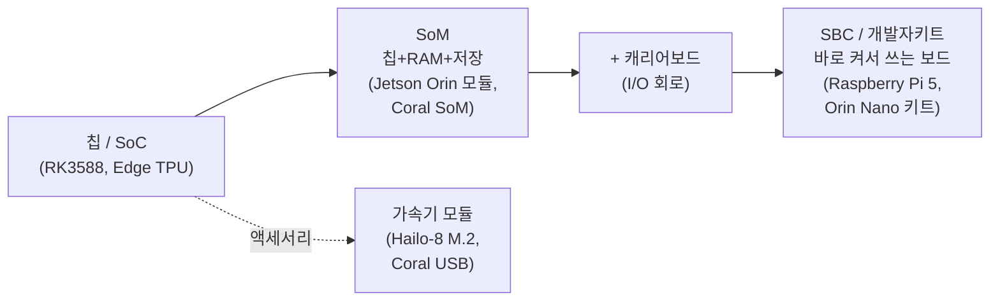

## 0. 데이터시트가 읽히지 않는 지점

온디바이스 AI를 검토하다 보면 제품 페이지에서 막힌다. "RK3588 SoC", "Jetson Orin Nano 모듈", "Coral SoM + 베이스보드", "Hailo-8 M.2", "67 TOPS(sparse) / 33 TOPS(dense) INT8". 이 단어들이 같은 층위처럼 나열돼 있지만 실제로는 칩 한 조각부터 바로 켜서 쓰는 컴퓨터까지 크기와 완성도가 다 다른 물건들이다. 폼팩터를 구분하지 못하면 "이걸 사면 바로 돌아가는가, 아니면 보드를 따로 설계해야 하는가"를 판단할 수 없다. 스펙 용어를 못 읽으면 "이 칩이 내 모델을 받는가"를 판단할 수 없다.

이 글은 둘을 정리한다. 앞부분은 폼팩터를 실제 제품으로 다섯 단계로 나누고, 뒷부분은 데이터시트에 나오는 숫자(TOPS·정밀도·전력·메모리 대역폭·공정·인터페이스)를 실제 수치 예시와 함께 푼다. 마지막에 같은 칩들을 한 표로 나란히 비교한다.

> **폼팩터는 "내가 무엇을 직접 만들어야 하는가"를 정하고, 스펙은 "이 칩이 내 모델을 받는가"를 정한다. 둘 다 사기 전에 결정된다.**

## 1. 칩에서 컴퓨터까지 — 폼팩터 다섯 단계

같은 연산 코어라도 어디까지 붙여 파느냐에 따라 부르는 이름이 다르다. 작은 것부터 큰 것 순으로 다섯 단계가 있다.

*그림. 칩 → SoM → (캐리어보드와 결합) → SBC로 갈수록 완성도가 올라간다. 가속기 모듈은 이 계층에 끼어 기존 보드에 NPU만 더한다.*

**칩 / SoC.** 가장 안쪽의 실리콘 한 조각이다. SoC(System-on-Chip)는 CPU·GPU·NPU·메모리 컨트롤러·I/O를 한 다이에 통합한 칩으로, Rockchip RK3588이 대표적이다. 8nm 공정에 Cortex-A76 4개 + Cortex-A55 4개 + Mali GPU + 6 TOPS NPU를 한 칩에 넣었다. 칩 단품은 RAM·전원·커넥터가 없어 그 자체로는 동작하지 않는다. 보드를 설계해 납땜하는 제조사가 사는 단위다.

**SoM(System-on-Module).** 칩에 RAM·저장장치·전원관리를 얹어 한 모듈로 만든 것이다. I/O 커넥터(USB·이더넷·카메라 포트)는 일부러 뺀다. NVIDIA Jetson Orin Nano 모듈이 이 형태다. 8GB LPDDR5와 Ampere GPU를 모듈에 담았지만, 그 모듈만으로는 화면도 못 꽂는다. Google Coral Dev Board도 NXP i.MX 8M + Edge TPU + 4GB LPDDR4 + eMMC를 SoM에 담고 베이스보드와 분리해 판다. SoM을 쓰는 이유는 양산이다. 제품을 만들 때 SoM은 그대로 두고 그 아래 I/O 보드만 자기 제품에 맞게 설계하면 된다. 차세대 칩이 나오면 모듈만 갈아 끼운다.

**캐리어보드(carrier board) / 베이스보드.** SoM이 빠뜨린 I/O를 채우는 바닥판이다. SoM을 꽂을 커넥터, USB·이더넷·HDMI·전원 단자, 카메라용 MIPI CSI 핀을 여기에 깐다. SoM + 캐리어보드 = 완성된 컴퓨터다. Coral Dev Board의 "베이스보드"가 정확히 이 역할이다.

**SBC(Single Board Computer).** 칩·RAM·저장·전원·I/O를 한 장에 다 박아 바로 켜서 쓰는 보드다. Raspberry Pi 5가 대표다. 캐리어보드를 따로 설계할 필요가 없다는 게 SoM과의 차이다. 시제품·교육·소량 운영에는 SBC가 빠르고, 수만 대 양산에는 SoM이 유리하다. NVIDIA Jetson Orin Nano Super 개발자키트는 Orin Nano 모듈을 레퍼런스 캐리어보드에 얹어 SBC처럼 바로 쓰게 만든 물건이다(키트 249달러). 즉 "모듈"과 "개발자키트"는 같은 칩의 다른 폼팩터다.

**가속기 모듈.** 위 계층과 직교한다. CPU 보드는 그대로 두고 NPU 연산만 더하는 부품이다. Hailo-8 M.2 모듈(M.2 슬롯에 꽂는 26 TOPS NPU)이나 Google Coral USB Accelerator(USB-C로 꽂는 4 TOPS)가 그 예다. Raspberry Pi 5에 NPU가 없으니 Hailo-8 M.2를 꽂아 비전 추론을 붙이는 조합이 흔하다.

## 2. 스펙 용어 사전 — 숫자를 읽는 법

데이터시트의 숫자는 크게 연산 성능, 정밀도, 전력, 메모리, 공정, 인터페이스로 나뉜다. 하나씩, 실제 수치와 함께 본다.

**TOPS vs TFLOPS.** TOPS(Tera Operations Per Second)는 초당 1조 번의 정수 연산을 뜻한다. TFLOPS는 초당 1조 번의 부동소수(floating point) 연산이다. 둘은 척도가 다르다. TFLOPS는 학습·과학 계산처럼 정밀한 실수 연산에 쓰는 지표고, TOPS는 양자화된 모델을 돌리는 엣지 추론에 쓰는 지표다. 같은 칩이라도 FP16 250 TFLOPS, INT8 1,000 TOPS처럼 정밀도를 낮추면 숫자가 커진다. 작은 숫자 형식일수록 한 사이클에 더 많이 처리하기 때문이다. 그래서 "몇 TOPS"는 반드시 "어떤 정밀도에서"와 묶어 읽어야 한다.

**INT8 / INT4 / FP16 — 정밀도.** 모델 가중치를 몇 비트로 표현하느냐다. FP16은 16비트 부동소수, INT8은 8비트 정수, INT4는 4비트 정수다. 비트를 줄이면 연산기가 작아져 같은 면적에 더 많이 깔 수 있고 전력이 줄지만, 정밀도 손실이 생긴다. 칩마다 받는 정밀도가 다르다. Coral Edge TPU는 INT8 전용이고, RK3588은 INT4/INT8/INT16/FP16을 혼합 지원한다. 이 차이가 모델 양자화 방식을 직접 규정한다.

**sparse / dense.** Jetson Orin Nano Super가 "67 TOPS sparse / 33 TOPS dense"로 표기되는 이유다. dense는 가중치를 다 채워 계산한 값이고, sparse는 0인 가중치를 건너뛰는 구조적 희소성(structured sparsity)을 적용했을 때의 이론 최대치다. 실제 모델이 그 희소 패턴을 만족해야만 sparse 수치가 나온다. 보수적으로 보려면 dense 값을 본다.

**TDP — 전력.** TDP(Thermal Design Power)는 칩이 정상 동작에서 내는 열, 곧 설계가 감당해야 할 전력 상한이다. Coral USB는 약 2W, Hailo-8 M.2는 typical 2.5W에 TDP 8.65W, DeepX DX-M1은 2~5W, Jetson Orin Nano Super는 7~25W 모드를 고를 수 있다. 배터리 장비라면 TDP가 폼팩터·TOPS보다 먼저 걸리는 제약이다.

**메모리 종류·대역폭.** LPDDR(Low-Power DDR)은 모바일·임베디드용 저전력 D램이다. 세대가 올라갈수록 빠르다(LPDDR4X → LPDDR5). 중요한 건 용량(GB)이 아니라 대역폭(GB/s)이다. Raspberry Pi 5는 LPDDR4X-4267에 32비트 폭이라 약 17 GB/s다. 연산기가 아무리 빨라도 데이터가 이 대역폭으로만 들어오면 NPU가 놀게 된다. TOPS가 높은데 체감 속도가 안 나오면 대역폭을 의심한다.

**공정 노드(nm).** 트랜지스터 집적도의 척도다. RK3588은 8nm, Raspberry Pi 5의 BCM2712는 16nm다. 숫자가 작을수록 같은 면적에 더 많은 트랜지스터를 넣고 전력 효율이 좋아지는 경향이 있다(요즘은 마케팅 명칭과 실제 밀도가 어긋나기도 해 절대 비교 지표로 보긴 어렵다).

**PCIe lane / 인터페이스.** 가속기 모듈이 본체와 데이터를 주고받는 통로다. Hailo-8 M.2 Key M은 PCIe Gen3 x4, DX-M1도 PCIe Gen3 x4다. 카메라는 보통 MIPI CSI(전용 카메라 직결 인터페이스)로 붙고, 이더넷 카메라는 GigE, 범용 카메라는 USB3로 붙는다. "이 보드에 카메라 몇 대를 어떻게 붙일 수 있는가"가 이 인터페이스 표기에서 결정된다.

> **숫자 하나만 보면 속는다. TOPS는 정밀도와, 정밀도는 칩 지원 목록과, 성능은 메모리 대역폭과, 전력은 폼팩터와 묶여 있다.**

## 3. 실제 제품 비교 — 같은 줄에 세워 보기

온디바이스 비전에서 자주 마주치는 보드·모듈을 폼팩터별로 나란히 둔다. 수치는 각 제조사·유통사 사양값이다(출처는 말미).

| 제품 | 폼팩터 | NPU 성능 | 전력(TDP) | 메모리 | 인터페이스 | 가격대 | 전형적 용도 |
|---|---|---|---|---|---|---|---|
| Raspberry Pi 5 | SBC | NPU 없음(CPU만) | 약 12W 피크 | LPDDR4X, 약 17 GB/s | USB3·GbE·MIPI CSI·PCIe | 2GB 약 60달러 | 교육·시제품·범용, NPU는 별도 부착 |
| Orange Pi 5 / Rock 5B (RK3588) | SBC | 6 TOPS (INT4~FP16) | 수 W | LPDDR5 4~16GB | USB3·2.5GbE·MIPI·PCIe | 8GB 약 95~149달러 | 저가 고정형 비전, 산업 IPC |
| Jetson Orin Nano Super | 개발자키트(모듈+캐리어) | 33 TOPS dense / 67 sparse INT8 | 7~25W 모드 | LPDDR5 8GB | USB3·GbE·MIPI·M.2 | 키트 약 249달러 | 멀티카메라·로봇, PyTorch 거의 그대로 |
| Hailo-8 M.2 | 가속기 모듈 | 26 TOPS INT8 | typ 2.5W / TDP 8.65W | (호스트 메모리 사용) | PCIe Gen3 x4 (M.2) | 정확값 미확인 | Pi 5 등에 꽂는 상시 비전 가속 |
| Google Coral (USB / SoM) | 가속기 / SoM | 4 TOPS INT8 전용 | 약 2W | (USB) / SoM 4GB LPDDR4 | USB-C / SoM+베이스보드 | USB 약 75달러 | 배터리 카메라, 단순 분류 |
| DeepX DX-M1 (국산) | 가속기 모듈 | 25 TOPS INT8 | 2~5W | 4GB LPDDR5 | PCIe Gen3 x4 (M.2 2280) | 정확값 미확인 | 엣지 비전·로봇·SLAM |

표에서 폼팩터가 성격을 가른다. Raspberry Pi 5는 바로 켜지지만 NPU가 없어 추론은 CPU로 느리거나 가속기를 따로 꽂아야 한다. RK3588 보드는 NPU를 내장해 한 장으로 끝난다. Jetson Orin Nano Super는 모듈 형태라 양산 설계로 이어가기 쉽고 TOPS도 가장 높지만 전력·단가가 크다. Hailo-8·Coral·DX-M1은 그 자체로 컴퓨터가 아니라 기존 보드에 NPU만 더하는 부품이다.

국산으로는 DeepX DX-M1이 25 TOPS를 2~5W에 내는 M.2 가속기로 Hailo-8과 같은 자리(가속기 모듈)를 겨눈다. Raspberry Pi 5·x86 보드에 꽂는 조합을 공식 지원하고, DXNN SDK로 PyTorch·ONNX·TensorFlow 모델을 변환한다. Mobilint는 ARIES 계열에서 80 TOPS급 MLA100 모듈(25W TDP, PCIe Gen4 x8)로 한 단계 위, AI PC·고성능 임베디드를 노린다. "국산 NPU"라도 겨누는 폼팩터와 전력대가 이렇게 갈린다.

## 4. 폼팩터·스펙이 함께 정하는 선택

폼팩터와 스펙은 따로 고르는 게 아니라 한 번에 묶여 결정된다. 용도에서 거꾸로 내려오면 이렇게 정리된다.

- **교육·시제품, 빨리 켜보고 싶다**: SBC. Raspberry Pi 5로 시작하되 추론이 무거우면 Hailo-8 M.2나 Coral USB를 더한다.
- **저가 고정형 비전, 한 장으로 끝내기**: RK3588급 SBC. 6 TOPS NPU 내장에 정밀도 선택지가 넓다.
- **고성능 멀티카메라·로봇, 나중에 양산까지**: Jetson Orin 모듈/키트. 키트로 개발하고 모듈로 양산한다. 전력·단가를 감수한다.
- **기존 보드에 NPU만 더하기**: Hailo-8·Coral·DX-M1 같은 M.2/USB 가속기. 호스트 보드의 PCIe·USB 규격을 먼저 확인한다.
- **수만 대 양산이 목표**: SoM + 자체 캐리어보드. 모듈은 그대로 두고 I/O 보드만 제품에 맞춰 설계한다.

이 선택이 한꺼번에 정하는 것: 캐리어보드를 직접 설계할지, 어떤 정밀도까지 양자화할지, 카메라를 몇 대 어떤 인터페이스로 붙일지, 전력 예산 안에 들어오는지.

## 5. 사람에게 남는 일

칩에 모델을 올리는 절차는 도구가 한다. 코딩 에이전트에게 "이 YOLO 모델을 DX-M1용으로 INT8 양자화하고 DXNN으로 컴파일하라"고 지시하면 변환·컴파일은 Claude Code가 처리한다. 보드 부팅 스크립트, 카메라 캡처 파이프라인, 추론 루프 코드도 자동으로 짜 준다.

그럴수록 사람의 일은 데이터시트를 읽고 결정하는 쪽으로 옮겨간다. 이 제품이 SBC인가 SoM인가(캐리어보드를 내가 만들어야 하나), NPU가 INT8 전용인가 혼합 지원인가(내 모델을 양자화로 받을 수 있나), TDP가 전력 예산 안인가, 메모리 대역폭이 TOPS를 따라오나, PCIe·MIPI 슬롯이 내 카메라 수를 받나. 이 질문들의 답이 Raspberry Pi 5와 Jetson 사이 어디에 설지를 정한다.

도구는 주어진 보드에 맞춰 코드를 짜 주지만, 어느 보드를 살지는 묻지 않으면 정해 주지 않는다. 도구가 칩에 코드를 맞춰 주는 시대에 사람에게 남는 일은, 폼팩터와 스펙 표를 읽어 목표 하드웨어를 고르는 능력과 그 보드에서 모델이 실제로 전력 예산 안에서 돌아가는지 현장에서 검증하는 능력이다.

---

## 출처

- Raspberry Pi Documentation, "Processors" (BCM2712, 16nm, LPDDR4X-4267, 17 GB/s), https://www.raspberrypi.com/documentation/computers/processors.html
- Micro Center, "Raspberry Pi 5; BCM2712 Quad-Core Cortex-A76; LPDDR4X" (가격대), https://www.microcenter.com/product/683269/raspberry-pi-5
- NVIDIA, "Jetson Orin Nano Super Developer Kit" (33/67 TOPS, 7~25W, 8GB LPDDR5, 249달러), https://www.nvidia.com/en-us/autonomous-machines/embedded-systems/jetson-orin/nano-super-developer-kit/
- NVIDIA Developer Blog, "Jetson Orin Nano Developer Kit Gets a Super Boost", https://developer.nvidia.com/blog/nvidia-jetson-orin-nano-developer-kit-gets-a-super-boost/
- CNX Software, "Rockchip RK3588 specifications revealed — 8K, 6 TOPS NPU, 8nm", https://www.cnx-software.com/2020/11/26/rockchip-rk3588-specifications-revealed-8k-video-6-tops-npu-pcie-3-0-up-to-32gb-ram/
- CNX Software, "Orange Pi 5 Max SBC features up to 16GB LPDDR5" (가격대), https://www.cnx-software.com/2024/08/01/rockchip-rk3588-powered-orange-pi-5-max-sbc-features-up-to-16gb-lpddr5-2-5gbe-onboard-wifi-6e-and-bluetooth-5-3/
- Hailo, "Hailo-8 M.2 AI Acceleration Module" (26 TOPS, TDP 8.65W, PCIe Gen3 x4), https://hailo.ai/products/ai-accelerators/hailo-8-m2-ai-acceleration-module/
- Coral, "Dev Board datasheet" (i.MX 8M + Edge TPU SoM + baseboard, 4 TOPS, 4GB LPDDR4), https://gweb-coral-full.uc.r.appspot.com/docs/dev-board/datasheet/
- Coral / Amazon, "USB Accelerator" (4 TOPS INT8, 2W, 약 75달러), https://www.amazon.com/Google-Coral-Accelerator-coprocessor-Raspberry/dp/B07R53D12W
- DeepX, "DX-M1 M.2 LPDDR5 AI Accelerator E-Brochure" (25 TOPS INT8, 2~5W, 4GB LPDDR5, PCIe Gen3 x4, M.2 2280), https://deepx.ai/products/dx-m1m/
- CNX Software, "Radxa AICore DX-M1M M.2 2242 delivers 25 TOPS for 3W", https://www.cnx-software.com/2026/03/21/radxa-aicore-dx-m1m-m-2-2242-low-power-ai-module-delivers-25-tops-of-edge-ai-performance-for-just-3w-of-power/
- Mobilint, "MLA100 / ARIES" (80 TOPS, 25W TDP, PCIe Gen4 x8), https://www.mobilint.com/aries
- Lenovo Glossary, "What is TOPS in computing", https://www.lenovo.com/us/en/glossary/tops-in-computing/
- Gateworks, "SOM vs SBC in embedded computing" (SoM·SBC·carrier board 정의), https://www.gateworks.com/som-vs-sbc-in-embedded-computing/

*※ 수치는 위 출처가 제시한 제품 사양값이며, 모듈·전력 모드·메모리 구성에 따라 달라진다. 가격대는 유통사·시점에 따라 변동이 크고, Hailo-8 M.2와 DX-M1의 정가는 유통 채널마다 달라 "정확값 미확인"으로 두었다. TOPS는 표기 정밀도(주로 INT8) 기준이며 sparse/dense 구분에 유의한다.*
