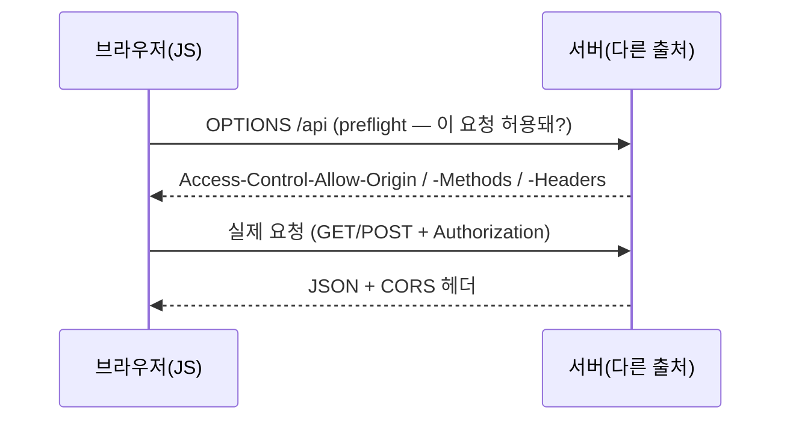

## 0. 한 줄 정의

**AJAX(Asynchronous JavaScript And XML)** — 웹페이지가 통째로 새로고침되지 않은 채로, 자바스크립트가 백그라운드에서 서버에 요청을 보내고 응답을 받아 화면 일부만 갱신하는 방식.

이름은 옛날부터 굳어진 거고, 지금은 XML보다 JSON을 더 많이 쓴다. 그래도 AJAX라고 부른다. 여기까지가 쉬운 정의다. 이 글은 거기서 멈추지 않고, 실제로 AJAX를 쓸 때 누구나 부딪히는 복잡함(CORS·에러 처리·경쟁 상태)까지 내려간다.

## 1. AJAX 이전과 이후

**이전**의 웹은 단순했다. 버튼을 누르면 브라우저가 서버에 요청을 보내고, 서버가 새 HTML을 통째로 돌려준다. 화면이 깜빡이며 다시 그려진다.

**이후**에는 자바스크립트가 페이지를 새로 받지 않고 서버와 대화한다. 필요한 데이터만 받아 화면 일부만 바꾼다.

```
이전: [클릭] → [페이지 전체 요청] → [페이지 전체 응답] → [화면 깜빡]
이후: [클릭] → [JS 백그라운드 요청] → [JSON 응답] → [화면 일부만 갱신]
```

검색창 자동완성, 무한 스크롤, "더보기" 버튼 — 모두 AJAX 패턴이다.

## 2. 기본 코드 — fetch

브라우저 안의 자바스크립트가 사용자 눈에 안 보이는 HTTP 요청을 만든다. 옛날엔 `XMLHttpRequest`를, 요즘은 `fetch()`를 쓴다. 요즘 코드는 `async/await`로 더 읽기 쉽게 쓴다.

```javascript
async function loadPage() {
  const res = await fetch('/api/announcements?page=1');
  const data = await res.json();   // 응답 본문(JSON)을 객체로
  render(data.items);              // 화면 일부만 다시 그림
}
```

서버는 HTML이 아니라 보통 JSON을 돌려준다. 여기까지는 교과서다. 문제는 이 다섯 줄이 실제 사이트에선 그대로 안 돈다는 것이다.

## 3. "비동기"가 진짜 뜻하는 것

AJAX의 A는 Asynchronous(비동기)다. 자바스크립트는 한 줄씩 순서대로 실행되는데, `fetch`는 네트워크 응답을 **기다리지 않고** 다음 줄로 넘어간다. 응답이 도착하면 그때 콜백(또는 `await` 뒤 코드)이 실행된다. 이 동작을 이벤트 루프(event loop)가 관리한다.

그래서 이런 코드는 틀린다.

```javascript
let data;
fetch('/api/x').then(r => r.json()).then(d => { data = d; });
console.log(data);   // undefined — 응답이 아직 안 왔는데 먼저 실행됨
```

`console.log`가 응답보다 먼저 돈다. 비동기를 이해 못 하면 "값이 분명 들어왔는데 왜 비었지?"에서 막힌다. `await`는 이 순서 문제를 풀어 준다 — 응답이 올 때까지 그 줄에서 기다린다.

## 4. 실제로 부딪히는 복잡함

### 4-1. fetch는 404·500에 실패하지 않는다

가장 많이 당하는 함정이다. `fetch`는 서버가 404나 500을 줘도 **정상으로 간주**한다. 네트워크 자체가 끊겼을 때만 reject된다. 그래서 상태 코드를 직접 확인해야 한다.

```javascript
const res = await fetch('/api/x');
if (!res.ok) {                     // res.ok는 상태코드 200~299일 때만 true
  throw new Error(`서버 오류: ${res.status}`);
}
const data = await res.json();
```

`res.ok`를 빼먹으면, 서버가 에러 페이지(HTML)를 줬는데 그걸 JSON으로 파싱하려다 엉뚱한 곳에서 터진다.

### 4-2. CORS — 다른 출처에는 그냥 못 보낸다

브라우저에는 동일 출처 정책(same-origin policy)이 있다. `a.com`의 페이지가 `b.com`의 API를 호출하면, 브라우저가 기본적으로 막는다. 보안 장치다. 이걸 푸는 약속이 CORS(Cross-Origin Resource Sharing)다.

서버가 응답에 `Access-Control-Allow-Origin` 헤더로 "이 출처는 허용한다"고 명시해야 브라우저가 응답을 넘겨준다. 게다가 단순하지 않은 요청(예: `Authorization` 헤더가 붙거나 `Content-Type: application/json`인 POST)은, 실제 요청 전에 **예비 요청(preflight)** 으로 OPTIONS를 한 번 더 보낸다.



*그림. 다른 출처 요청은 본 요청 전에 OPTIONS 예비 요청이 한 번 더 오간다. "콘솔에 CORS 에러가 떴다"는 대개 서버가 이 헤더를 안 줬다는 뜻이다.*

"분명 Postman에선 되는데 브라우저에선 CORS 에러"가 바로 이것이다. Postman은 브라우저가 아니라 동일 출처 정책을 안 받는다.

### 4-3. 인증 — 쿠키는 자동으로 안 따라간다

로그인된 상태로 API를 호출하려면 인증 정보가 같이 가야 한다. 두 방식이 흔하다. 쿠키 기반이면 다른 출처 요청에 쿠키를 실으라고 `credentials: 'include'`를 줘야 한다(기본은 안 보냄). 토큰 기반이면 헤더에 직접 싣는다.

```javascript
await fetch('https://api.example.com/me', {
  credentials: 'include',                       // 쿠키 동봉(세션 인증)
  headers: { 'Authorization': 'Bearer ' + token }  // 또는 토큰 인증
});
```

서버 쪽 세션 쿠키(JSESSIONID 등)가 어떻게 처음 발급되는지는 이 블로그 시리즈 2편(`requests.Session`과 세션 쿠키)에서 파이썬 쪽 시점으로 다룬다. 브라우저든 코드든 "왜 빈 응답이 오지?"의 절반은 이 인증·쿠키 문제다.

### 4-4. 경쟁 상태 — 빠른 응답이 늦게 올 수 있다

자동완성을 생각해 보자. 사용자가 "ab"를 치면 요청 A, "abc"를 치면 요청 B가 나간다. 그런데 네트워크 사정으로 **A의 응답이 B보다 늦게** 도착할 수 있다. 그러면 최신 입력 "abc"의 결과가 화면에 떴다가, 뒤늦게 온 "ab"의 결과로 덮인다. 이게 경쟁 상태(race condition)다.

해법은 두 가지를 같이 쓴다. 입력이 멈출 때까지 잠깐 기다렸다 보내는 디바운스(debounce)로 요청 수 자체를 줄이고, 새 요청을 보낼 때 이전 요청을 `AbortController`로 취소한다.

```javascript
let controller;
function search(q) {
  controller?.abort();                 // 이전 요청 취소
  controller = new AbortController();
  fetch(`/api/search?q=${q}`, { signal: controller.signal });
}
```

## 5. 개발자 도구로 들여다보기

코딩이 본업이 아닌 사람에게 가장 쓸모 있는 부분이다. **브라우저는 모든 AJAX 호출을 기록한다.**

F12 → **Network** 탭 → **Fetch/XHR** 필터 → 페이지에서 버튼을 누르거나 스크롤하면, 그때 발생한 요청이 한 줄씩 쌓인다. 각 요청을 클릭하면 URL·메서드·요청 헤더·응답 본문이 다 보인다. 위에서 말한 preflight(OPTIONS)도 여기 그대로 찍힌다.

이걸로 사이트가 어떤 데이터를 어디서 받아오는지, 응답 JSON의 키가 어떻게 생겼는지, CORS·인증 헤더가 어떻게 오가는지 전부 읽을 수 있다. 이 블로그 시리즈 1편 "데이터 출처의 세 층위"의 가운데 층이 이 관찰에서 시작한다.

## 6. AJAX가 답이 아닐 때

- **검색 엔진에 보여야 할 콘텐츠** — AJAX로만 그리면 봇이 못 본다. 서버 사이드 렌더링이 필요하다.
- **첫 화면이 빨라야 할 때** — 빈 페이지 뜨고 JS가 데이터를 받아 그리면 사용자가 빈 화면을 잠시 본다.
- **데이터가 거의 안 변할 때** — 정적 HTML 한 장이면 될 걸 매번 받아오는 건 낭비.

## 7. 한 줄 마무리

> **AJAX = 화면 새로고침 없이 서버와 대화하는 방식.** 쉬운 정의는 한 줄이지만, 실제로는 비동기 순서·fetch의 에러 처리·CORS 예비 요청·인증 쿠키·경쟁 상태가 줄줄이 따라온다.

쉬운 입구로 들어와 이 다섯 가지 실제 복잡함까지 알면, 웹페이지의 동작을 한 단계가 아니라 두세 단계 깊게 읽을 수 있다.
