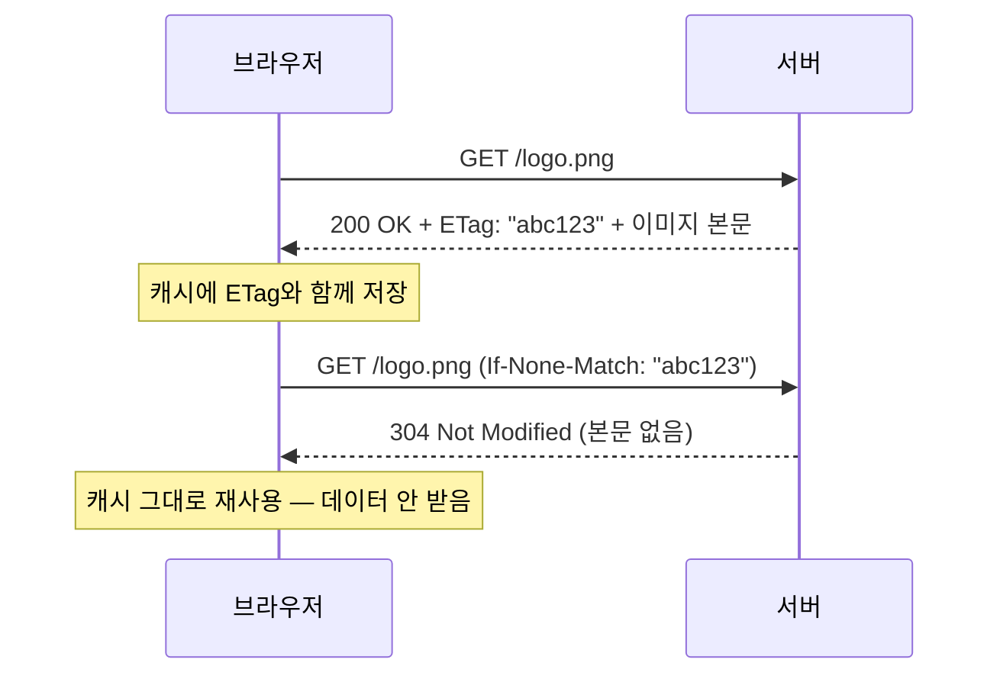
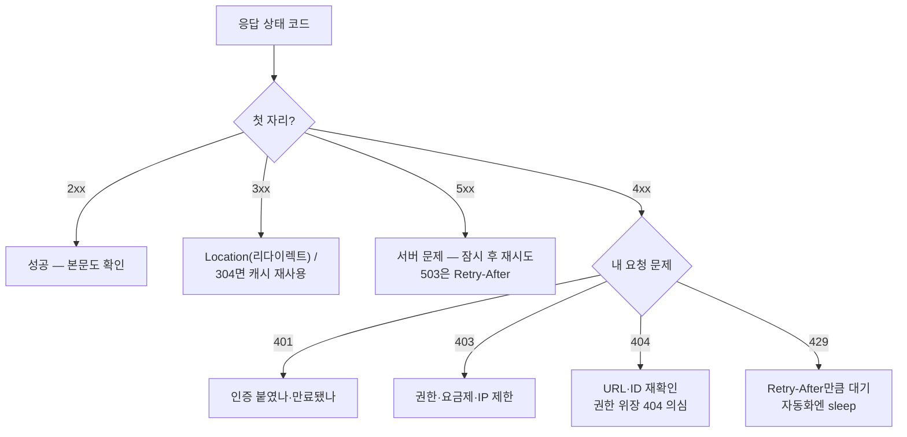

## 0. 숫자가 알려주는 일

서버에 요청했을 때 돌아오는 3자리 숫자. 이 숫자가 **누가 잘못했는지, 다음에 무엇을 해야 하는지**를 알려준다. 자주 만나는 7개로 시작해, 실제로 디버깅·성능에서 중요해지는 캐싱 코드(304)와 조건부 요청까지 내려간다.

## 1. 첫 자리로 종류를 가른다

| 첫 자리 | 의미 | 한 줄 |
|---|---|---|
| 1xx | 정보 | 자주 안 본다 |
| 2xx | **성공** | 잘 됐다 |
| 3xx | **리다이렉트/캐시** | 다른 데로 가라 / 안 바뀌었다 |
| 4xx | **클라이언트(나) 잘못** | 내 요청에 문제 |
| 5xx | **서버 잘못** | 서버가 죽었거나 버그 |

첫 자리만 봐도 "내가 고칠 일이냐 서버가 고칠 일이냐"가 갈린다.

## 2. 자주 만나는 7개

**200 OK** — 성공. 본문이 같이 온다. 단, 본문이 비었는데 200이 오기도 하니 한 번씩 본문을 확인한다.

**301 / 302** — 리다이렉트. 301은 영구, 302는 일시. `Location:` 헤더에 새 URL. `requests`는 기본 자동 추적이며 `allow_redirects=False`로 끈다.

**401 Unauthorized** — 인증이 안 됐거나 잘못됐다. 토큰·키·세션 쿠키가 빠졌거나 만료. 헤더가 실제로 붙었는지, 토큰이 안 죽었는지, 키 오타가 없는지 순서로 본다.

**403 Forbidden** — 누군지는 알겠는데 권한이 없다. 권한 정책·요금제·IP/국가 제한. 401이 "다시 로그인", 403은 "너에겐 안 열림".

**404 Not Found** — 자원이 없다. URL이 틀렸거나 삭제됐거나. **"진짜 없음"과 "권한 없어 없는 척"이 같은 404일 수 있다** — 일부 서비스는 보안상 403 대신 404를 준다.

**429 Too Many Requests** — rate limit. 응답에 `Retry-After`(N초 또는 시각)가 온다. 자동화라면 요청 간 sleep과 "429 만나면 Retry-After만큼 대기 후 재시도"를 같이 설계한다.

**500 Internal Server Error** — 서버가 예외를 던졌다. 내 잘못이 아닐 때가 많지만 비정상 요청이 원인일 수도. 잠시 후 재시도해 같은 500이면 서버 문제, 다른 응답이면 일시 장애였던 것.

## 3. 7개 다음으로 자주 보는 코드

- **201 Created** — POST로 새 자원이 만들어졌다. 보통 `Location`에 새 자원 URL이 온다.
- **202 Accepted** — 요청은 받았지만 처리는 아직(비동기 작업). "큐에 넣었다"는 뜻.
- **204 No Content** — 성공인데 돌려줄 본문이 없다. DELETE·PUT 응답에 흔하다.
- **409 Conflict** — 상태 모순. 중복 생성, 이미 점유된 리소스, 버전 충돌 등.
- **422 Unprocessable Entity** — 형식은 맞는데 값이 검증에 걸렸다(예: 이메일 형식 오류). 400보다 구체적인 "검증 실패".
- **503 Service Unavailable** — 서버가 일시적으로 못 받는다(과부하·점검). 500과 달리 "지금은 안 되니 이따 와라". `Retry-After`가 붙기도.

## 4. 304와 캐싱 — "안 바뀌었으니 그대로 써"

성능에서 가장 중요한 3xx는 리다이렉트가 아니라 **304 Not Modified**다. 같은 자원을 또 받을 때, 안 바뀌었으면 본문을 다시 안 받고 304만 받아 캐시를 재사용한다. 이걸 조건부 요청(conditional request)이라 한다.

작동 방식은 이렇다. 처음 응답에 서버가 자원의 "지문"을 붙여 준다. `ETag`(내용 해시)나 `Last-Modified`(수정 시각)다. 다음 요청에서 브라우저가 그 지문을 되돌려 보낸다.

*그림. 두 번째 요청은 `If-None-Match`로 지문을 보내고, 안 바뀌었으면 서버가 304만 준다. 본문 전송이 없어 빠르고 트래픽도 적다. 큰 이미지·API 응답에서 이 차이가 크다.*

`Last-Modified`/`If-Modified-Since` 짝도 같은 원리다. 개발자 도구 Network 탭에서 같은 자원을 두 번 부르면, 두 번째가 304로 뜨고 크기가 작은 걸 직접 볼 수 있다.

## 5. 만났을 때 무엇을 할지 — 흐름

*그림. 첫 자리로 큰 갈래를 가르고, 4xx만 세부 분기. 본문을 길게 읽기 전에 이 흐름으로 다음 행동의 절반이 정해진다.*

## 6. 한 줄 마무리

> 상태 코드는 서버가 보내는 **짧은 안내문**이다. 첫 자리로 책임 소재를 가르고, 7개 핵심으로 일상의 90%를 읽고, 304·조건부 요청까지 알면 성능 문제도 읽힌다.

쉬운 입구는 "200은 성공, 404는 없음"이지만, 실제로는 401/403의 차이, 404의 권한 위장, 429의 Retry-After, 304의 캐싱까지가 진짜 알아야 할 폭이다.
