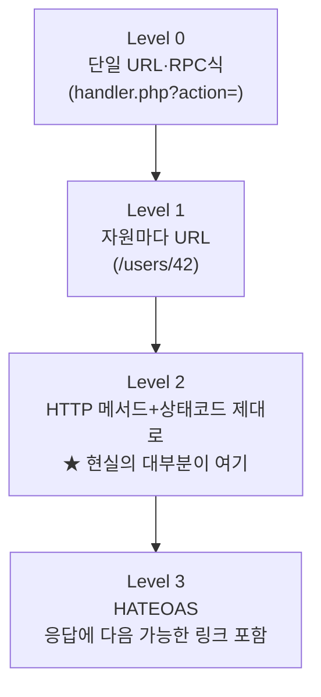

## 0. 한 줄 정의

**REST API(REpresentational State Transfer API)** — 서버에 있는 자원을 URL로 가리키고, HTTP 메서드(GET·POST·PUT·DELETE 등)로 그 자원을 어떻게 다룰지 약속한 인터페이스.

이름이 거창하지만 입구는 단순하다. **자원에 주소를 붙이고, 그 주소에 메서드를 보내서 일을 시킨다.** 이 글은 그 쉬운 입구에서 시작해, 실제로 REST를 "제대로" 쓰는 데 따라오는 제약(무상태·멱등성·성숙도)과 실무 설계의 복잡함까지 내려간다.

## 1. REST 이전을 잠깐 본다

REST 이전에는 하나의 URL이 여러 동작을 다 받았다. `?action=create`, `?action=update` 같은 파라미터로 동작을 구분했다.

```
POST /api/handler.php?action=update&id=42
```

같은 URL이 무엇을 하는지 본문을 까봐야 알았다. REST는 이걸 뒤집었다. **자원이 먼저, 동작은 메서드로.**

```
PUT /api/users/42
```

URL을 보면 자원이, 메서드를 보면 동작이 드러난다.

## 2. 자원·URL·메서드의 짝

URL은 자원의 주소다. 보통 복수형 명사로 컬렉션을, 그 뒤 식별자로 개별 자원을 가리킨다.

```
/users           ← 사용자 컬렉션
/users/42        ← 42번 사용자
/users/42/posts  ← 42번 사용자의 글 컬렉션
```

같은 URL에 어떤 메서드를 보내느냐로 동작이 결정된다.

| 메서드 | 컬렉션 (`/users`) | 개별 자원 (`/users/42`) |
|---|---|---|
| **GET** | 목록을 읽는다 | 정보를 읽는다 |
| **POST** | 새로 만든다 | (보통 안 씀) |
| **PUT** | (보통 안 씀) | 통째로 바꾼다 |
| **PATCH** | (보통 안 씀) | 일부만 바꾼다 |
| **DELETE** | (보통 안 씀) | 삭제한다 |

여기까지가 쉬운 그림이다. 이제 이 약속을 "제대로" 지킨다는 게 뭔지로 들어간다.

## 3. REST를 진짜 REST로 만드는 제약

REST는 단순한 URL 규칙이 아니라 몇 가지 제약을 갖춘 아키텍처 스타일이다. 실무에서 자주 어기는 두 가지가 핵심이다.

### 무상태(stateless)

각 요청은 그 자체로 완결돼야 한다. 서버가 "직전에 이 사용자가 뭘 했는지"를 기억하고 그에 기대면 안 된다. 인증 토큰처럼 필요한 정보는 매 요청에 같이 실어 보낸다. 무상태라서 서버를 여러 대로 늘려도 아무 서버나 그 요청을 처리할 수 있다(확장성). "로그인 단계의 상태를 서버 세션에 담아두고 다음 요청이 그걸 가정"하면 무상태가 깨진다.

### 멱등성(idempotency)

같은 요청을 여러 번 보내도 결과가 같은 성질이다. 네트워크가 끊겨 재시도할 때 안전한지가 여기서 갈린다.

| 메서드 | 멱등? | 안전(safe, 자원 안 바꿈)? |
|---|---|---|
| GET | O | O |
| PUT | O | X |
| DELETE | O | X |
| POST | **X** | X |
| PATCH | 보통 X | X |

`DELETE /users/42`를 두 번 보내도 결과는 "42번 없음"으로 같다(멱등). 하지만 `POST /users`를 두 번 보내면 사용자가 둘 생긴다(멱등 아님). 그래서 결제처럼 중복이 치명적인 POST에는 멱등성 키(Idempotency-Key 헤더)를 따로 붙여 중복 실행을 막는다.

### 성숙도 — 대부분의 "REST API"는 사실 절반만 REST다

Leonard Richardson은 REST 적용 수준을 네 단계로 나눴다.



*그림. Richardson 성숙도 모델. 세상의 "REST API" 대부분은 Level 2(메서드·상태코드를 제대로 쓰는 수준)에 머문다. 응답이 다음에 할 수 있는 동작의 링크까지 담는 Level 3(HATEOAS)은 드물다.*

그래서 "이거 진짜 RESTful이야?"라는 논쟁은 보통 Level 2냐 3이냐의 문제다. 실무에선 Level 2면 충분히 잘 쓴 것이다.

## 4. 실무 설계의 복잡함

자원·메서드만으로는 안 끝난다. 실제 API는 다음을 추가로 정한다.

- **버전**: API가 바뀌면 기존 클라이언트가 깨진다. `/v1/users`처럼 URL에 버전을 박거나 헤더로 협상한다.
- **페이지네이션**: 목록이 수만 건이면 한 번에 못 준다. `?page=2&size=20`(오프셋) 방식은 쉽지만 데이터가 중간에 바뀌면 항목이 밀린다. 큰 데이터엔 마지막 본 위치를 넘기는 커서(cursor) 방식이 안정적이다.
- **필터·정렬·부분 응답**: `?status=open&sort=-deadline&fields=id,title`처럼 쿼리 파라미터로 좁힌다.

이 블로그가 다룬 공공기관 공고 수집에서, `?pageIndex=&recordCountPerPage=` 같은 파라미터가 정확히 이 페이지네이션 약속이다.

## 5. 상태 코드로 결과를 알린다

서버는 본문과 함께 HTTP 상태 코드로 결과를 분류해 알린다(자세한 건 상태 코드 편 참고).

- `200 OK` 읽기 성공 · `201 Created` 생성됨(POST) · `204 No Content` 성공인데 본문 없음(DELETE)
- `400` 요청 오류 · `401` 인증 안 됨 · `403` 권한 없음 · `404` 자원 없음 · `409` 충돌

응답이 이상하면 본문보다 먼저 상태 코드를 본다.

## 6. 개발자 도구에서 REST 호출 읽기

`basics-ajax` 편의 Network 탭 관찰법이 그대로 적용된다. REST 관점에선 세 칸을 본다: **메서드**(GET/POST/...), **URL의 자원 부분**(`/api/users/42`), **상태 코드**. 이 셋만 봐도 그 API가 자원을 명사로 두는지, 메서드 의미가 맞는지, 상태 코드가 적절한지 — 즉 Level 2를 지키는지 보인다.

## 7. REST가 답이 아닐 때

- **한 화면에 여러 자원이 필요할 때** — REST는 자원 단위라 호출이 여러 번이 된다. GraphQL이 한 호출로 묶는다.
- **실시간 양방향** — 채팅·알림은 WebSocket이나 SSE.
- **명사로 안 떨어지는 동작** — "환불한다", "메일 보낸다"는 RPC 스타일(gRPC 등)이 자연스럽다.

## 8. 한 줄 마무리

> **REST API = 자원에 URL을 붙이고 HTTP 메서드로 동작을 시키는 약속.** 제대로 하려면 무상태·멱등성을 지키고, 결과는 상태 코드로 알린다.

쉬운 입구는 "자원+메서드" 한 줄이지만, 그 뒤엔 멱등성·무상태·버전·페이지네이션이 줄줄이 붙는다. 남의 API 문서를 볼 때 메서드·자원·상태 코드부터 짚고, "이건 Level 2구나"까지 읽으면 구조가 거의 다 잡힌다.
