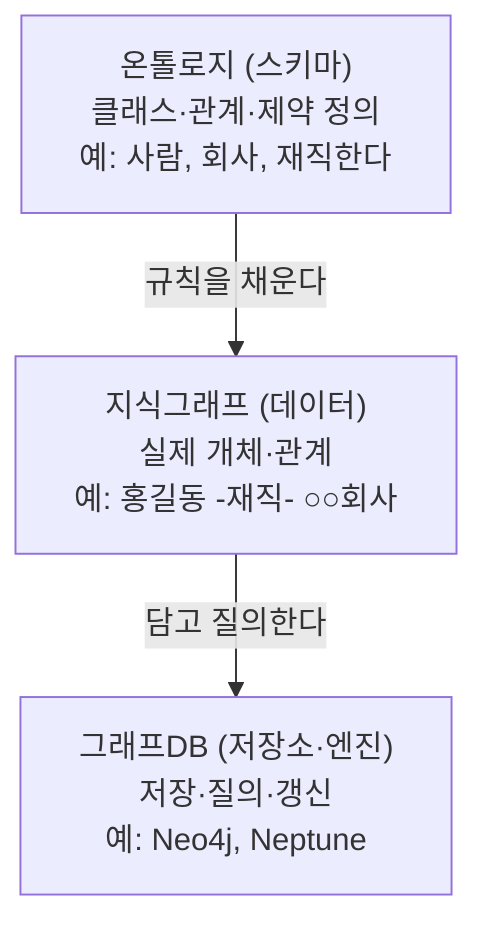

## 0. 세 단어가 자꾸 섞인다

지식그래프, 온톨로지, 그래프DB. 이 세 단어가 한 문장 안에 같이 등장하는데, 셋을 같은 것으로 뭉뚱그리는 글이 많다. 셋은 층이 다르다. 하나는 규칙(스키마), 하나는 그 규칙으로 채운 실제 데이터, 하나는 그 데이터를 담는 저장소다. 이 구분을 흐리면 "온톨로지를 만들었다"는 말과 "Neo4j를 깔았다"는 말이 같은 작업처럼 들리는데, 둘은 전혀 다른 일이다.

나는 어떤 업무에서 흩어진 자료를 연결해 질의하는 도구를 다룰 일이 있었고, 그때 이 세 층위를 분리해 이해하지 못하면 "데이터 모델링"이라는 작업이 통째로 안개에 싸인다는 걸 겪었다. 이 글은 그 세 층위를 분리하고, 두 표준 계열(RDF 계열과 속성 그래프 계열)을 실제 제품·수치로 비교한다.

> **온톨로지는 규칙, 지식그래프는 그 규칙으로 채운 데이터, 그래프DB는 그 데이터를 담아 질의하는 엔진이다. 세 층은 겹치지 않는다.**

## 1. 세 층위 — 스키마·데이터·저장소

먼저 한 문장씩 못 박는다.

- **온톨로지(ontology)**: 어떤 개념들이 있고 그것들이 어떤 관계를 맺을 수 있는지를 형식으로 정의한 스키마다. "사람은 회사에 '재직한다', 회사는 '위치한다' 도시에"처럼 개념(클래스)과 관계(속성)의 종류, 그리고 그 관계가 지켜야 하는 제약을 적는다. 개별 데이터는 들어 있지 않다. 데이터베이스로 치면 테이블 정의(DDL)에 가깝다.
- **지식그래프(knowledge graph)**: 그 스키마로 채운 실제 개체와 관계의 그래프다. "홍길동 — 재직한다 → ○○회사", "○○회사 — 위치한다 → 서울"처럼 구체적 노드와 엣지가 들어간다. 온톨로지가 '사람'이라는 클래스를 정의했다면, 지식그래프에는 '홍길동'이라는 실제 개체가 들어간다.
- **그래프DB(graph database)**: 그 지식그래프를 물리적으로 저장하고 질의·갱신하는 DB 엔진이다. Neo4j, Amazon Neptune 같은 제품이 여기 해당한다. 데이터를 노드·엣지 구조로 저장하고, 그래프 질의어로 탐색하는 데 최적화돼 있다.

이 셋의 관계는 위로 갈수록 추상, 아래로 갈수록 물리다.



*그림. 온톨로지(스키마) → 지식그래프(데이터) → 그래프DB(저장소)의 세 층위. 위는 규칙, 가운데는 그 규칙으로 채운 실제 데이터, 아래는 그 데이터를 담는 엔진이다.*

중요한 건 이 셋이 항상 한 세트가 아니라는 점이다. 온톨로지 없이 지식그래프를 만들 수 있고(스키마를 느슨하게 두는 경우), 지식그래프를 그래프DB가 아니라 관계형 DB나 파일에 담을 수도 있다. 셋은 자주 같이 가지만 묶여 있지는 않다.

## 2. 두 표준 계열 — RDF 트리플 vs 속성 그래프

지식을 그래프로 표현하는 방식에는 크게 두 계열이 있다. 데이터 모델이 다르고, 질의어가 다르고, 출신 진영이 다르다.

**RDF 계열(W3C 시맨틱 웹).** RDF(Resource Description Framework)는 모든 사실을 트리플(triple), 즉 `주어-술어-목적어(subject-predicate-object)` 세 토막으로 표현한다. "홍길동이 ○○회사에 재직한다"는 `<홍길동> <재직한다> <○○회사>` 하나의 트리플이다. 각 자원은 URI(전역 고유 식별자)로 가리켜 서로 다른 데이터셋끼리 같은 개체를 같은 URI로 합칠 수 있다. 스키마·제약은 OWL(Web Ontology Language)로 정의하고, 질의는 SPARQL로 한다. OWL은 기술 논리(description logic) 기반이라 "재직 관계가 있으면 그 사람은 직원이다" 같은 추론을 형식적으로 끌어낼 수 있다.

**속성 그래프 계열(Neo4j).** 속성 그래프(property graph, 정확히는 Labeled Property Graph)는 노드와 관계 둘 다에 키-값 속성을 붙일 수 있다. "홍길동" 노드에 `{name:'홍길동', age:40}`, "재직한다" 관계 자체에 `{since:2019}` 같은 속성을 직접 단다. RDF 표준 트리플은 엣지에 속성을 못 달아 별도 노드로 우회해야 하는데, 속성 그래프는 그게 자연스럽다. 질의어는 Cypher다. 이 계열은 형식 추론보다 "그래프가 곧 애플리케이션 동작을 끌고 가는" 운영 용도에 맞춰 설계됐다. 표준 측면에서는 2024년 ISO가 그래프 질의 표준 GQL을 제정해 Cypher 계열 질의의 이식성이 생기기 시작했다.

같은 사실을 두 방식으로 적으면 차이가 보인다. 목적은 같은 데이터가 모델에 따라 어떻게 달라지는지 한눈에 비교하는 것이다.

RDF/Turtle 표기(트리플):

```turtle
# 주어            술어         목적어
:홍길동  :재직한다   :회사_A .
:회사_A  :위치한다   :서울 .
:회사_A  rdf:type   :회사 .       # 회사_A 는 '회사' 클래스의 개체
```

Cypher 표기(속성 그래프):

```cypher
// 노드와 관계에 속성을 직접 부여
CREATE (p:사람 {name:'홍길동'})
CREATE (c:회사 {name:'회사_A', city:'서울'})
CREATE (p)-[:재직한다 {since:2019}]->(c)  // 관계 자체에 속성 since
```

RDF 쪽은 "회사_A의 위치"를 별도 트리플로 또 적는 반면, Cypher 쪽은 도시를 노드 속성으로 욱여넣었다. 둘 다 가능한 모델링이고, 어느 쪽이 맞다기보다 무엇을 독립 개체로 볼지의 결정이 다르다. 그 결정은 사람이 한다.

두 계열의 차이를 정리하면 이렇다.

| 구분 | RDF 계열 (W3C) | 속성 그래프 계열 |
|---|---|---|
| 데이터 단위 | 트리플 (주어-술어-목적어) | 노드 + 관계 (둘 다 속성 보유) |
| 식별자 | URI (전역 고유) | 내부 ID + 라벨 |
| 엣지에 속성 | 표준 트리플은 불가(우회 필요) | 가능(기본 기능) |
| 스키마/제약 | OWL, SHACL | 라벨·제약(엔진별), GQL |
| 질의어 | SPARQL | Cypher (ISO GQL 2024로 표준화 진행) |
| 추론 | OWL 기술 논리로 형식 추론 | 엔진 계약에 추론은 기본 미포함 |
| 강점 | 데이터셋 통합·표준·형식 추론 | 운영 질의·개발 편의 |

## 3. 실제 제품과 공개 지식그래프

이론은 위와 같고, 실제로 쓰는 제품과 공개 데이터셋은 다음과 같다. 비교 대상이 셋을 넘으니 표로 묶는다. 목적은 어느 제품이 어느 모델·질의어를 지원하는지 한눈에 보는 것이다.

| 제품/엔진 | 지원 모델 | 질의어 | 형태 | 비고 |
|---|---|---|---|---|
| Neo4j | 속성 그래프 | Cypher | 자체 호스팅/클라우드 | 가장 널리 쓰임, ACID, 시각화 도구 |
| Amazon Neptune | 속성 그래프 + RDF | Gremlin·openCypher·SPARQL | 완전관리형(AWS) | 두 계열을 한 엔진에서 지원, GraphRAG 연동 |
| ArangoDB | 그래프 + 문서 | AQL | 멀티모델 | 그래프와 문서 DB를 한곳에 |
| TigerGraph | 속성 그래프 | GSQL | 분산 병렬 | 다중 홉 질의에 대규모 병렬, 금융 사기 탐지 등 |

공개 지식그래프의 실제 규모도 짚을 만하다. 추상적으로 "방대한"이라 적지 않고 수치를 박는다.

- **Wikidata**: 위키미디어가 운영하는 공개 지식그래프로, RDF로도 내보내고 SPARQL 엔드포인트를 제공한다. 2026년 기준 항목(item) 수가 약 1억 2,200만 개(122,072,697)에 이른다.
- **DBpedia**: 위키백과에서 구조화 데이터를 추출한 지식그래프다. 영어판 기준 약 458만 개 개체를 다루고, 한 릴리스가 수십억 개의 RDF 트리플 규모다.
- **Google Knowledge Graph**: 검색 결과 옆 정보 패널을 떠받치는 비공개 지식그래프다. Google 발표로 2024년 5월 기준 약 540억 개 개체에 대해 1조 6,000억 개가 넘는 사실을 담고 있다. 2020년의 50억 개체·5,000억 사실에서 크게 늘었다.

규모 차이가 곧 용도 차이다. Wikidata·DBpedia는 누구나 SPARQL로 질의하는 공개 자산이고, Google의 것은 검색 제품 안에서만 동작하는 사내 자산이다.

> **공개 지식그래프 Wikidata는 2026년 기준 약 1억 2,200만 항목, Google Knowledge Graph는 2024년 기준 540억 개체에 1.6조 사실 규모다. "지식그래프"라는 한 단어가 가리키는 규모는 이만큼 벌어진다.**

## 4. 왜 지금 다시 중요해졌나 — LLM 환각과 지식그래프

지식그래프는 오래된 기술인데 2026년 다시 주목받는 이유는 LLM이다. LLM은 다음 토큰을 확률로 예측하는 구조라, 학습에 없던 사실이나 최신 사실을 그럴듯한 거짓으로 만들어내는 환각(hallucination)을 일으킨다. 여기에 검증된 사실 그래프를 붙여 답을 그 그래프에 묶는 방식이 GraphRAG다.

작동 원리는 이렇다. 사용자의 질문에 대해 지식그래프에서 관련 개체·관계를 먼저 끌어와(retrieval), 그 사실들을 프롬프트에 넣어 LLM이 "다음 토큰 예측"이 아니라 "주어진 검증된 사실"을 근거로 답하게 강제한다. 단순 벡터 검색 RAG와 달리 그래프는 개체 사이의 다중 홉 관계(A가 B를 거쳐 C와 연결)를 따라갈 수 있어, "이 두 사람의 공통 소속을 거쳐 연결된 사건"처럼 관계를 타고 들어가는 질문에 강하다. 한 조사에서는 그래프 기반 접근이 기준 LLM 대비 사실 오류를 30~40% 줄였다고 보고한다(연구·구현마다 편차가 크므로 절대 수치보다 방향으로 읽는 게 안전하다).

이 흐름 때문에 Amazon Neptune이 GraphRAG를 관리형으로 묶어 내놓고, 기업이 RAG 파이프라인을 더 똑똑하게 만들려고 Neo4j나 ArangoDB를 새로 세우는 사례가 늘었다. 그래프DB의 첫 대중적 비-사기탐지·비-추천 용도가 GraphRAG에서 나온 셈이다. GraphRAG 자체는 분량이 커서 다음 글에서 따로 다룬다.

## 5. 사람에게 남는 일

온톨로지를 OWL로 적는 것도, 트리플을 SPARQL로 질의하는 것도, Cypher를 짜는 것도 이제 코딩 에이전트에게 시킬 수 있다. "이 CSV를 사람-회사-도시 스키마의 속성 그래프로 적재하는 Cypher를 써라"라고 지시하면 Claude Code가 적재 스크립트를 자동 생성한다. 절차는 도구가 처리한다.

그럴수록 사람의 일은 절차에서 모델링 결정으로 옮겨간다. 무엇을 독립된 개체(노드)로 볼 것인가, 무엇을 그 개체의 속성으로 둘 것인가, 두 데이터셋에서 같은 이름의 '홍길동'을 같은 개체로 합칠 것인가 다른 사람으로 둘 것인가. 2절의 RDF 예시와 Cypher 예시가 같은 사실을 다르게 적었던 것도, 도시를 개체로 볼지 속성으로 볼지를 사람이 다르게 결정했기 때문이다. 이 결정이 곧 온톨로지이고, 온톨로지가 틀리면 그 위에 쌓은 지식그래프 전체가 틀린 사실을 정답으로 굳힌다.

GraphRAG가 환각을 줄이는 것도 결국 "그 그래프에 들어간 사실이 참"이라는 전제 위에서다. 무엇을 참으로 등록할지, 즉 진실의 기준을 정하는 일은 도구가 대신 해 주지 않는다. 도구는 내가 정한 스키마대로 데이터를 채우고 질의해 주지만, 어떤 개념을 어떻게 모델링하고 무엇을 진실의 기준으로 삼을지는 묻지 않으면 정해 주지 않는다. 지식을 데이터로 바꾸는 세 층위에서 도구가 아래 두 층(데이터 적재·저장)을 자동화할수록, 맨 위 층(개념과 진실의 정의)을 정하는 일이 사람에게 더 또렷이 남는다.

---

## 출처

- Wikidata:Statistics, https://www.wikidata.org/wiki/Wikidata:Statistics
- Amazon Neptune Features (AWS), https://aws.amazon.com/neptune/features/
- Neptune Graph Data Model (AWS Docs), https://docs.aws.amazon.com/neptune/latest/userguide/feature-overview-data-model.html
- Knowledge Graph (Google) — Wikipedia, https://en.wikipedia.org/wiki/Knowledge_Graph_(Google)
- About — DBpedia, https://www.dbpedia.org/about/
- Michael DeBellis, "Semantic Web vs. Property Graphs", https://www.michaeldebellis.com/post/owlvspropgraphs
- DZone, "SPARQL and Cypher Cheat Sheet", https://dzone.com/articles/sparql-and-cypher
- "Can Knowledge Graphs Reduce Hallucinations in LLMs?: A Survey" (arXiv 2311.07914), https://arxiv.org/abs/2311.07914
- RisingWave, "Graph Database Battle: Neo4j, TigerGraph, and ArangoDB Compared", https://risingwave.com/blog/graph-database-battle-neo4j-tigergraph-and-arangodb-compared/
- pdpspectra, "Graph Databases in 2026: Neo4j, ArangoDB, TigerGraph and the GraphRAG Moment", https://pdpspectra.com/blog/neo4j-vs-arangodb-2026/

*※ 수치는 위 출처 기준이다. Wikidata 항목 수는 실시간으로 증가하며 본문 값은 2026년 시점 통계 페이지 값이다. Google Knowledge Graph 수치는 Google 발표(2024년 5월) 기준이고, GraphRAG의 오류 감소 폭은 연구·구현마다 편차가 크다.*
