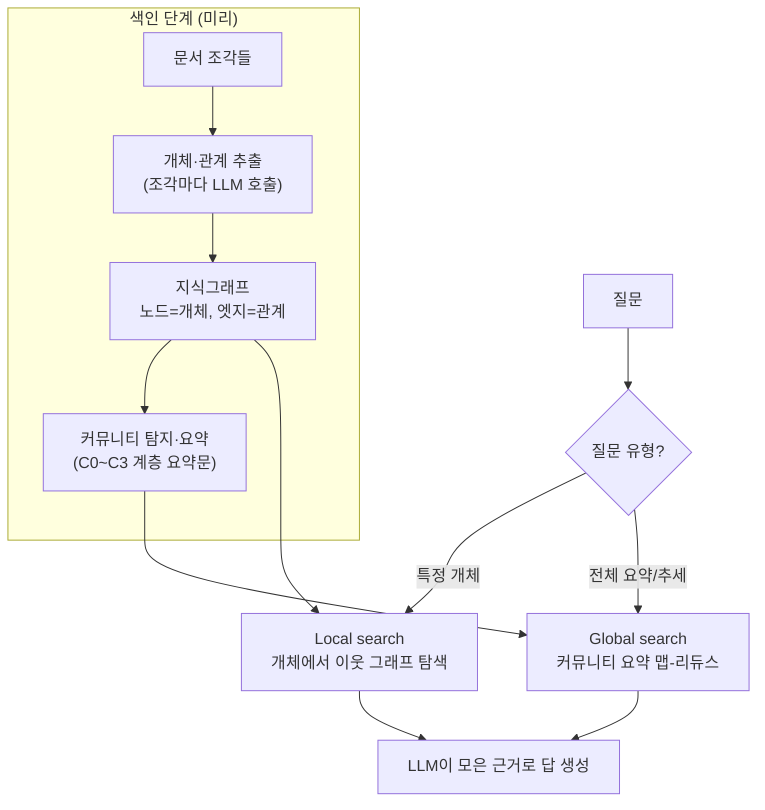

## 0. 벡터 RAG가 막히는 지점

[온톨로지·지식그래프 글](/ax/kr-01-ontology-knowledge-graph/)에서 "지식그래프를 LLM과 붙이는 GraphRAG는 다음 글에서"라고 미뤄 뒀다. 이 글이 그 다음 글이다.

먼저 일반 RAG(Retrieval-Augmented Generation, 검색으로 찾은 문서 조각을 LLM 프롬프트에 넣어 답하게 하는 방식)부터. 보통의 RAG는 이렇게 동작한다. 문서를 수백 토큰짜리 조각(chunk)으로 자르고, 각 조각을 임베딩(벡터)으로 바꿔 벡터DB에 넣는다. 질문이 오면 질문도 벡터로 바꿔 가장 가까운 조각 몇 개를 꺼내 프롬프트에 붙인다. 의미가 비슷한 조각을 찾아 주는 데는 잘 듣는다.

문제는 질문이 한 조각 안에 답이 없을 때다. "A사에 투자한 펀드의 대표가 과거에 일한 회사는?" 같은 질문은 A사→펀드, 펀드→대표, 대표→과거 회사로 세 번 건너뛰어야(multi-hop) 답이 나온다. 이 세 사실이 각각 다른 문서 조각에 흩어져 있으면, 질문 벡터와 가까운 조각 하나만 꺼내서는 연결을 못 짓는다. "이 보고서 전체에서 가장 자주 등장하는 갈등 구도는?" 같은 전체 요약형 질문도 마찬가지다. 답이 특정 조각에 있는 게 아니라 문서 전체에 퍼져 있어서, 가까운 조각 몇 개로는 잡히지 않는다.

> **벡터 RAG는 "의미가 비슷한 조각 찾기"에 최적화돼 있다. 여러 사실을 이어야 답이 나오는 질문, 문서 전체를 훑어야 하는 질문은 조각 검색의 사각지대다.**

GraphRAG는 이 사각지대를 겨눈다. 문서에서 개체와 관계를 뽑아 지식그래프로 만들어 두고, 질의할 때 그래프 구조를 타고 답을 모은다. 이 글은 그 동작 원리와 실제 제품(Microsoft GraphRAG, Neo4j, LlamaIndex, Think-on-Graph, Amazon Neptune)을 수치로 비교하고, 언제 무엇을 써야 하는지 정리한다.

## 1. GraphRAG가 푸는 법 — 색인 단계와 질의 단계

GraphRAG는 크게 두 단계로 나뉜다. 미리 그래프를 짓는 색인(indexing) 단계와, 질문이 왔을 때 답을 모으는 질의(query) 단계다.

**색인 단계**는 이렇다. Microsoft GraphRAG([arXiv 2404.16130](https://arxiv.org/abs/2404.16130)) 기준으로:

1. **개체·관계 추출**: 문서 조각마다 LLM을 호출해 "이 텍스트에 등장하는 개체(사람·회사·장소…)와 그들 사이의 관계"를 뽑는다. "퓨리오사AI가 Warboy를 설계했다"에서 (퓨리오사AI)―[설계]→(Warboy) 같은 삼중항이 나온다.
2. **그래프 적재**: 뽑은 개체를 노드로, 관계를 엣지로 그래프에 쌓는다. 여러 조각에서 같은 개체가 나오면 하나로 합친다(병합).
3. **커뮤니티 탐지·요약**: 그래프를 Leiden 알고리즘 같은 군집화로 묶어 커뮤니티(서로 촘촘히 연결된 노드 무리)를 찾는다. Microsoft 구현은 커뮤니티를 C0~C3의 4단계 거칠기로 계층화하고, 각 커뮤니티마다 LLM이 "이 무리가 무슨 주제인지" 요약문을 미리 생성해 둔다.

**질의 단계**는 질문 종류에 따라 두 경로로 갈린다. 이게 Microsoft GraphRAG의 핵심인 **global search와 local search**다.

- **Local search**(지역 검색): 특정 개체에 관한 구체적 질문에 쓴다. 질문에서 개체를 찾아 그 노드에서 시작해 이웃 노드·관계·관련 텍스트 조각을 그래프를 타고 모아 답한다. "퓨리오사AI Warboy의 공정은?" 같은 질문.
- **Global search**(전역 검색): 전체를 훑어야 하는 질문에 쓴다. 미리 만들어 둔 커뮤니티 요약문들을 맵-리듀스로 종합한다. 각 커뮤니티 요약에 부분 답을 만들고(map), 그 부분 답들을 다시 합쳐(reduce) 최종 답을 낸다. "이 코퍼스 전체의 주요 주제는?" 같은 질문.



*그림. GraphRAG의 두 단계. 색인 때 문서에서 그래프를 짓고 커뮤니티를 요약해 두고, 질의 때 질문 유형에 따라 local(개체 탐색) 또는 global(커뮤니티 요약 종합) 경로로 답을 모은다.*

조각 검색만 하던 벡터 RAG와 비교하면, GraphRAG는 "무엇이 무엇과 연결돼 있는가"라는 구조를 색인 단계에서 미리 만들어 둔다. 그 구조 덕에 질의 때 여러 사실을 이어 답할 수 있다.

## 2. 수치 — 얼마나 정확해지고, 얼마나 비싼가

방향은 일관된다. multi-hop과 전체 요약형 질문에서 GraphRAG가 벡터 RAG를 앞선다. 단, 편차는 데이터셋·구현에 따라 크다.

- Microsoft 원 논문은 팟캐스트·뉴스 코퍼스에서 GraphRAG가 벡터 RAG 대비 **포괄성(comprehensiveness) 72~83%, 다양성(diversity) 62~82% 승률**(LLM 심판 쌍대 비교)을 보고했다([arXiv 2404.16130](https://arxiv.org/abs/2404.16130)). Microsoft 블로그는 multi-hop 질문에서 **환각률 약 40% 감소**를 제시한다([Microsoft Research](https://www.microsoft.com/en-us/research/blog/lazygraphrag-setting-a-new-standard-for-quality-and-cost/)).
- 별도 체계적 평가(arXiv 2502.11371)는 멀티홉 QA(HotpotQA·MultiHop-RAG)에서 그래프 기반이 우세하고, 한 엔터프라이즈 벤치마크에서는 multi-hop 정확도가 **GraphRAG 86% 대 벡터 RAG 32%**로 벌어진다고 보고한다([arXiv 2502.11371](https://arxiv.org/abs/2502.11371)).
- 반대로 **단일 사실 조회·단순 의미 검색**에서는 벡터 RAG가 대등하거나 더 낫다. "주제 X를 다룬 문서 찾기"류는 그래프가 얹는 구조가 이득 없이 비용만 늘린다([arXiv 2502.11371](https://arxiv.org/abs/2502.11371)).

비용이 GraphRAG의 발목이다. 색인 때 문서 조각마다 LLM을 여러 번 호출하기 때문이다. 한 분석은 GraphRAG 색인이 **벡터 RAG 임베딩 대비 20~100배 비싸다**고 본다. 기본 설정이 512토큰 조각 하나에 4~6회 LLM 호출(개체 추출·주장 추출·중복 해소·관계 분류)을 쓰고, 색인 토큰의 약 58%가 개체 추출에서 나온다([PremAI](https://blog.premai.io/graphrag-implementation-guide-entity-extraction-query-routing-when-it-beats-vector-rag-2026/)).

이 비용을 줄이려는 흐름이 2026년 현재 활발하다. Microsoft의 **LazyGraphRAG**는 커뮤니티 요약을 색인 때 미리 만들지 않고 질의 시점으로 미룬다. 그 결과 색인 비용이 **벡터 RAG와 동일(전체 GraphRAG의 약 0.1%)** 수준이고, global 질의는 GraphRAG global search와 비슷한 답 품질을 **700배 이상 낮은 질의 비용**으로 낸다. 대가는 질의 지연이 2~8초 늘어나는 것이다([Microsoft Research](https://www.microsoft.com/en-us/research/blog/lazygraphrag-setting-a-new-standard-for-quality-and-cost/)).

> **GraphRAG의 정확도 이득은 multi-hop·전체 요약 질문에 한정된다. 단순 조회는 벡터 RAG가 대등하면서 색인 비용이 20~100배 싸다. 무엇을 쓸지는 질문 유형이 결정한다.**

## 3. 제품·접근 비교

같은 "GraphRAG"라도 누가 만들었느냐에 따라 겨누는 자리가 다르다. 크게 두 갈래다. 색인 때 그래프를 통째로 짓는 쪽(Microsoft·Neo4j·LlamaIndex)과, 색인을 가볍게 두고 질의 때 LLM이 그래프를 직접 탐색하는 쪽(Think-on-Graph)이다.

| 접근 | 핵심 방식 | 그래프 저장 | 질의 방식 | 자리 |
|---|---|---|---|---|
| Microsoft GraphRAG | LLM으로 개체·관계 추출 → 커뮤니티 계층 요약 | Parquet 파일(별도 그래프DB 불필요) | global(요약 맵-리듀스) / local(이웃 탐색) | 전체 요약·sensemaking이 핵심인 코퍼스 |
| Neo4j GraphRAG (Python 패키지) | KG Builder로 추출, 스키마 기반 가지치기·개체 병합 | Neo4j 그래프DB | 벡터+Cypher 혼합 retriever | 이미 Neo4j를 쓰거나 운영형 그래프DB가 필요한 곳 |
| LlamaIndex PropertyGraphIndex | 추출기·retriever 모듈 조합, TextToCypher로 자연어→Cypher | Neo4j·Neptune 등 백엔드 교체 가능 | 속성 그래프 질의, 벡터 병행 | 빠른 프로토타이핑·백엔드 유연성 |
| Amazon Neptune + LlamaIndex/Bedrock | Neptune PropertyGraphStore에 KG 적재 | Amazon Neptune(관리형) | TextToCypher / Cypher 템플릿 retriever | AWS 생태계 운영 배포 |
| Think-on-Graph (ToG) | 색인 때 그래프 안 지음. 질의 때 LLM 에이전트가 그래프 위 빔서치로 경로 탐색 | 기존 KG(예: Freebase·Wikidata) | LLM이 개체→관계 반복 탐색(beam search) | 이미 정제된 KG가 있고 추적·교정이 중요한 추론 |

차이를 셋으로 짚으면:

- **그래프를 어디에 두나**. Microsoft GraphRAG는 그래프DB를 안 쓰고 Parquet 파일로 떨군다. 가볍게 시작하기 좋지만 운영형 갱신·동시 질의에는 약하다. Neo4j·Neptune은 정식 그래프DB라 갱신·트랜잭션·동시성이 강하다([Neo4j Developer](https://neo4j.com/developer/genai-ecosystem/graphrag-python/), [AWS](https://aws.amazon.com/blogs/database/using-knowledge-graphs-to-build-graphrag-applications-with-amazon-bedrock-and-amazon-neptune/)).
- **그래프를 새로 짓나, 있는 걸 쓰나**. Microsoft·Neo4j·LlamaIndex는 비정형 문서에서 그래프를 새로 추출한다. ToG는 그래프 구축을 전제로 하지 않고 이미 있는 KG 위에서 LLM이 경로를 탐색한다. 학습 없이 LLM·KG·프롬프트를 갈아끼울 수 있고, 답의 근거 경로를 그대로 보여 줘 추적·교정이 된다([arXiv 2307.07697](https://arxiv.org/abs/2307.07697)). 후속 ToG-2는 그래프 검색과 텍스트 검색을 번갈아 쓴다([arXiv 2407.10805](https://arxiv.org/abs/2407.10805)).
- **자연어→질의 변환**. Neo4j와 LlamaIndex·Neptune은 TextToCypher 계열 retriever로 자연어 질문을 Cypher(그래프 질의어)로 바꿔 실행한다. 벡터 근접 검색이 아니라 정밀한 구조 질의라 답의 출처를 또렷이 짚는다.

## 4. 짧은 의사코드 — 추출→적재→질의

GraphRAG의 색인·질의가 코드로는 어떻게 생겼는지 뼈대만 본다. 목적은 "조각마다 LLM 호출이 들어간다"는 비용 구조와 "질의가 그래프 탐색"이라는 점을 코드 흐름으로 확인하는 것이다. 아래는 Neo4j GraphRAG Python 패키지 스타일의 의사코드다.

```python
# 1) 색인: 문서 조각마다 LLM을 호출해 개체·관계를 뽑아 그래프에 적재
for chunk in split(document, size=512):          # 문서를 512토큰 조각으로 자른다
    triples = llm_extract_entities_relations(chunk)  # ← 조각마다 LLM 호출(여기가 비용의 대부분)
    for (head, relation, tail) in triples:
        graph.merge_node(head)                    # 같은 개체면 합치고(병합), 없으면 새로 만든다
        graph.merge_node(tail)
        graph.merge_edge(head, relation, tail)    # 관계를 엣지로 적재

# 2) (Microsoft GraphRAG라면) 여기서 커뮤니티 탐지 + 커뮤니티별 요약문 생성

# 3) 질의: 자연어 질문을 그래프 질의(Cypher)로 바꿔 구조를 타고 답을 모은다
question = "A사에 투자한 펀드의 대표가 과거에 일한 회사는?"
cypher = text_to_cypher(question, graph.schema)   # 자연어 → 그래프 질의어로 변환
subgraph = graph.run(cypher)                      # 그래프를 타고 multi-hop 경로 탐색
answer = llm_answer(question, context=subgraph)   # 모은 근거만 넣어 LLM이 답 생성
```

요점 두 가지다. 첫째, 색인 루프 안의 `llm_extract_entities_relations`가 조각 수만큼 LLM을 호출한다. 이게 벡터 RAG(임베딩 한 번)보다 수십 배 비싼 이유다. 둘째, 질의가 벡터 근접 검색이 아니라 그래프 경로 탐색이다. A사→펀드→대표→과거 회사를 엣지를 타고 따라가므로, 세 사실이 다른 조각에 흩어져 있어도 연결이 된다.

## 5. 그래서 언제 무엇을 쓰나

질문 유형이 선택을 가른다.

- **단일 사실 조회, 단순 의미 검색**("환불 정책이 뭐야?", "X를 다룬 문서 찾아"): 벡터 RAG. 그래프가 줄 이득이 거의 없고 색인 비용만 20~100배 든다.
- **multi-hop 추론**("A에 투자한 펀드 대표의 전 직장"): GraphRAG. 여러 사실을 이어야 답이 나오는 질문에서 정확도 격차가 가장 크다.
- **전체 요약·추세 파악**("이 보고서 묶음의 핵심 쟁점"): Microsoft GraphRAG global search 계열. 비용이 부담이면 LazyGraphRAG로 색인 비용을 벡터 RAG 수준까지 낮춘다.
- **이미 정제된 KG가 있고 근거 추적이 중요**(규제·감사 맥락): Think-on-Graph. 답이 나온 경로를 그대로 보여 줘 교정이 된다.
- **운영형 배포·동시 질의·갱신**: Neo4j 또는 Amazon Neptune 기반. 파일 기반 색인보다 트랜잭션·동시성이 강하다.

현실에서는 라우터를 둬 질문을 분류한 뒤 단순 질문은 벡터 RAG로, 복잡한 질문만 GraphRAG로 보내는 혼합 구성이 흔하다. GraphRAG를 모든 질문에 쓰면 단순 조회까지 비싸진다.

## 6. 사람에게 남는 일

GraphRAG의 파이프라인은 대부분 도구가 자동으로 한다. 조각마다 LLM을 호출해 개체·관계를 뽑고, 커뮤니티를 묶고, 요약문을 만들고, 자연어를 Cypher로 바꾸는 일은 Microsoft GraphRAG·Neo4j 패키지·LlamaIndex가 처리한다. 코딩 에이전트에게 "이 문서들로 Neo4j GraphRAG 파이프라인을 구성하라"고 지시하면 절차는 도구가 짠다. 그럴수록 사람의 일은 절차 실행에서 두 가지 판단으로 옮겨간다.

첫째, **무엇을 개체로, 무엇을 관계로 추출할지**. 같은 문서라도 "회사―투자→스타트업"을 핵심 관계로 볼지, "사람―재직→회사"를 핵심으로 볼지에 따라 그래프 모양이 달라지고, 답할 수 있는 질문의 범위가 달라진다. 추출 스키마는 도구가 자동 생성도 하지만, 그게 내 질문을 받칠 구조인지는 사람이 정해야 한다. 추출이 빗나가면 그래프 전체가 빗나간다.

둘째, **무엇을 진실로 둘지**. LLM이 문서에서 뽑은 삼중항에는 오류가 섞인다. 같은 인물을 다른 개체로 쪼개거나, 없는 관계를 만들어 내거나, 문맥을 오해한 관계를 넣는다. 그래프에 잘못 들어간 관계는 multi-hop 질의에서 잘못된 경로로 답을 끌고 간다. 어떤 추출을 신뢰하고 어떤 걸 걷어낼지, 그래프가 실제 도메인과 맞는지는 사람이 검증해야 한다. [신경기호 AI 글](/ax/kr-03-neurosymbolic-ai/)에서 다룬, 기호적 구조에 사실을 못 박는 일과 같은 맥락이다.

도구가 문서를 자동으로 그래프로 바꿔 주는 시대에 사람에게 남는 일은, 내 질문을 받칠 개체·관계 구조를 정의하는 능력과 도구가 추출한 그래프가 진실인지 검증하는 능력이다.

---

## 출처

- Edge et al., "From Local to Global: A Graph RAG Approach to Query-Focused Summarization", arXiv 2404.16130, https://arxiv.org/abs/2404.16130
- Microsoft Research, "LazyGraphRAG: Setting a new standard for quality and cost", https://www.microsoft.com/en-us/research/blog/lazygraphrag-setting-a-new-standard-for-quality-and-cost/
- Microsoft GraphRAG 문서(Global Search), https://microsoft.github.io/graphrag/query/global_search/
- "RAG vs. GraphRAG: A Systematic Evaluation and Key Insights", arXiv 2502.11371, https://arxiv.org/abs/2502.11371
- Sun et al., "Think-on-Graph: Deep and Responsible Reasoning of Large Language Model on Knowledge Graph", arXiv 2307.07697, https://arxiv.org/abs/2307.07697
- "Think-on-Graph 2.0", arXiv 2407.10805, https://arxiv.org/abs/2407.10805
- Neo4j Developer, "Neo4j GraphRAG Python Package", https://neo4j.com/developer/genai-ecosystem/graphrag-python/
- AWS, "Using knowledge graphs to build GraphRAG applications with Amazon Bedrock and Amazon Neptune", https://aws.amazon.com/blogs/database/using-knowledge-graphs-to-build-graphrag-applications-with-amazon-bedrock-and-amazon-neptune/
- PremAI Blog, "GraphRAG Implementation Guide: Entity Extraction, Query Routing & When It Beats Vector RAG (2026)", https://blog.premai.io/graphrag-implementation-guide-entity-extraction-query-routing-when-it-beats-vector-rag-2026/

*※ 정확도·환각 감소 수치는 데이터셋·구현·LLM 심판 방식에 따라 편차가 크다. 본문 수치는 출처가 제시한 값으로, 절대 수준보다 "multi-hop·전체 요약에서 GraphRAG 우세, 단순 조회에서 벡터 RAG 대등·저비용"이라는 방향으로 읽는다.*
