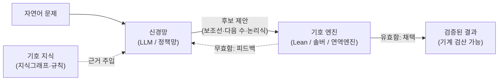

## 0. LLM이 잘 못 하는 한 가지

LLM(대규모 언어 모델)에게 "37 곱하기 48은?"을 물으면 그럴듯한 수를 내놓는다. 맞을 때도 있고 틀릴 때도 있다. 모델은 계산을 한 게 아니라 학습 데이터에서 본 패턴으로 "이쯤 되는 답"을 생성했기 때문이다. 규칙을 끝까지 엄밀히 따르는 일, 한 단계라도 어기면 안 되는 일에서 순수 신경망은 약하다. 환각(없는 사실을 그럴듯하게 지어내는 현상)과 산술·논리 오류가 같은 뿌리에서 나온다.

반대편에 기호적(symbolic) 시스템이 있다. 정리 증명기, SAT 솔버, 규칙 엔진, 지식그래프 같은 것들이다. 이들은 규칙을 한 치도 어기지 않고, 답이 맞는지 기계가 검증할 수 있다. 대신 유연하지 못하다. 자연어의 모호함을 못 받고, 사람이 규칙을 일일이 정의해 줘야 하며, 본 적 없는 형태에 약하다.

뉴로심볼릭(neuro-symbolic) AI는 이 둘을 한 시스템에 묶는다. 신경망의 직관으로 후보를 빠르게 만들고, 기호 엔진의 논리로 그 후보가 옳은지 검산한다. 이 글은 그 결합이 실제로 어떤 형태를 띠는지, 검증된 시스템과 수치로 본다.

> **신경망은 "그럴듯한 것"을 생성하고, 기호 엔진은 "옳은 것"만 통과시킨다. 뉴로심볼릭은 생성과 검증을 서로 다른 엔진에 맡기는 설계다.**

## 1. 왜 한쪽만으로는 부족한가

두 진영의 강점과 약점은 거의 정확히 상보적이다.

| 항목 | 순수 신경망 (LLM 포함) | 기호적 시스템 |
|---|---|---|
| 잘하는 것 | 패턴 인식, 자연어 처리, 유연한 일반화 | 엄밀한 논리, 규칙 준수, 검증 가능성 |
| 못하는 것 | 다단계 논리, 산술, 환각 통제 | 모호함 수용, 데이터로부터 학습, 확장성 |
| 답의 성질 | 확률적("아마 이것") | 결정적("이것이 참") |
| 검증 | 사람이 일일이 확인 | 기계가 자동 검증 |
| 지식 획득 | 데이터에서 학습 | 사람이 규칙·온톨로지로 입력 |

핵심은 "검증 가능성"이다. LLM이 "이 정리는 참이다"라고 답해도 그 말이 맞는지는 모델 자신이 보장하지 못한다. 반면 정리 증명기 Lean에서 증명이 통과하면 그것은 기계적으로 참이다. 사람이 다시 읽어 볼 필요조차 없다. 신경망이 환각을 일으켜도 기호 엔진을 통과하지 못하면 그 환각은 결과에 남지 못한다. 이 구조가 뉴로심볼릭이 환각을 줄이는 원리다.

## 2. 결합 방식 세 갈래

IJCAI 2025의 뉴로심볼릭 서베이는 LLM과 기호 시스템의 결합을 세 방향으로 나눈다. 이 분류가 현재 연구를 정리하는 기준선이다.

| 유형 | 흐름 | 누가 무엇을 하나 | 대표 사례 |
|---|---|---|---|
| Symbolic→LLM | 기호 지식을 신경망에 주입 | 지식그래프·규칙을 검색해 LLM 입력에 넣음 | GraphRAG, ToG |
| LLM→Symbolic | 신경망이 기호 표현을 생성 | LLM이 논리식·코드를 짜서 외부 솔버가 실행 | Logic-LM, SATLM |
| LLM+Symbolic | 둘이 번갈아 탐색 | 신경망이 후보를 내고 기호 엔진이 검증·탐색 유도 | AlphaGeometry, AlphaProof |

세 유형은 "누가 최종 판단을 내리는가"가 다르다. Symbolic→LLM은 신경망이 답하되 근거를 기호 지식에서 가져오고, LLM→Symbolic은 신경망이 문제를 번역만 하고 답은 솔버가 내며, LLM+Symbolic은 둘이 주고받으며 답을 좁혀 간다. 아래에서 각각을 실제 시스템으로 본다.

## 3. LLM→Symbolic: 번역하고 솔버에 넘긴다

가장 직관적인 결합이다. LLM은 자연어 문제를 풀지 않는다. 대신 그 문제를 1차 논리식(FOL), 제약 충족 문제(CSP), SAT 같은 기호 표현으로 번역만 한다. 실제 추론은 Prover9·Z3 같은 결정적 솔버가 한다.

EMNLP 2023의 Logic-LM이 이 방식을 보여준다. 논리 추론 문제를 LLM이 기호 표현으로 옮기고, 외부 솔버가 풀고, 솔버가 오류를 돌려주면 LLM이 그 피드백으로 표현을 고치는 자기 교정 루프를 돈다. ProofWriter·FOLIO·AR-LSAT 등 5개 논리 추론 데이터셋에서, LLM 단독 표준 프롬프트 대비 평균 39.2% 정확도가 올랐고, 사고 사슬(chain-of-thought) 프롬프트 대비로도 18.4% 올랐다. 같은 모델인데 "직접 답하지 말고 논리식으로 옮겨 솔버에 넘겨라"로 바꾼 것만으로 이 차이가 났다.

이 방식의 핵심은 책임 분리다. 자연어를 이해하는 어려운 일은 LLM이 잘하고, 그 논리식이 참인지 따지는 일은 솔버가 틀리지 않는다. LLM이 "P이면 Q이고 P이다"를 잘못된 결론으로 잇는 환각을 일으켜도, 번역만 맡으면 그 추론 오류가 끼어들 자리가 없다.

## 4. LLM+Symbolic: 번갈아 가며 탐색한다

가장 깊은 결합이자 가장 인상적인 성과가 나온 자리다. 신경망이 다음 수를 직관으로 제안하고, 기호 엔진이 그 수가 유효한지 검증하면서 탐색 공간을 좁힌다. 바둑에서 AlphaZero가 신경망으로 유망한 수를 고르고 탐색으로 검증한 것과 같은 구조를, 수학 증명에 적용했다.

DeepMind의 **AlphaGeometry**가 이 구조의 교과서다. 신경망 언어 모델이 보조선 같은 추가 구성을 "직관으로" 제안하면, 기호적 연역 엔진이 그 구성으로부터 엄밀히 따라 나오는 사실들을 결정적으로 도출한다. 신경망 혼자서는 무한히 많은 보조선 후보에 길을 잃고, 기호 엔진 혼자서는 어떤 보조선을 그어야 할지 모른다. 둘을 붙이자 올림피아드급 기하 문제 30개 중 25개를 풀었다. 직전까지의 최고 기법이 10개를 풀던 것에서 크게 올라간 수치이고, IMO 금메달리스트 평균에 근접한다(Nature, 2024년 1월).

후속인 **AlphaProof**는 한 걸음 더 나갔다. 정리 증명기 Lean의 형식 언어 안에서 AlphaZero식 강화학습으로 증명을 찾는다. 수백만 개의 자동 형식화(auto-formalization)된 문제로 자가 학습하며, 모든 추론이 Lean 안에서 이뤄지므로 증명이 나오면 기계가 자동 검증한다. 즉 환각이 원천적으로 결과에 남을 수 없다. 2024년 국제수학올림피아드(IMO)에서 AlphaProof는 비기하 5문제 중 3개(대회 최난도 6번 문제 포함)를, AlphaGeometry 2가 기하 1문제를 풀어, 6문제 중 4문제를 맞혀 42점 만점에 28점을 받았다. 은메달 수준이며 금메달 커트라인(29점)에 1점 모자란 점수다. AI가 IMO에서 메달급 점수를 받은 첫 사례다. 방법론은 2025년 11월 Nature에 정식 발표됐다.

*그림. 신경망이 후보를 생성하고 기호 엔진이 검증한다. 무효한 후보는 피드백으로 신경망에 돌아가 다음 제안을 좁힌다. 점선의 지식그래프 주입(왼쪽 아래)이 Symbolic→LLM 경로다.*

## 5. Symbolic→LLM: 지식그래프로 근거를 댄다

세 번째 갈래는 앞 글에서 다룬 온톨로지·지식그래프와 직접 이어진다. 기호 쪽 지식의 한 형태가 지식그래프이고, 이걸 LLM에 주입하는 게 Symbolic→LLM 결합이다.

순수 LLM은 답의 근거를 모델 가중치 안에서만 끌어온다. 그래서 최신 사실이나 조직 내부 지식을 모르고, 모르는 걸 지어낸다. 여기에 검색 증강 생성(RAG: 외부 지식을 검색해 입력에 붙여 주는 기법)을 더하면 환각이 준다. 그 외부 지식을 비정형 문서 대신 **지식그래프**(개체와 관계를 노드·엣지로 구조화한 데이터)로 두면 근거가 더 정확해진다. 구조화된 사실에 답을 묶어 두기 때문이다.

GraphRAG·ToG(Think-on-Graph) 같은 2025년 프레임워크가 이 방향이다. ToG는 LLM이 지식그래프 위를 빔 서치로 탐색하며 추론 경로를 넓혀, 여러 단계를 건너뛰어야 하는 질문(multi-hop)에서 답의 근거를 그래프 경로로 댄다. 여기서 LLM은 자연어를 다루고, 지식그래프는 "무엇이 사실인지"의 기준을 쥔다. 검증이 솔버 통과 여부만큼 엄밀하지는 않지만, 답이 구조화된 사실에 묶인다는 점에서 같은 철학이다.

## 6. 그래서 무엇이 달라지나 — 세 갈래 비교

| | LLM→Symbolic | LLM+Symbolic | Symbolic→LLM |
|---|---|---|---|
| 대표 | Logic-LM | AlphaProof | GraphRAG·ToG |
| 신경망 역할 | 문제를 기호로 번역 | 후보 제안 | 답 생성 |
| 기호 역할 | 솔버가 실행·확정 | 후보 검증·탐색 유도 | 근거(사실) 공급 |
| 검증 강도 | 강함(솔버가 결정) | 가장 강함(증명 검산) | 중간(사실 근거) |
| 적용 영역 | 논리·제약 문제 | 수학 증명·게임 | 질의응답·지식 작업 |

세 갈래 모두 "신경망 혼자 답을 단정하게 두지 않는다"는 점이 같다. 검증의 칼자루를 기호 쪽이 쥐는 정도만 다르다. AlphaProof처럼 결과가 Lean에서 검산되면 사람이 다시 읽을 필요가 없고, ToG처럼 근거가 그래프 경로로 남으면 사람이 그 경로를 따라 검증할 수 있다.

## 7. 사람에게 남는 일

뉴로심볼릭의 두 절차, 즉 신경망으로 후보를 내는 일과 기호 엔진으로 검증하는 일은 점점 더 도구가 자동으로 한다. AlphaProof는 사람이 증명을 쓰지 않고 Lean이 검산까지 끝낸다. Logic-LM은 사람이 논리식을 짜지 않고 LLM이 번역해 솔버가 푼다. 코딩 에이전트에게 "이 추론 문제를 Z3로 풀 수 있게 제약식으로 옮겨라"고 지시하면 번역도 솔버 호출도 도구가 처리한다.

그럴수록 사람의 일은 두 곳으로 옮겨간다. 하나는 **무엇을 검증 대상으로 삼을지 정의하는 일**이다. 이 문제를 어떤 기호 표현으로 옮겨야 솔버가 받는지, 어떤 사실을 지식그래프에 담아야 답이 근거를 갖는지는 사람이 문제를 정확히 정의해야 정해진다. 솔버는 잘못 번역된 문제도 충실히 풀어 틀린 답을 확신에 차서 내놓는다. 다른 하나는 **검증 자체의 한계를 읽는 일**이다. Lean 증명은 명제가 옳음을 보장하지만 그 명제가 내가 진짜 풀려던 문제인지는 보장하지 않는다. 지식그래프에 담긴 사실이 틀렸으면 그 근거에 묶인 답도 틀린다.

도구가 생성과 검증을 자동으로 잇는 시대에 사람에게 남는 일은, 무엇을 기호로 정의해 검증에 걸 것인지를 정하는 능력과, 기계가 통과시킨 결과가 정말 내가 풀려던 문제의 답인지 검산하는 능력이다.

---

## 출처

- Trinh, T., Luong, T. et al., "Solving olympiad geometry without human demonstrations" (AlphaGeometry), Nature, 2024-01. https://www.nature.com/articles/s41586-023-06747-5
- Google DeepMind, "AI achieves silver-medal standard solving International Mathematical Olympiad problems", 2024. https://deepmind.google/blog/ai-solves-imo-problems-at-silver-medal-level/
- DeepMind et al., "Olympiad-level formal mathematical reasoning with reinforcement learning" (AlphaProof), Nature, 2025-11-12. https://www.nature.com/articles/s41586-025-09833-y
- Pan, L. et al., "Logic-LM: Empowering Large Language Models with Symbolic Solvers for Faithful Logical Reasoning", EMNLP Findings 2023. https://aclanthology.org/2023.findings-emnlp.248/
- "Neuro-Symbolic Artificial Intelligence: Towards Improving the Reasoning Abilities of Large Language Models", IJCAI 2025. https://www.ijcai.org/proceedings/2025/1195
- "Can Knowledge Graphs Reduce Hallucinations in LLMs?: A Survey". https://arxiv.org/pdf/2311.07914
- Awesome-GraphRAG (GraphRAG·ToG 등 자료 모음). https://github.com/DEEP-PolyU/Awesome-GraphRAG

*※ 수치는 위 출처가 제시한 값이다. AlphaGeometry의 25/30은 Nature 2024 논문의 30문제 테스트셋 기준이고, AlphaProof의 IMO 2024 28점(은메달, 4/6문제)은 AlphaGeometry 2와 결합한 결과다. Logic-LM의 +39.2%/+18.4%는 5개 데이터셋 평균 향상치다.*
