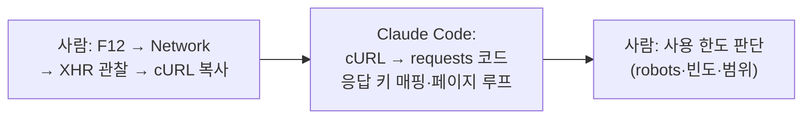

## 0. 화면 뒤로 흐르는 데이터를 가로채기

시리즈 1편에서 데이터 출처의 세 층위를 갈랐다. HTML 스크래핑, AJAX 엔드포인트 직접 호출, 공식 API. 그중 가운데 층 — 브라우저가 화면을 그리려고 백그라운드에서 호출하는 AJAX 엔드포인트를 코드로 직접 부르는 것 — 이 이번 글의 자리다.

내가 수집하는 공공기관 공고 사이트 여럿은 화면을 HTML로 한 번에 내려주지 않는다. 빈 껍데기 페이지를 먼저 주고, 자바스크립트가 별도의 주소로 JSON을 받아 화면을 채운다. 그 JSON 주소를 찾아 직접 부르면, HTML을 파싱하는 것보다 훨씬 깨끗하고 안정적으로 데이터를 얻는다. 문제는 그 주소가 공식 문서에 없다는 것이다. 화면 동작을 관찰해 알아내야 한다.

> **AJAX 엔드포인트 분석은 기술의 문제이기 전에 한도의 문제다. 찾을 수 있다는 것과 써도 된다는 것은 다른 질문이다.**

이 글은 그 엔드포인트를 찾아내는 5단계 절차와, 그것을 쓰기 전에 내가 그은 사용 한도를 함께 적는다.

## 1. 엔드포인트를 찾는 다섯 단계

비공식 AJAX 엔드포인트를 찾는 절차는 사이트가 달라도 거의 같다. 그리고 이 다섯 단계는 전부 사람이 한다.

1. 브라우저에서 F12로 개발자 도구를 연다.
2. **Network** 탭 → **Fetch/XHR** 필터를 켠다.
3. 페이지에서 실제 동작을 재현한다. 목록을 넘기거나, 검색하거나, "더보기"를 누른다.
4. 그때 새로 뜨는 요청을 클릭해 URL·메서드·요청 본문·응답 JSON을 본다.
5. 그 요청을 cURL로 복사한다(우클릭 → Copy as cURL).

여기까지가 관찰이다. 다음 단계, 즉 cURL 한 줄을 Python 코드로 옮기는 일은 Claude Code에게 넘긴다.



*그림. 엔드포인트 발견은 사람의 관찰, 코드 변환은 도구, 그리고 사용 한도 판단은 다시 사람으로 돌아온다.*

## 2. cURL 한 줄을 코드로 — 도구가 한 일

브라우저에서 복사한 cURL은 헤더와 본문이 한 줄에 다 들어 있어 사람이 읽기 번거롭다. 이걸 던지면 Claude Code가 `requests` 호출로 옮기고, 응답 JSON의 키를 한국어 의미로 매핑하고, 페이지를 끝까지 도는 루프까지 붙인다.

이 코드를 보이는 목적은, 도구가 "관찰된 요청"을 "재현 가능한 코드"로 바꾸는 일은 잘하지만 그 요청을 보내도 되는지는 묻지 않는다는 걸 보이기 위해서다.

한 사이트의 목록 엔드포인트는 이런 모양이었다(파라미터 이름은 사이트 고유 표기를 일반화함).

```python
# 목록 조회 — POST로 페이지·건수를 넘기면 JSON 배열이 온다
def fetch_list(session, page):
    resp = session.post(LIST_API_URL, data={
        "pageIndex": page,            # 몇 번째 페이지
        "recordCountPerPage": 100,    # 한 번에 받을 건수
        "ancmPrg": "",                # 공고 진행 상태 필터(빈 값=전체)
    }, timeout=20)
    resp.raise_for_status()
    return resp.json()["resultList"]  # 응답 안의 실제 목록 배열
```

Claude Code는 `pageIndex`·`recordCountPerPage`가 페이지네이션 파라미터라는 것까지 추정해 주석을 달았다. 응답 키 `resultList`를 찾아 꺼내는 것도 자동이었다. 내가 한 일은 이 코드가 맞는지 한 페이지 받아 확인한 것, 그리고 그다음 결정이다.

## 3. 진짜 일 — 사용 한도를 긋는다

코드가 도는 걸 확인한 순간, 기술적으로는 이 엔드포인트를 초당 수십 번도 부를 수 있다. 그러나 그래도 되는지는 다른 질문이다. 비공식 엔드포인트를 쓸 때 나는 세 가지를 먼저 확인하고 한도를 정했다.

**robots.txt와 안내 페이지.** 사이트가 수집을 어떻게 보는지 먼저 본다. 명시적으로 막은 경로는 건드리지 않는다.

**행위의 성격.** 공고 목록을 하루 몇 번 조회하는 것은, 사람이 브라우저로 그 페이지를 몇 번 여는 것과 본질적으로 다르지 않다고 판단했다. 반면 첨부 파일을 대량으로 내려받는 것은 부담이 다르다. 그래서 목록 조회와 첨부 다운로드의 한도를 따로 뒀다.

**빈도.** 목록은 하루 정해진 횟수만, 첨부 다운로드는 항목당 하루 1회로 제한했다. 요청 사이에 간격을 두고, 같은 항목을 다시 받지 않게 했다(증분 수집은 5편에서 다뤘다).

> **도구는 "할 수 있는가"를 푼다. "해도 되는가"와 "어디까지 하는가"는 묻지 않으면 대답하지 않는다.**

이 한도는 코드 어딘가의 상수가 아니라 판단이다. Claude Code에게 "이 엔드포인트로 전부 빠르게 받아라"라고 하면 정확히 그렇게 짠다. 그 속도가 사이트에 어떤 부담인지, 어디까지가 적절한 사용인지는 도구의 관심사가 아니다.

## 4. 깨질 것을 전제로 설계한다

비공식 엔드포인트의 또 다른 성질은 불안정이다. 공식 API가 아니므로 사이트가 개편되면 예고 없이 사라지거나 모양이 바뀐다. 이걸 전제로 구조를 짰다.

사이트별 수집 코드를 `sites/<이름>/` 폴더로 격리했다. 한 사이트의 엔드포인트가 깨져도 그 어댑터만 멈추고, 나머지 사이트는 계속 돈다. 비공식 인터페이스에 의존하는 시스템에서 이 격리는 선택이 아니라 필수다. 전부 한 덩어리로 짜면 한 사이트의 개편이 전체 수집을 멈춘다.

이 구조를 만들라고 한 것도 사람이다. Claude Code는 "네 사이트에서 공고를 수집하라"고 하면 동작하는 코드를 짜지만, "한 사이트가 깨져도 나머지가 살아야 한다"는 요구는 명시해야 구조로 들어온다.

## 5. 사람에게 남는 일

AJAX 엔드포인트 분석에서 도구가 맡는 부분은 명확하다. cURL을 코드로 옮기고, 응답 키를 매핑하고, 페이지 루프를 짜고, 어댑터 골격을 만든다. 관찰된 요청을 재현 가능한 코드로 바꾸는 일은 도구가 빠르고 정확하다.

그럴수록 사람의 일은 두 곳에 남는다. 하나는 발견이다. 화면 뒤로 어떤 요청이 흐르는지는 사람이 F12를 열고 동작을 재현해야 보인다. 다른 하나, 더 무거운 쪽은 한도다. robots.txt를 확인하고, 행위의 성격을 가늠하고, 빈도를 정하고, 첨부 다운로드의 부담을 따로 다루는 일. 이건 코드가 아니라 판단이고, 도구는 이 판단을 대신해 주지 않는다.

이 단계에서 코딩 에이전트가 보편화된 환경의 사람에게 새로 요구되는 능력은, 비공식 인터페이스를 쓸 때 **어디까지가 적절한 사용인가의 한도를 스스로 긋는 능력**이다. 도구는 한도를 묻지 않는다. 그 침묵을 메우는 것이 사람의 자리다.
