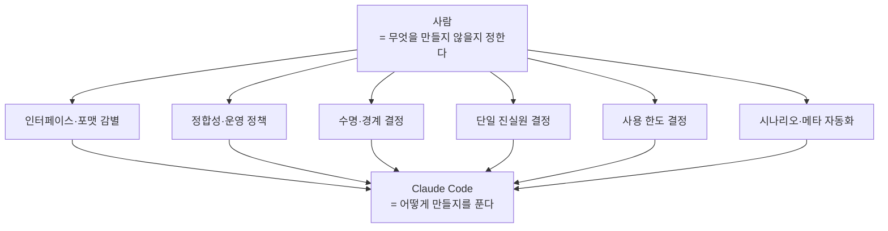

## 0. 여덟 편이 같은 곳을 가리켰다

이 시리즈는 내가 실제로 굴리는 시스템을 한 회차에 하나씩 뜯어보며, 도구가 한 일과 사람이 한 일을 갈라 적었다. 여덟 편을 쓰고 보니 회차마다 따로 나온 "사람에게 남는 일" 한 줄들이 한 방향을 가리키고 있었다. 이 종결편은 그 줄들을 모아 패턴으로 묶고, 그다음 한 사람이 이런 시스템을 여러 개 동시에 굴리는 방법을 적는다.

> **여덟 편의 결론은 모두 "무엇을 만들지 않을 것인가"의 결정이었다. 도구는 "어떻게 만들지"를 다 푼다.**

## 1. 여덟 줄을 한자리에

각 회차가 끝에 남긴 한 줄을 모으면 이렇다.

| 회차 | 사례 | 사람에게 남은 일 |
|---|---|---|
| 1 | HTML·AJAX·API 세 층위 | 더 안정적인 인터페이스가 화면 뒤에 있는지 감별 |
| 2 | requests.Session과 세션 쿠키 | 두 요청의 차이를 한 줄씩 비교하는 진단 절차 |
| 3 | AJAX 엔드포인트 분석 | 비공식 사용의 한도를 스스로 긋기 |
| 4 | CP949 ZIP 인코딩 | 표준이 정의한 분기를 코드에 강제하기 |
| 5 | 증분 수집 워터마크 | 더러운 데이터를 의심하고 정합성 보정 장치 설계 |
| 6 | 임시·영구 데이터 분리 | 데이터마다 다른 수명과 관리자를 경계로 드러내기 |
| 7 | 단일 진실원(SSOT) 결정 | 어느 출처를 진실로 삼을지 결정 |
| 8 | 더블클릭 한 번의 설계 | 사용자 시나리오를 한 번의 실행으로 압축 |

여덟 줄 모두 코드를 어떻게 짜느냐가 아니다. 무엇을 진실로 볼지, 어디까지 할지, 무엇을 분리할지, 무엇을 의심할지의 결정이다. Claude Code는 결정이 내려지면 그것을 코드로 옮기는 데 막힘이 없었다. 막힌 적이 있다면 그건 결정이 아직 안 섰을 때였다.

## 2. 여섯 가지 패턴으로 묶기

여덟 줄을 성질로 묶으면 여섯 패턴이 나온다.

1. **인터페이스·포맷 감별** (1·2편): 화면 뒤의 더 나은 통로를 알아보고, 표준 포맷의 분기를 읽는다.
2. **정합성·운영 정책 수립** (5편): 효율이 놓치는 정합성을 보정 장치로 메운다.
3. **수명·경계 결정** (6편): 데이터마다 다른 수명을 폴더 경계로 드러낸다.
4. **단일 진실원 결정** (7편): 같은 데이터가 여럿일 때 무엇을 진실로 삼을지 정한다.
5. **사용 한도 결정** (3편): 비공식 인터페이스를 어디까지 쓸지 긋는다.
6. **사용자 시나리오·메타 자동화** (8편): 한 번의 실행에 모든 결정을 미리 담고, 사람의 수고 자체를 줄인다.

*그림. 여섯 패턴 모두 사람이 경계를 긋고, 도구가 그 안을 채운다. 공통점은 "무엇을 하지 않을 것인가"의 결정이라는 점이다.*

이 여섯이 공유하는 한 가지가 있다. 모두 **"무엇을 만들지 않을 것인가"의 결정**이라는 점이다. 어느 출처는 쓰지 않는다, 어느 데이터는 자동 삭제하지 않는다, 어느 빈도는 넘지 않는다, 어느 경우는 표준대로 갈라 처리한다. 도구는 "만들어 달라"는 요청에 답하지, "만들지 말아야 할 것"을 먼저 묻지 않는다. 그 경계를 긋는 일이 사람에게 남는다.

## 3. 한 사람이 여러 시스템을 굴리는 법

여기까지가 한 시스템 안의 이야기다. 그런데 나는 이런 미니 자동화를 하나만 굴리지 않는다. 공고 수집기, 입찰 분석 시스템, 그리고 이 블로그 자체까지 여러 개를 동시에 끌고 간다. 본업이 따로 있는 사람이 이걸 가능하게 하려면, 시스템마다 매번 처음부터 설명하지 않아야 한다. 결정과 맥락이 쌓여서 재사용돼야 한다.

그 축적을 떠받치는 도구가 몇 개 있다.

| 층 | 도구 | 담는 것 |
|---|---|---|
| 사용자 전역 | `~/.claude/CLAUDE.md` | 나·일하는 방식·연속성 규칙 (모든 프로젝트 공통) |
| 프로젝트별 | 각 폴더의 `CLAUDE.md` | 그 프로젝트의 규칙·구조 |
| 진행 상태 | `NOTES.md` | 현재 상태·다음 할 일·막힌 부분 |
| 세션 간 기억 | `memory/` | 정착된 사실·피드백·참조 |

핵심 원리는 하나다. **한 번 한 일은 다시 하지 않는다.** 한 번 내린 결정, 한 번 정리한 절차, 한 번 분석한 자료는 글이나 규칙으로 적어 두고 다음 세션이 이어받는다. 세션이 끊기거나 PC가 꺼져도 `NOTES.md`만 보면 어디까지 했는지 복원된다. 이게 없으면 도구를 매번 새로 가르치느라 자동화가 주는 시간을 도로 까먹는다.

## 4. 블로그도 그 관리의 한 층이다

이 시리즈를 쓰는 블로그 자체가 메타 관리의 한 장치다. 결정을 글로 공개하도록 강제하면, 머릿속에만 있던 판단이 문장으로 정리된다. 정리하면서 빈틈이 보이고, 공개돼 있으니 나중에 같은 결정을 다시 내릴 때 근거로 쓴다. 자동화를 운영하는 일과 그것을 기록하는 일이 서로를 받친다.

> **자동화는 시간을 벌어 주고, 기록은 그 시간을 다음으로 넘긴다. 기록 없는 자동화는 매번 처음으로 돌아간다.**

## 5. 잠정 결론 — 네 가지 능력

여덟 편의 패턴과 다중 프로젝트 관리를 합치면, 코딩이 본업이 아닌 사람이 코딩 에이전트와 일할 때 갖춰야 하는 능력은 네 항으로 정리된다.

1. **요구 정의력** — 무엇을 만들지 정확히 말하는 능력. 도구는 모호한 요청에 모호하게 답한다.
2. **검증력** — 도구가 낸 결과가 맞는지, 어떤 경우를 놓쳤는지 보는 능력. 도구의 첫 답은 흔한 경우에 머문다.
3. **한도 설정력** — 무엇을 하지 않을지, 어디까지 할지 경계를 긋는 능력. 도구는 한도를 묻지 않는다.
4. **메타 자동화 설계력** — 결정과 맥락을 쌓아 다음에 재사용하는 능력. 기록 없는 자동화는 매번 처음으로 돌아간다.

이 네 가지는 코드를 짜는 능력이 아니다. 엑셀이 함수를 대신 계산해 줄 때 사람에게 남았던 능력 — 무엇을 계산할지 정하고 결과가 맞는지 보는 능력 — 의 코드 버전이다.

## 6. 닫으며, 그리고 다음

시리즈를 여기서 닫는다. 출발점의 명제는 그대로다. Claude Code는 엑셀이 함수에 한 일을 코드에 한다. 도구가 코드를 짤 때 사람이 잘해야 하는 일은, 무엇을 만들지 정의하는 능력과 도구가 만든 결과를 검증하는 능력이다. 여덟 개의 사례가 그 명제를 각자의 방식으로 증명했다.

다음 기록은 이 도구들을 더 오래 굴리며 마주칠 것들이다. 자동화가 어디서 깨지는지, 사람의 개입이 어디서 또 필요해지는지. 그건 다음 시리즈의 몫으로 둔다.
