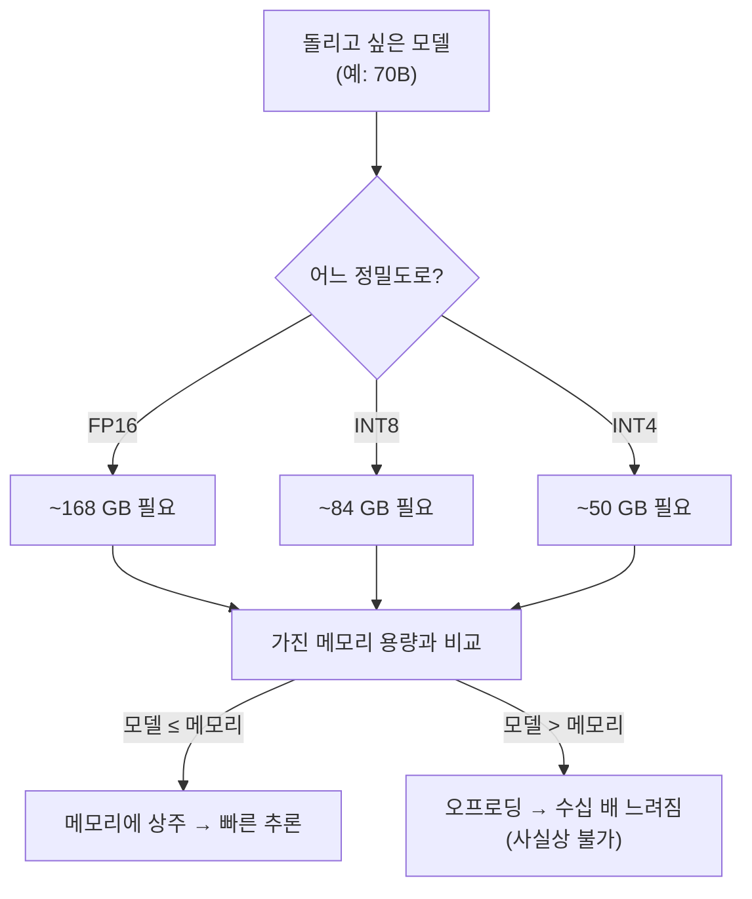
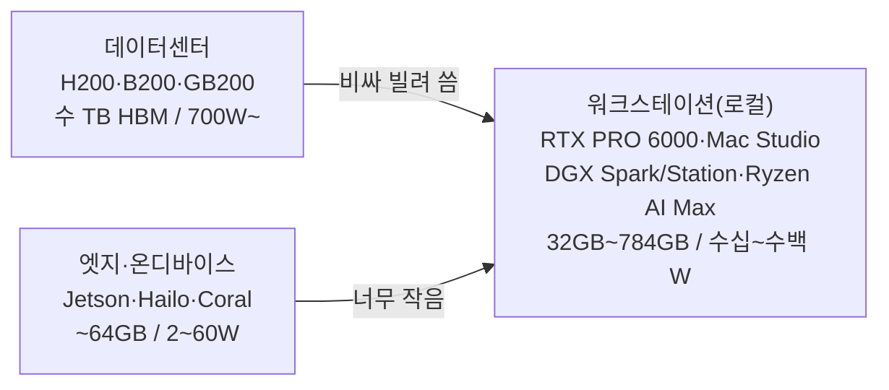

## 0. 데이터센터와 엣지 사이의 빈자리

AI 하드웨어를 두 극단으로만 보면 빈자리가 생긴다. 한쪽 끝에는 데이터센터가 있다. H200·B200·GB200 같은 칩은 한 장에 수만 달러, 8장 묶은 노드는 수십만 달러다. 대부분 사서 쌓지 않고 시간 단위로 빌려 쓴다. 반대쪽 끝에는 엣지가 있다. Jetson Orin이나 Coral Edge TPU 같은 칩은 2~60W를 먹고 카메라 옆에 붙는다. 둘 사이에 책상 위·랙 밑에 놓고 내가 직접 켜고 끄는 로컬 머신이 있다. 미세조정을 돌리고, 모델을 양자화해 추론 속도를 재 보고, 프롬프트를 수백 번 던져 보는 자리다. 이 글은 그 중간 티어, 워크스테이션 하드웨어를 다룬다.

왜 로컬 머신이 따로 필요한가. 빌리는 데이터센터 GPU는 분 단위 과금이라 며칠 내내 프로토타이핑하면 비용이 쌓인다. 데이터를 밖으로 못 내보내는 보안 요구가 있으면 클라우드 자체가 선택지에서 빠진다. 오프라인에서 돌려야 하는 경우도 있다. 그래서 H200을 빌릴 정도는 아니고 엣지 칩으로는 모자란 작업이 로컬 워크스테이션으로 내려온다.

> **로컬 LLM에서 칩을 고르는 첫 질문은 "얼마나 빠른가"가 아니라 "내 모델이 메모리에 들어가는가"다. 들어가지 못하면 속도는 논외다.**

이 글은 2026년 현재 실제로 살 수 있는 워크스테이션급 하드웨어를 메모리 용량·대역폭·연산 성능·전력·가격으로 비교한다. 그리고 로컬 LLM에서 성능을 가르는 진짜 변수가 raw 연산이 아니라 메모리라는 점을, 제품 스펙으로 보인다.

## 1. 먼저 규칙 하나: VRAM이 모델 크기의 상한을 정한다

로컬에서 LLM을 돌릴 때 가장 먼저 부딪치는 벽은 속도가 아니라 용량이다. 모델 가중치가 메모리에 통째로 올라가야 추론이 시작된다. 올라가지 못하면 추론은 시작조차 안 한다(일부를 디스크·시스템 RAM으로 흘리는 오프로딩이 있지만, 그 순간 속도가 수십 배 느려져 실사용이 어렵다).

필요한 메모리는 대략 이 공식으로 잡힌다.

```
필요 메모리(GB) ≈ 파라미터 수(B) × 파라미터당 바이트 × 1.2
   - 파라미터당 바이트: FP16 = 2, INT8(Q8) = 1, INT4(Q4) = 0.5
   - × 1.2 는 런타임 구조·여유분
```

이걸 70B(700억 파라미터) 모델에 대입하면 정밀도가 메모리 요구를 어떻게 가르는지가 한눈에 보인다.

| 정밀도 | 파라미터당 | 70B 가중치 | +KV 캐시·여유(약 1.2배) | 들어가는 하드웨어 예 |
|---|---|---|---|---|
| FP16 | 2 byte | ~140 GB | ~168 GB | 80GB GPU 2장, 또는 통합메모리 256GB급 |
| INT8(Q8) | 1 byte | ~70 GB | ~84 GB | RTX PRO 6000 96GB 1장, 통합메모리 128GB |
| INT4(Q4) | 0.5 byte | ~42 GB | ~50 GB | RTX 5090 32GB로는 부족, 48GB+ 필요 |

여기에 한 가지가 더 붙는다. KV 캐시(추론 중 토큰마다 쌓이는 키·값 텐서)는 문맥이 길어질수록 커진다. 70B급에서 8K 문맥은 약 2.5GB지만 128K 문맥이면 KV 캐시만 약 40GB로 불어난다. 긴 문맥을 다루려면 가중치 외에 이 몫까지 메모리가 남아 있어야 한다.



*그림. 메모리 용량이 돌릴 수 있는 모델 크기의 상한을 정한다. 정밀도를 낮추면(양자화) 같은 메모리에 더 큰 모델이 들어가지만, 모델이 메모리를 넘으면 오프로딩으로 떨어져 실사용이 어렵다.*

이 규칙이 워크스테이션 하드웨어 선택을 거꾸로 규정한다. "몇 TFLOPS인가"보다 "몇 GB인가"가 먼저다. 그래서 아래 비교표에서도 메모리 용량과 대역폭을 맨 앞 열에 둔다.

## 2. 두 갈래의 메모리 구조 — 전용 VRAM과 통합 메모리

워크스테이션 하드웨어는 메모리를 다루는 방식에서 두 갈래로 갈린다. 이 구조 차이가 "큰 모델이 들어가느냐"와 "얼마나 빠르냐"를 동시에 가른다.

**전용 VRAM(discrete GPU)**: GPU가 자기 전용 메모리(GDDR7·GDDR6X)를 따로 갖는다. 대역폭이 압도적으로 높다. RTX 5090은 GDDR7 32GB에 1.79 TB/s, RTX PRO 6000은 GDDR7 96GB에 1.6~1.8 TB/s에 이른다. 연산기가 데이터를 굶지 않고 받으니 토큰 생성 속도가 빠르다. 한계는 용량이다. 컨슈머 카드는 32GB(5090), 워크스테이션 카드라야 96GB(PRO 6000)에서 막힌다. 96GB를 넘는 모델은 카드를 여러 장 꽂아 쪼개 올려야 하고, 그러면 카드 간 통신이 새 병목이 된다.

**통합 메모리(unified memory)**: CPU·GPU·NPU가 하나의 큰 메모리 풀을 공유한다. Apple Mac Studio M3 Ultra는 최대 512GB, AMD Ryzen AI Max+ 395는 최대 128GB, NVIDIA DGX Spark는 128GB, DGX Station은 784GB를 이 방식으로 단다. 장점은 용량이다. Mac Studio 한 대에 512GB가 들어가니, GPU 카드로는 여러 장을 꽂아야 할 대형 모델을 단일 머신에 통째로 올린다. 한계는 대역폭이다. LPDDR5X 기반 통합메모리는 GDDR7 전용 VRAM보다 대역폭이 한참 낮다. DGX Spark·Ryzen AI Max는 256~273 GB/s 수준으로, 5090의 1.79 TB/s에 비하면 7분의 1이다. Mac M3 Ultra만 819 GB/s로 통합메모리 중 예외적으로 높다.

여기서 로컬 LLM의 핵심 통찰이 나온다. 큰 모델을 "돌릴 수 있느냐"는 용량(통합메모리가 유리)이 정하고, 돌아가는 모델이 "얼마나 빠르냐"는 대역폭(전용 VRAM이 유리)이 정한다. Mac Studio가 로컬 대형 모델 추론에서 의외로 강한 이유가 여기 있다. 512GB 통합메모리에 600억~6,000억 파라미터 모델을 통째로 올릴 수 있어서, raw 연산이 GPU보다 낮아도 "애초에 올라가느냐"의 싸움에서 이긴다. 대신 819 GB/s 대역폭이 토큰 생성 속도의 상한이 되어, M3 Ultra가 초대형 모델에서 초당 17~18 토큰 수준에 머무는 것도 이 구조로 설명된다.

> **전용 VRAM은 빠르지만 용량이 작고, 통합메모리는 크지만 느리다. 내 모델이 32~96GB 안에 들면 GPU가 빠르고, 그 위로 올라가면 통합메모리가 아니면 단일 머신에 담기지 않는다.**

## 3. 제품으로 보는 워크스테이션 티어

2026년 현재 실제 제품을 메모리·대역폭·연산·전력·가격으로 나란히 둔다. 가격은 변동이 크니 대략의 자리만 본다.

| 제품 | 메모리 | 대역폭 | AI 연산(정점) | 전력(TDP) | 가격대 | 단일 머신에 올라가는 모델(대략) |
|---|---|---|---|---|---|---|
| RTX 5090 (컨슈머) | 32GB GDDR7 | 1.79 TB/s | FP8 5세대 텐서코어, FP32 ~105 TFLOPS | 575W | ~$2,000 (출시가) | INT4 30B급, INT8 13B급 |
| RTX PRO 6000 Blackwell WS | 96GB GDDR7 | 1.6~1.8 TB/s | 4,000 AI TOPS, 24,064 CUDA | 600W | 출시 ~$8,565 → 현재 ~$13,250 | INT8 70B급, INT4 120B급 |
| DGX Spark (GB10) | 128GB LPDDR5X 통합 | ~273 GB/s | 1 PFLOP FP4(희소) | ~140W급 | ~$3,999~4,699 | INT4 200B급(느림) |
| AMD Ryzen AI Max+ 395 | 최대 128GB LPDDR5X 통합 | 256 GB/s | NPU 50 TOPS / 플랫폼 126 TOPS | 55~120W | 미니PC ~$2,000~, 개발플랫폼 ~$3,999 | INT4 70B급(BF16 70B도 적재 가능) |
| Mac Studio M3 Ultra | 최대 512GB 통합 | 819 GB/s | 80코어 GPU + 32코어 Neural Engine | ~270W(시스템) | $3,999~$14,099 | INT4 600B급, INT8 200B급 |
| DGX Station (GB300) | 784GB 코히어런트<br/>(252GB HBM3e + 496GB LPDDR5X) | 미확인(HBM3e 부분 TB/s급) | 20 PFLOP FP4 | 데스크톱 전원(미확인) | 미정(Q4 2026 출시 예정) | 최대 1조 파라미터급 |

각 제품을 자리별로 짚는다.

- **RTX 5090**: 컨슈머 플래그십이다. GDDR7 32GB에 1.79 TB/s로 대역폭은 최상급이지만 용량 32GB가 천장이다. 직전 세대 RTX 4090(24GB GDDR6X, 1008 GB/s, 450W) 대비 메모리 대역폭이 약 78% 늘었다. 7B~13B 모델을 빠르게 돌리거나, 30B를 INT4로 욱여넣는 자리다. 70B는 양자화해도 단독으로는 안 들어간다.
- **RTX PRO 6000 Blackwell Workstation Edition**: 같은 Blackwell 세대인데 GDDR7을 96GB로 단 워크스테이션 카드다. 1장으로 70B를 INT8에 올리는 게 5090과 갈리는 지점이다. 4,000 AI TOPS, 24,064 CUDA 코어, 600W. 출시가 약 8,565달러였으나 GDDR7 공급난으로 2026년 6월 기준 NVIDIA 정가가 13,250달러까지 올랐다. 용량과 대역폭을 둘 다 챙기는 대신 가격이 데이터센터 입구에 닿는다.
- **DGX Spark**: GB10 Grace Blackwell 슈퍼칩을 얹은 손바닥만 한 데스크톱이다. 128GB 통합메모리로 큰 모델을 올리는 데는 유리하지만, 대역폭이 약 273 GB/s에 그쳐 토큰 생성이 빠르지 않다. FP4 정점 1 PFLOP(희소 기준)은 추론 처리량용 수치다. 2025년 10월 출시, 가격은 3,999달러에서 4,699달러로 인상됐다. "데이터센터 소프트웨어 스택을 책상에서 그대로 익히는 머신"에 가깝다.
- **AMD Ryzen AI Max+ 395 (Strix Halo)**: Zen5 16코어 + RDNA 3.5 40CU iGPU + XDNA 2 NPU(50 TOPS, 플랫폼 합계 126 TOPS)를 한 칩에 묶은 APU다. 최대 128GB LPDDR5X를 통합메모리로 공유해 Llama 70B를 iGPU에서 BF16으로 돌렸다는 시연이 있다. 대역폭 256 GB/s는 DGX Spark와 비슷한 급이다. GMKtec·Beelink 등의 미니PC로 2,000달러대부터, AMD 공식 개발 플랫폼은 3,999달러다. DGX Spark와 같은 자리를 Windows·x86으로 노린다.
- **Mac Studio M3 Ultra**: 통합메모리 용량의 극단이다. 최대 512GB, 대역폭 819 GB/s, 80코어 GPU. 6,000억 파라미터 넘는 모델을 메모리에 올린다고 Apple이 명시했다. 단일 머신에 대형 모델을 통째로 담는 게 목적이라면 가장 현실적인 선택지다. 96GB 1TB 구성이 3,999달러, 풀옵션이 14,099달러까지 간다. 대역폭이 GDDR7 카드보다 낮아 raw 토큰 속도는 5090·PRO 6000에 밀리지만, 그 카드들에 안 들어가는 크기를 올린다.
- **DGX Station**: 워크스테이션 티어의 천장이다. GB300 Grace Blackwell Ultra에 784GB 코히어런트 메모리(HBM3e 252GB + LPDDR5X 496GB)를 달아 최대 1조 파라미터 모델을 데스크톱에서 다룬다. FP4 정점 20 PFLOP. 2026년 4분기 출시 예정이라 본문 스펙 중 전력·정가 일부는 미확정이다. 사실상 "랙에 넣던 것을 책상 옆에 두는" 경계 제품이다.

## 4. 세 티어를 한 번 더 — 서버·워크스테이션·엣지

이 시리즈에서 다룬 세 하드웨어 티어를 메모리·전력·자리로 나란히 두면 워크스테이션이 어디에 끼는지가 분명해진다.

| 티어 | 대표 칩·제품 | 메모리 규모 | 전력대 | 소유 형태 | 주 용도 |
|---|---|---|---|---|---|
| 데이터센터(서버) | H200(141GB HBM3e), B200/GB200, MI300, TPU | 칩당 수십~수백 GB HBM, 노드 수 TB | 칩당 700W~1kW+ | 주로 임대 | 대규모 학습, 대규모 추론 서빙 |
| 워크스테이션(로컬) | RTX PRO 6000, Mac Studio, DGX Spark/Station, Ryzen AI Max | 32GB~784GB | 수십~수백 W | 소유(책상 위) | 미세조정, 로컬 추론, 프로토타이핑 |
| 엣지/온디바이스 | Jetson Orin, Hailo-8, Coral, Ethos-U85 | 수백 MB~64GB | 2W~60W | 임베드(기기 내장) | 실시간 비전, 상시 센서, 로봇 |



*그림. 데이터센터와 엣지 사이에 워크스테이션 티어가 있다. 데이터센터는 비싸 빌려 쓰고 엣지는 모델을 담기엔 작아, 책상 위에서 소유하며 돌리는 중간 자리가 따로 생긴다.*

세 티어는 같은 축(메모리·전력·소유 형태) 위에서 연속적으로 이어진다. 워크스테이션 티어 안에서도 DGX Station(784GB)은 데이터센터 쪽으로, Ryzen AI Max 미니PC는 엣지 쪽으로 양 끝이 번진다. 경계는 칼로 자르듯 갈리지 않는다.

## 5. TFLOPS·TOPS 숫자에 속지 않으려면

스펙표에서 가장 눈에 띄는 큰 숫자가 연산 성능(TFLOPS·TOPS)이다. 그런데 로컬 LLM 추론에서 이 숫자는 자주 오답을 부른다. DGX Spark의 FP4 1 PFLOP은 5090의 raw 연산을 가볍게 넘는 수치로 보이지만, 실제 토큰 생성 속도에서는 대역폭 273 GB/s가 발목을 잡는다. LLM 추론은 토큰을 하나 만들 때마다 모델 가중치 전체를 메모리에서 읽어 와야 하는, 메모리 대역폭에 묶인(memory-bound) 작업이기 때문이다. 연산기가 아무리 많아도 가중치가 그 속도로 안 들어오면 놀고 있는 것이다.

그래서 같은 작업에서도 우선순위가 갈린다.

- **돌릴 수 있는가**(모델이 들어가는가): 메모리 용량이 정한다. 여기선 통합메모리(Mac 512GB, DGX Station 784GB)가 이긴다.
- **얼마나 빠른가**(토큰 생성 속도): 메모리 대역폭이 정한다. 여기선 GDDR7 전용 VRAM(5090 1.79 TB/s, PRO 6000 1.6~1.8 TB/s)이 이긴다.
- **연산 정점(TFLOPS/TOPS)**: 일괄 처리(batch) 추론이나 학습 처리량에서 의미가 커진다. 단건 대화형 추론에서는 위 둘에 가려지는 경우가 많다.

> **로컬 LLM에서 TFLOPS는 셋째 기준이다. 첫째는 모델이 들어가는 용량, 둘째는 토큰을 뽑는 대역폭이다. 큰 숫자부터 보면 순서가 거꾸로다.**

## 6. 그래서 무엇을 정해야 하나

워크스테이션을 고르는 일은 결국 두 질문으로 좁혀진다.

첫째, **빌릴까 살까**. 며칠 쓰고 말 작업이면 데이터센터 GPU를 시간 단위로 빌리는 게 싸다. 매일 켜고 데이터를 밖으로 못 내보내는 작업이면 로컬을 사는 게 길게 보면 싸고, 보안 요구도 푼다. 이 판단에 정답은 없고 사용 패턴·보안 제약·예산이 결정한다.

둘째, **어느 메모리 급이 내 모델을 담나**. 7B~13B를 빠르게 돌릴 거면 RTX 5090 32GB로 충분하고 대역폭도 최상급이다. 70B를 단일 카드에 INT8로 올릴 거면 RTX PRO 6000 96GB가 갈림길이다. 100B를 넘는 모델을 단일 머신에 통째로 담을 거면 전용 VRAM으로는 안 되고 Mac Studio 512GB나 DGX Station 784GB 같은 대용량 통합메모리로 넘어가야 한다. 단, 통합메모리는 대역폭이 낮아 토큰 속도를 양보해야 한다.

이 두 결정이 양자화 비트수, 다룰 수 있는 문맥 길이, 한 머신에 담기는 모델 크기 상한을 한꺼번에 정한다.

## 7. 사람에게 남는 일

모델을 양자화하고, 런타임에 올리고, 추론 서버를 띄우는 절차는 도구가 한다. 코딩 에이전트에게 "Llama 70B를 INT4로 양자화해 이 머신에서 추론 서버로 띄워라"라고 지시하면 Claude Code가 변환 명령과 실행 스크립트를 자동으로 만든다. 그럴수록 사람의 일은 절차 실행에서 하드웨어를 고르는 결정으로 옮겨간다.

도구는 주어진 머신에 맞춰 모델을 올리지만, 어느 머신을 살지는 묻지 않으면 정해 주지 않는다. 내 모델이 몇 B인가, INT4까지 줄여도 품질이 버티는가, 문맥을 얼마나 길게 쓰는가, 매일 돌리는가 며칠 쓰고 마는가, 데이터를 밖으로 내보낼 수 있는가. 이 질문들의 답이 RTX 5090과 DGX Station 사이 어디에 설지를 정한다. 그리고 그 머신에서 모델이 메모리에 상주해 실제로 빠른지, 오프로딩으로 떨어져 느려지는지는 현장에서 재 봐야 안다.

도구가 모델을 자동으로 머신에 맞춰 올려 주는 시대에 사람에게 남는 일은, 메모리 용량·대역폭·전력·예산 제약을 읽어 어느 티어가 내 모델을 담는지 고르는 능력과, 그 머신에서 모델이 실제로 빠르게 도는지 검증하는 능력이다.

---

## 출처

- NVIDIA, "RTX PRO 6000 Blackwell Workstation Edition" 제품 페이지, https://www.nvidia.com/en-us/products/workstations/professional-desktop-gpus/rtx-pro-6000/
- Tom's Hardware, "Nvidia raises RTX Pro 6000 Blackwell GPU pricing to $13,250", https://www.tomshardware.com/pc-components/gpus/nvidia-raises-rtx-pro-6000-blackwell-gpu-pricing-to-usd13-250-55-percent-increase-over-msrp-in-a-years-time
- NVIDIA, "GeForce RTX 5090 Graphics Cards", https://www.nvidia.com/en-us/geforce/graphics-cards/50-series/rtx-5090/
- RunPod, "RTX 5090 Specs and VRAM", https://www.runpod.io/articles/guides/nvidia-rtx-5090
- RunPod, "RTX 4090 NVLink Support, Specs, VRAM, and AI Performance", https://www.runpod.io/articles/guides/nvidia-rtx-4090
- NVIDIA, "Personal AI Supercomputer Powered by Blackwell | DGX Spark", https://www.nvidia.com/en-us/products/workstations/dgx-spark/
- Notebookcheck, "Nvidia GB10-powered DGX Spark with 128 GB LPDDR5X memory gets $700 price hike", https://www.notebookcheck.net/Nvidia-GB10-powered-DGX-Spark-with-128-GB-LPDDR5X-memory-gets-700-price-hike.1236870.0.html
- NVIDIA, "DGX Station: The Ultimate Desktop AI Supercomputer", https://www.nvidia.com/en-us/products/workstations/dgx-station/
- NVIDIA Newsroom, "NVIDIA DGX Station for Windows Puts a Trillion-Parameter AI Supercomputer on Every Enterprise Desk", https://nvidianews.nvidia.com/news/nvidia-dgx-station-for-windows-puts-a-trillion-parameter-ai-supercomputer-on-every-enterprise-desk
- Apple, "Mac Studio - Technical Specifications", https://www.apple.com/mac-studio/specs/
- Apple Newsroom, "Apple reveals M3 Ultra, taking Apple silicon to a new extreme", https://www.apple.com/newsroom/2025/03/apple-reveals-m3-ultra-taking-apple-silicon-to-a-new-extreme/
- AMD, "Ryzen AI Max+ 395", https://www.amd.com/en/products/processors/laptop/ryzen/ai-300-series/amd-ryzen-ai-max-plus-395.html
- CNX Software, "$4,000 AMD Ryzen AI Halo Developer Platform features 126 TOPS Ryzen AI Max+ 395 processor", https://www.cnx-software.com/2026/06/16/4000-amd-ryzen-ai-halo-developer-platform-features-126-tops-ryzen-ai-max-395-processor/
- SitePoint, "VRAM for 70B Models: Why 16GB GPU Is the Minimum in 2026", https://www.sitepoint.com/vram-requirements-70b-models-16gb-gpu-minimum-2026/
- InsiderLLM, "Running 70B Models Locally — Exact VRAM by Quantization", https://insiderllm.com/guides/running-70b-models-locally-vram-guide/

*※ 수치는 위 출처가 제시한 제품 사양값이다. 가격은 2025~2026년 기준이며 GDDR7 공급 상황에 따라 변동이 크다. DGX Station(GB300)은 2026년 4분기 출시 예정 제품으로 전력·정가 등 일부 사양이 미확정이다. 통합메모리 제품의 "올라가는 모델 크기"는 정밀도·KV 캐시·문맥 길이에 따라 달라지는 근사값이다.*
