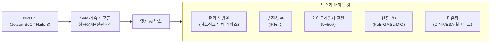
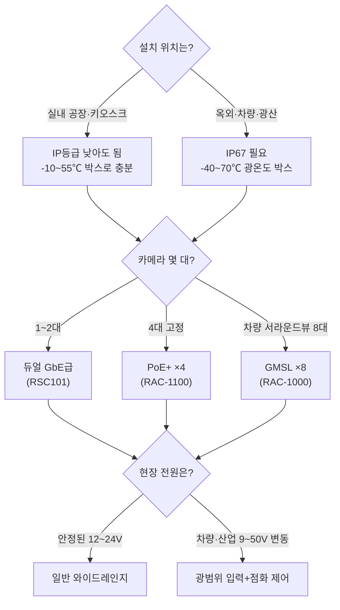

## 0. 칩은 정했는데, 현장에는 무엇을 거는가

앞선 글에서 온디바이스 비전을 떠받치는 칩(NPU)을 네 계층으로 나눴고, 그 칩을 보드에 얹은 모듈(SoM)과 폼팩터도 다뤘다. 거기까지는 "어떤 연산기로 추론을 돌릴 것인가"라는 결정이다. 그런데 공장 천장, 신호등 기둥, 화물차 운전석 뒤에 실제로 거는 물건은 칩이 아니다. 칩을 견고한 금속 박스에 넣고, 팬 없이 식히고, 먼지·물·진동을 막고, 카메라 여러 대와 9~50V짜리 현장 전원을 받아내는 완성품이다. 이걸 엣지 AI 박스라 부른다.

칩 선택과 박스 선택은 다른 결정이다. Jetson AGX Orin이라는 같은 모듈을 쓰는 박스가 -20℃까지만 버티는 실내용도 있고, IP67로 빗속에 거는 옥외용도 있다. 둘은 안의 칩이 같아도 쓰는 현장이 다르다. "Jetson Orin을 쓴다"는 칩 결정이고, "이 현장에 어떤 Jetson 박스를 거는가"는 그와 별개의 결정이다.

> **칩을 고르면 추론 성능이 정해지고, 박스를 고르면 그 성능이 현장에서 살아남을지가 정해진다. 둘은 같은 결정이 아니다.**

이 글은 2026년에 실제로 파는 엣지 AI 박스를 스펙으로 비교한다. 안에 무슨 칩이 들어가는지보다, 그 칩을 어떤 견고성·I/O로 감쌌는지를 본다. 모든 수치는 제조사 제품 사양에서 확인한 값이다.

## 1. 엣지 AI 박스란 무엇을 감싼 물건인가

엣지 AI 박스의 안쪽은 앞 글에서 본 칩·모듈 그대로다. NVIDIA Jetson AGX Orin 같은 SoM(System-on-Module)이나 Hailo-8 같은 가속기가 들어간다. 박스가 더하는 건 그 모듈이 현장에서 죽지 않게 만드는 바깥 껍질이다.

*그림. 칩·모듈은 추론 성능을 정하고, 박스는 그것을 견고성과 현장 I/O로 감싼 완성품이다.*

각 층이 더하는 게 무엇인지 하나씩 본다.

**팬리스 방열.** 산업 박스는 팬을 거의 안 쓴다. 팬은 먼지를 빨아들이고, 베어링이 닳아 가장 먼저 고장 나는 부품이기 때문이다. 대신 케이스 전체를 히트싱크로 만들어 칩의 열을 금속 몸체로 빼낸다. 그래서 산업 박스는 묵직한 알루미늄 덩어리처럼 생겼다. 단점은 방열 한계가 명확하다는 점인데, 뒤에 나오는 Vecow RAC-1000이 "30W 모드면 -25~70℃, 40/50W 모드면 -25~55℃"로 동작 온도가 갈리는 이유가 이것이다. 칩을 더 빠르게 돌리면 열이 늘어 버틸 수 있는 외기 온도가 떨어진다.

**방진·방수(IP등급).** IP 뒤 두 자리는 앞이 방진, 뒤가 방수다. IP67이면 앞자리 6은 완전 방진, 뒷자리 7은 수심 1m에 30분 잠겨도 견딘다는 뜻이다. 실내 공장이면 IP40 정도로 충분하지만, 옥외 신호등·항만·광산이면 IP67이 필요하다.

**와이드레인지 전원.** 현장 전원은 깨끗한 12V가 아니다. 차량은 시동 때 전압이 출렁이고, 산업 현장은 24V·48V가 섞인다. 그래서 산업 박스는 단일 전압이 아니라 범위로 받는다. Vecow RAC-1000은 DC 9~50V, OnLogic Karbon 523은 12~48V를 받는다. 차량 탑재용은 시동 전압 강하를 견디는 점화 시퀀스(ignition control)까지 넣는다.

**현장 I/O.** 일반 PC가 안 쓰는 입력들이다. PoE(Power over Ethernet, 랜선 하나로 카메라에 전원·데이터를 같이 보냄), GMSL(자동차용 고속 카메라 직결 규격), DIO(센서·릴레이용 디지털 입출력). 카메라가 몇 대 붙느냐가 박스 등급을 가르는 핵심 축이다.

## 2. 제품으로 보는 엣지 AI 박스 — 견고성 등급별 비교

같은 Jetson AGX Orin을 써도 박스는 견고성·I/O로 등급이 갈린다. 2026년에 실제 판매 중인 제품을 견고성 순으로 나열하면 이렇다. TOPS는 안에 든 칩 성능이라 비슷하거나 같고, **박스를 가르는 건 동작 온도·IP등급·전원·카메라 입력**이다.

| 제품 | 안의 칩 | AI 성능 | 동작 온도 | IP / 방열 | 전원 입력 | 카메라·네트워크 I/O | 용도 |
|---|---|---|---|---|---|---|---|
| Axiomtek RSC101 | Intel J6412 + Hailo-8 | 26 TOPS | -10 ~ 70℃ | 팬리스(IP등급 명시 없음) | DC 12~24V | 듀얼 GbE LAN, Wi-Fi/5G/LTE | 손바닥 크기 실내 비전, 키오스크 |
| AAEON BOXER-8640AI | Jetson AGX Orin 32GB | 최대 200 TOPS | -20 ~ 55℃ | 팬리스(IP등급 명시 없음) | 미확인 | PoE LAN 4, HDMI, USB 3.2 ×4 | 실내 다중 카메라 영상분석 |
| Advantech AIR-030 | Jetson AGX Orin | 최대 275 TOPS | 미확인(산업 등급) | 팬리스 / 200×220×74mm | 미확인 | (산업용 다중 I/O) | 공장 비전·로보틱스 |
| OnLogic Karbon 523 | Intel Core + MXM GPU 옵션 | 칩 구성에 따름 | -40 ~ 70℃ | 팬리스(러기드) | DC 12~48V, 점화 제어 | 다중 LAN, DIN/VESA/월/랙 | 광온도·진동 현장, 차량 |
| Vecow RAC-1000 | Jetson AGX Orin | 275 TOPS | -25 ~ 70℃(30W) / -25 ~ 55℃(40·50W) | **IP67** / 팬리스 | DC 9~50V | **GMSL 1/2 카메라 8대**(Fakra-Z) | 옥외·차량, 서라운드뷰 |
| Vecow RAC-1100 | Jetson AGX Orin | 275 TOPS | -25 ~ 70℃ / -25 ~ 55℃ | **IP67** / 팬리스 | DC 9~50V | **M12 PoE+ 카메라 4대** | 옥외 고정 감시·교통 |

표를 읽는 법은 칩이 아니라 끝의 네 열(동작 온도·IP·전원·카메라)이다. RSC101과 RAC-1000은 둘 다 엣지 비전 박스지만, 하나는 실내 12~24V·26 TOPS·손바닥 크기이고 다른 하나는 옥외 IP67·9~50V·275 TOPS·7kg 금속 덩어리다. 안의 칩(Hailo-8 vs Jetson Orin)도 다르지만, 설치 현장이 둘을 가른다.

특히 같은 Vecow RAC-1000과 RAC-1100은 안의 Jetson AGX Orin도 같고 275 TOPS도 같은데 카메라 입력만 다르다. RAC-1000은 자동차 카메라 규격인 GMSL2를 Fakra-Z 커넥터로 8대 받고, RAC-1100은 M12 PoE+ 카메라 4대를 받는다. 차량 서라운드뷰는 전자, 교차로 고정 감시는 후자다. 같은 칩·같은 견고성인데 카메라 인터페이스가 용도를 가른다.

> **엣지 박스 비교표는 TOPS 열을 먼저 보면 틀린다. 같은 275 TOPS 박스가 동작 온도 -25℃와 -40℃, IP등급 없음과 IP67, 카메라 4대와 8대로 갈린다. 현장 제약이 적힌 오른쪽 네 열이 진짜 결정 변수다.**

## 3. 신형 칩이 박스로 내려오는 데는 시차가 있다

박스 안의 칩은 한 세대 전 것일 때가 많다. 칩이 발표되고 산업 박스로 양산되기까지 인증·검증에 시간이 걸리기 때문이다. 2026년 기준 상황을 보면 이 시차가 분명하다.

NVIDIA는 2025년에 JetSon Thor를 출시했다. Blackwell 아키텍처 기반 로봇용 모듈로, FP4 기준 최대 2,070 TFLOPS, FP8 기준 1,035 TFLOPS를 내고 128GB LPDDR5X(약 273 GB/s)를 단다. CPU는 14코어 Arm Neoverse-V3AE다. 전력 범위는 40~130W다. NVIDIA는 Jetson AGX Orin 대비 AI 연산 최대 7.5배, 전력 효율 3.5배라고 밝혔다. Agility Robotics·Boston Dynamics·Figure 같은 휴머노이드 로봇 업체가 초기 도입사다.

그런데 위 2절 비교표에 Thor 박스가 없다. 2026년 중반 시점에 산업용 박스 제품군의 주력은 여전히 Jetson AGX Orin(최대 275 TOPS)이다. Thor는 개발자 키트와 모듈이 막 풀려 로봇·연구용으로 들어가는 단계이고, IP67 옥외 박스나 광온도 산업 박스로 양산되기까지는 더 걸린다. 칩의 발표 스펙과 "지금 현장에 걸 수 있는 박스"는 다른 이야기다.

이 시차가 박스 결정에 주는 함의는 분명하다. 칩 로드맵의 최신 TOPS를 보고 박스를 기다리면 현장 도입이 늦어진다. 반대로 지금 검증된 Jetson AGX Orin 박스로 가면, 275 TOPS는 멀티카메라 비전에 충분하고 제품·드라이버·인증이 다 갖춰져 있다. 로봇처럼 Thor의 연산이 꼭 필요한 워크로드가 아니라면, 현장 박스는 보통 한 세대 전 칩으로 결정된다.

## 4. 현장 제약이 박스 사양을 거꾸로 정한다

칩을 고를 때 전력 예산·정밀도가 모델 설계를 거꾸로 규정했던 것처럼, 박스를 고를 때는 설치 현장의 물리적 제약이 사양을 거꾸로 정한다. 순서는 칩이 아니라 현장이 먼저다.

*그림. 칩이 아니라 설치 위치·카메라 수·전원이 먼저고, 그 답이 박스 사양을 거꾸로 결정한다.*

이 흐름을 실제 결정으로 풀면 이렇다.

- **실내 공장 검사 라인, 카메라 1~2대, 안정된 전원.** Axiomtek RSC101급으로 충분하다. Hailo-8 26 TOPS, -10~70℃, 12~24V, 손바닥 크기. IP67도 GMSL도 필요 없으니 돈을 거기 쓰지 않는다.
- **건물 외벽 다중 카메라 영상분석, 실내 설치, 4채널 이상.** AAEON BOXER-8640AI급. Jetson AGX Orin 200 TOPS에 PoE LAN 4포트로 IP 카메라 네 대를 랜선 하나씩으로 먹이고 전원까지 보낸다. 동작 온도 -20~55℃면 실내·처마 밑은 커버한다.
- **옥외 교차로 고정 감시, 빗물·먼지 노출, 카메라 4대.** Vecow RAC-1100. IP67이라 빗속에 직접 걸고, M12 PoE+ 4채널로 사방 카메라를 받고, 9~50V로 현장 전원 변동을 흡수한다.
- **차량 탑재 서라운드뷰, 진동·시동 전압 강하, 카메라 8대.** Vecow RAC-1000. GMSL 8채널과 IP67, 9~50V 광범위 입력이 차량 환경을 정확히 겨눈다.

같은 "엣지 AI 비전"인데 박스가 다섯 갈래로 갈리는 이유는 안의 칩 성능이 아니라 현장의 온도·먼지·물·카메라 수·전원이다. 칩 스펙표만 보면 이 갈래가 안 보인다.

## 5. 사람에게 남는 일

칩에 모델을 맞춰 컴파일하는 일은 도구가 한다. 박스를 고르는 일은 도구가 카탈로그를 읽어 후보를 추려 줄 수는 있어도, 어느 박스가 맞는지는 묻지 않으면 정해 주지 않는다. 그 결정에 필요한 정보가 데이터시트가 아니라 현장에 있기 때문이다.

설치 위치가 처마 밑인가 빗속인가, 외기가 여름 한낮 55℃까지 오르는 함석 지붕 아래인가 영하 30℃ 광산인가, 카메라가 고정 4대인가 차량 8대인가, 전원이 깔끔한 24V인가 시동 때 출렁이는 차량 배터리인가. 이 답은 현장을 가서 봐야 나온다. 코딩 에이전트에게 "RAC-1000과 BOXER-8640AI 중 뭐가 맞냐"고 물으면 스펙은 정리해 주지만, 그 현장의 외기 온도와 전원 상태는 사람이 측정해 입력해야 한다.

도구가 칩에 모델을 맞추고 박스 카탈로그를 정리해 주는 시대에 사람에게 남는 일은, 설치 현장의 온도·먼지·물·카메라 수·전원 제약을 직접 읽어 박스 사양으로 번역하는 능력과, 그 박스가 실제 그 현장에서 팬리스 방열 한계를 넘기지 않고 IP등급대로 버티는지 설치 후 검증하는 능력이다. 275 TOPS는 데이터시트에 적힌 숫자고, 그 숫자가 함석 지붕 아래 한여름에도 스로틀링 없이 나오는지는 현장에서만 확인된다.

---

## 출처

- NVIDIA, "Jetson Thor | Advanced AI for Physical Robotics", https://www.nvidia.com/en-us/autonomous-machines/embedded-systems/jetson-thor/
- NVIDIA Newsroom, "NVIDIA Blackwell-Powered Jetson Thor Now Available, Accelerating the Age of General Robotics", https://nvidianews.nvidia.com/news/nvidia-blackwell-powered-jetson-thor-now-available-accelerating-the-age-of-general-robotics
- AAEON, "BOXER-8640AI: AI@Edge Fanless Embedded Box PC with NVIDIA Jetson AGX Orin 32GB", https://www.aaeon.com/en/product/detail/ai-edge-solutions-boxer-8640ai
- Advantech, "Advantech Releases AIR-030 New Edge AI System with NVIDIA Jetson AGX Orin System on Module", https://www.advantech.com/en-us/resources/news/advantech-releases-air-030-new-edge-ai-system-with-nvidia-jetson-agx-orin-system-on-module
- M2M Solution, "RAC-1000 / RAC-1100 (GMSL2 or PoE) — IP67 Rugged NVIDIA Jetson AGX Orin", https://www.m2msolution.ca/product-page/rac-1000-1100-gmsl2-or-poe-ip67-rugged-nvidia-jetson-agx-orin
- Axiomtek, "Fanless Edge AI Vision System with Hailo-8 — RSC101", https://www.axiomtek.com/Default.aspx?MenuId=Products&FunctionId=ProductView&ItemId=26680&upcat=350
- OnLogic, "Karbon 523 Rugged Fanless PC with Dual ModBay", https://www.onlogic.com/store/k523/
- Hailo, "Hailo-8 M.2 AI Acceleration Module — 26 TOPS AI Processor Card", https://hailo.ai/products/ai-accelerators/hailo-8-m2-ai-acceleration-module/
- The Robot Report, "How does NVIDIA's Jetson Thor compare with other robot brains on the market?", https://www.therobotreport.com/how-does-nvidias-jetson-thor-compare-with-other-robot-brains/

*※ 수치는 위 출처가 제시한 제품 사양값이다. Vecow RAC-1000/1100의 동작 온도는 TDP 모드(30W / 40·50W)에 따라 갈린다. Advantech AIR-030의 동작 온도·전원 입력, AAEON BOXER-8640AI의 전원 입력, Axiomtek RSC101의 IP등급은 공개 자료에서 확정 수치를 확인하지 못해 "미확인"으로 표기했다. Jetson Thor의 2,070 FP4 TFLOPS는 희소(sparse) 기준값이다.*
