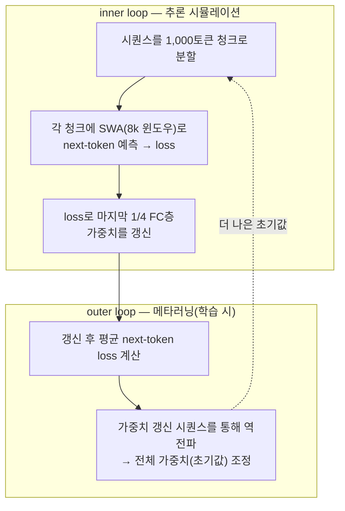

## TL;DR

긴 컨텍스트 문제를 새 아키텍처(Mamba·선형 어텐션 등)로 풀던 흐름과 달리, TTT-E2E는 **표준 트랜스포머 + 슬라이딩 윈도우 어텐션**을 그대로 쓰되 추론 중에 모델이 그 컨텍스트로 스스로 학습(test-time training)해 가중치에 압축한다. 3B 모델·164B 토큰에서 풀 어텐션 트랜스포머와 같은 방식으로 컨텍스트 길이에 스케일하면서, 128k 컨텍스트에서 약 2.7배 빠르다. 다만 needle-in-a-haystack 같은 검색형 과제에서는 크게 약해, 만능이 아니라 트레이드오프가 분명한 접근이다.

> **긴 컨텍스트는 더 큰 어텐션의 문제가 아니라, 읽은 것을 어떻게 기억에 압축하느냐의 문제다 — TTT-E2E는 그 압축을 '학습'으로 본다.**

- 제목: End-to-End Test-Time Training for Long Context
- 소속: Astera Institute, NVIDIA, Stanford, UC Berkeley, UC San Diego
- arXiv: [2512.23675](https://arxiv.org/abs/2512.23675) · 코드: [test-time-training/e2e](https://github.com/test-time-training/e2e) (JAX) · 라이선스 CC BY 4.0

## 1. 모델 한눈에 (1축: 이런 모델이 있구나)

TTT-E2E의 출발 발상은 문제를 재정의하는 데 있다. 긴 컨텍스트 언어 모델링을 "아키텍처 설계" 문제가 아니라 "지속 학습(continual learning)" 문제로 본다. 보통은 풀 어텐션의 제곱 비용을 줄이려고 Mamba 2나 Gated DeltaNet 같은 새 구조를 들고 온다. TTT-E2E는 구조를 바꾸지 않는다. 표준 트랜스포머에 슬라이딩 윈도우 어텐션(SWA, 윈도우 8,000토큰)을 얹은 평범한 모델을 쓴다.

대신 모델이 추론할 때 멈춰 있지 않는다. 주어진 컨텍스트를 **next-token prediction으로 스스로 학습**해 그 내용을 자기 가중치에 압축한다. 윈도우 밖으로 밀려난 과거를 어텐션으로 다시 보는 게 아니라, 가중치 안에 눌러 담는다. 이름의 E2E(End-to-End)는 이게 추론 시(next-token 학습)와 학습 시(메타러닝) 양쪽에서 end-to-end로 맞물린다는 뜻이다.

## 2. 데이터 준비 (4축: 이런 데이터를 준비했구나)

- **사전학습**: 필터링된 웹 텍스트, 시퀀스 길이 8,000토큰. 모델 3B 파라미터에 총 164B 토큰.
- **파인튜닝(롱컨텍스트)**: The Pile의 Books 서브셋에서 최대 128,000토큰 시퀀스. 짧게 사전학습하고, 긴 책 데이터로 컨텍스트 길이를 늘려 적응시키는 구성이다.

사전학습 윈도우(8k)와 파인튜닝 길이(128k)가 다르다는 점이 뒤의 한계(8k 밖 검색 성능 급락)와 연결된다.

## 3. 학습 절차 (3축: 이렇게 학습시켰구나) — 이중 루프

TTT-E2E의 핵심은 inner/outer 두 루프다. 추론 때 일어날 학습을, 학습 때 미리 시뮬레이션해 그 학습이 잘 되도록 초기값을 잡는다.

*그림. inner loop는 추론 때 일어날 'test-time 학습'을 1,000토큰 청크 단위로 시뮬레이션하고, outer loop는 그 갱신 결과의 손실을 역전파해 "test-time에 잘 학습되는 초기값"을 메타러닝한다.*

- **inner(추론 시뮬레이션)**: 학습 시퀀스를 1,000토큰 청크로 자른다. 각 청크에 SWA로 다음 토큰을 예측해 손실을 구하고, 그 손실로 **네트워크 마지막 1/4의 완전연결(FC) 층** 가중치를 어떻게 바꿀지 계산한다. 전체가 아니라 뒷부분만 갱신하는 게 비용을 누르는 장치다.
- **outer(메타러닝)**: 그 가중치 갱신을 적용한 뒤의 평균 next-token 손실을 계산하고, 갱신 시퀀스 전체를 거쳐 역전파해 모델의 모든 가중치(=초기값)를 조정한다. "추론 때 학습을 잘하는 출발점"을 학습으로 찾는 것이다.

## 4. 파인튜닝 (2축) 

별도의 SFT·RLHF 단계가 핵심이 아니다. 이 논문에서 '파인튜닝'은 8k로 사전학습한 모델을 128k 책 데이터로 길이 적응시키는 단계에 해당한다. 정렬(alignment)보다 컨텍스트 길이 확장이 목적인 학습이다.

## 5. 성능 평가 (5축: 평가는 이렇게)

비교 대상은 풀 어텐션 트랜스포머, Mamba 2, Gated DeltaNet이다.

| 지표 (8k~128k 컨텍스트) | TTT-E2E | 풀 어텐션 | Mamba 2 / Gated DeltaNet |
|---|---|---|---|
| 평균 손실(낮을수록 좋음) | 기준(최저) | +0.015 | +0.03 |
| Needle-in-a-Haystack (128k) | **6%** | **99%** | 7% / 7% |
| 첫 토큰 생성(1k토큰당, H100) | +25ms 선형 | 12→70ms | (가장 빠름) |
| 학습 지연(8k→128k) | 0.25s→0.33s | — | 약 0.06s 일정 |

읽는 법이 중요하다. **언어 모델링 손실에서는 TTT-E2E가 셋 중 가장 낮다.** 풀 어텐션보다도 0.015 낮고, 컨텍스트가 길어져도 풀 어텐션처럼 스케일한다(Mamba 2·Gated DeltaNet은 그렇지 못함). 속도도 128k에서 약 2.7배 빠르다.

그런데 needle-in-a-haystack(긴 문서 속 특정 사실을 정확히 집어내는 검색형 과제)에서는 TTT-E2E가 6%, 풀 어텐션이 99%다. 압축이 평균적 예측에는 유리해도, 한 글자도 틀리면 안 되는 정밀 검색에서는 어텐션이 원문을 그대로 보는 쪽을 못 따라간다. 가중치에 "눌러 담는" 방식의 본질적 한계다.

## 6. 우리는 이걸 어떻게 활용하면 좋을까 (6축: 실무 함의)

이 논문에서 실무자가 가져갈 것은 결론이 아니라 **트레이드오프의 모양**이다.

**무엇에 맞나.** 긴 문맥을 평균적으로 이해해 이어 쓰거나 요약하는 작업, 즉 "전체 분위기"가 중요한 long-context 생성에는 잘 맞고 빠르다. 추론 지연이 컨텍스트 길이에 거의 안 늘어나는 점은 긴 문서를 다루는 서비스에 매력적이다.

**무엇에 안 맞나.** 긴 계약서·로그에서 특정 조항·이벤트를 정확히 집어내야 하는 검색형 과제에는 지금 형태로는 위험하다. NIAH 6%는 그대로 쓰면 안 된다는 신호다. 이런 작업은 여전히 풀 어텐션이나 RAG(외부 검색)가 답이다.

**비용 구조.** TTT-E2E는 추론을 싸게 만드는 대신 학습을 비싸게 만든다(학습 지연이 Mamba 2의 4~5배). 한 번 학습해 많이 추론하는 서비스라면 이 교환이 이득이고, 자주 재학습해야 하면 부담이다.

**재현·라이선스.** 코드가 JAX로 공개돼 있고 CC BY 4.0이라 검증·활용이 열려 있다. 다만 3B 규모 결과라, 더 큰 모델에서도 같은 스케일링이 유지되는지는 별도 확인이 필요하다.

> **TTT-E2E는 "긴 컨텍스트를 다 기억한다"가 아니라 "평균적으로 잘 기억하되 정밀 검색은 포기한다"는 모델이다. 쓰기 전에 내 작업이 생성형인지 검색형인지부터 가른다.**

---

## 출처

- Tandon, A., Dalal, K., Li, X. et al., "End-to-End Test-Time Training for Long Context", arXiv 2512.23675, https://arxiv.org/abs/2512.23675
- 코드(JAX), test-time-training/e2e, https://github.com/test-time-training/e2e
- DeepLearning.AI The Batch, "Test-Time Training End-to-End (TTT-E2E) Retrains Model Weights to Handle Long Inputs", https://www.deeplearning.ai/the-batch/test-time-training-end-to-end-ttt-e2e-retrains-model-weights-to-handle-long-inputs
- VentureBeat, "New 'Test-Time Training' method lets AI keep learning without exploding inference costs", https://venturebeat.com/infrastructure/new-test-time-training-method-lets-ai-keep-learning-without-exploding

*※ 수치는 위 출처(arXiv 초록·the Batch 정리) 기준이다. 평균 손실 차(+0.015/+0.03), NIAH(6/99/7%), 속도(128k에서 약 2.7배·1k토큰당 +25ms), 학습 지연(0.25→0.33s)은 3B·164B 토큰 설정의 보고값이며 모델 규모·구현에 따라 달라질 수 있다.*
