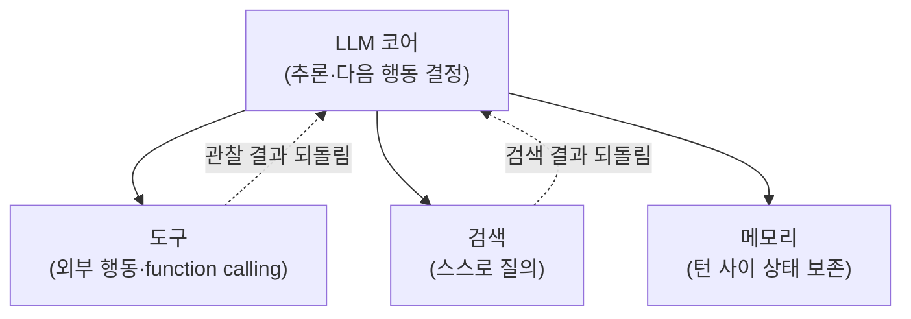

## 0. 챗봇과 에이전트의 갈림길

챗봇에 "이 폴더에 어떤 파일이 제일 큰지 알려줘"라고 물으면, 모델은 폴더를 볼 수 없으니 일반적인 방법을 설명하는 글을 돌려준다. 입력 한 번에 출력 한 번. 거기서 끝난다.

같은 질문을 에이전트에 던지면 흐름이 다르다. 모델이 "폴더 목록을 읽는 도구를 호출해야겠다"고 판단해 도구를 부르고, 돌아온 파일 목록을 다시 읽고, 그 결과를 보고 "이제 답할 수 있다"고 판단해 답을 만든다. 한 번의 응답이 아니라 관찰→사고→행동→관찰을 도는 순환이다. 이 순환을 에이전트 루프(agent loop)라고 부른다.

Anthropic은 「Building Effective AI Agents」에서 에이전트를 "LLM이 도구를 루프 안에서 자율적으로 사용하는 것"으로 정의한다. 정의의 무게는 "루프"와 "자율"에 있다. 모델이 스스로 다음 행동을 정하고, 그 행동의 결과를 다시 입력으로 받아 다음을 정한다. 챗봇은 이 루프가 없다.

> **챗봇은 입력 한 번에 출력 한 번이다. 에이전트는 자기가 한 행동의 결과를 보고 다음 행동을 다시 정하는 루프다.**

이 글은 에이전트를 이루는 부품을 구조로 분해한다. LLM 코어, 도구, 메모리, 플래너, 그리고 이들을 도는 제어 루프. 그다음 대표 루프 패턴인 ReAct와 Plan-and-Execute를 코드 수준으로 비교하고, 마지막에 이 자율 루프에서 사람에게 남는 일이 무엇인지로 모은다. (앞선 글에서 훅·스킬·MCP·워크플로 같은 "에이전트 둘레의 부품"을 다뤘다면, 이 글은 "에이전트 한 대의 내부 골격"을 다룬다.)

## 1. 증강된 LLM — 부품의 출발점

에이전트의 가장 작은 단위는 모델 하나가 아니다. Anthropic이 기본 빌딩 블록으로 드는 것은 "증강된 LLM(augmented LLM)"이다. 순수 언어 모델에 세 가지를 붙인 형태다.

- **도구(tools)**: 모델이 외부에 행동을 내보내는 통로. 모델이 어떤 도구를 어떤 인자로 부를지 스스로 고르고, 돌아온 출력을 다시 읽는다.
- **검색(retrieval)**: 모델이 필요한 정보를 스스로 질의해 가져오는 통로. 검색 질의문을 모델이 직접 만들고 결과를 소비한다.
- **메모리(memory)**: 여러 턴에 걸쳐 무엇을 남길지 모델이 정하는 상태 저장소.

세 가지의 공통점은 모델이 수동으로 주입받는 게 아니라 능동적으로 부린다는 데 있다. 검색 질의를 짜는 것도, 도구를 고르는 것도, 무엇을 기억할지 정하는 것도 모델 자신이다. 이 능동성이 에이전트 루프를 굴리는 엔진이다.

여기에 한 부품을 더하면 자율 에이전트의 골격이 완성된다. **플래너(planner)**, 즉 목표를 받아 다음 행동(또는 행동들의 순서)을 정하는 사고 단계다. 단일 에이전트에서는 플래너가 따로 떨어져 있지 않고 LLM 코어가 매 턴 "다음에 무엇을 할지" 판단하는 형태로 녹아 있다. Plan-and-Execute 같은 패턴에 가면 이 플래너가 별도 단계로 분리된다(§4).



*그림. 증강된 LLM의 구성. 코어가 도구·검색·메모리를 능동적으로 부리고, 그 결과를 다시 코어로 되돌려 다음 판단의 입력으로 쓴다.*

## 2. 도구 호출 — 모델이 "말"을 "행동"으로 바꾸는 자리

에이전트가 바깥세상에 손을 뻗는 실제 메커니즘이 도구 호출(tool calling), 또는 함수 호출(function calling)이다. 모델은 코드를 직접 실행하지 못한다. 대신 "이 함수를 이 인자로 부르고 싶다"는 구조화된 요청을 텍스트가 아닌 데이터로 내보낸다. 그 함수를 실제로 실행하는 건 모델 바깥의 내 코드다.

핵심은 도구를 JSON 스키마로 정의한다는 점이다. 함수의 이름, 인자, 각 인자의 타입과 설명을 스키마로 적어 모델에 넘긴다. 모델은 그 스키마를 보고 언제 이 함수를 어떤 인자로 불러야 할지 판단한다.

아래 코드를 보이는 목적은, 도구 정의가 "사람이 읽는 설명"이 아니라 "모델이 읽는 스키마"라는 점을 구체로 확인하기 위해서다. 날씨를 조회하는 도구 하나의 정의다.

```python
# tools/weather.py — 도구를 JSON 스키마로 정의한다
# description과 인자 설명은 사람이 아니라 "모델"이 읽고 판단의 근거로 쓴다.
weather_tool = {
    "name": "get_weather",
    "description": "특정 도시의 현재 날씨를 조회한다",  # 모델이 '언제 부를지' 판단하는 근거
    "input_schema": {
        "type": "object",
        "properties": {
            # 인자마다 타입과 설명을 명시 — 모델이 값을 채울 때 본다
            "city": {"type": "string", "description": "도시 이름, 예: Seoul"},
            "unit": {"type": "string", "enum": ["celsius", "fahrenheit"]},  # enum으로 선택지 제한
        },
        "required": ["city"],  # 반드시 채워야 하는 인자
    },
}
```

모델에 "서울 날씨 알려줘"라고 물으면, 모델은 답 텍스트 대신 `get_weather(city="Seoul")`를 부르겠다는 구조화된 응답을 내보낸다. Anthropic의 Claude는 이를 응답 안의 별도 콘텐츠 블록(tool_use 블록)으로 내보내고, OpenAI는 assistant 메시지에 `tool_calls` 배열로 담는다. 형식은 다르지만 골자는 같다. 모델이 함수 이름과 인자(JSON)를 정해서 내놓으면, 내 코드가 그걸 파싱해 실제 함수를 실행하고, 결과를 다시 모델에 돌려준다.

2024년 6월 OpenAI는 여기에 Structured Outputs를 더했다. 도구 정의에 `strict: true`를 켜면 모델이 만든 인자가 내가 준 JSON 스키마와 정확히 일치하도록 보장한다. 제약 디코딩(constrained decoding)이라는 기법으로, 모델이 스키마를 벗어난 토큰을 애초에 생성하지 못하게 막는 방식이다. 도구 인자가 스키마와 어긋나 파싱이 깨지는 사고를 줄인다.

도구 호출이 중요한 이유는 이것이 "추론(reasoning)"과 "행동(acting)"을 잇는 다리이기 때문이다. 모델의 사고는 그 자체로는 텍스트일 뿐이다. 도구 호출이 있어야 그 사고가 파일을 읽고, API를 부르고, DB를 조회하는 실제 행동으로 바뀐다. 이 다리를 어떻게 반복해 건너느냐가 다음 절의 루프 패턴이다.

## 3. 에이전트 루프 — 도는 구조

부품을 갖췄으면 이제 이들을 돌리는 제어 흐름이 필요하다. 가장 단순한 형태의 에이전트 루프는 다섯 줄 안에 들어온다. 관찰한 상태를 모델에 넣고, 모델이 도구를 부르면 실행해서 결과를 다시 넣고, 모델이 "끝"이라고 할 때까지 반복한다.

아래 코드를 보이는 목적은, 에이전트의 "자율"이 거창한 게 아니라 while 루프 한 개라는 점을 드러내기 위해서다. 의사코드 수준이지만 실제 동작 구조가 그대로 보인다.

```python
# agent/loop.py — 에이전트 루프의 뼈대
def run_agent(goal, tools, max_steps=15):
    messages = [{"role": "user", "content": goal}]  # 메모리: 대화 누적 상태

    for step in range(max_steps):           # 무한 루프 방지용 상한(안전망)
        response = llm.call(messages, tools)  # 1) 사고: 모델이 다음 행동을 정한다
        messages.append(response)             # 모델의 판단을 상태에 누적

        if not response.tool_calls:          # 2) 모델이 도구를 안 부르면 = 끝났다는 신호
            return response.text             #    최종 답을 반환하고 루프 종료

        for call in response.tool_calls:     # 3) 행동: 모델이 고른 도구를 실제로 실행
            result = tools[call.name](**call.args)
            # 4) 관찰: 도구 실행 결과를 다시 상태에 넣어 다음 사고의 입력으로 만든다
            messages.append({"role": "tool", "name": call.name, "content": result})

    raise RuntimeError("최대 단계 초과 — 루프를 강제 종료한다")  # 종료 조건
```

이 루프에서 두 가지가 구조의 핵심이다.

첫째, **종료 조건**. 루프는 모델이 도구를 더 부르지 않을 때(목표 달성) 또는 `max_steps`에 닿을 때 끝난다. `max_steps` 같은 상한은 장식이 아니라 안전망이다. 종료 조건이 없으면 헷갈린 에이전트가 같은 행동을 무한히 반복하며 토큰과 비용을 태운다. 실무 루프는 여기에 더해, 출력 상태가 여러 턴 동안 변하지 않으면 빠져나오는 "정체 감지(no-progress detection)"와 도구 호출 재시도 횟수를 제한하는 회로 차단기(circuit breaker)를 함께 둔다.

둘째, **관찰을 상태에 되먹이는 줄**(4번). 도구 실행 결과를 `messages`에 다시 넣는 이 한 줄이 챗봇과 에이전트를 가른다. 모델은 자기가 부른 도구가 무엇을 돌려줬는지 봐야 다음을 판단한다. 이 되먹임이 없으면 모델은 행동만 하고 그 결과를 보지 못하는 장님이 된다.

종료 조건은 "에이전트의 자기 판단"이 아니라 검증 가능한 자동 점검에 거는 편이 안전하다. 모델이 "다 됐다"고 말하는 것과 테스트가 통과하는 것은 다르다. 후자가 기계적으로 확인 가능한 종료 신호다.

## 4. ReAct vs Plan-and-Execute — 두 가지 루프 패턴

위 루프는 골격이고, 그 안에서 "사고와 행동을 어떤 리듬으로 교대하느냐"가 루프 패턴이다. 대표가 둘이다.

### 4-1. ReAct — 사고와 행동을 한 걸음씩 교대

ReAct(Reasoning + Acting)는 Yao 등이 2022년 논문 「ReAct: Synergizing Reasoning and Acting in Language Models」에서 제안했다. 핵심은 추론 흔적(reasoning trace)과 행동(action)을 한 걸음씩 번갈아 짜 넣는다는 것이다. 한 번 생각하고(Thought), 한 번 행동하고(Action), 그 결과를 관찰하고(Observation), 다시 생각한다. §3의 while 루프가 매 턴 모델을 다시 부르는 모습이 바로 ReAct다.

이 교대가 주는 이득은 추론이 행동의 결과에 묶여 있다는 점이다. 모델이 매 단계 실제 도구 결과를 보고 다음 생각을 고치니, 근거 없는 추론을 길게 이어 가다 틀리는 일이 줄어든다. 논문은 질의응답(HotpotQA)과 사실 검증(Fever)에서 ReAct가 위키피디아 API와 상호작용해 체인오브소트(chain-of-thought)만 쓸 때 생기는 환각과 오류 전파를 줄였다고 보고한다. 의사결정 벤치마크 ALFWorld·WebShop에서는 모방학습·강화학습 대비 성공률을 각각 34%p, 10%p 끌어올렸다. 그것도 한두 개의 예시만 프롬프트에 넣고서다.

> **ReAct는 한 걸음 생각하고 한 걸음 행동한다. 매번 실제 결과를 보고 다음을 고치니, 빗나가도 그 자리에서 바로잡는다.**

대가는 비용과 지연이다. 매 사고·관찰 사이클이 LLM을 한 번씩 더 부른다. 10단계 작업이면 LLM 호출이 10번 일어난다. 토큰이 쌓이고, 순차 처리라 지연이 길어지고, 비용을 미리 예측하기도 어렵다.

### 4-2. Plan-and-Execute — 계획을 먼저 세우고 실행

Plan-and-Execute는 순서를 뒤집는다. 먼저 플래너가 목표를 받아 단계들의 순서를 한 번에 세운다. 그다음 실행자(executor)가 그 계획을 순서대로 실행한다. 플래너는 도구를 부르지 않고 생각만 하고, 실행자는 즉흥 판단 없이 정해진 단계만 실행한다.

이 분리가 비용 구조를 바꾼다. 10단계 작업이 ReAct에서 LLM 호출 10번이 필요하다면, Plan-and-Execute는 계획 1번 + 실행 몇 번으로 줄어든다. 게다가 역할을 나눠 모델을 섞어 쓸 수 있다. 계획은 비싸고 똑똑한 모델로 한 번, 실행은 싸고 빠른 모델로 N번. 대략 `1 × 강한 모델 + N × 싼 모델`의 비용이 되어, 단계가 3개를 넘으면 같은 작업에서 ReAct보다 싸지는 경향이 있다.

대신 약점이 분명하다. 플래너가 도구 결과를 하나도 보기 전에 계획 전체를 확정한다. 그래서 2단계가 예상 못 한 결과를 돌려주면, 그걸 전제로 한 3단계는 이미 잘못 적혀 있다. 이게 "깨지기 쉬운 계획(brittle plan)"이라는 전형적 실패 모드다. 그래서 실무에서는 실행 도중 계획을 다시 세우는 재계획(replanning) 단계를 끼워 ReAct의 적응력을 일부 되찾는다.

### 4-3. 언제 무엇을

| 항목 | ReAct | Plan-and-Execute |
|---|---|---|
| 사고·행동 리듬 | 한 걸음씩 교대 | 계획 전체 먼저, 실행 나중 |
| LLM 호출 수 | 단계 수만큼(10단계≈10회) | 계획 1회 + 실행 소수 |
| 적응력 | 매 단계 결과 보고 즉시 수정 | 계획 확정 후 경직(재계획 없으면) |
| 비용·지연 | 높음, 예측 어려움 | 낮음, 모델 분리 가능 |
| 대표 실패 모드 | 루프가 길어지며 헤맴 | 깨지기 쉬운 계획 |
| 잘 맞는 작업 | 탐색적·경로가 불확실한 작업 | 단계가 또렷이 정해진 작업 |

규칙으로 굳히면 이렇다. 경로가 미리 안 보이고 중간 결과에 따라 길이 갈리는 탐색적 작업이면 ReAct가 맞다. 단계가 또렷하고 도중에 크게 바뀔 일이 없는 작업이면 Plan-and-Execute가 호출 수와 비용을 줄인다. 둘 사이에 ReWOO(관찰을 추론에서 떼어내 호출을 줄이는 변형), Reflexion(실패를 스스로 비평해 다시 시도하는 변형) 같은 패턴이 더 있지만, 출발점은 이 두 축이다.

## 5. 사람에게 남는 일

에이전트의 부품은 도구가 거의 다 자동으로 짜 준다. 코딩 에이전트에게 "날씨 도구를 정의하고 ReAct 루프로 도는 에이전트를 만들어"라고 지시하면, JSON 스키마도 while 루프도 종료 조건도 알아서 생성한다. 그럴수록 사람의 일은 코드를 짜는 데서 세 가지 경계를 긋는 데로 옮겨간다.

첫째, **무엇을 도구로 줄지**. 에이전트의 능력 범위는 어떤 도구를 쥐여줬는지로 정해진다. 파일을 지우는 도구를 줄지, 읽기만 하는 도구를 줄지는 모델이 정하지 않는다. 사람이 정한다. 도구 하나가 곧 에이전트가 세상에 낼 수 있는 행동의 경계다.

둘째, **어디서 멈출지**. §3에서 봤듯 종료 조건이 없는 루프는 무한히 돈다. `max_steps`를 몇으로 둘지, 무엇을 "완료"로 칠지, 어떤 자동 점검으로 그걸 확인할지는 사람이 설계한다. 모델의 "다 됐습니다"를 그대로 믿을지, 테스트 통과를 종료 신호로 삼을지의 선택이다.

셋째, **무엇을 검증할지**. ReAct가 매 단계 결과를 보고 고친다 해도, 그 결과가 옳은지는 별개다. 도구가 잘못된 데이터를 돌려줘도 모델은 그걸 사실로 받아 다음을 판단한다. 어느 행동의 결과를 사람이 다시 확인할지, 어느 행동은 자동에 맡길지의 경계가 자율 에이전트의 안전을 정한다.

도구가 코드를 대신 짜 줄 때 사람이 잘해야 하는 일은, 무엇을 만들지 정의하는 능력과 도구가 만든 결과를 검증하는 능력이다. 에이전트 아키텍처에서 그 정의는 "어떤 도구를 쥐여주고 어디서 멈추게 할지"로, 그 검증은 "어느 관찰 결과를 사람이 다시 확인할지"로 나타난다. 루프는 도구가 돌리지만, 그 루프의 경계를 긋는 일은 사람이 한다.

> **에이전트가 자율로 돌수록, 무엇을 도구로 줄지·어디서 멈출지·무엇을 검증할지는 더 또렷이 사람의 일로 남는다.**

---

## 출처

- Anthropic, "Building Effective AI Agents", https://www.anthropic.com/research/building-effective-agents
- Anthropic, "Effective context engineering for AI agents", https://www.anthropic.com/engineering/effective-context-engineering-for-ai-agents
- Yao et al., "ReAct: Synergizing Reasoning and Acting in Language Models" (arXiv:2210.03629), https://arxiv.org/abs/2210.03629
- OpenAI, "Function calling | OpenAI API", https://platform.openai.com/docs/guides/function-calling
- OpenAI, "Introducing Structured Outputs in the API", https://openai.com/index/introducing-structured-outputs-in-the-api/
- DigitalApplied, "AI Function Calling Guide: OpenAI, Anthropic, Google", https://www.digitalapplied.com/blog/ai-function-calling-guide-openai-anthropic-google
- DEV Community (James Li), "ReAct vs Plan-and-Execute: A Practical Comparison of LLM Agent Patterns", https://dev.to/jamesli/react-vs-plan-and-execute-a-practical-comparison-of-llm-agent-patterns-4gh9
- dasroot.net, "Agent Architectures: ReAct vs Plan-Execute vs Graph Agents", https://dasroot.net/posts/2026/04/agent-architectures-react-plan-execute-graph-agents/
- Data Science Dojo, "Agentic Loops: From ReAct to Loop Engineering (2026 Guide)", https://datasciencedojo.com/blog/agentic-loops-explained-from-react-to-loop-engineering-2026-guide/
- tinyagents.dev, "The Agent Loop Explained: The 5-Line Pattern Behind Every AI Agent", https://tinyagents.dev/blog/what-is-the-agent-loop
