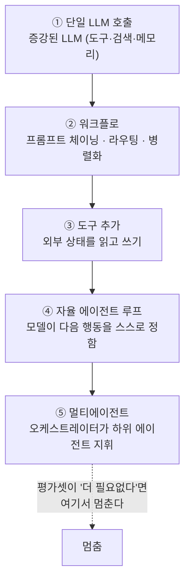
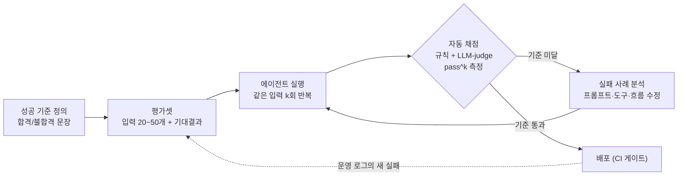

## 0. "돌아간다"로 끝나는 함정

코딩 에이전트로 자동화를 하나 만들어 두면 처음엔 다 잘 된다. 내가 시켰던 그 입력에서는 그렇다. 그런데 사흘 뒤 다른 입력을 넣으면 도구 호출이 엉뚱한 인자로 나가고, 같은 단계를 무한히 반복하고, 없는 파일을 있다고 우긴다. 같은 코드인데 어제는 됐고 오늘은 안 된다.

전통적인 프로그램과 에이전트의 차이가 여기 있다. 보통의 코드는 결정적이라 한 번 통과한 테스트는 계속 통과한다. 에이전트는 비결정적이다. 모델이 매 호출마다 조금씩 다르게 판단하므로, 같은 입력도 다른 출력을 낸다. 그래서 "한 번 돌아가는 걸 봤다"는 거의 정보가 없다. 열 번 중 몇 번 같은 품질로 도착하는지가 정보다.

이 글은 에이전트를 어떻게 만들어 나가는가의 절차를 다룬다. 결론부터 적으면 두 줄이다. 첫째, 가장 단순한 것부터 시작해 복잡도는 필요할 때만 한 칸씩 올린다. 둘째, "돌아간다"가 아니라 평가셋으로 키운다. 형제 글이 에이전트의 부품(아키텍처)과 반복되는 설계 패턴을 다룬다면, 이 글은 그 부품을 어떤 순서로 끼우고 무엇으로 검증하며 올라가는가에 집중한다.

> **에이전트는 비결정적이다. "한 번 돌아가는 걸 봤다"는 품질이 아니라 운이다. 품질은 평가셋이 정의한다.**

## 1. 가장 단순한 것부터 — 복잡도 사다리

Anthropic이 2024년 12월 공개하고 이후 계속 갱신해 온 "Building effective agents"의 첫 권고는 단순함이다. 세 원칙을 든다. (1) 설계를 단순하게 유지하라, (2) 에이전트의 계획 단계를 드러내 투명하게 하라, (3) 도구 문서와 테스트로 에이전트-컴퓨터 인터페이스(ACI, agent-computer interface)를 정성껏 만들어라. 그리고 가장 자주 인용되는 문장이 이것이다. "가능한 가장 단순한 해법을 찾고, 필요할 때만 복잡도를 올려라. 그게 에이전트를 아예 안 만드는 것을 뜻할 수도 있다."

여기서 워크플로(workflow)와 에이전트(agent)를 가른다. 워크플로는 LLM과 도구를 미리 정해진 코드 경로로 엮은 시스템이다. 흐름이 고정돼 있다. 에이전트는 모델이 자기 진행 과정과 도구 사용을 스스로 지휘하는 시스템이다. 흐름이 그때그때 정해진다. 자율성은 유연하지만 지연·비용·예측 불가능성을 같이 데려온다. Anthropic의 권고는 명확하다. 고정된 흐름으로 충분한 일에 자율 루프를 쓰지 마라.

그래서 구축은 사다리를 한 칸씩 오르는 모양이 된다. 모든 단계의 출발점은 같다. 도구·검색·메모리를 붙인 단일 LLM 호출, 즉 증강된 LLM(augmented LLM)이다.



*그림. 복잡도 사다리. 아래로 갈수록 자율성·비용·디버깅 난이도가 함께 오른다. 한 칸 올릴 때마다 그 칸이 평가 점수를 실제로 올리는지 확인하고, 안 오르면 올라가지 않는다.*

각 단계가 무엇을 풀고, 다음 칸으로 언제 올라가는지를 표로 둔다.

| 단계 | 무엇인가 | 이걸로 충분한 경우 | 다음 칸으로 올리는 신호 |
|---|---|---|---|
| ① 단일 호출 | 프롬프트 1회 + (필요시) 도구 1개 | 분류·추출·요약·번역 등 한 번에 끝나는 일 | 한 프롬프트에 단계가 너무 많아 정확도가 떨어진다 |
| ② 워크플로 | 고정된 코드 경로로 여러 호출을 엮음 | 단계·분기가 정해져 있고 매번 같은 순서 | 입력에 따라 필요한 단계 수·종류가 달라진다 |
| ③ 도구 추가 | 외부 상태(DB·API·파일)를 읽고 씀 | 모델이 모르는 실시간/사내 데이터가 필요 | 어떤 도구를 언제 쓸지 사람이 다 못 정한다 |
| ④ 자율 루프 | 모델이 행동→관찰→다음 행동을 스스로 반복 | 경로가 미리 안 정해지고 환경 피드백이 필요 | 한 에이전트의 맥락이 포화하거나 갈래가 너무 많다 |
| ⑤ 멀티에이전트 | 오케스트레이터가 하위 에이전트에 위임 | 독립적 하위 작업을 병렬로 굴려야 함 | (대개 여기가 천장. 더 올리지 않는다) |

②의 워크플로 패턴은 Anthropic 문서가 다섯 개로 정리한다. 프롬프트 체이닝(한 호출의 출력을 다음 호출 입력으로), 라우팅(입력을 분류해 전문화된 후속 작업으로 보냄), 병렬화(여러 호출을 동시에), 오케스트레이터-워커(중앙이 하위 작업을 쪼개 분배), 평가자-최적화(한 호출이 만들고 다른 호출이 평가·피드백하는 루프). 이 패턴들은 ④의 자율 루프보다 먼저 시도해야 할 후보다. 대부분 몇 줄의 코드로 구현된다.

내가 만든 자동화 대부분은 ②와 ③에서 멈춘다. 고정된 순서로 데이터를 가져와 가공해 내보내는 일에는 자율 루프가 필요 없다. 자율 루프는 디버깅이 어렵고, 비용이 예측되지 않으며, 같은 입력에 다른 길로 가서 재현이 안 된다. 사다리를 올라가는 것은 능력 과시가 아니라 비용이다. 그래서 올라가는 결정에는 근거가 있어야 하고, 그 근거를 만드는 것이 평가다.

## 2. 단계 ②~③의 짧은 코드 — 라우팅 워크플로

사다리 ②(워크플로)와 ③(도구)이 실제로 어떻게 생겼는지 보이는 목적의 코드다. 들어온 문의를 분류해 알맞은 처리로 보내는 라우팅 워크플로의 뼈대다. 자율 루프가 아니라 흐름이 코드로 고정돼 있다는 점이 핵심이다.

`agent/router.py`

```python
def handle(query: str) -> str:
    # ① 분류만 하는 단일 LLM 호출 — 라벨 하나만 받아온다
    label = classify(query)  # -> "refund" | "tech" | "other"

    # ② 분기는 코드가 고정한다. 모델이 흐름을 정하지 않는다
    if label == "refund":
        order = db.lookup_order(query)          # ③ 도구: 사내 DB 조회
        return draft_refund_reply(order)        #    환불 답변 초안 생성
    elif label == "tech":
        docs = search_kb(query)                 # ③ 도구: 지식베이스 검색
        return answer_with_docs(query, docs)    #    근거 문서를 붙여 답변
    else:
        return escalate_to_human(query)         # 분류 불가 → 사람에게
```

분류(classify)는 ①단계 단일 호출이고, `db.lookup_order`와 `search_kb`가 ③단계 도구다. 분기 자체는 `if/elif`로 코드가 쥐고 있다. 모델에게 "알아서 처리해"라고 맡기지 않는다. 이 정도 일에 ④ 자율 루프를 쓰면 같은 문의가 어떤 날은 DB를 조회하고 어떤 날은 건너뛰는 비결정성이 들어온다. 분기가 정해져 있으면 코드로 고정하는 게 맞다. Claude Code가 이 골격을 자동 생성했고, 나는 분기 조건과 "분류 불가는 사람에게"라는 마지막 경로를 결정했다.

## 3. 평가 주도 개발 — "돌아간다"를 숫자로 바꾼다

사다리를 어디까지 올릴지 결정하려면 각 칸의 품질을 숫자로 알아야 한다. 그 숫자를 만드는 방식이 평가 주도 개발(eval-driven development)이다. 코드를 짜기 전에 테스트를 먼저 쓰는 TDD의 에이전트판이다. 성공 기준을 먼저 정의하고, 그것을 평가(eval)로 코드화하고, 계속 측정하고, 실패를 시스템 변경의 근거로 삼는다.

순서는 이렇다.

1. **성공 기준을 먼저 적는다.** "환불 문의면 주문번호를 DB에서 찾아 정확한 금액을 답한다" 같은, 합격/불합격을 가를 수 있는 문장. 이게 없으면 무엇을 개선했는지조차 말할 수 없다.
2. **평가셋을 만든다.** 실제로 들어올 법한 입력 20~50개와 각각의 기대 결과. 처음엔 손으로 적고, 나중엔 운영 로그에서 실패 사례를 긁어와 채운다.
3. **자동 채점기를 붙인다.** 정답이 정해진 항목은 문자열·규칙으로 채점한다. 답변 품질처럼 정답이 하나가 아닌 항목은 다른 LLM이 채점하는 LLM-as-judge를 쓴다.
4. **고친 뒤 전체 평가셋을 다시 돌린다.** 한 입력을 고치다 다른 입력을 깨뜨리는 회귀를 여기서 잡는다. 통과 점수가 기준 아래면 배포하지 않는다(CI 게이트).

여기서 두 가지 함정을 짚어야 한다.

**첫째, 단일 실행 성공은 거짓말을 한다.** 비결정적이므로 한 번 통과는 통과가 아니다. 그래서 2026년의 평가는 pass@k가 아니라 pass^k를 본다. pass@k는 k번 중 한 번이라도 성공하면 통과(낙관), pass^k는 k번 모두 성공해야 통과(일관성)다. 둘은 크게 갈린다. 한 번 성공률이 75%인 에이전트의 pass@3은 98.4%지만 pass^3은 42%다. 고객을 마주하는 에이전트라면 "세 번 중 한 번 된다"가 아니라 "세 번 다 된다"가 신뢰를 만든다. 그래서 평가는 같은 입력을 여러 번 돌려 일관성을 본다.

**둘째, 채점기 자신을 채점해야 한다.** LLM-as-judge를 검증 없이 그대로 신뢰하면, 틀린 채점기로 측정한 점수를 믿게 된다. 권고는 사람이 직접 라벨링한 15~30개의 정답 세트(gold set)에 대해 판정 LLM의 일치율을 먼저 재고, 그 일치율이 충분할 때만 CI 게이트로 쓰라는 것이다. 채점기도 검증 대상이다.

> **pass@k는 운을 재고 pass^k는 신뢰를 잰다. 한 번 성공률 75%는 pass^3에서 42%로 주저앉는다. 그래서 "한 번 됐다"는 배포 근거가 못 된다.**



*그림. 평가 루프. 고치고 전체를 다시 돌려 회귀를 막고, 운영에서 나온 새 실패를 평가셋에 되먹인다. 채점기(LLM-judge)는 별도로 사람 정답 세트에 대해 일치율을 검증한 것만 쓴다.*

## 4. 간단한 eval 루프 코드

평가셋을 같은 입력으로 여러 번 돌려 pass^k를 재는 루프가 실제로 어떻게 생겼는지 보이는 목적의 코드다. 핵심은 한 번이 아니라 k번 돌려 전부 통과했는지를 본다는 점이다.

`eval/run_eval.py`

```python
def passes(query, expected, k=3):
    # 같은 입력을 k번 실행해서 '전부' 통과해야 True (pass^k)
    return all(grade(handle(query), expected) for _ in range(k))

def run_eval(dataset, k=3):
    results = [passes(c["query"], c["expected"], k) for c in dataset]
    score = sum(results) / len(results)        # pass^k 비율
    print(f"pass^{k} = {score:.0%}  ({sum(results)}/{len(results)})")
    return score

# CI 게이트: 기준(예: 90%)에 못 미치면 배포 중단
if run_eval(DATASET, k=3) < 0.90:
    raise SystemExit("eval 기준 미달 — 배포 중단")
```

`grade`가 채점기다. 정답이 정해진 항목은 규칙으로, 품질 평가는 LLM-as-judge로 구현한다. `k=3`을 `k=1`로 두면 pass@1, 즉 흔한 "한 번 돌려보기"가 된다. 한 줄 차이지만 측정하는 대상이 운에서 일관성으로 바뀐다. 나는 k 값과 통과 기준선(0.90), 그리고 `DATASET`에 무엇을 넣을지를 결정했다. 채점 로직과 루프 골격은 Claude Code가 생성했다.

## 5. 실패를 다루는 가드레일

평가가 품질을 키운다면, 가드레일(guardrail)은 에이전트가 실제로 행동할 때의 사고를 막는다. 에이전트의 대표적 실패는 셋이다. 도구를 잘못된 인자로 호출하기, 같은 단계를 끝없이 반복하기(무한 루프), 없는 사실을 지어내기(환각). 비결정적이라 같은 입력도 다른 실패를 낸다. 그래서 "잘 부탁한다"가 아니라 코드로 막는 장치가 필요하다.

- **최대 스텝(max steps) 제한.** 자율 루프에 반복 상한을 둔다. 상한에 닿으면 강제로 멈추고 사람에게 넘긴다. 같은 실패를 반복하는 루프도 중단 신호다.
- **사람 승인 게이트(human-in-the-loop).** 돌이킬 수 없거나 비용이 큰 행동 앞에 사람의 승인을 끼운다. 게이트를 거는 자리는 외부 상태를 바꾸는 행동, 돈이 오가는 행동, 고객에게 직접 나가는 행동이다. 읽기 작업까지 전부 막으면 에이전트가 무력해지고, 전부 열면 위험하다. 경계를 외부 상태·금전·대외 발신에 긋는 게 표준이다.
- **검증 도구.** 에이전트의 출력을 다른 코드가 한 번 더 검사한다. 예를 들어 답변에 인용한 문서 ID가 실제로 검색 결과에 있었는지 확인하면 환각을 잡는다. 형제 글이 다루는 평가자-최적화 패턴이 이걸 루프로 만든 형태다.

승인 게이트에는 함정이 하나 있다. 기계 속도로 쏟아지는 승인 요청은 사람이 결국 거의 다 눌러 통과시키는 고무도장(rubber-stamping)이 된다. 1948년 Mackworth의 레이더 감시 실험이 보인 것처럼 사람의 주의는 30분 안에 떨어진다. 그래서 게이트는 "검토해 주세요"라고 부탁하는 게 아니라, 검토가 끝날 때까지 행동을 코드로 막아 세우고, 정말 사람 판단이 필요한 소수의 자리에만 걸어야 한다. 너무 많이 걸면 게이트가 의미를 잃는다.

> **"건드리지 마"라는 부탁은 확률을 높이고, 최대 스텝과 승인 게이트는 보장을 만든다. 단 게이트가 너무 많으면 사람은 고무도장이 된다.**

## 6. 사람에게 남는 일

복잡도 사다리도, 평가셋 실행도, 가드레일을 코드로 거는 것도 도구가 자동으로 한다. Claude Code에게 "이 평가셋으로 pass^3을 재는 CI 게이트를 만들어라"라고 지시하면 루프와 채점 골격은 도구가 짠다. 라우팅 워크플로의 분기 코드도 도구가 생성한다. 그럴수록 사람의 일은 코드 작성에서 세 가지 결정으로 옮겨간다.

첫째, 사다리의 어느 칸에 멈출지 정하는 일. 이 작업이 워크플로로 충분한가, 자율 루프가 정말 필요한가. 한 칸 올리는 비용과 그게 평가 점수를 올리는 값을 견주는 판단이다. 둘째, 성공 기준과 평가셋을 정하는 일. 무엇을 합격으로 볼지, pass^k의 k와 통과 기준선을 몇으로 둘지는 도구가 정해 주지 않는다. 잘못 정의한 평가셋은 잘못된 방향으로 에이전트를 키운다. 셋째, 승인 게이트의 경계를 긋는 일. 무엇을 자동에 맡기고 어떤 행동 앞에 사람을 세울지. 이 경계가 어긋나면 자동화의 속도만큼 손해도 자동으로 커진다.

도구가 에이전트를 짜 주는 시대에 사람에게 남는 일은, 어디서 멈출지(복잡도)와 무엇을 합격으로 볼지(평가 기준)와 어디에 사람을 세울지(승인 게이트)를 정의하는 능력, 그리고 평가셋으로 그 결과가 실제로 신뢰할 만한지 검증하는 능력이다. 도구는 시킨 평가를 돌리지만, 무엇을 합격으로 볼지는 묻지 않으면 정해 주지 않는다.

---

## 출처

- Anthropic, "Building Effective AI Agents", https://www.anthropic.com/research/building-effective-agents
- Anthropic Engineering, "Building effective agents", https://www.anthropic.com/engineering/building-effective-agents
- Anthropic Engineering, "Writing effective tools for AI agents—using AI agents", https://www.anthropic.com/engineering/writing-tools-for-agents
- Red Hat Developer, "Eval-driven development: Build and evaluate reliable AI agents", https://developers.redhat.com/articles/2026/03/23/eval-driven-development-build-evaluate-ai-agents
- Micheal Lanham, "Why 'Success' is Lying to You: The 2026 Agent Eval Stack", https://micheallanham.substack.com/p/why-success-is-lying-to-you-the-2026
- DigitalApplied, "Building an AI Agent Evaluation Pipeline: 2026 Methodology", https://www.digitalapplied.com/blog/ai-agent-evaluation-pipeline-2026-testing-methodology
- Confident AI, "LLM Agent Evaluation Metrics in 2026: Tool Calling, Task Completion, Reasoning, and Trace-Based Evals", https://www.confident-ai.com/blog/llm-agent-evaluation-complete-guide
- Best AI Web, "What Is Human-in-the-Loop for Agents and How Approval Gates Keep Autonomous Workflows Safe", https://www.bestaiweb.ai/what-is-human-in-the-loop-for-agents-and-how-approval-gates-keep-autonomous-workflows-safe/
- Jitera Blog, "The Gate Test: Why Human-in-the-Loop Fails and How to Fix It", https://jitera.com/blog/agentic-gate/
- DigitalApplied, "Agentic Workflow Approval Gates: Governance Framework", https://www.digitalapplied.com/blog/agentic-workflow-approval-gate-framework-governance

*※ pass^k 예시 수치(한 번 성공률 75% → pass@3 98.4%, pass^3 42%)와 LLM-judge를 사람 정답 세트 15~30개로 보정한다는 권고는 위 평가 관련 출처가 제시한 값이다. Mackworth의 30분 주의 감퇴는 1948년 레이더 감시 실험에서 인용했다.*
