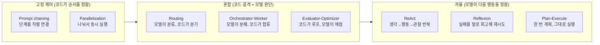
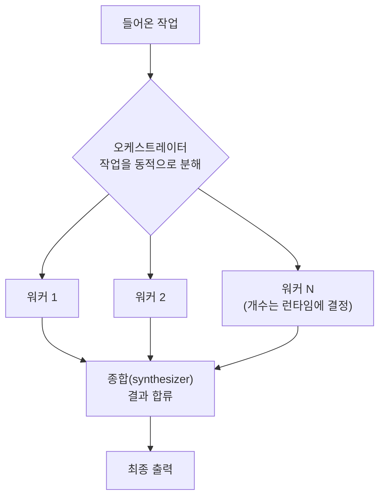
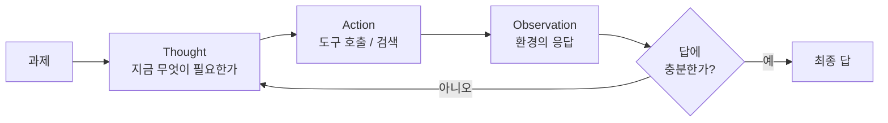
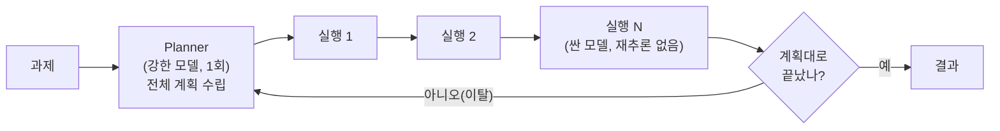

## 0. "에이전트를 만든다"는 말이 가리는 것

에이전트를 한 번 만들어 보면, 막상 결정이 필요한 자리가 모델 고르기가 아니라는 걸 알게 된다. 같은 모델, 같은 도구를 쥐고도 그것들을 어떤 순서로 엮느냐에 따라 결과가 갈린다. 한 작업을 모델의 매 턴 판단에 통째로 맡길 수도 있고, 처음에 계획을 한 번 뽑아 두고 그대로 실행만 시킬 수도 있다. 두 방식은 비용도, 실패하는 방식도 다르다.

이 선택지들에는 이름이 붙어 있다. Anthropic이 2024년 말 공개한 "Building effective agents"는 이걸 두 묶음으로 갈랐다. 하나는 워크플로(workflow): LLM과 도구를 미리 정한 코드 경로로 엮는 방식. 다른 하나는 에이전트(agent): 모델이 다음 행동을 스스로 정하며 도구를 호출하는 방식. 같은 문서가 강조하는 원칙은 단순하다. 단순하게 시작하고, 측정 가능한 이득이 있을 때만 복잡도를 더하라는 것이다.

> **패턴 선택은 "모델에게 얼마만큼의 자율을 줄 것인가"를 정하는 일이다. 고정된 코드 경로는 예측 가능하고 싸지만 경직되고, 자율적 판단은 유연하지만 비싸고 들쭉날쭉하다.**

이 글은 그 워크플로 패턴(Prompt chaining, Routing, Parallelization, Orchestrator-workers, Evaluator-optimizer)과 에이전트 패턴(ReAct, Reflexion, Plan-and-Execute)을 한자리에 모아, 각각이 무엇이고 언제 쓰며 무엇을 내주고 무엇을 얻는지를 정리한다. 마지막에는 이 카탈로그에서 어느 칸을 고를지를 정하는 일이 왜 사람에게 남는지로 수렴한다.

## 1. 두 축으로 보는 지형 — 제어 흐름과 자율성

패턴들을 외우기 전에 좌표축을 먼저 잡는 게 낫다. 모든 패턴은 두 질문에 대한 서로 다른 답이다.

1. **누가 다음 단계를 정하는가** — 코드(고정)인가, 모델(자율)인가.
2. **반복이 있는가** — 한 번 흘러가고 끝나는가, 결과를 보고 다시 도는가.

Prompt chaining은 코드가 순서를 정하고 반복이 없다. ReAct는 모델이 매 단계를 정하고 결과를 보며 계속 돈다. 나머지 패턴은 이 두 극단 사이 어딘가에 박힌다. 이 좌표를 머리에 두면, 새 패턴을 만나도 "아, 이건 라우팅을 모델 자율로 돌리는 변형이구나" 식으로 자리를 잡을 수 있다.



*그림. 제어 흐름이 코드에 고정된 쪽(왼쪽)에서 모델 자율(오른쪽)로 갈수록 유연하지만 예측이 어려워진다. (출처: Anthropic "Building effective agents"의 워크플로/에이전트 구분을 두 축으로 재구성)*

## 2. 워크플로 패턴 — 코드가 골격을 쥔다

워크플로 패턴은 흐름을 코드로 미리 짜 두고, 그 안의 빈칸만 모델이 채운다. 결과가 예측 가능하고 디버깅이 쉽다. Anthropic이 "대부분의 경우 이것으로 충분하다"고 못 박은 쪽이 이쪽이다.

### 2-1. Prompt chaining (프롬프트 직렬 연결)

한 작업을 여러 단계로 쪼개고, 앞 단계의 출력을 뒤 단계의 입력으로 직렬 연결한다. 단계 사이에 코드로 게이트(gate)를 둬서, 조건을 통과 못 하면 멈추거나 되돌린다. "개요를 쓰고 → 개요가 기준을 만족하는지 검사하고 → 통과하면 본문을 쓴다"가 전형이다.

- **언제** — 작업이 깔끔하게 고정된 하위 단계로 쪼개질 때. 각 단계를 작게 만들어 정확도를 올리고 싶을 때.
- **장점** — 단계마다 모델의 부담이 작아 정확도가 오른다. 어느 단계에서 틀렸는지 추적이 쉽다.
- **단점** — 지연(latency)이 단계 수만큼 쌓인다. 분기가 많은 작업에는 안 맞는다.

### 2-2. Routing (라우팅)

입력을 먼저 분류하고, 분류 결과에 따라 서로 다른 처리 경로로 보낸다. 분류는 모델이 하고, 분기는 코드가 한다. 고객 문의를 환불·기술지원·일반문의로 나눠 각기 다른 프롬프트와 도구로 보내는 식이다. 쉬운 질문은 작고 싼 모델로, 어려운 질문만 큰 모델로 보내 비용을 줄이는 용도로도 쓴다.

- **언제** — 입력 유형이 뚜렷이 갈리고, 유형마다 다른 처리가 더 나을 때.
- **장점** — 각 경로를 따로 최적화한다. 한 프롬프트에 모든 경우를 욱여넣을 때보다 깨끗하다.
- **단점** — 분류가 틀리면 그 뒤가 전부 어긋난다. 분류 자체가 또 하나의 실패 지점이다.

### 2-3. Parallelization (병렬화)

한 작업을 동시에 여러 갈래로 돌린다. 두 변형이 있다. **섹셔닝(sectioning)**은 작업을 독립된 조각으로 나눠 동시에 처리하고 합친다(예: 긴 문서를 구간별로 나눠 동시 요약). **투표(voting)**는 같은 작업을 여러 번 돌려 다수결이나 합의로 답을 정한다(예: 코드 취약점을 여러 번 검사해 하나라도 걸리면 플래그).

- **언제** — 하위 작업들이 서로 독립이라 병렬로 돌려도 될 때. 또는 여러 번 시도해 신뢰도를 올리고 싶을 때.
- **장점** — 지연을 줄인다. 투표는 단일 호출의 변덕을 눌러 준다.
- **단점** — 호출 수만큼 비용이 곱으로 든다. 조각으로 나눌 때 맥락이 잘리면 품질이 떨어진다.

### 2-4. Orchestrator-Workers (오케스트레이터-워커)

중앙의 오케스트레이터 LLM이 작업을 동적으로 쪼개 여러 워커 LLM에 위임하고, 결과를 다시 모은다. Parallelization과 닮았지만 결정적 차이가 있다. 병렬화는 하위 작업이 코드에 미리 정해져 있고, 오케스트레이터-워커는 **하위 작업을 모델이 그때그때 정한다**. 입력에 따라 몇 갈래로 쪼갤지가 달라지는 작업에 쓴다.

- **언제** — 하위 작업을 미리 못 정하고 입력에 따라 갈래 수가 달라질 때. 코드 변경을 여러 파일에 퍼뜨리는 작업이 대표적이다.
- **장점** — 미리 예측 못 한 분해를 모델이 유연하게 한다.
- **단점** — 오케스트레이터의 분해 판단이 틀리면 전체가 흔들린다. 호출 수가 예측 불가라 비용 상한을 잡기 어렵다.



*그림. 오케스트레이터가 작업을 몇 갈래로 쪼갤지는 코드가 아니라 모델이 런타임에 정한다. 이 점이 병렬화와 다르다. (출처: Anthropic "Building effective agents"의 Orchestrator-workers 도식 재구성)*

### 2-5. Evaluator-Optimizer (평가자-최적화자)

한 모델이 답을 만들고(optimizer), 다른 모델이 그 답을 평가해 피드백을 돌려준다(evaluator). 평가가 통과 기준에 닿을 때까지 이 루프를 돈다. 사람이 글을 쓰고 편집자 의견을 받아 고치는 과정을 두 모델로 나눈 구조다. 번역 품질을 채점해 다시 다듬게 하거나, 검색 결과가 충분한지 평가해 더 찾게 하는 데 쓴다.

- **언제** — 명확한 평가 기준이 있고, 반복으로 답이 눈에 띄게 나아질 때. 사람이 피드백을 주면 결과가 좋아지는 작업이면 이 패턴이 맞는다.
- **장점** — 자기 출력을 한 번에 못 맞추는 작업에서 품질을 끌어올린다.
- **단점** — 루프마다 호출이 곱으로 늘어 비용·지연이 커진다. 평가 기준이 모호하면 루프가 헛돈다.

이 패턴은 짧은 의사코드로 골격이 잡힌다. 아래 코드를 보이는 목적은, "루프를 도는 주체가 모델이 아니라 코드"라는 점을 드러내는 것이다. 모델은 생성과 채점만 하고, 멈출지 말지의 결정은 코드가 쥔다.

```python
# evaluator_optimizer.py — 평가 루프의 골격 (의사코드)
def evaluator_optimizer(task, max_rounds=3):
    answer = generate(task)                    # optimizer: 초안 생성
    for _ in range(max_rounds):                # 루프 횟수는 코드가 상한을 건다
        verdict, feedback = evaluate(task, answer)  # evaluator: 채점 + 사유
        if verdict == "PASS":                  # 통과 기준 충족 시 종료
            return answer
        answer = generate(task, revise=feedback)    # 피드백 받아 재생성
    return answer                              # 상한 도달 시 마지막 답 반환
```

`max_rounds`라는 상한, `PASS` 판정으로 빠져나가는 조건은 전부 코드에 박혀 있다. 모델은 그 틀 안에서 채점과 수정을 반복할 뿐이다. 자율 패턴과의 경계가 바로 여기다.

## 3. 에이전트 패턴 — 모델이 다음 행동을 정한다

워크플로가 코드로 흐름을 굳힌다면, 에이전트 패턴은 모델이 매 단계 "다음에 무엇을 할지"를 스스로 정한다. 환경에서 피드백을 받아 계속 돌고, 언제 멈출지도 모델이 판단한다. 유연하지만 호출 수와 비용이 예측하기 어렵고, 잘못 돌면 길을 잃는다.

### 3-1. ReAct (Reasoning + Acting)

ReAct는 모델이 생각(Thought)과 행동(Action)을 번갈아 내고, 행동의 결과를 관찰(Observation)로 받아 다음 생각으로 잇는 패턴이다. Yao 등이 2022년 제안하고 ICLR 2023에 실린 방식으로(arXiv 2210.03629), 생각만 하는 추론(chain-of-thought)과 행동만 하는 도구 호출을 한 루프 안에 합쳤다. 생각이 행동을 이끌고, 행동의 관찰이 다시 생각을 교정한다.

원 논문의 평가가 패턴의 성질을 잘 보여준다. 질문응답(HotpotQA)·사실검증(Fever)에서는 위키피디아 API와 주고받으며 환각과 오류 전파를 줄였고, 텍스트 게임(ALFWorld)과 웹 탐색(WebShop)에서는 모방·강화학습 기반 방법을 각각 절대 성공률 34%, 10% 앞섰다. 단 1~2개의 예시만 주고 얻은 결과다.



*그림. ReAct는 생각→행동→관찰을 답이 충분해질 때까지 반복한다. 루프를 멈출 시점도 모델이 판단한다. (출처: Yao et al., "ReAct" 2022/ICLR 2023의 Thought-Act-Obs 구조 재구성)*

ReAct의 골격도 코드로 보면 짧다. 아래 코드를 보이는 목적은 Evaluator-Optimizer와 무엇이 다른지를 대비시키는 것이다. 여기서는 루프를 빠져나가는 결정(`finish` 행동을 낼지)을 코드가 아니라 모델이 쥔다.

```python
# react_loop.py — ReAct 루프의 골격 (의사코드)
def react(task, tools, max_steps=10):
    history = [task]
    for _ in range(max_steps):                 # 안전용 상한만 코드가 건다
        step = model(history)                  # 모델이 Thought + Action을 생성
        if step.action == "finish":            # 멈출지 말지는 모델의 판단
            return step.answer
        obs = tools[step.action](step.args)    # 행동 실행 → 환경 관찰
        history += [step.thought, step.action, obs]  # 관찰을 history에 누적
    return "max steps reached"                 # 상한 초과 시 종료
```

Evaluator-Optimizer에서는 `PASS`라는 종료 조건이 코드에 있었다. ReAct에서는 `finish`를 낼지를 모델이 매 턴 정한다. 이 한 줄의 차이가 워크플로와 에이전트를 가른다.

### 3-2. Reflexion (언어적 회고로 재시도)

Reflexion은 ReAct가 실패했을 때, 그 실패를 가중치 갱신이 아니라 **말로 회고해** 다음 시도에 반영하는 패턴이다. Shinn 등이 2023년 제안했고(arXiv 2303.11366), 실패한 시도의 피드백 신호를 받아 "무엇이 잘못됐는지"를 언어로 정리해 에피소드 메모리에 쌓고, 다음 시도에 그 회고를 프롬프트에 끼워 같은 실수를 피한다. 학습이라고 부르지만 모델을 재훈련하지 않는다. 회고문을 메모리에 남기는 것이 전부다.

효과는 ReAct 위에 얹었을 때 분명하게 나온다. 논문 보고에 따르면 ReAct 단독 대비 ReAct+Reflexion이 ALFWorld 134개 과제 중 130개를 풀어, 단순한 휴리스틱(환각·비효율 계획 감지)만으로 큰 차이를 냈다.

- **언제** — 한 번에 못 풀고 여러 번 시도하는 게 허용되며, 실패에서 배울 단서가 명확할 때.
- **장점** — 재훈련 없이 시행착오를 누적해 같은 실수를 줄인다.
- **단점** — 시도 횟수만큼 비용이 든다. 회고가 틀린 방향이면 그 오류도 누적된다.

### 3-3. Plan-and-Execute (계획 후 실행)

ReAct는 매 단계마다 모델을 다시 불러 다음 행동을 정한다. Plan-and-Execute는 처음에 **계획 전체를 한 번에** 뽑고(planner), 그 단계들을 차례로 실행만(executor) 한다. 단계마다 다시 추론하지 않는다. 비용 구조가 ReAct와 정반대다. ReAct가 10단계 작업에 10번의 전체 LLM 호출(매번 누적된 맥락까지 같이)을 쓴다면, Plan-and-Execute는 강한 모델로 계획 1번 + 싼 모델로 실행 N번이라, 단계 수가 늘수록 ReAct보다 싸진다.

- **언제** — 단계 순서를 미리 합리적으로 예측할 수 있는, 잘 정의된 다단계 작업(데이터 파이프라인, 정형 보고서 생성 등).
- **장점** — 호출 수가 줄어 비용·지연이 낮다. 계획이 명시적이라 사람이 실행 전에 검토할 수 있다.
- **단점** — 현실이 계획을 벗어나면 약하다. 3단계에서 예상 못 한 결과가 나오면 나머지 계획이 통째로 어긋난다.



*그림. Plan-and-Execute는 계획을 한 번 뽑고 단계를 실행만 한다. 현실이 계획을 벗어나면(이탈) 재계획으로 되돌아간다. (출처: LangChain Plan-and-Execute 구조 및 ReAct 대비 비용 분석 재구성)*

## 4. 한눈 비교표

여덟 패턴을 제어 흐름·반복 여부·적합 상황·상대 비용으로 나란히 둔다. 비용은 같은 작업을 처리할 때의 LLM 호출 수를 기준으로 한 상대값이다.

| 패턴 | 제어 흐름 | 반복 | 적합 상황 | 상대 비용 |
|---|---|---|---|---|
| Prompt chaining | 고정(코드) | 없음 | 단계가 깔끔히 쪼개지는 작업 | 낮음(단계 수만큼) |
| Routing | 혼합(모델 분류+코드 분기) | 없음 | 입력 유형이 뚜렷이 갈릴 때 | 낮음 |
| Parallelization | 고정(코드) | 없음 | 독립 하위작업 동시 처리 / 투표 | 중간(갈래 수 곱) |
| Orchestrator-Workers | 혼합(모델 분해+코드 합류) | 없음(보통) | 하위작업을 미리 못 정할 때 | 중간~높음(가변) |
| Evaluator-Optimizer | 혼합(코드 루프+모델 채점) | 있음(코드가 상한) | 평가 기준 명확, 반복으로 개선 | 중간(루프 수 곱) |
| ReAct | 자율(모델) | 있음(모델이 종료 판단) | 도구를 써 가며 탐색하는 작업 | 높음(단계마다 전체 호출) |
| Reflexion | 자율(모델) | 있음(시도 간 회고) | 재시도 허용, 실패서 배울 단서 | 높음(시도 수 곱) |
| Plan-and-Execute | 자율(계획)+고정(실행) | 없음(이탈 시 재계획) | 순서를 미리 예측 가능한 다단계 | 낮음(계획1+실행N) |

표에서 읽히는 규칙이 하나 있다. 제어 흐름이 코드에 가까울수록 비용이 예측 가능하고 대체로 낮으며, 모델 자율에 가까울수록 유연한 대신 비용 상한이 흐려진다. ReAct가 비싼 건 매 단계가 누적된 맥락을 끌고 전체 호출을 하기 때문이고, Plan-and-Execute가 싼 건 실행 단계에서 재추론을 안 하기 때문이다. 같은 "자율" 칸 안에서도 비용이 갈린다.

## 5. 패턴은 섞어 쓴다

실제 시스템은 한 패턴만 쓰지 않는다. 바깥은 Routing으로 입력을 가르고, 한 경로 안에서 Orchestrator-Workers로 분해하고, 각 워커가 ReAct로 도구를 쓰고, 마지막 출력을 Evaluator-Optimizer로 다듬는 식으로 겹친다. Anthropic 문서가 이 패턴들을 "레고 블록"이라 부르는 이유다. 형제 글에서 다룬 오케스트레이터는 이 블록들을 어느 순서로 끼울지를 런타임에 지휘하는 층이고, 이 글의 패턴 카탈로그는 그 블록의 목록에 해당한다.

겹쳐 쓸 때 핵심은 비용이 곱으로 쌓인다는 점이다. Routing 안에 Evaluator-Optimizer 루프를 넣고, 그 안의 생성기를 ReAct로 돌리면, 한 요청이 수십 번의 LLM 호출로 불어날 수 있다. 그래서 Anthropic의 "단순하게 시작하라"는 원칙이 여기서 다시 걸린다. 패턴을 더하기 전에, 그 복잡도가 측정 가능한 이득을 주는지를 먼저 본다.

## 6. 사람에게 남는 일

이 패턴들은 모두 코드로 구현돼 있고, 코딩 에이전트에게 "이 작업을 Evaluator-Optimizer 루프로 짜라"고 지시하면 골격은 도구가 만든다. 패턴 카탈로그가 정리될수록, 사람이 코드를 짜는 부담은 줄고 사람이 골라야 할 것이 또렷해진다.

남는 결정은 두 가지다. 첫째, **어느 패턴을 고를 것인가.** 이 작업이 단계로 깔끔히 쪼개지면 Prompt chaining이고, 도구를 써 가며 탐색해야 하면 ReAct이며, 순서를 미리 알 수 있으면 Plan-and-Execute다. 작업의 성질을 읽어 패턴을 맞추는 건 모델이 대신 못 한다. 잘못 고르면 ReAct로 충분할 일에 비싼 Orchestrator-Workers를 얹거나, 계획이 자주 어긋나는 작업에 Plan-and-Execute를 박아 매번 재계획으로 헛돈다.

둘째, **고정과 자율의 경계를 어디에 그을 것인가.** 같은 작업도 코드로 굳히면 예측 가능하고 싸지만 경직되고, 모델 자율에 맡기면 유연하지만 비싸고 들쭉날쭉하다. 어디까지 코드로 못 박고 어디부터 모델에 맡길지가 Evaluator-Optimizer의 `max_rounds` 한 줄과 ReAct의 `finish` 판단 사이의 거리다. 그 경계를 긋는 일, 그리고 고른 패턴이 실제로 비용 안에서 답을 내는지 검증하는 일이 사람에게 남는다.

도구가 패턴을 코드로 구현해 주는 시대에 사람이 잘해야 하는 일은, 풀 작업의 성질을 읽어 맞는 패턴을 고르는 능력과, 모델에 얼마만큼의 자율을 줄지의 경계를 긋고 그 결과를 검증하는 능력이다. 무엇을 만들지 정의하고 결과를 검증하는 일이 패턴 선택의 형태로 나타난 것이다.

---

## 출처

- Anthropic, "Building Effective AI Agents", https://www.anthropic.com/research/building-effective-agents
- Anthropic (resources), "Building Effective AI Agents", https://resources.anthropic.com/building-effective-ai-agents
- Yao et al., "ReAct: Synergizing Reasoning and Acting in Language Models" (ICLR 2023), https://arxiv.org/abs/2210.03629
- ReAct project (Google Research), "ReAct: Synergizing Reasoning and Acting in Language Models", https://research.google/blog/react-synergizing-reasoning-and-acting-in-language-models/
- Shinn et al., "Reflexion: Language Agents with Verbal Reinforcement Learning" (2023), https://arxiv.org/abs/2303.11366
- LangChain, "Plan-and-Execute Agents", https://blog.langchain.dev/planning-agents/
- The AI Engineer, "The 4 Single-Agent Patterns: ReAct vs Plan-and-Execute vs ReWOO vs Reflexion", https://theaiengineer.substack.com/p/the-4-single-agent-patterns
- Daniel Davenport (Medium), "Five Agentic Workflow Patterns — Anthropic's framework", https://danieldavenport.medium.com/five-agentic-workflow-patterns-9f03e356d031

*※ 패턴 도식은 위 출처가 제시한 구조를 본 글의 두 축(제어 흐름·자율성) 관점에서 재구성한 것이다. ReAct의 성공률(ALFWorld +34%, WebShop +10%)과 Reflexion의 ALFWorld 130/134는 각 논문이 보고한 수치다. 비용 비교(계획1+실행N vs 단계마다 전체 호출)는 출처가 제시한 호출 수 모델에 따른 상대값으로, 모델·작업에 따라 달라진다.*
