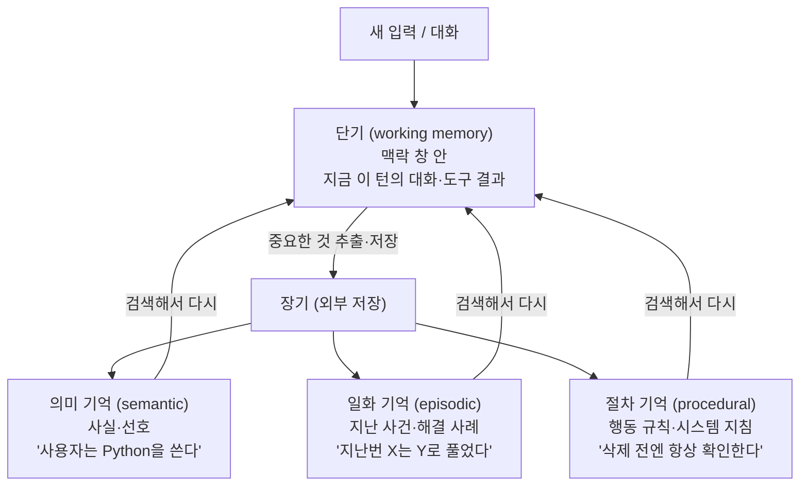

## 0. 잊어버리는 어시스턴트

긴 대화를 나눠 본 사람은 안다. 처음에 알려 준 제약 조건을, 스무 번쯤 주고받고 나면 에이전트가 잊는다. 어제 정해 둔 결정을 오늘 새 세션에서 다시 설명해야 한다. 이건 모델이 멍청해서가 아니라 구조 때문이다. LLM은 맥락 창(context window, 모델이 한 번에 읽을 수 있는 토큰의 범위) 밖을 보지 못한다. 창에 없는 것은 그 모델에게 존재하지 않는다.

그래서 "에이전트 메모리"라는 별도의 문제가 생긴다. 모델 자체는 상태가 없다(stateless). 같은 입력에 같은 출력을 낼 뿐, 지난 대화를 스스로 기억하지 않는다. 우리가 ChatGPT나 Claude가 "기억한다"고 느끼는 건, 매 요청마다 지난 대화를 다시 창에 밀어 넣어 주는 바깥 장치가 있기 때문이다. 그 장치를 어떻게 설계하느냐가 에이전트 메모리다.

창을 키우면 되지 않느냐고 묻고 싶어진다. 2026년 기준 100만 토큰 창을 받는 모델이 흔해졌으니, 다 집어넣으면 되는 것 아닌가. 안 된다. 그 이유부터 봐야 한다.

> **에이전트는 무엇을 기억할지보다 무엇을 잊을지를 더 많이 결정한다. 다 넣으면 느려지고, 틀린다.**

## 1. 왜 다 집어넣을 수 없나 — 맥락 창의 세 가지 한계

긴 맥락을 그냥 쓰지 못하는 이유는 세 가지가 겹쳐 있다.

첫째, **비용과 지연**. 맥락은 매 요청마다 처음부터 다시 읽힌다. 26,000 토큰을 매번 통째로 밀어 넣으면 매번 그만큼의 입력 토큰 요금을 내고, 그만큼 응답이 늦어진다. 뒤에서 볼 Mem0의 측정에서 전체 맥락 방식은 한 질의에 약 26,000 토큰을 쓰고 중앙값 지연이 9.87초였다. 메모리 계층을 끼우면 같은 일을 1,800 토큰, 0.71초에 한다.

둘째, **lost in the middle(가운데 실종)**. 모델의 주의(attention)는 입력의 처음과 끝에 쏠리고 가운데로 갈수록 흐려진다. 여러 연구에서 관련 정보가 맥락 중앙에 놓이면 정확도가 30% 넘게 떨어지는 U자형 곡선이 관찰됐다. 100만 토큰 창이 있어도, 정작 필요한 사실이 그 한가운데 묻히면 모델이 놓친다.

셋째, **context rot(맥락 부패)**. 토큰 수가 늘수록 주의가 희석되고(attention dilution), 의미가 비슷하지만 쓸모없는 내용(distractor)이 정답을 밀어낸다. 창을 채울수록 그 안에서 정답을 꺼내는 능력이 떨어진다. 한 집계에 따르면 2025년 기업용 AI 실패의 약 65%가 다단계 추론 중 맥락 표류나 메모리 손실 때문이었다.

그래서 문제는 "얼마나 많이 담느냐"가 아니라 "지금 이 단계에 필요한 것만 어떻게 골라 담느냐"가 된다. 메모리 설계는 곧 망각 설계다.

## 2. 메모리를 구조로 나누기

에이전트 메모리는 인지과학의 사람 기억 분류를 그대로 빌려 쓴다. 큰 줄기는 단기와 장기이고, 장기는 다시 셋으로 갈린다. 분류 자체보다 각 칸이 실제로 어디에 저장되고 어떻게 불려 오는지가 중요하다.



*그림. 단기 기억은 맥락 창 안에 있고, 거기서 중요한 것을 추려 외부 장기 저장으로 내보낸다. 장기는 의미·일화·절차로 나뉘고, 필요할 때 검색해 다시 창으로 끌어온다.*

- **단기(working memory)**: 맥락 창 안에 들어 있는 것. 지금 이 턴의 대화, 방금 호출한 도구의 결과. 창을 벗어나면 사라진다.
- **장기 — 의미 기억(semantic)**: 시간과 무관한 사실과 선호. "사용자는 태평양 표준시를 쓴다", "예시는 Python으로 달라"처럼 언제 일어난 일인지가 중요하지 않은 지식.
- **장기 — 일화 기억(episodic)**: 특정 시점에 일어난 사건. "지난주에 이 버그를 이렇게 고쳤다." LangMem은 이걸 다음 작업의 few-shot 예시로 쓴다. 비슷한 상황이 오면 과거의 성공 사례를 본보기로 끌어온다.
- **장기 — 절차 기억(procedural)**: 어떻게 행동할지에 대한 규칙. 에이전트가 스스로 갱신하는 시스템 지침에 해당한다. "삭제하기 전엔 항상 확인한다" 같은 규칙을 에이전트가 자기 지침에 적어 넣는 것.

| 구분 | 저장 위치 | 보존 기간 | 예시 | 대표 구현 |
|---|---|---|---|---|
| 단기(working) | 맥락 창 안 | 세션 한정, 창 넘으면 소실 | 지금 턴의 대화·도구 결과 | 모든 LLM 기본 |
| 의미(semantic) | 외부 저장 | 영구 | "사용자는 Python 선호" | Mem0, LangMem |
| 일화(episodic) | 외부 저장 | 영구 | "지난번 X는 Y로 해결" | LangMem, Zep |
| 절차(procedural) | 외부 저장(지침) | 영구, 갱신됨 | "삭제 전 확인" 규칙 | LangMem |

## 3. 무엇으로 저장하고 어떻게 꺼내나

장기 기억을 "외부에 저장한다"고 했는데, 그 외부가 무엇이냐에 따라 검색 방식이 갈린다. 크게 네 가지 방식이 쓰인다.

**벡터 메모리**가 가장 흔하다. 저장할 텍스트를 임베딩(embedding, 문장을 숫자 벡터로 바꾼 것)으로 변환해 벡터 DB에 넣고, 질의가 들어오면 질의도 임베딩해 코사인 유사도가 높은 것을 꺼낸다. 이게 RAG(Retrieval-Augmented Generation)의 검색 부분과 같은 메커니즘이다. 의미가 가까운 기억을 잘 찾지만, "A가 B의 상사다" 같은 관계를 추론하거나 "그 정책은 작년에 바뀌었다" 같은 시간 변화를 다루는 데는 약하다.

**지식그래프 메모리**는 그 약점을 메운다. 기억을 노드(엔티티)와 엣지(관계)로 저장한다. Zep이 이 방식의 대표인데, 노드는 엔티티, 엣지는 관계이고 그래프가 세 층의 하위그래프(일화·의미 엔티티·커뮤니티)로 쌓인다. 관계를 따라가며 추론할 수 있고, 사실이 언제 참이었다가 언제 바뀌었는지를 엣지에 시간으로 기록한다. 이 글의 형제 글에서 다룬 지식그래프·GraphRAG가 메모리에 그대로 들어온 형태다.

**요약 압축**은 저장 방식이라기보다 단기 기억을 다루는 기법이다. 대화가 길어져 창이 찰 것 같으면, 오래된 대화를 통째로 들고 가는 대신 고밀도 요약으로 줄여 그 자리에 넣는다. Anthropic은 이걸 context compaction(맥락 압축)이라 부른다. 맥락 창 내용을 고충실도 요약으로 졸여, 대화가 길어져도 성능 저하를 최소화하며 이어가게 한다.

**슬라이딩 윈도우**는 가장 단순하다. 최근 N개의 메시지만 남기고 오래된 것을 버린다. 구현이 쉽지만 창 밖으로 밀려난 정보는 그냥 사라진다. 그래서 슬라이딩 윈도우는 보통 위의 장기 저장과 함께 쓴다. 최근 대화는 창에, 중요한 사실은 외부 메모리에.

| 방식 | 저장 형태 | 검색 방법 | 강점 | 한계 |
|---|---|---|---|---|
| 벡터 메모리 | 임베딩 벡터 | 유사도 검색 | 의미가 가까운 기억 검색 | 관계·시간 추론 약함 |
| 지식그래프 | 노드+엣지(시간 부착) | 그래프 탐색+의미+시간 융합 | 관계 추론, 시간 변화 추적 | 구축 비용·복잡도 높음 |
| 요약 압축 | 고밀도 요약 텍스트 | (창 안에 직접) | 창 절약, 긴 대화 유지 | 요약 과정에서 디테일 손실 |
| 슬라이딩 윈도우 | 최근 N개 원문 | (창 안에 직접) | 구현 단순 | 밀려난 정보 소실 |

## 4. 실제 시스템들 — 무엇이 다른가

개념만으로는 손에 잡히지 않으니 실제 제품을 본다. 2026년 현재 에이전트 메모리 계층으로 자주 거론되는 네 가지다.

**Letta(예전 이름 MemGPT)**. UC 버클리의 MemGPT 논문이 출발점이다. 핵심 발상은 맥락 창을 운영체제의 가상 메모리처럼 다루는 것. 창은 RAM, 외부 저장은 디스크로 보고 그 사이를 페이징(paging)한다. Letta는 메모리를 세 층으로 둔다. 코어 메모리(core, 창 안에 상주하는 작은 블록 = RAM), 리콜 메모리(recall, 창 밖의 검색 가능한 대화 이력 = 디스크 캐시), 아카이브 메모리(archival, 도구 호출로 질의하는 장기 저장 = 콜드 스토리지). 특징은 에이전트가 자기 메모리를 스스로 관리한다는 점이다. 무엇을 창에 둘지, 무엇을 리콜로 밀어낼지, 무엇을 아카이브할지를 모델이 도구를 호출해 직접 결정한다. 2026년 기준 Letta는 터미널에서 도는 메모리 우선 코딩 에이전트(Letta Code)로 중심을 옮겼고, Terminal-Bench에서 42.5%를 기록했다고 밝힌다.

**Mem0**. 메모리를 별도 인프라 계층으로 떼어내 어떤 LLM에든 붙이는 방향이다. 대화에서 사실을 추출해 저장하고, 질의 때 관련된 것만 골라 넣는다. 강점은 수치로 검증된다. LOCOMO 벤치마크에서 Mem0는 한 질의에 약 1,800 토큰, 중앙값 지연 0.71초를 쓰는데, 전체 맥락 방식(약 26,000 토큰, 9.87초)과 비교해 토큰 90%, p95 지연 91%를 줄였다. 2026년 4월 갱신된 토큰 효율 알고리즘은 LOCOMO에서 92.5점을 내면서 검색 호출당 평균 7,000 토큰 미만을 쓴다고 보고했다. 연구는 ECAI 2025에 실렸다.

**Zep**. 앞서 본 지식그래프 메모리다. 오픈소스 엔진 Graphiti 위에서 시간 인식 동적 지식그래프를 만든다. 벤치마크에서 MemGPT의 DMR(Deep Memory Retrieval) 과제 94.8%(MemGPT 93.4%), 더 현실적인 LongMemEval에서 정확도 최대 18.5% 향상과 응답 지연 90% 감소를 보고했다. 시간이 흐르며 사실이 바뀌는 기업 시나리오에 강점을 둔다.

**LangMem(LangGraph)**. LangChain의 오픈소스 SDK로, 위에서 나눈 의미·일화·절차 세 종류를 하나의 API로 다룬다. 일화 기억을 다음 작업의 few-shot 예시로 쓰고, 절차 기억은 에이전트가 자기 시스템 지침을 갱신하는 형태로 둔다. 저장소는 추상화돼 있어 Pinecone·Weaviate·Redis 같은 벡터 저장소를 어댑터로 갈아 끼울 수 있다.

> **벡터·그래프·요약은 경쟁이 아니라 층이다. Mem0가 사실을 고르고, Zep이 관계와 시간을 잇고, 압축이 창을 비운다.**

## 5. 가장 단순한 벡터 메모리 — 코드로 보기

말로만 보면 추상적이니 가장 단순한 형태를 코드로 만든다. 외부 라이브러리 없이 임베딩과 유사도 검색만으로 "저장하고 꺼내는" 벡터 메모리의 뼈대다. 이 코드를 보이는 목적은, 위에서 말한 "임베딩 후 유사도 검색"이 실제로 몇 줄인지 확인하는 것이다.

```python
# memory/vector_memory.py
import numpy as np

class VectorMemory:
    def __init__(self, embed):
        self.embed = embed          # 텍스트 → 벡터 함수 (임베딩 모델)
        self.items = []             # [(원문, 벡터), ...] 형태로 누적

    def save(self, text):
        # 기억할 문장을 벡터로 바꿔 통째로 저장한다
        self.items.append((text, self.embed(text)))

    def search(self, query, k=3):
        q = self.embed(query)                       # 질의도 같은 공간의 벡터로
        def cos(a, b):                              # 코사인 유사도 = 두 벡터의 방향이 얼마나 같은가
            return a @ b / (np.linalg.norm(a) * np.linalg.norm(b))
        scored = [(cos(q, v), t) for t, v in self.items]
        scored.sort(reverse=True)                   # 유사도 높은 순으로 정렬
        return [t for _, t in scored[:k]]           # 상위 k개 원문만 반환
```

핵심은 `search`다. 모든 기억과 질의를 같은 벡터 공간에 두고 방향이 가장 비슷한 것을 고른다. 실제 제품은 여기에 벡터 DB(수만 건을 빠르게 검색), 메타데이터 필터(시간·사용자별), 중복 제거를 붙이지만 원리는 이 열 줄이다. Mem0가 줄여 주는 토큰은 바로 이 `k`를 작게 유지하면서도 맞는 것을 고르는 데서 나온다. 전부 넣는 대신 상위 3개만 창에 넣으니까.

## 6. 요약 압축 루프 — 창이 차기 전에 졸이기

벡터 메모리가 장기 저장이라면, 다음은 단기 기억이 넘치는 걸 막는 쪽이다. 이 코드를 보이는 목적은 Anthropic이 말한 context compaction이 개념적으로 어떤 루프인지 보이는 것이다.

```python
# memory/compactor.py
def maybe_compact(history, llm, token_count, limit=8000, keep_recent=6):
    # 대화 이력이 한도에 닿을 것 같으면 오래된 부분만 요약으로 대체한다
    if token_count(history) < limit:
        return history                          # 아직 여유 있으면 그대로

    recent = history[-keep_recent:]             # 최근 N턴은 원문 그대로 보존
    old = history[:-keep_recent]                # 오래된 부분만 압축 대상
    summary = llm(                              # LLM에게 고밀도 요약을 시킨다
        "다음 대화에서 이후 작업에 필요한 결정·제약·사실만 "
        "압축해 정리해라. 잡담은 버려라:\n" + render(old)
    )
    # 요약 한 덩이 + 최근 원문으로 새 이력을 구성한다
    return [{"role": "system", "content": "[이전 요약] " + summary}] + recent
```

여기서 사람이 정해야 하는 건 두 가지 숫자와 한 줄의 프롬프트다. 한도(`limit`)를 언제로 잡을지, 최근 몇 턴(`keep_recent`)을 원문으로 남길지, 그리고 무엇을 "버려라"라고 적을지. "잡담은 버려라"라는 한 줄에 무엇이 기억의 진실이고 무엇이 잡음인지에 대한 판단이 들어간다. 이 판단이 틀리면 요약이 정작 중요한 제약을 버린다. 그래서 Anthropic은 압축과 별도로 memory tool을 같이 쓰라고 권한다. 압축이 졸이는 동안 잃으면 안 되는 핵심은 파일로 따로 적어 압축 경계 너머로 넘긴다.

## 7. 무엇을 기억할지 정하는 일은 도구가 안 한다

저장도, 임베딩도, 유사도 검색도, 요약도 도구가 자동으로 한다. Claude Code에게 "이 프로젝트의 결정 사항을 메모리에 남기고 다음 세션에 이어가라"고 하면 절차는 도구가 처리한다. Mem0·Zep·LangMem을 붙이면 추출·저장·검색 파이프라인이 통째로 따라온다. 그럴수록 사람의 일은 파이프라인을 만드는 데서, 그 파이프라인이 무엇을 진실로 남기고 무엇을 잊을지의 기준을 정하는 데로 옮겨간다.

이 글의 코드에서 사람이 손으로 정한 것을 보면 분명하다. `search`의 `k`를 몇으로 둘지(너무 크면 잡음, 너무 작으면 누락), 압축의 `limit`을 언제로 잡을지, "잡담은 버려라"에서 무엇을 잡담으로 칠지. 이건 도구가 묻지 않으면 정해 주지 않는다. 도구는 주어진 기준대로 저장하고 검색하지만, 어떤 사실을 기억의 진실로 삼을지는 기준을 준 사람의 책임이다.

기억의 반대편엔 망각이 있다. 좋은 메모리 시스템은 많이 기억하는 게 아니라 정확히 잊는다. 무엇을 버려도 안전하고 무엇을 버리면 다음 단계가 무너지는지는 그 업무를 아는 사람이 안다. 도구가 대화를 졸이고 벡터를 검색해 주는 시대에 사람에게 남는 일은, 무엇을 기억의 진실로 남기고 무엇을 잊을지의 기준을 정의하는 능력과, 도구가 졸여 낸 요약에서 중요한 사실이 빠지지 않았는지 검증하는 능력이다.

---

## 출처

- Anthropic, "Effective context engineering for AI agents", https://www.anthropic.com/engineering/effective-context-engineering-for-ai-agents
- Anthropic, "Memory tool — Claude API Docs", https://platform.claude.com/docs/en/agents-and-tools/tool-use/memory-tool
- Anthropic, "Context engineering: memory, compaction, and tool clearing (Claude Cookbook)", https://platform.claude.com/cookbook/tool-use-context-engineering-context-engineering-tools
- Mem0, "State of AI Agent Memory 2026: Benchmarks, Architectures & Production Gaps", https://mem0.ai/blog/state-of-ai-agent-memory-2026
- Mem0, "AI Memory Benchmarks 2026: LoCoMo, LongMemEval & BEAM", https://mem0.ai/blog/ai-memory-benchmarks-in-2026
- Mem0, "Research — Token-Efficient Memory Algorithm", https://mem0.ai/research
- Letta, "GitHub — letta-ai/letta: Platform for stateful agents", https://github.com/letta-ai/letta
- Rasmussen et al., "Zep: A Temporal Knowledge Graph Architecture for Agent Memory", arXiv:2501.13956, https://arxiv.org/abs/2501.13956
- Zep, "Zep Is The New State of the Art In Agent Memory", https://blog.getzep.com/state-of-the-art-agent-memory/
- LangChain, "Long-term Memory in LLM Applications (LangMem 개념 가이드)", https://langchain-ai.github.io/langmem/concepts/conceptual_guide/
- LangChain, "LangMem SDK for agent long-term memory", https://www.langchain.com/blog/langmem-sdk-launch
- QubitTool, "Long Context LLMs and the Lost in the Middle Phenomenon Explained (2026)", https://qubittool.com/blog/long-context-lost-in-the-middle

*※ 수치는 위 출처가 제시한 측정값이다. Mem0의 LOCOMO 토큰·지연 수치는 전체 맥락 기준선과의 비교값이며, 모델·설정에 따라 달라진다. Zep의 DMR·LongMemEval 수치는 해당 논문이 보고한 값이다.*
