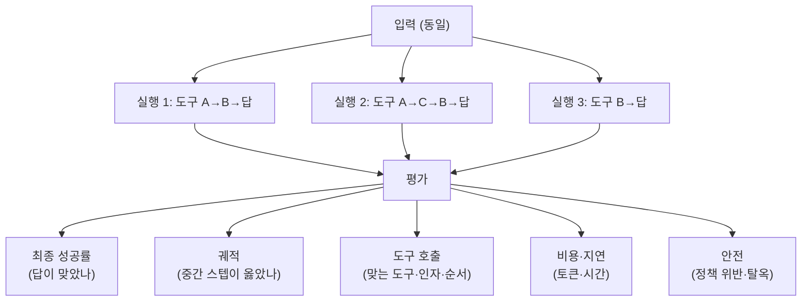

## 0. 단위 테스트가 통하지 않는 시스템

코드에 단위 테스트를 붙이는 일은 익숙하다. 입력을 넣고, 정해진 출력이 나오는지 비교한다. 같은 입력이면 같은 출력이 나오니까 빨강·초록이 명확하다.

에이전트는 이 전제가 깨진다. 같은 질문을 두 번 던지면 두 번 다르게 행동한다. 도구를 부르는 순서가 바뀌고, 중간에 한 번 더 검색하기도 하고, 같은 결론에 다른 경로로 도착한다. LLM 호출에 온도(temperature) 같은 무작위성이 들어가 있고, 여러 스텝·여러 도구 호출이 사슬로 엮여 매 실행이 다른 궤적(trajectory, 에이전트가 목표에 도달하기까지 거친 행동의 연속)을 그린다. 출력 하나를 정답과 문자열 비교하는 방식으로는 잡히지 않는다.

그래서 "정확도 92%"라는 한 숫자는 에이전트에 대해 거의 아무것도 말해주지 않는다. 어떤 92%인가. 최종 답이 맞은 비율인가, 도구를 제대로 부른 비율인가, 같은 작업을 여덟 번 시켜 여덟 번 다 성공한 비율인가. 이 셋은 전혀 다른 수치다.

> **에이전트 평가에서 단일 정확도는 거의 정보가 없다. 최종 성공·궤적·도구 호출·비용·안전을 각각 따로 재야 시스템이 어디서 무너지는지 보인다.**

이 글은 그 "따로 재는 축"이 무엇인지 정리하고, 실제 벤치마크가 그 축들을 어떤 수치로 재는지 카탈로그로 본다. 그다음 운영 중인 에이전트를 들여다보는 관측(observability) 도구와 표준을 보고, 트레이싱 계측과 채점기 코드를 짧게 인용한다. 절차로서의 eval 주도 개발은 [에이전트를 만드는 방법론] 글에서 이미 다뤘으니, 여기서는 "무엇을 어떤 도구로 재는가"의 구체 목록에 집중한다.

## 1. 평가의 다섯 축

에이전트를 재는 축은 크게 다섯이다. 각 축은 잡는 실패의 종류가 다르다.

| 축 | 무엇을 재나 | 놓치면 생기는 일 |
|---|---|---|
| 최종 성공률 | 작업이 끝에 가서 목표를 달성했나 | 표면적으론 OK인데 과정이 위험한 걸 놓침 |
| 궤적 평가 | 거쳐 간 스텝·중간 상태가 옳았나 | 운으로 맞은 답을 실력으로 오인 |
| 도구 호출 정확도 | 맞는 도구를, 맞는 인자로, 맞는 순서에 불렀나 | 잘못된 API를 부르고도 답만 그럴듯 |
| 비용·지연 | 토큰·호출 수·응답 시간이 예산 안인가 | 성능은 좋은데 운영비가 폭발 |
| 안전 | 금지된 행동·정책 위반·탈옥을 했나 | 정답이지만 규정을 어김 |

여기서 가장 비싼 착각은 첫 축만 보는 것이다. τ-bench(시에라가 만든 고객 응대 도구 사용 벤치마크)의 핵심이 바로 이 지점이다. 항공편 예약 작업에서, 맞는 항공편을 잡았더라도 명시된 변경 수수료 정책을 어기면 그 작업은 실패로 친다. "작업 완료"보다 훨씬 높은 기준이고, 실제 기업 배포가 요구하는 기준과 정확히 맞물린다.

reliability를 보려면 한 축이 더 필요하다. Pass@1(한 번 시도해 성공할 확률) 말고 Pass^k(k번 시도해 k번 다 성공할 확률)다. Pass^k = p^k로 지수적으로 떨어진다. Pass@1이 90%인 모델도 k=8이면 0.9^8 ≈ 0.43, 즉 같은 작업을 여덟 번 시키면 전부 성공할 확률은 43%로 주저앉는다. 한 번 잘하는 것과 매번 잘하는 것은 다른 문제다. 운영에 올릴 에이전트라면 후자가 진짜 지표다.



*그림. 같은 입력이라도 매 실행이 다른 궤적을 그린다. 그래서 하나의 결과가 아니라 여러 축으로 나눠 평가해야 한다.*

## 2. 벤치마크를 수치로 — 무엇을 재고, 어디까지 왔나

추상적인 "축" 얘기는 실제 벤치마크에 박아 넣어야 손에 잡힌다. 대표 벤치마크 다섯을 무엇을 재는지·대표 점수와 함께 본다. 점수는 모델·버전·하네스에 따라 출렁이므로, 여기서는 자주 인용되는 값과 그 한계를 같이 적는다.

| 벤치마크 | 도메인 | 재는 것 | 규모 | 대표 수치 |
|---|---|---|---|---|
| τ-bench / τ²-bench | 고객 응대(항공·소매·통신) | 도구 사용 + 정책 준수, 사용자와의 다중 턴 | 항공 50 · 소매 115 · 통신 114 태스크 | 소매 Pass@1 최고 약 86%(Claude Sonnet 4.5), 통신은 같은 모델군도 30~50%대로 급락 |
| SWE-bench Verified | 소프트웨어 공학 | 실제 GitHub 이슈를 푸는 패치 생성 | 사람이 검증한 500개 파이썬 태스크 | 프런티어 모델 약 54~81% 구간 (예: Opus 4.5 약 80.9%) |
| GAIA | 범용 어시스턴트 | 브라우징·파일·코드를 엮는 장기 과제 | 사람 검증 466문항, 난이도 3단계 | 사람 약 92%, 상위 에이전트는 그보다 한참 아래(레벨3에서 특히) |
| WebArena | 웹 내비게이션 | 실제 사이트 복제 환경에서 과제 완수 | 812개 태스크 | 출시 초 약 14% → 2026년 상위 에이전트 70%대, 사람 약 78% |
| AgentBench | 다중 환경 종합 | OS·DB·웹 등 8개 환경에서의 행동 | 8개 환경 | 환경별 편차가 커 단일 종합점수는 오해 소지 |

읽는 법이 점수보다 중요하다. 세 가지를 짚는다.

**도메인이 바뀌면 점수가 무너진다.** τ²-bench에서 같은 모델이 소매·항공에서는 50~70%대를 내다가 통신 도메인에서는 30%대로 급락한다. 통신은 사용자와 에이전트가 둘 다 도구를 부르는 이중 제어(dual-control) 시나리오라 협응이 어렵기 때문이다. "에이전트가 잘한다"는 말은 항상 "어느 도메인에서"가 빠져 있으면 공허하다.

**높은 점수는 오염을 의심해야 한다.** SWE-bench Verified는 500개 태스크가 전부 공개된 파이썬 저장소에서 왔고, 그 저장소들은 모든 모델의 학습 컷오프보다 앞선다. 프런티어 모델이 정답 패치와 이슈 문구를 학습 데이터에서 재현할 수 있다는 우려가 제기됐고, OpenAI는 2026년 2월 오염을 이유로 이 벤치마크를 자사 평가에서 내렸다. 더 엄격한 SWE-bench Pro 같은 변종이 나온 배경이다. 90%대 점수를 자랑하는 리더보드 항목 중 일부는 모델 버전 자체가 확인되지 않거나 오염 논란이 있어, 나는 그런 수치를 이 표에 단정으로 싣지 않았다(미확인).

**종합 점수는 실패를 가린다.** AgentBench처럼 8개 환경을 합산하는 벤치마크에서 종합 70%는 "여섯 환경에서 탄탄하고 두 환경에서 0점"일 수 있다. 합산 한 숫자는 어디가 0점인지를 지운다. 그래서 환경별·도메인별로 풀어서 봐야 한다.

> **벤치마크 점수는 "어느 도메인에서, 어떤 하네스로, 오염 가능성은 어떤가"를 함께 읽지 않으면 숫자에 속는다. 표면 점수가 높을수록 의심을 키운다.**

## 3. LLM-as-judge와 그 함정

정답이 하나로 정해진 항목(SWE-bench의 패치가 테스트를 통과하느냐)은 규칙으로 채점된다. 문제는 "답변이 정중했나", "요약이 충실한가"처럼 정답이 하나가 아닌 항목이다. 사람이 일일이 채점하면 느리고 비싸다. 그래서 다른 LLM에게 채점을 시키는 LLM-as-judge가 표준이 됐다. 빠르고 싸고, 자연어 기준을 그대로 프롬프트로 줄 수 있다.

대신 판정자 LLM은 일관된 방향으로 편향된다. 연구로 반복 확인된 함정이 넷이다.

- **위치 편향(position bias)**: 두 답을 나란히 비교시키면 먼저 제시된 쪽을 선호한다. 완화하려면 순서를 바꿔 두 번 채점하고 평균을 낸다.
- **장황함 편향(verbosity bias)**: 더 길면 더 좋다고 매긴다. 길이가 정보를 더 담지 않아도 그렇다. 이걸 방치하면 모델을 정확하게 만드는 대신 장황하게 만들어 점수를 올리는 우회로가 열린다.
- **자기 선호 편향(self-preference bias)**: 판정 LLM이 자기 계열이 쓴 답에 더 높은 점수를 준다. 완화책은 채점 대상과 최대한 다른 계열의 판정자를 쓰거나, 여러 판정자의 교차 합의를 보는 것이다.
- **기준 미정 시 과신**: 채점 기준(rubric)이 모호하면 판정자는 들쭉날쭉한 엄격함과 근거 없는 확신을 보인다.

이 함정들이 가리키는 결론은 하나다. 채점기 자신을 먼저 채점해야 한다. 사람이 직접 라벨링한 작은 정답 세트(gold set, 15~30개면 시작 가능)에 대해 판정 LLM의 일치율을 재고, 그 일치율이 충분할 때만 CI 게이트로 쓴다. 검증 안 된 채점기를 믿으면, 틀린 자로 잰 점수를 믿게 된다.

## 4. 운영 중인 에이전트를 들여다보기 — 관측

벤치마크는 출시 전 점수다. 운영에 올린 뒤에는 매 요청이 어디서 시간을 쓰고, 어떤 도구를 부르고, 어디서 헛돈을 쓰는지를 봐야 한다. 이게 관측(observability)이고, 단위는 트레이스(trace)와 스팬(span)이다.

용어부터 박는다. **트레이스**는 사용자 요청 하나가 완료될 때까지의 전체 기록이다. 그 안에 **스팬**이 중첩된다. 스팬은 LLM 호출 하나, 도구 호출 하나, 검색 하나 같은 개별 작업 단위다. 각 스팬에 입력·출력·토큰 수·소요 시간·오류가 붙는다. 에이전트가 다섯 스텝을 거쳤다면 트레이스 하나에 스팬이 여러 겹으로 쌓여, 세 번째 도구 호출에서 1.8초가 샜고 그 인자가 틀렸다는 걸 사후에 짚을 수 있다.

대표 도구 넷을 비교한다.

| 도구 | 성격 | 자가 호스팅 | 강점 | 비고 |
|---|---|---|---|---|
| LangSmith | LangChain 네이티브 | 제한적 | LangChain·LangGraph에서 설정 거의 없이 트레이스, LLM-as-judge 평가 워크플로 내장 | 생태계 종속(lock-in) 위험이 가장 큼 |
| Langfuse | 오픈소스·프레임워크 무관 | 가능(Postgres+ClickHouse) | 무료·자가 호스팅, 어떤 SDK든 OpenTelemetry로 수용, 프롬프트 반복에 강함 | 2026년 1월 ClickHouse가 인수(기능은 유지) |
| Arize Phoenix | ML 관측 출신 오픈소스 | 가능 | 충실성·환각·검색 품질 등 평가 메트릭 다수, 궤적 분석·드리프트 탐지 | RAG 검색 평가에 특히 강함 |
| OpenTelemetry GenAI | 표준 규약(도구 아님) | 해당 없음 | 벤더 중립 스키마, 한 번 계측하면 도구를 갈아끼움 | 도구가 아니라 위 도구들이 따르는 공통 약속 |

마지막 줄이 핵심이다. OpenTelemetry GenAI 시맨틱 컨벤션은 도구가 아니라 표준이다. CNCF가 뒷받침하는 공통 스키마로, LLM 호출 스팬에 어떤 속성을 어떤 이름으로 달지를 못 박는다. 예를 들어 `gen_ai.request.model`(요청한 모델명), `gen_ai.operation.name`(작업 종류), `gen_ai.usage.input_tokens`(입력 토큰 수) 같은 속성 이름이 규약으로 정해져 있다. 스팬 이름도 `{gen_ai.operation.name} {gen_ai.request.model}` 형식을 권고한다. 이 규약을 따라 계측해 두면, 관측 도구를 LangSmith에서 Langfuse로 바꿔도 계측 코드를 다시 쓰지 않는다. Datadog·Google Cloud·AWS·Azure가 이 컨벤션을 네이티브로 받는 것도 같은 이유다. 2026년 6월 기준 스키마는 v1.37대다.

## 5. 코드 — 계측 한 줄과 채점기 골격

말로만 하면 멀게 느껴지니 두 가지를 짧게 인용한다. 하나는 트레이싱 계측, 하나는 채점기다. 둘 다 운영 가능한 최소 골격이다.

먼저, 도구 호출 하나를 OpenTelemetry 규약에 맞춰 스팬으로 남기는 코드다. 이걸 보이는 목적은 "관측이 마법이 아니라 작업 단위를 규약 이름의 속성과 함께 기록하는 일"임을 드러내기 위해서다.

`eval/tracing.py`
```python
from opentelemetry import trace

tracer = trace.get_tracer("agent")

def call_tool(name, args, fn):
    # 도구 호출 하나를 스팬으로 감싼다. 트레이스 안에 중첩되어 쌓인다.
    with tracer.start_as_current_span(f"execute_tool {name}") as span:
        # 속성 이름은 OpenTelemetry GenAI 규약을 따른다 — 도구를 갈아끼워도 호환된다.
        span.set_attribute("gen_ai.operation.name", "execute_tool")
        span.set_attribute("gen_ai.tool.name", name)
        span.set_attribute("gen_ai.tool.call.arguments", str(args))
        try:
            result = fn(**args)                       # 실제 도구 실행
            span.set_attribute("gen_ai.tool.call.result", str(result)[:500])
            return result
        except Exception as e:
            span.record_exception(e)                  # 실패도 스팬에 박힌다
            raise
```

다음은 평가 축을 한 번에 거두는 채점기 골격이다. 정답이 정해진 항목은 규칙으로, 품질 항목은 LLM-as-judge로 채점하되, 위치 편향을 줄이려 순서를 바꿔 두 번 부른다. 이 코드를 보이는 목적은 "§1의 다섯 축이 실제로는 따로 계산되어 합쳐진다"는 점을 보이기 위해서다.

`eval/scorer.py`
```python
def score(task, run):
    s = {}
    # ① 최종 성공: 정답이 정해진 항목은 규칙으로 채점
    s["success"] = 1.0 if run.final_answer == task.gold else 0.0
    # ③ 도구 호출: 기대한 도구 집합을 실제로 불렀는지
    called = {c.name for c in run.tool_calls}
    s["tool_recall"] = len(called & task.expected_tools) / len(task.expected_tools)
    # ④ 비용·지연: 트레이스에서 합산해 둔 값
    s["tokens"] = run.total_tokens
    s["latency_ms"] = run.latency_ms
    # 품질 항목은 정답이 하나가 아니므로 LLM-as-judge — 위치 편향 완화로 순서를 바꿔 두 번
    a = judge(task.prompt, run.final_answer, task.reference)
    b = judge(task.prompt, task.reference, run.final_answer)  # 순서 뒤집기
    s["quality"] = (a + b) / 2                         # 평균으로 위치 편향 상쇄
    return s

def pass_k(scores, k=8):
    # Pass^k: k번 다 성공해야 1. 한 번 잘하는 것과 매번 잘하는 것을 구분한다.
    p = sum(s["success"] for s in scores) / len(scores)
    return p ** k
```

`pass_k`의 `k`를 1로 두면 흔한 "한 번 돌려보기"가 되고, 8로 두면 매번 성공하는지를 본다. 한 줄 차이지만 측정 대상이 운에서 일관성으로 바뀐다. `score`가 다섯 축 중 넷(성공·도구·비용·품질)을 한 번에 거둔다. 궤적 평가는 트레이스의 스팬 순서를 기대 순서와 맞춰 보는 별도 단계로, 위 `call_tool`이 남긴 스팬이 그 입력이 된다.

이 코드들의 골격과 OpenTelemetry 속성 이름 매핑은 Claude Code가 생성했다. 나는 다섯 축 중 무엇을 규칙으로 채점하고 무엇을 LLM-as-judge로 넘길지, `k`를 몇으로 둘지, 위치 편향을 순서 뒤집기로 잡을지를 결정했다. 도구는 규약에 맞는 코드를 짜주지만, 무엇을 합격으로 볼지는 묻지 않으면 정해 주지 않는다.

## 6. 사람에게 남는 일

양자화나 컴파일처럼, 계측 코드를 짜고 트레이스를 수집하고 LLM-as-judge 프롬프트를 작성하는 일은 도구가 한다. "이 에이전트에 OpenTelemetry 트레이싱을 붙이고 τ-bench 스타일 채점기를 만들어라"고 지시하면 절차는 Claude Code가 처리한다. 그럴수록 사람의 일은 절차 실행에서 기준을 정하는 결정으로 옮겨간다.

남는 질문은 도구가 답하지 않는 것들이다. 무엇을 합격으로 볼 것인가. 항공편을 잡되 수수료 정책을 어긴 답을 성공으로 칠 것인가, 실패로 칠 것인가. Pass@1로 충분한가, Pass^8을 봐야 하는가. 어떤 실패가 치명적이고 어떤 실패는 감수할 만한가. 채점기를 믿어도 되는지 확인할 gold set에 무엇을 넣을 것인가. 이 결정들이 평가 전체의 합격선을 긋는다.

도구가 비결정적 시스템을 자동으로 계측하고 채점해 주는 시대에 사람에게 남는 일은, 어떤 실패를 잡아야 하는지 정의하고 무엇을 합격으로 볼지 기준을 긋는 능력, 그리고 그 채점기 자신이 믿을 만한지를 검증하는 능력이다. 비결정적 시스템을 믿는다는 것은 매번 같은 답이 나오게 만드는 일이 아니라, 무엇이 합격인지 사람이 먼저 정의해 두는 일이다.

---

## 출처

- Sierra Research, "τ-Bench / τ²-Bench (GitHub)", https://github.com/sierra-research/tau2-bench
- "τ²-Bench: Evaluating Conversational Agents in a Dual-Control Environment" (arXiv:2506.07982), https://arxiv.org/pdf/2506.07982
- Artificial Analysis, "τ²-Bench Telecom Benchmark Leaderboard", https://artificialanalysis.ai/evaluations/tau2-bench
- LLM-Stats, "TAU-bench Retail Leaderboard", https://llm-stats.com/benchmarks/tau-bench-retail
- DemandSphere, "SWE-bench Verified — AI Benchmark Explained", https://www.demandsphere.com/research/demandsphere-radar/ai-frontier-model-tracker/benchmarks/swe-bench/
- LLM-Stats, "SWE-Bench Verified Leaderboard", https://llm-stats.com/benchmarks/swe-bench-verified
- HAL (Princeton), "GAIA Leaderboard", https://hal.cs.princeton.edu/gaia
- Steel.dev, "WebArena benchmark — web navigation agent evaluation", https://leaderboard.steel.dev/registry/benchmarks/webarena/
- "Self-Preference Bias in LLM-as-a-Judge" (arXiv:2410.21819), https://arxiv.org/pdf/2410.21819
- "Justice or Prejudice? Quantifying Biases in LLM-as-a-Judge", https://llm-judge-bias.github.io/
- OpenTelemetry, "Semantic conventions for generative AI spans", https://opentelemetry.io/docs/specs/semconv/gen-ai/gen-ai-spans/
- OpenTelemetry, "Semantic Conventions for GenAI agent and framework spans", https://opentelemetry.io/docs/specs/semconv/gen-ai/gen-ai-agent-spans/
- Langfuse, "Best Phoenix/Arize alternatives", https://langfuse.com/faq/all/best-phoenix-arize-alternatives
- Digital Applied, "Agent Observability: LangSmith, Langfuse, Arize 2026", https://www.digitalapplied.com/blog/agent-observability-platforms-langsmith-langfuse-arize-2026

*※ 벤치마크 점수는 모델·버전·하네스에 따라 변동한다. 본문 수치는 위 출처가 제시한 값 중 비교적 검증 가능한 것을 골랐고, 모델 버전이 불확실하거나 오염 논란이 있는 90%대 상위 리더보드 항목은 단정하지 않고 "미확인"으로 두었다.*
