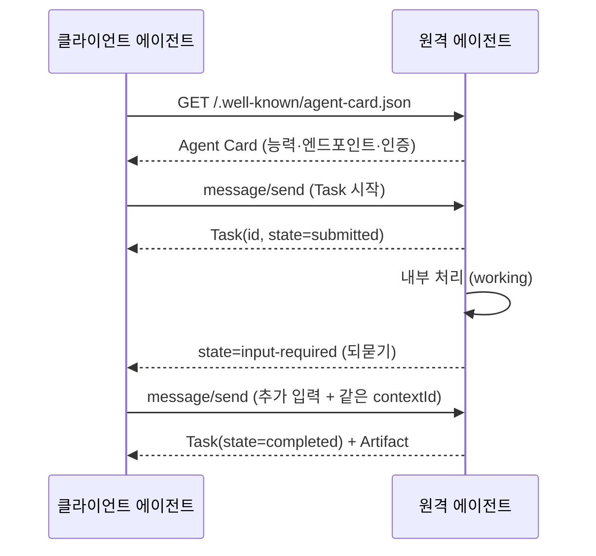
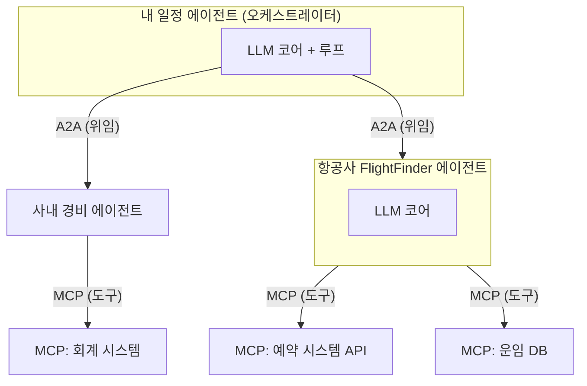

## 0. 한 에이전트가 못 끝내는 일

[MCP](/building-with-ai/mcp-01-protocol-architecture/)는 에이전트가 도구·데이터에 닿는 면을 표준화한다. 에이전트가 사내 위키를 읽고, Postgres를 조회하고, GitHub에 PR을 올리는 일이 전부 MCP 서버 한 규격으로 통일된다. 그런데 MCP로 도구를 아무리 많이 붙여도 못 푸는 문제가 하나 남는다. 일을 끝내려면 내가 만들지 않은 다른 에이전트의 능력이 필요할 때다.

예를 들어 출장 일정을 짜는 에이전트가 있다고 하자. 항공편 검색은 항공사가 만든 에이전트가 제일 잘하고, 비자 요건 판단은 이민 전문 에이전트가, 회계 정산은 사내 경비 에이전트가 맡고 있다. 이 넷은 서로 다른 회사가, 서로 다른 프레임워크([LangGraph](/building-with-ai/agent-01-architecture/)·CrewAI·Google ADK 등)로 만들었다. 내 일정 에이전트가 이들을 MCP 도구처럼 부르려면, 상대 에이전트마다 내부 구현을 열어 보고 전용 연동 코드를 짜야 한다. 에이전트가 M개, 붙이려는 상대가 N개면 다시 M×N 접착 코드가 돌아온다.

A2A(Agent2Agent)는 이 M×N을 푸는 규격이다. 도구를 잇는 게 아니라 에이전트를 에이전트에 잇는다. Google이 2025년 4월 9일 Google Cloud Next에서 발표했고, 2025년 6월 23일 Linux Foundation에 기증해 Agent2Agent Protocol Project로 중립 거버넌스에 넘겼다.

> **MCP는 에이전트↔도구를, A2A는 에이전트↔에이전트를 표준화한다. 둘은 경쟁이 아니라 같은 그림의 가로축과 세로축이다.**

이 글은 A2A가 정확히 무엇을 약속하는지 — Agent Card, Task, 메시지/아티팩트, 전송과 스트리밍, 인증 — 을 스펙 수준에서 들여다보고, MCP와 어떻게 한 시스템에 같이 들어가는지를 본다.

## 1. MCP와 A2A는 무엇이 다른가

둘 다 JSON-RPC 2.0을 메시지 형식으로 쓰고, 둘 다 능력 발견(discovery)과 호출을 표준화한다. 그래서 헷갈리기 쉽지만, 표준화하는 대상이 다르다.

MCP에서 도구는 수동적이다. MCP 서버는 자기가 가진 함수 목록(tools)을 노출하고, 클라이언트가 부르면 그 함수를 실행해 결과를 돌려준다. 서버는 스스로 판단하거나 되묻거나 오래 끄는 작업을 진행하지 않는다. 입력을 받아 출력을 내는 함수다.

A2A에서 상대는 능동적이다. 원격 에이전트는 자기 LLM과 [루프](/building-with-ai/agent-01-architecture/)를 가진 자율 주체다. 일을 받으면 스스로 계획을 세우고, 정보가 모자라면 되묻고, 몇 분에서 몇 시간 걸리는 작업을 비동기로 진행하다 중간 결과를 흘려보낸다. A2A는 이 "에이전트가 다른 에이전트에게 일을 위임하고 그 진행을 추적하는" 상호작용을 규격화한다.

| 구분 | MCP (Model Context Protocol) | A2A (Agent2Agent) |
|---|---|---|
| 잇는 대상 | 에이전트 ↔ 도구·데이터 | 에이전트 ↔ 에이전트 |
| 상대의 성격 | 수동적 함수(tool/resource) | 능동적·자율적 주체 |
| 발견 방식 | 서버의 `tools/list` 등 | `.well-known/agent-card.json` (Agent Card) |
| 작업 단위 | 함수 호출(요청-응답) | Task(상태를 가진 비동기 작업) |
| 되묻기 | 없음 (한 번 호출, 한 번 응답) | 있음 (`input-required` 상태로 추가 입력 요청) |
| 메시지 형식 | JSON-RPC 2.0 | JSON-RPC 2.0 / gRPC / HTTP+JSON |
| 발표·거버넌스 | Anthropic, 2024-11 | Google 발표(2025-04) → Linux Foundation(2025-06) |

핵심 차이는 "되묻기"와 "Task" 행에 있다. MCP 함수는 부르면 끝나지만, A2A의 상대는 일을 받아 들고 며칠 뒤에 끝낼 수도 있고 중간에 "예산 한도가 얼마냐"고 되물을 수도 있다. 이 비대칭성 때문에 A2A는 단순 RPC가 아니라 상태를 가진 작업(stateful task) 모델을 둔다.

## 2. Agent Card — 에이전트의 명함

A2A에서 협업의 출발점은 상대가 무엇을 할 수 있는지 아는 것이다. 이를 위해 모든 A2A 에이전트는 자기 능력을 기계가 읽을 수 있는 JSON으로 공개한다. 이 문서가 Agent Card다.

Agent Card는 관례상 도메인의 well-known URI에 둔다(RFC 8615). 경로는 `/.well-known/agent-card.json`이다. 클라이언트 에이전트는 상대 도메인의 이 주소를 가져오는 것만으로 상대의 엔드포인트·능력·인증 요건을 알아낸다. DNS로 도메인을 찾듯, 이 경로로 에이전트를 찾는다.

아래는 Agent Card의 뼈대다. 목적은 카드 한 장이 담는 정보의 종류를 보이는 것이다. (출처: A2A 공식 스펙 §4.4.1을 단순화)

```json
// /.well-known/agent-card.json — 항공편 검색 에이전트의 명함(예시)
{
  "name": "FlightFinder Agent",
  "description": "항공편 검색과 가격 비교를 수행한다",
  "url": "https://flights.example.com/a2a",   // A2A 요청을 받는 엔드포인트
  "version": "1.2.0",
  "capabilities": {
    "streaming": true,            // SSE 스트리밍 지원 여부
    "pushNotifications": true     // 작업 완료 시 웹훅 알림 지원 여부
  },
  "defaultInputModes": ["text/plain"],          // 받을 수 있는 입력 형식
  "defaultOutputModes": ["text/plain", "application/json"],
  "skills": [                     // 이 에이전트가 가진 구체 능력 목록
    {
      "id": "search-flights",
      "name": "항공편 검색",
      "description": "출발/도착/날짜로 항공편을 찾는다",
      "tags": ["travel", "flights"]
    }
  ],
  "securitySchemes": { /* OAuth2·API Key 등 인증 방식 선언 */ }
}
```

`capabilities`는 이 에이전트가 스트리밍·푸시 알림을 받을 수 있는지를 켜고 끈다. `skills`는 "이 에이전트가 정확히 무슨 일을 하는가"를 단위로 쪼갠 목록이다. 클라이언트는 이 카드를 보고 "내가 찾는 일을 할 수 있는 에이전트인가"를 판단한 뒤 연결한다.

2026년 초 발표된 A2A v1.0.0의 가장 큰 변화가 이 카드와 직접 관련 있다. 서명된 Agent Card(Signed Agent Card)다. 카드에 도메인 소유자의 암호 서명을 붙여, 받는 쪽이 "이 카드가 정말 그 도메인이 발급한 것인지"를 검증할 수 있게 했다. 카드를 위조해 가짜 능력을 주장하는 에이전트를 거르기 위한 장치다.

## 3. Task — 한 번 부르고 끝나지 않는 작업

A2A에서 일의 단위는 함수 호출이 아니라 Task다. Task는 고유 ID를 갖고 상태(state)를 거치며 진행되는, 수명이 긴 작업이다. 클라이언트 에이전트가 메시지를 보내 Task를 시작하면, 원격 에이전트는 그 Task를 자기 쪽에서 들고 진행하면서 상태를 갱신한다.

Task가 거치는 상태는 다음과 같다.

- `submitted` — 작업이 접수됐다.
- `working` — 원격 에이전트가 처리 중이다.
- `input-required` — 진행하려면 클라이언트의 추가 입력이 필요하다(되묻기).
- `completed` — 완료됐다.
- `canceled` / `failed` / `rejected` — 취소·실패·거부.
- `auth-required` — 인증이 더 필요하다.

`input-required`가 MCP에는 없는 상태다. 원격 에이전트가 "예산 상한이 얼마냐"고 되물으면 Task는 이 상태로 멈춰 클라이언트의 답을 기다린다. 클라이언트가 답을 보내면 다시 `working`으로 돌아간다. 사람과 에이전트가 주고받는 대화처럼, 에이전트끼리도 한 작업 안에서 여러 차례 주고받는다.

Task 안에서 주고받는 내용은 두 가지로 나뉜다.

- **Message(메시지)**: 대화의 한 차례(turn)다. `role`이 `user`(요청한 쪽) 또는 `agent`(원격 에이전트)이고, 내용은 하나 이상의 Part로 이뤄진다.
- **Artifact(아티팩트)**: 작업의 산출물이다. 생성된 문서·이미지·구조화된 데이터 같은 결과물이며, 역시 Part들로 구성된다.

Message와 Artifact를 이루는 최소 단위가 Part다. Part는 텍스트(`TextPart`), 파일(`FilePart`), 구조화된 JSON(`DataPart`) 중 하나를 담는다. 즉 한 메시지 안에 텍스트 설명과 첨부 파일과 폼 데이터를 섞어 보낼 수 있다.

아래는 클라이언트가 Task를 시작하는 JSON-RPC 요청과, 원격 에이전트가 결과를 돌려주는 응답의 뼈대다. 목적은 `message/send` 한 번에 무엇이 오가는지를 보이는 것이다.

```json
// 1) 클라이언트 → 원격 에이전트 : 메시지를 보내 Task 시작
{
  "jsonrpc": "2.0",
  "id": 1,
  "method": "message/send",
  "params": {
    "message": {
      "role": "user",                  // 일을 의뢰하는 쪽
      "parts": [
        { "kind": "text", "text": "6월 30일 서울→도쿄 항공편 찾아줘" }
      ],
      "messageId": "msg-001"
    }
  }
}
```

```json
// 2) 원격 에이전트 → 클라이언트 : 완료된 Task와 산출물(artifact) 반환
{
  "jsonrpc": "2.0",
  "id": 1,
  "result": {
    "id": "task-abc123",               // 이후 이 ID로 상태 조회·취소
    "contextId": "ctx-xyz",            // 여러 Task를 한 맥락으로 묶는 키
    "status": { "state": "completed" },
    "artifacts": [                     // 작업 산출물
      {
        "artifactId": "art-1",
        "parts": [
          { "kind": "data", "data": { "flights": [ /* 검색 결과 */ ] } }
        ]
      }
    ]
  }
}
```

응답에 담긴 `id`(Task ID)가 이후 작업의 손잡이다. 작업이 오래 걸리면 클라이언트는 이 ID로 `tasks/get`을 호출해 상태를 확인하거나 `tasks/cancel`로 취소한다. `contextId`는 출장 일정처럼 여러 Task가 한 맥락에 속할 때 그것들을 묶는 키다.

## 4. 전송·스트리밍·푸시 알림

A2A는 통신을 HTTP(S) 위에서 한다. 페이로드 형식은 세 가지 바인딩을 허용한다(스펙 §1.3).

- **JSON-RPC 2.0** — 기본. 위 예시가 이 형식이다.
- **gRPC** — 성능·타입 안전이 필요한 환경용.
- **HTTP+JSON / REST** — 일반 REST 스타일.

작업이 길어질 때를 위해 두 가지 비동기 수단을 둔다.

**스트리밍(SSE)**: 클라이언트가 `message/stream`으로 작업을 시작하면, 원격 에이전트는 단일 응답 대신 Server-Sent Events로 진행 상황을 흘려보낸다. 상태가 `working`으로 바뀌었다는 이벤트, 아티팩트가 일부 생성됐다는 이벤트가 연결이 열려 있는 동안 차례로 도착한다. 긴 보고서를 한 줄씩 받아 보는 식이다.

**푸시 알림(Webhook)**: 몇 시간 걸리는 작업이라 연결을 계속 열어 둘 수 없을 때 쓴다. 클라이언트가 `tasks/pushNotificationConfig/set`으로 "끝나면 이 URL로 알려 달라"고 콜백 주소를 등록해 두면, 원격 에이전트는 작업이 끝났을 때 그 주소로 알림을 보낸다. 클라이언트는 그 시각까지 연결을 붙들 필요가 없다.

인증은 Agent Card의 `securitySchemes`가 선언한 방식(OAuth 2.0·API Key 등)을 따른다. A2A는 자체 인증 체계를 새로 만들지 않고 OpenAPI가 쓰는 표준 보안 스킴을 그대로 빌려, 엔터프라이즈의 기존 인증 인프라에 얹히도록 설계됐다.



*그림. 클라이언트 에이전트가 Agent Card로 상대를 발견하고, Task를 시작한 뒤 되묻기(input-required)를 한 차례 거쳐 산출물을 받기까지의 흐름.*

## 5. MCP와 A2A를 한 시스템에 같이 넣기

둘은 같은 에이전트 안에 동시에 들어간다. Google도 발표 때 A2A를 "Anthropic의 MCP를 보완하는(complements) 프로토콜"로 못 박았다. 한 에이전트는 아래로는 MCP로 도구를 쓰고, 옆으로는 A2A로 다른 에이전트와 협업한다.

앞의 출장 일정 예로 돌아가 보자. 내 일정 에이전트는 항공편 검색을 직접 하지 않는다. A2A로 항공사의 FlightFinder 에이전트에게 위임한다. 그 FlightFinder는 자기 일을 하려고 MCP로 항공사 예약 시스템 API와 운임 데이터베이스를 호출한다. 정산 단계에서는 내 일정 에이전트가 다시 A2A로 사내 경비 에이전트를 부르고, 그 경비 에이전트는 MCP로 회계 시스템에 기록한다.



*그림. 세로 화살표(MCP)는 에이전트가 도구를 쓰는 면, 가로 화살표(A2A)는 에이전트가 다른 에이전트에게 일을 위임하는 면. 한 에이전트가 두 면을 동시에 갖는다.*

여기서 경계가 분명해진다. 한 조직이 통제하는 능력은 MCP 도구로 붙이는 게 단순하다(되묻기·자율 판단이 필요 없으므로). 통제 밖의, 다른 주체가 운영하는 자율 에이전트와 협업할 때 A2A가 필요하다. "도구로 부를 것인가, 에이전트에게 위임할 것인가"는 상대가 수동적 함수인가 능동적 주체인가로 갈린다.

## 6. 거버넌스와 채택 현황

A2A는 2025년 6월 23일 Open Source Summit North America에서 Linux Foundation 산하 프로젝트가 됐다. 창립 멤버는 AWS, Cisco, Google, Microsoft, Salesforce, SAP, ServiceNow다. 특정 벤더가 규격을 통제하지 못하도록 중립 재단에 넘긴 구조다.

2026년 4월 기준(발표 1주년) 지원 조직은 150곳을 넘었다. 위 창립 멤버에 더해 IBM, Workday 등이 이름을 올렸고, AWS·Microsoft·Google의 주요 클라우드 플랫폼에 들어가 엔터프라이즈 프로덕션 사용 사례가 나왔다고 Linux Foundation이 1주년 발표에서 밝혔다. 스펙 버전은 0.1.0 → 0.2.x → 0.3.0을 거쳐 2026년 초 v1.0.0이 정식 릴리스됐다.

다만 이 숫자를 "사실상 표준이 정해졌다"로 읽는 건 이르다. A2A 외에도 에이전트 상호운용 프로토콜은 여럿 제안돼 있고(Agora, ANP 등 학술 제안 포함), 보안 모델은 아직 굳는 중이다. 서명된 Agent Card가 v1.0의 핵심으로 들어온 것 자체가, 위조·신뢰 문제가 풀리지 않은 영역임을 보여준다. 협업 상대가 정말 카드에 적힌 일만 하는지, 위임한 작업을 안전하게 처리하는지는 프로토콜이 자동으로 보장해 주지 않는다.

## 7. 사람에게 남는 일

A2A로 에이전트끼리 일을 주고받는 배선은 도구가 깔아 준다. 코딩 에이전트에게 "이 에이전트를 A2A로 노출하고 Agent Card를 만들어라", "FlightFinder 에이전트에 message/send로 작업을 위임하는 클라이언트를 짜라"고 지시하면 JSON-RPC 호출, SSE 구독, 콜백 등록 같은 절차는 도구가 처리한다.

그럴수록 사람의 일은 코드에서 결정으로 옮겨간다. 어느 외부 에이전트를 신뢰해 일을 위임할지, 그 에이전트의 Agent Card 서명을 검증할지, 위임의 경계를 어디에 그을지 — 예산 상한을 묻는 `input-required`에 자동으로 답하게 둘지 사람이 끼어들게 할지 — 는 묻지 않으면 도구가 정해 주지 않는다. 위임은 통제를 넘기는 일이고, 어디까지 넘길지는 판단의 영역이다.

도구가 에이전트들을 자동으로 연결해 주는 시대에 사람에게 남는 일은, 어느 에이전트를 신뢰해 어떤 작업까지 위임할지 정하는 능력과, 위임한 작업이 경계를 넘지 않고 의도대로 끝났는지 검증하는 능력이다. A2A는 에이전트끼리 말하게 해 주지만, 무엇을 맡길지는 사람이 정한다.

---

## 출처

- A2A 공식 스펙, "Agent2Agent (A2A) Protocol Specification (Latest, v1.0.0)", https://a2a-protocol.org/latest/specification/
- A2A 프로젝트 GitHub, "a2aproject/A2A", https://github.com/a2aproject/A2A
- Google Developers Blog, "Announcing the Agent2Agent Protocol (A2A)" (2025-04-09), https://developers.googleblog.com/en/a2a-a-new-era-of-agent-interoperability/
- Google Developers Blog, "Google Cloud donates A2A to Linux Foundation" (2025-06-23), https://developers.googleblog.com/en/google-cloud-donates-a2a-to-linux-foundation/
- Linux Foundation, "Linux Foundation Launches the Agent2Agent Protocol Project", https://www.linuxfoundation.org/press/linux-foundation-launches-the-agent2agent-protocol-project-to-enable-secure-intelligent-communication-between-ai-agents
- Linux Foundation, "A2A Protocol Surpasses 150 Organizations ... in First Year", https://www.linuxfoundation.org/press/a2a-protocol-surpasses-150-organizations-lands-in-major-cloud-platforms-and-sees-enterprise-production-use-in-first-year
- Google Open Source Blog, "A year of open collaboration: Celebrating the anniversary of A2A" (2026-04), https://opensource.googleblog.com/2026/04/a-year-of-open-collaboration-celebrating-the-anniversary-of-a2a.html
- IBM Think, "What Is Agent2Agent (A2A) Protocol?", https://www.ibm.com/think/topics/agent2agent-protocol
- Stellagent, "A2A Protocol Explained: How Google's Agent-to-Agent Standard Grew to 150+ Organizations in One Year", https://stellagent.ai/insights/a2a-protocol-google-agent-to-agent
