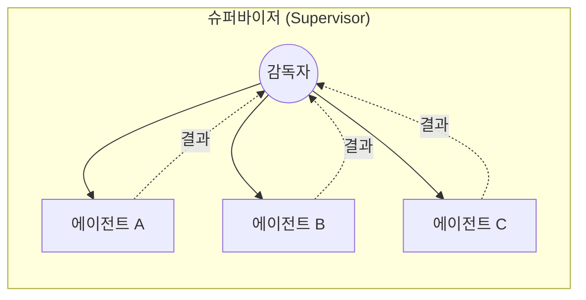
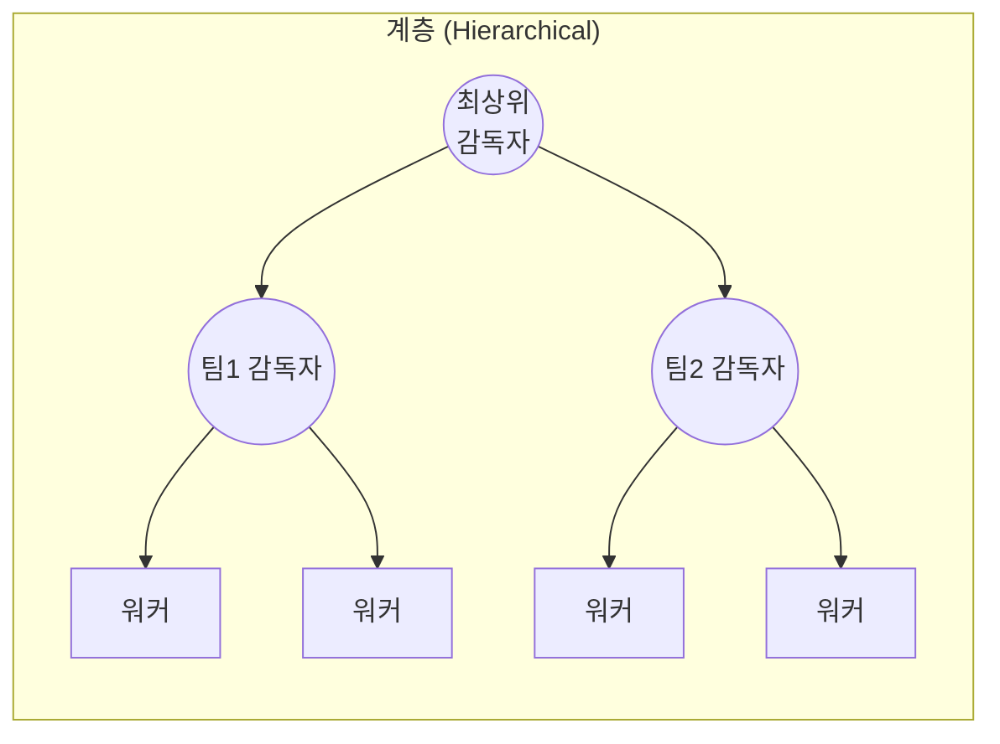
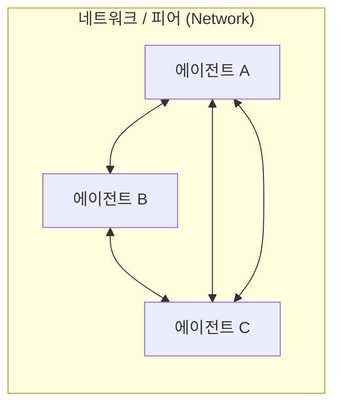
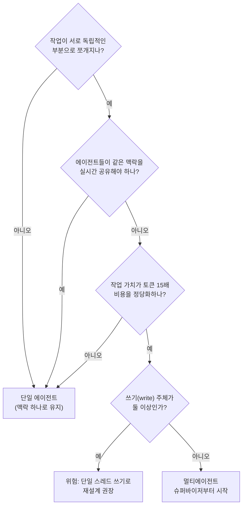

## 0. 에이전트를 하나 더 붙이기 전에

작업이 커지면 "에이전트를 하나 더 붙이면 되지 않나"라는 생각이 든다. 문서를 읽는 에이전트, 코드를 짜는 에이전트, 검토하는 에이전트로 나누면 각자 자기 일에 집중하고 병렬로 돌아 빨라질 것 같다. 실제로 Anthropic의 리서치 시스템은 리드 에이전트와 서브에이전트로 나눠 단일 에이전트를 내부 평가에서 90.2% 앞섰다. 같은 회사의 데이터에서 멀티에이전트는 그만한 대가를 치른다. 채팅 대비 약 15배의 토큰을 쓴다.

쪼개는 결정은 공짜가 아니다. 맥락을 나눈 만큼 에이전트들은 같은 그림을 못 보게 되고, 한쪽이 다른 쪽의 결과를 덮어쓰면 아무 오류 없이 일이 사라진다. 그래서 "에이전트를 여러 개 쓴다"는 말은 거의 정보가 없다. 어떤 토폴로지로 연결했는지, 상태를 어떻게 공유하는지, 누가 멈춤을 결정하는지가 전부다.

> **멀티에이전트는 맥락을 쪼개 병렬·전문화를 얻는 대신 토큰 15배·상태 불일치·오류 전파를 떠안는 거래다. 그 거래가 남는 장사인지부터 따져야 한다.**

이 글은 그 거래를 토폴로지(에이전트들을 어떤 구조로 연결하는가)로 분해하고, 조정 비용이 어디서 새는지를 실제 수치와 프레임워크 용어로 짚는다. 형제 글에서 단일 에이전트의 설계 패턴(ReAct·Plan-and-Execute 등)과 워크플로 5패턴을 다뤘으니, 여기서는 그 위층, 즉 여러 에이전트를 어떻게 묶고 언제 묶지 말아야 하는지에 집중한다.

## 1. 왜 여러 에이전트인가 — 이득과 손해를 같이 적는다

에이전트를 쪼개서 얻는 것과 잃는 것은 짝으로 움직인다. 한쪽만 보면 틀린 결정을 한다.

**얻는 것 1 — 맥락 분리.** 단일 에이전트는 모든 도구 설명, 모든 중간 결과, 모든 지시를 하나의 컨텍스트 창에 쌓는다. 창이 길어질수록 모델은 앞쪽 지시를 흘리고(context rot), 토큰 비용이 선형으로 는다. 서브에이전트를 두면 각자 자기 컨텍스트 창에서 일부만 탐색하고, 중요한 토큰만 압축해 리드에게 돌려준다. Anthropic은 이를 "서브에이전트가 병렬로 각자의 컨텍스트 창에서 질문의 다른 측면을 동시에 탐색한 뒤 가장 중요한 토큰만 리드 에이전트에게 압축해 전달한다"고 설명한다.

**얻는 것 2 — 병렬.** 리서치처럼 방향이 서로 독립적인 작업은 여러 서브에이전트가 동시에 다른 출처를 뒤질 수 있다. 단일 에이전트가 순차로 도구를 호출하는 것보다 벽시계 시간이 짧아진다.

**얻는 것 3 — 전문화.** 코드 작성용 프롬프트와 보안 검토용 프롬프트는 요구하는 사고방식이 다르다. 각 에이전트에 좁은 역할과 도구만 주면 프롬프트가 짧고 또렷해진다.

**잃는 것 1 — 토큰 폭증.** Anthropic 데이터에서 에이전트는 채팅보다 약 4배, 멀티에이전트는 약 15배 토큰을 쓴다. 같은 평가(BrowseComp)에서 성능 변동의 95%를 세 요인이 설명하는데, 그중 토큰 사용량 단독이 80%를 설명한다. 멀티에이전트가 잘 도는 건 상당 부분 "토큰을 더 태우기 때문"이다.

**잃는 것 2 — 조정 비용.** 에이전트끼리 무엇을 주고받을지, 누가 다음에 움직일지, 언제 멈출지를 누군가 정해야 한다. 이 결정 자체가 LLM 호출이고 토큰이다.

**잃는 것 3 — 오류 전파.** A 에이전트의 흐릿한 출력이 B의 컨텍스트에 "사실"로 들어가고, B의 결론이 C로 넘어간다. 한 번 어긋난 가정이 hop마다 증폭된다.

Anthropic은 적용 조건을 못 박는다. "경제적으로 성립하려면, 작업의 가치가 늘어난 성능 비용을 감당할 만큼 높아야 한다. 또한 모든 에이전트가 같은 맥락을 공유해야 하거나 에이전트 간 의존이 많은 도메인은 오늘날 멀티에이전트에 맞지 않는다." 코딩이 대표적 반례로 언급된다. "대부분의 코딩 작업은 리서치보다 진짜 병렬화 가능한 부분이 적고, LLM 에이전트는 아직 실시간으로 서로 조정·위임하는 데 능하지 않다."

## 2. 토폴로지 — 에이전트를 어떤 구조로 연결하는가

멀티에이전트 시스템은 에이전트들의 연결 구조, 즉 토폴로지로 갈린다. LangGraph 문서는 이를 네트워크·슈퍼바이저·계층으로 정리하고, 업계에서 자주 쓰는 분류는 여기에 파이프라인과 디베이트를 더한다. 다섯 가지를 그림으로 먼저 본다.



*그림 1. 슈퍼바이저 토폴로지. 감독자 하나가 누가 다음에 움직일지 정하고, 결과를 받아 다시 라우팅한다. 에이전트끼리는 직접 말하지 않는다.*



*그림 2. 계층 토폴로지. 슈퍼바이저를 여러 층으로 쌓아, 상위 감독자가 하위 감독자에게, 하위 감독자가 워커에게 위임한다. 에이전트 수가 많아 한 감독자가 다 못 쥘 때 쓴다.*



*그림 3. 네트워크(피어) 토폴로지. 중앙 감독자 없이 에이전트가 서로 직접 다음 차례를 넘긴다. 유연하지만 누가 멈출지가 흐려져 가장 통제하기 어렵다.*

파이프라인(Sequential)은 에이전트를 한 줄로 세워 A→B→C로 출력을 넘기는 구조다. 디베이트(Debate)는 여러 에이전트가 같은 문제에 서로 다른 답·비판을 내놓고 합의를 만드는 구조다. 이 둘은 그림보다 표로 비교하는 편이 정확하다.

### 2-1. 다섯 토폴로지 비교

| 토폴로지 | 누가 다음을 정하나 | 조정 비용 | 장점 | 약점 / 위험 | 언제 쓰나 |
|---|---|---|---|---|---|
| 슈퍼바이저 | 중앙 감독자 1명 | 중 (감독자가 매번 라우팅 판단) | 통제·디버깅 쉬움, 종료 조건 명확 | 감독자가 병목, 토큰이 감독자에 몰림 | 전문 워커 몇이 있고 한 오케스트레이터가 지휘 |
| 계층 | 층별 감독자 | 높음 (층마다 호출 누적) | 에이전트 多를 분할 통치 | 층이 깊으면 지연·비용·오류 전파 누적 | 워커가 수십 개라 한 감독자로 안 될 때 |
| 네트워크/피어 | 에이전트끼리 직접 | 가장 높음·예측 불가 | 가장 유연, 동적 협업 | 종료 판단 모호, 무한 핑퐁 위험 | 구조가 사전에 안 잡히는 개방형 협업 |
| 파이프라인 | 코드(고정 순서) | 낮음 | 예측 가능, 싸고 디버깅 쉬움 | 분기·재시도에 약함, 한 단계 실패가 끝까지 | 단계가 정해진 변환·검수 흐름 |
| 디베이트 | 라운드 규칙(코드) | 높음 (n명 × 라운드) | 단일 답의 편향·오류를 교차 검증 | 토큰이 라운드로 곱, 합의 안 될 수 있음 | 정답이 불확실해 교차 검증이 값어치 있을 때 |

실무에서 가장 먼저 손이 가는 건 슈퍼바이저다. 통제와 종료 조건이 명확해서다. 네트워크는 가장 유연하지만 "누가 멈출지"가 흐려져 통제가 가장 어렵다. 파이프라인은 토폴로지 중 가장 싸고 예측 가능하지만, 실은 형제 글에서 다룬 워크플로(Prompt chaining)와 같은 골격이다. 즉 진짜 "에이전트 자율 협업"의 비용은 슈퍼바이저 위에서부터 발생한다.

## 3. 슈퍼바이저를 코드로 — 라우팅이 곧 토큰이다

가장 흔한 슈퍼바이저 토폴로지를 코드로 보면 조정 비용이 어디서 새는지 눈에 보인다. 아래 코드를 보이는 목적은, "누가 다음에 움직일지"라는 결정 자체가 매 턴 LLM 호출 하나라는 점을 드러내는 것이다. 라우팅이 공짜가 아니다.

`supervisor.py`

```python
# 감독자가 매 턴 "다음에 누구를 부를지"를 LLM에게 묻는다.
WORKERS = ["researcher", "coder", "reviewer"]

def supervisor_step(state):
    # state["messages"]에는 지금까지의 모든 워커 출력이 쌓여 있다.
    decision = llm.invoke(                       # ← 호출 1: 라우팅 판단 그 자체가 토큰
        system="너는 감독자다. 다음 워커를 고르거나 FINISH를 반환하라.",
        context=state["messages"],               # 누적 맥락 전체를 다시 읽힘 (비용 누적)
        choices=WORKERS + ["FINISH"],
    )
    if decision == "FINISH":                      # ← 멈춤 결정도 감독자가 쥔다
        return {"next": "END"}
    return {"next": decision}

def worker_step(state, who):
    out = AGENTS[who].invoke(state["messages"])   # ← 호출 2: 워커가 실제 일을 한다
    # 워커 출력을 공용 상태에 append → 다음 감독자 턴이 이걸 또 읽는다
    return {"messages": state["messages"] + [out]}

# 루프: 감독자 → 워커 → 감독자 → … → FINISH
# 워커 한 번 일할 때마다 감독자 호출이 한 번씩 더 붙는다.
```

핵심은 `supervisor_step`이 매 턴 한 번씩 돈다는 점이다. 워커가 세 번 일하면 감독자도 최소 네 번 호출된다. 그리고 감독자는 매번 `state["messages"]`에 쌓인 누적 맥락을 통째로 다시 읽는다. 워커가 늘수록, 턴이 길어질수록 감독자가 읽는 토큰이 눈덩이로 분다. 멀티에이전트가 15배 토큰을 쓰는 이유의 큰 부분이 이 "조정 오버헤드"다.

LangGraph로 옮기면 이 골격이 그래프의 노드와 엣지로 그대로 표현된다. 아래 코드를 보이는 목적은, 토폴로지가 코드 구조에 1:1로 드러난다는 점을 보이는 것이다.

`graph.py`

```python
from langgraph.graph import StateGraph, START, END

builder = StateGraph(State)
builder.add_node("supervisor", supervisor_step)   # 감독자 노드
for w in WORKERS:
    builder.add_node(w, lambda s, w=w: worker_step(s, w))
    builder.add_edge(w, "supervisor")             # 워커는 끝나면 무조건 감독자로 복귀

builder.add_edge(START, "supervisor")
# 감독자의 출력(next)에 따라 워커로 분기하거나 종료
builder.add_conditional_edges(
    "supervisor",
    lambda s: s["next"],
    {**{w: w for w in WORKERS}, "END": END},      # ← 종료 엣지가 그래프에 명시됨
)
graph = builder.compile()
```

워커가 끝나면 항상 감독자로 돌아오는 엣지(`add_edge(w, "supervisor")`)와, 감독자만이 `END`로 가는 조건부 엣지가 슈퍼바이저 토폴로지의 정의 그 자체다. 네트워크 토폴로지로 바꾸려면 워커끼리 직접 잇는 엣지를 추가하면 되는데, 그 순간 "누가 `END`로 가는가"가 그래프에서 흐려진다. 토폴로지를 고른다는 건 이 종료 엣지를 어디에 둘지를 정하는 일이다.

## 4. 프레임워크는 토폴로지를 어떻게 강제하나

같은 멀티에이전트라도 프레임워크마다 미는 토폴로지와 추상화가 다르다. 도구를 고르는 건 토폴로지를 고르는 일과 거의 같다.

| 프레임워크 | 핵심 추상화 | 기본으로 미는 토폴로지 | 상태 공유 | 특징 / 2026 현황 |
|---|---|---|---|---|
| LangGraph | 그래프(노드·엣지·상태) | 임의 (슈퍼바이저·계층·네트워크 모두 그래프로) | 명시적 공용 State + 체크포인트 | 상태형 프로덕션 워크플로의 기본. 종료·분기를 엣지로 못 박음 |
| CrewAI | 역할(Crew·Agent·Task) | 슈퍼바이저/파이프라인(Process) | Task 출력 전달 | 프로토타입까지 가장 빠름. 장기 실행 체크포인트·세밀한 통신 제어는 약함 |
| AutoGen / AG2 | 대화하는 에이전트(GroupChat) | 네트워크/디베이트(대화 기반) | 대화 이력 공유 | AutoGen은 MS가 유지보수 모드 전환, AG2가 커뮤니티 후속. 이벤트 기반·타입드 툴 추가 |
| OpenAI Agents SDK | Agent + Handoff | 슈퍼바이저(handoff로 위임) | 핸드오프 시 맥락 전달 | GPT 중심 워크플로에 마찰 가장 적음. 서브에이전트·샌드박스 툴 지원 |
| Microsoft Agent Framework | 통합 SDK | 다양 (AutoGen+Semantic Kernel 통합) | 프레임워크 관리 | MS가 AutoGen과 Semantic Kernel을 합쳐 GA. .NET·Azure 네이티브에 적합 |

읽는 법은 이렇다. CrewAI는 "역할을 적으면 크루가 굴러간다"는 추상화라 프로토타입이 빠르지만, 통신·종료를 세밀히 제어하긴 어렵다. LangGraph는 그래프를 직접 그리게 해 통제가 강한 대신 손이 많이 간다. AutoGen/AG2는 에이전트들이 그룹챗에서 대화하는 모델이라 디베이트·네트워크에 자연스럽다. 어느 도구든 2026 기준 MCP 지원은 기본값처럼 되었다. 도구의 차이는 "기능 유무"보다 "어떤 토폴로지를 쉽게/어렵게 만드는가"에 있다.

## 5. 조정이 어려운 진짜 이유 — 멀티에이전트가 독이 될 때

멀티에이전트가 단일보다 나빠지는 경우가 분명히 있다. 원인은 대부분 조정의 네 지점에서 터진다.

**상태 공유 실패.** 여러 에이전트가 같은 상태·메모리를 병렬로 읽고 쓰면, A가 상태를 읽어 처리해 "A"를 쓰는 사이 B도 같은 상태를 읽어 "B"를 쓴다. A의 작업이 아무 오류·경고 없이 조용히 사라진다. 분산된 에이전트는 단일 에이전트와 달리 경계를 넘어 상태를 능동적으로 동기화해야 하고, 그 동기화 지점마다 실패가 새로 생긴다.

**충돌하는 가정.** Cognition은 "Don't Build Multi-Agents"에서 멀티에이전트의 핵심 문제로 이걸 짚는다. 서브에이전트들이 처음에 합의되지 않은, 서로 충돌하는 가정 위에서 행동하는 경우가 잦다는 것이다. 리드가 "보고서를 써라"고 막연히 지시하면, 한 서브에이전트는 격식체로, 다른 서브에이전트는 개조식으로 쓰고, 합치면 누더기가 된다. 맥락이 쪼개졌기 때문에 서로의 가정을 모른다.

**누가 멈춤을 결정하나.** 슈퍼바이저는 감독자가 `FINISH`를 쥐지만, 네트워크 토폴로지는 종료 주체가 흐려진다. 에이전트들이 서로에게 차례를 넘기다 같은 작업을 핑퐁하며 토큰만 태우는 무한 루프에 빠질 수 있다. 4절 코드에서 종료 엣지를 그래프에 명시하는 게 사소해 보여도, 실은 가장 중요한 안전장치다.

**평가의 어려움.** 단일 에이전트는 입력→출력이 선형이라 어디서 틀렸는지 짚기 쉽다. 멀티에이전트는 비결정적 경로(매번 다른 라우팅)로 같은 입력에도 다른 궤적을 그려, 실패를 재현하고 책임 지점을 찾기가 어렵다.

Cognition의 처방은 단호하다. 기본값을 단일 스레드 선형 에이전트로 두고, 높은 기준을 통과할 때만 멀티에이전트를 쓰라는 것이다. 원칙은 둘로 요약된다. 결정 사이에 가능한 한 많은 맥락을 공유할 것, 그리고 충돌할 수 있는 방식으로 의사결정을 쪼개지 말 것. 이들은 나중에 입장을 다듬어, "쓰기(write)는 단일 스레드로 유지하고, 추가 에이전트는 행동이 아니라 지능(읽기·판단)을 보태게 할 때 멀티에이전트가 가장 잘 작동한다"고 정리했다.

> **멀티에이전트가 독이 되는 건 거의 항상 맥락이 쪼개진 자리다. 병렬로 쓰는(write) 에이전트가 둘 이상이면 조용히 서로를 덮어쓴다. 쓰기는 단일 스레드로, 늘리는 건 읽기·판단 쪽으로.**

Anthropic과 Cognition은 표면상 반대처럼 보인다. 한쪽은 멀티에이전트로 90.2%를 얻었고, 한쪽은 짓지 말라 한다. 그러나 적용 조건을 보면 같은 선을 긋는다. 방향이 독립적이고(병렬화 가능) 맥락 공유가 적어도 되는 리서치형 작업이면 멀티에이전트가 값을 하고, 모든 에이전트가 같은 맥락을 봐야 하고 서로 의존이 많은 작업(대부분의 코딩 포함)이면 단일이 낫다. 둘 다 "맥락 공유 필요성"을 기준으로 삼는다.

## 6. 그래서 결정 트리는 이렇게 선다

위 조건들을 실제 선택 순서로 세우면 다음과 같다.



*그림 4. 멀티에이전트를 쓸지 정하는 순서. 독립성·맥락공유·비용·쓰기주체 네 관문을 통과해야 멀티로 간다. 하나라도 막히면 단일이 정답이다.*

토폴로지 선택도 비슷하게 좁혀진다. 전문 워커 몇이 있고 한 지휘자가 통제하면 슈퍼바이저, 워커가 수십 개면 계층, 단계가 고정된 변환이면 파이프라인, 정답이 불확실해 교차 검증이 값어치 있으면 디베이트다. 네트워크/피어는 종료 통제가 가장 어려우니 마지막 수단으로 둔다.

## 7. 사람에게 남는 일

토폴로지를 그래프로 짜는 일, 슈퍼바이저 라우팅을 코드로 까는 일, 에이전트 간 핸드오프를 잇는 일은 도구가 자동으로 한다. 코딩 에이전트에게 "researcher·coder·reviewer 세 워커를 슈퍼바이저로 묶고 종료 조건을 달아라"고 지시하면 4절 같은 골격은 도구가 만든다. 그럴수록 사람의 일은 구현에서 결정으로 옮겨간다.

남는 결정은 세 가지다. 첫째, **쪼갤 것인가 말 것인가.** 작업이 독립적으로 병렬화되는지, 에이전트들이 같은 맥락을 실시간 공유해야 하는지, 그 작업 가치가 토큰 15배를 정당화하는지를 읽는 일이다. 셋 중 하나라도 막히면 단일 에이전트가 정답이고, 이 판단은 도구가 대신 못 한다. 둘째, **어떤 토폴로지인가.** 슈퍼바이저로 통제를 쥘지, 계층으로 분할 통치할지, 디베이트로 교차 검증할지를 작업 성질에 맞춰 고른다. 셋째, **조정 경계를 어디에 긋는가.** 누가 멈춤을 결정하는지(종료 엣지를 어디 두는지), 쓰기 주체를 단일 스레드로 묶을지, 어떤 상태를 공유하고 어떤 걸 격리할지가 조용한 덮어쓰기와 무한 루프를 가른다.

도구가 멀티에이전트 골격을 코드로 짜 주는 시대에 사람에게 남는 일은, 작업을 쪼갤지 말지·어떤 토폴로지로 묶을지·조정 경계를 어디 그을지를 정하는 능력과, 그렇게 묶은 시스템이 단일 에이전트보다 실제로 나은지를 토큰과 성능으로 검증하는 능력이다. 무엇을 만들지 정의하고 결과를 검증하는 일이, 멀티에이전트에서는 토폴로지와 조정 경계를 정하는 형태로 나타난다.

---

## 출처

- Anthropic, "How we built our multi-agent research system", https://www.anthropic.com/engineering/multi-agent-research-system
- Cognition (Walden Yan), "Don't Build Multi-Agents", https://cognition.ai/blog/dont-build-multi-agents
- LangGraph, "Multi-agent network" (tutorial), https://langchain-ai.github.io/langgraph/tutorials/multi_agent/multi-agent-collaboration/
- LangChain, "LangGraph Multi-Agent Supervisor" (reference), https://reference.langchain.com/python/langgraph-supervisor
- Towards AI, "A Complete Guide to Multi-Agent Systems in LangGraph: Network to Supervisor and Hierarchical Models", https://towardsai.net/p/l/a-complete-guide-to-multi-agent-systems-in-langgraph-network-to-supervisor-and-hierarchical-models
- DigitalApplied, "Multi-Agent Orchestration: 5 Patterns That Work in 2026", https://www.digitalapplied.com/blog/multi-agent-orchestration-5-patterns-that-work
- QubitTool, "2026 AI Agent Framework Showdown: LangGraph vs CrewAI vs AG2 vs Claude SDK vs Strands vs OpenAI", https://qubittool.com/blog/ai-agent-framework-comparison-2026
- Uvik, "Agentic AI Frameworks 2026: LangGraph vs CrewAI vs OpenAI SDK", https://uvik.net/blog/agentic-ai-frameworks/
- Galileo, "Are Your Multi-Agent Systems Failing for These 7 Reasons?", https://galileo.ai/blog/why-multi-agent-systems-fail
- DEV Community, "Why Multi-Agent AI Systems Fail (And How to Fix It)", https://dev.to/jovansapfioneer/why-multi-agent-ai-systems-fail-and-how-to-fix-it-4enl

*※ 수치는 위 출처가 제시한 값이다. 토큰 15배·90.2%·BrowseComp 변동의 80%는 Anthropic 엔지니어링 글의 자사 평가값이며, 모델·작업에 따라 달라진다. 프레임워크 현황(AutoGen→AG2 유지보수 전환, Microsoft Agent Framework GA 통합)은 2026년 기준 비교 글들에 근거한다.*
