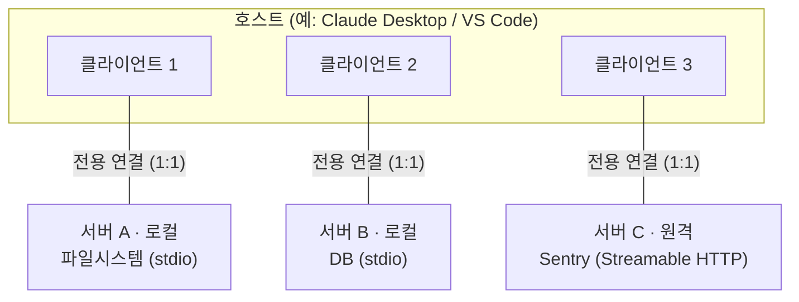
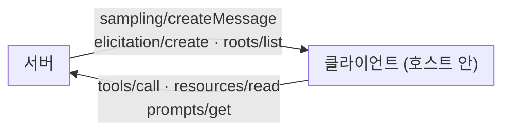

## 0. 통합이 폭발하는 자리

에이전트가 외부 데이터에 닿게 하려고 하면 곧 같은 문제에 부딪힌다. 모델 쪽도 여럿이고(Claude, GPT, Gemini …), 붙이고 싶은 도구·데이터도 여럿이다(사내 위키, Postgres, Slack, GitHub …). 표준이 없으면 이 둘을 잇는 접착 코드를 조합마다 따로 짜야 한다. 모델이 M개, 도구가 N개면 최악의 경우 M×N개의 연동을 손으로 만든다. 도구를 하나 추가하면 모델 수만큼, 모델을 하나 바꾸면 도구 수만큼 코드가 늘어난다.

MCP(Model Context Protocol)는 이 M×N을 M+N으로 바꾸려고 나온 규격이다. 도구 쪽이 "MCP 서버"라는 한 가지 규격으로 자기를 노출하고, 모델 쪽이 "MCP 클라이언트"라는 한 가지 규격으로 그 서버를 부른다. 그러면 새 도구는 서버 1개만 만들면 모든 MCP 호스트가 쓰고, 새 모델은 클라이언트만 맞추면 기존 서버를 전부 쓴다. Anthropic이 2024년 11월 25일에 공개했고, 메시지 형식은 JSON-RPC 2.0을 쓴다.

USB-C에 비유하는 설명을 많이 본다. 기기마다 다르던 충전·데이터 단자를 하나의 물리 규격으로 통일했듯, 모델과 도구를 잇는 연결면을 하나의 인터페이스로 통일한다는 뜻이다. 비유는 여기까지만 맞다. 실제로 MCP가 통일하는 건 단자 모양이 아니라 "어떤 JSON-RPC 메서드로 무엇을 주고받는가"라는 메시지 규약이다. 이 글은 그 규약의 안쪽 — 누가 누구에게 무엇을 보내는지 — 을 끝까지 들여다본다.

> **MCP는 M개 모델 × N개 도구의 연동을 M+N으로 줄이는 약속이다. 줄어드는 건 코드량이고, 통일되는 건 JSON-RPC 메시지 규약이다.**

이 글은 1부다. 프로토콜·아키텍처·프리미티브·전송까지 다룬다. 서버를 직접 만드는 법과 보안·생태계는 2부에서 다룬다.

## 1. 세 주체 — 호스트, 클라이언트, 서버

MCP는 클라이언트-서버 구조다. 다만 주체가 둘이 아니라 셋이다. 이 셋을 정확히 구분하지 않으면 이후 설명이 전부 흐려진다.

- **호스트(Host)**: 사용자가 실제로 마주하는 AI 애플리케이션이다. Claude Desktop, Claude Code, VS Code, Cursor 같은 것. 호스트는 여러 서버에 붙기 위해 그 수만큼 클라이언트를 만들어 관리한다.
- **클라이언트(Client)**: 호스트 안에 들어 있는 연결 담당 부품이다. 핵심은 **서버 하나당 클라이언트 하나**라는 점이다. 클라이언트와 서버는 1:1 전용 연결을 유지한다.
- **서버(Server)**: 도구·데이터·템플릿을 제공하는 프로그램이다. 로컬에서 돌 수도(파일시스템 서버), 원격에서 돌 수도(Sentry 같은 SaaS형 서버) 있다.

호스트가 서버 세 개에 붙으면 호스트 안에 클라이언트 세 개가 생긴다. VS Code가 Sentry 서버에 연결하면 VS Code 런타임이 클라이언트 객체 하나를 만들어 그 연결을 쥐고, 이어서 로컬 파일시스템 서버에 연결하면 클라이언트 객체를 하나 더 만든다. 클라이언트는 서버와 1:1로 묶이는 회선이고, 호스트는 그 회선들을 거느리는 본체다.



*그림. 호스트는 서버 하나당 클라이언트 하나를 만든다. 클라이언트-서버는 1:1 전용 연결이고, 로컬 서버는 stdio, 원격 서버는 Streamable HTTP 전송을 쓴다.*

여기서 자주 헷갈리는 게 "서버"라는 말이다. MCP에서 서버는 위치가 아니라 역할이다. 내 노트북에서 같이 돌아도, 클라우드에 떠 있어도, 컨텍스트를 제공하는 쪽이면 전부 서버다. Claude Desktop이 파일시스템 서버를 실행하면 그 서버는 같은 기계에서 도는 로컬 서버이고, Sentry가 자기 플랫폼에서 운영하는 서버는 원격 서버다. 위치는 전송(transport)이 가르고, 호칭은 역할이 정한다.

## 2. 두 개의 층 — 데이터 층과 전송 층

MCP를 읽을 때 가장 먼저 잡아야 할 분할이 이거다. MCP는 두 층으로 나뉜다.

- **데이터 층(Data layer)**: JSON-RPC 2.0 기반의 메시지 규약이다. 연결 수명 관리(initialize 등), 프리미티브(tools·resources·prompts), 알림(notifications)이 전부 여기 있다. MCP의 의미론이 사는 안쪽 층이다.
- **전송 층(Transport layer)**: 그 JSON-RPC 메시지를 실제로 어떤 통로로 실어 나르는가다. 프로세스 표준입출력으로 보낼지, HTTP로 보낼지, 인증은 어떻게 붙일지를 정한다. 바깥쪽 층이다.

이 분리가 중요한 이유는, 전송이 무엇이든 데이터 층의 JSON-RPC 메시지 형식은 똑같다는 데 있다. 로컬에서 stdio로 보내든 원격에서 HTTP로 보내든, 안에 흐르는 `tools/call` 메시지의 모양은 동일하다. 전송을 바꿔도 서버 로직을 다시 짤 필요가 없다.

## 3. 프리미티브 — 서버가 주는 것, 클라이언트가 주는 것

프리미티브(primitive)는 MCP의 핵심이다. 양쪽이 서로에게 무엇을 제공할 수 있는지를 정의한 기본 단위다. 방향이 두 갈래라는 게 핵심이다. 서버가 클라이언트에 제공하는 것이 셋, 클라이언트가 서버에 제공하는 것이 셋이다.

### 3-1. 서버가 제공하는 셋 — Tools, Resources, Prompts

- **Tools(도구)**: 모델이 호출해 행동을 일으키는 함수다. DB 질의, 파일 쓰기, API 호출 같은 것. 각 도구는 `name`·`description`·`inputSchema`(JSON Schema)를 갖는다. 클라이언트가 `tools/list`로 목록을 받고 `tools/call`로 실행한다. **모델이 주도**한다 — 대화 중 모델이 필요하다고 판단해 부른다.
- **Resources(리소스)**: 모델이나 사용자가 읽을 데이터다. 파일 내용, DB 레코드, API 응답 같은 컨텍스트. `resources/list`로 찾고 `resources/read`로 읽는다. 부수효과가 없는, 읽기 쪽 프리미티브다. **애플리케이션이 주도**하는 성격이 강하다(어떤 리소스를 컨텍스트에 넣을지 호스트가 고른다).
- **Prompts(프롬프트)**: 재사용하는 메시지 템플릿이다. 시스템 프롬프트, few-shot 예시, 정해진 워크플로 같은 것. 리소스·도구 출력을 끼워 넣는 자리를 가질 수 있다. **사용자가 주도**한다 — 슬래시 명령처럼 사용자가 골라서 실행하는 형태로 노출되는 경우가 많다.

세 프리미티브 모두 `*/list`(발견), `*/get` 또는 `*/read`(가져오기), 도구의 경우 `tools/call`(실행) 메서드를 갖는다. 목록을 동적으로 받기 때문에, 서버가 도중에 도구를 추가하면 `notifications/tools/list_changed` 알림으로 클라이언트에 알리고 클라이언트가 목록을 다시 받는다.

### 3-2. 클라이언트가 제공하는 셋 — Sampling, Roots, Elicitation

방향이 반대인 프리미티브가 있다. 서버가 클라이언트에게 요청하는 것들이다. 이게 MCP를 단순 도구 호출 규격 이상으로 만든다.

- **Sampling(샘플링)**: 서버가 클라이언트에게 LLM 추론을 요청한다(`sampling/createMessage`). 서버 안에서 "이 텍스트를 요약해 줘" 같은 모델 호출이 필요할 때, 서버가 자기 안에 LLM SDK를 넣지 않고 호스트의 모델을 빌려 쓴다. 서버가 모델 독립적으로 남을 수 있다. 보안상 사용자가 이 요청을 승인하도록 설계하는 게 원칙이다(서버가 사용자 동의 없이 호스트 모델을 마음대로 돌리지 못하게).
- **Roots(루트)**: 서버가 접근해도 되는 파일시스템·URI 경계를 클라이언트가 알려준다. "이 디렉터리 안에서만 작업하라"는 범위 선언이다. 서버는 이 경계를 기준으로 자기가 다룰 수 있는 파일 범위를 판단한다.
- **Elicitation(일리시테이션)**: 서버가 사용자에게 추가 입력을 요청한다(`elicitation/create`). 작업 도중 빠진 값을 묻거나, 위험한 행동 전에 확인을 받는다. 클라이언트의 UI를 통해 사용자에게 질문이 가고, 답이 서버로 돌아온다.

Sampling·Elicitation·Roots는 모두 **서버가 시작하는** 요청이라는 공통점이 있다. 데이터를 주는 쪽이 서버라고만 생각하면 이 셋을 놓친다. MCP의 연결은 양방향이다 — 클라이언트가 서버의 도구를 부르기도 하고, 서버가 클라이언트의 모델·사용자·파일 경계를 부르기도 한다.

| 프리미티브 | 제공 방향 | 무엇인가 | 주 메서드 | 누가 주도 |
|---|---|---|---|---|
| Tools | 서버 → 클라이언트 | 모델이 부르는 함수 | `tools/list`·`tools/call` | 모델 |
| Resources | 서버 → 클라이언트 | 읽을 컨텍스트 데이터 | `resources/list`·`resources/read` | 애플리케이션 |
| Prompts | 서버 → 클라이언트 | 재사용 템플릿 | `prompts/list`·`prompts/get` | 사용자 |
| Sampling | 클라이언트 → 서버 | 서버가 LLM 추론 요청 | `sampling/createMessage` | 서버 |
| Roots | 클라이언트 → 서버 | 접근 가능한 경로 경계 | `roots/list` | 서버(요청)·클라이언트(응답) |
| Elicitation | 클라이언트 → 서버 | 서버가 사용자에게 추가 입력 요청 | `elicitation/create` | 서버 |



*그림. 프리미티브는 양방향이다. 클라이언트는 서버의 Tools·Resources·Prompts를 부르고, 서버는 클라이언트의 Sampling·Elicitation·Roots를 부른다.*

## 4. 전송 — stdio, HTTP+SSE, Streamable HTTP

데이터 층의 JSON-RPC 메시지를 실제로 나르는 통로가 전송이다. MCP 현행 스펙이 정의하는 표준 전송은 둘이다. 여기에 폐기된 전송 하나가 역사로 남아 있다.

- **stdio(표준 입출력)**: 로컬 프로세스용이다. 호스트가 서버를 자식 프로세스로 띄우고, 클라이언트가 그 프로세스의 stdin에 JSON-RPC 메시지를 쓰면 서버가 stdout으로 답한다. 네트워크를 거치지 않아 지연이 없고 인증 복잡도가 없다. 내 기계 안의 파일시스템·로컬 DB 서버에 쓴다.
- **HTTP+SSE(구버전, 폐기)**: 2024-11-05 최초 스펙이 쓰던 원격 전송이다. POST용 엔드포인트와 SSE(Server-Sent Events) 스트림용 엔드포인트를 따로 두는 두-엔드포인트 방식이었다. 2025-03-26 스펙에서 폐기됐다. 구형 클라이언트 호환을 위해 서버가 병행 운영할 수는 있다.
- **Streamable HTTP(현행 원격 전송)**: 2025-03-26 스펙에서 도입된 현행 원격 전송이다. 단일 엔드포인트로 합쳤고, SSE를 선택적으로 만들었다. 클라이언트→서버는 HTTP POST로 보내고, 서버는 스트리밍이 필요하면 그 응답을 SSE로 흘리고 아니면 평범한 HTTP 응답 한 번으로 끝낸다. 베어러 토큰·API 키·커스텀 헤더 같은 표준 HTTP 인증을 쓰며, 스펙은 인증 토큰을 OAuth로 받기를 권한다. 원격 서버는 보통 다수 클라이언트를 동시에 받는다.

| 전송 | 위치 | 통로 | 도입/상태 | 언제 쓰나 |
|---|---|---|---|---|
| stdio | 로컬 | 프로세스 stdin/stdout | 최초부터 표준 | 내 기계 안 서버(파일·로컬 DB) |
| HTTP+SSE | 원격 | POST + 별도 SSE 엔드포인트(2개) | 2024-11-05 도입, 2025-03-26 폐기 | 신규 채택 비권장(호환용) |
| Streamable HTTP | 원격 | 단일 엔드포인트, SSE 선택적 | 2025-03-26 도입(현행) | 원격·SaaS형 서버 |

전송이 무엇이든 안에 흐르는 JSON-RPC 메시지는 같다는 점을 다시 짚는다. stdio로 돌던 로컬 서버를 원격으로 옮길 때 전송 설정만 바꾸면 되고, `tools/call` 같은 데이터 층 메시지는 손대지 않는다.

## 5. 라이프사이클 — initialize 핸드셰이크

MCP는 상태가 있는(stateful) 프로토콜이다. 연결을 열 때 클라이언트와 서버가 서로 무엇을 지원하는지 먼저 맞춘다. 이걸 capability negotiation(능력 협상)이라 한다. 순서는 이렇다.

클라이언트가 `initialize` 요청을 보낸다. 자기가 쓰는 프로토콜 버전과 자기가 지원하는 능력(capabilities)을 적는다. 이 코드를 보이는 목적은 핸드셰이크의 실제 메시지 모양을 확인하기 위해서다.

```json
{
  "jsonrpc": "2.0",
  "id": 1,
  "method": "initialize",
  "params": {
    "protocolVersion": "2025-06-18",
    "capabilities": { "elicitation": {} },
    "clientInfo": { "name": "example-client", "version": "1.0.0" }
  }
}
```

`"elicitation": {}` 는 이 클라이언트가 서버의 elicitation 요청을 받을 수 있다는 선언이다. 서버는 같은 방식으로 자기 능력을 응답에 적는다.

```json
{
  "jsonrpc": "2.0",
  "id": 1,
  "result": {
    "protocolVersion": "2025-06-18",
    "capabilities": {
      "tools": { "listChanged": true },
      "resources": {}
    },
    "serverInfo": { "name": "example-server", "version": "1.0.0" }
  }
}
```

`"tools": {"listChanged": true}` 는 이 서버가 도구를 제공하며 도구 목록이 바뀌면 알림을 보낼 수 있다는 뜻이고, `"resources": {}` 는 리소스도 제공한다는 뜻이다. 핸드셰이크가 하는 일은 셋이다. (1) 프로토콜 버전을 맞춘다 — 호환 버전을 못 찾으면 연결을 끊는다. (2) 양쪽이 어떤 프리미티브·기능을 지원하는지 선언한다. (3) 이름·버전 같은 신원을 교환한다. 협상이 끝나면 클라이언트가 준비 완료 알림을 보낸다.

```json
{ "jsonrpc": "2.0", "method": "notifications/initialized" }
```

`id` 가 없는 메시지는 JSON-RPC 2.0의 알림(notification)이다 — 응답을 기대하지 않는다. 이 알림 이후부터 클라이언트는 `tools/list`로 도구를 발견하고 `tools/call`로 호출하기 시작한다. 능력을 먼저 협상하기 때문에, 서버가 지원하지 않는 기능을 클라이언트가 헛되이 부르는 일이 없다.

## 6. 버전 — 날짜가 곧 버전이다

MCP 스펙 버전은 날짜로 매긴다. 최초 공개가 2024-11-05, 이어 2025-03-26(Streamable HTTP 도입, HTTP+SSE 폐기), 2025-06-18, 그리고 공개 1주년에 맞춰 나온 **2025-11-25**가 현행 최신이다. 2025-11-25에는 Tasks라는 실험적 프리미티브가 들어왔다. 오래 걸리는 작업을 task로 감싸 비동기로 추적하고, 작업이 끝난 뒤 일정 시간 안에 클라이언트가 상태·결과를 조회하는 구조다. 값비싼 연산·배치·다단계 워크플로를 겨눈 추가다.

> **MCP 버전은 날짜다. 2024-11-05로 시작해 2025-03-26에 원격 전송이 Streamable HTTP로 바뀌었고, 현행은 2025-11-25다. 스펙을 읽을 땐 어느 날짜 버전인지부터 확인한다.**

버전이 빠르게 도는 만큼 글·문서가 가리키는 게 어느 날짜의 스펙인지 보지 않으면 틀린 정보를 집는다. 예컨대 "MCP 원격 전송은 SSE다"는 2024-11-05 기준으로는 맞지만 지금은 틀리다. 현행 원격 전송은 Streamable HTTP다.

## 7. 사람에게 남는 일

MCP가 표준이 된 뒤로, 서버 골격을 짜는 일은 거의 도구가 한다. 코딩 에이전트에게 "이 사내 API를 MCP 서버로 감싸라"고 지시하면 SDK 보일러플레이트·핸들러·initialize 협상까지 자동으로 만든다. JSON-RPC 메시지를 손으로 조립할 일도 없다. 그럴수록 사람의 일은 메시지 조립에서 **무엇을 어떤 프리미티브로 노출할지 정하는 결정**으로 옮겨간다.

이 결정은 자동화가 대신 못 한다. 사내 데이터베이스를 붙일 때, 그 안의 무엇을 모델이 부르는 Tool로 열고(쓰기·삭제까지 줄지), 무엇을 읽기 전용 Resource로 둘지, Roots로 어느 경로까지만 손대게 막을지는 연결면을 설계하는 사람이 정한다. Tool로 연 순간 모델이 그걸 호출해 행동을 일으킬 수 있고, Resource로 둔 데이터는 모델 컨텍스트로 흘러 들어간다. 무엇을 어느 쪽에 두느냐가 곧 권한과 노출 범위의 경계다.

도구가 코드를 대신 짤 때 사람이 잘해야 하는 일은, 무엇을 만들지 정의하는 능력과 도구가 만든 결과를 검증하는 능력이다. MCP에서 그 정의는 "연결면을 어떻게 그을 것인가" — 어떤 데이터·동작을 어떤 프리미티브로 노출하고 어디에 경계를 둘 것인가 — 로 나타난다. 그 경계 설계와, 서버를 안전하게 만들고 운영하는 방법은 2부에서 이어 다룬다.

---

## 출처

- Anthropic, "Introducing the Model Context Protocol", https://www.anthropic.com/news/model-context-protocol
- Model Context Protocol, "Architecture overview", https://modelcontextprotocol.io/docs/learn/architecture
- Model Context Protocol, "Specification (2025-11-25)", https://modelcontextprotocol.io/specification/2025-11-25
- Model Context Protocol Blog, "One Year of MCP: November 2025 Spec Release", https://blog.modelcontextprotocol.io/posts/2025-11-25-first-mcp-anniversary/
- WorkOS, "Understanding MCP features: Tools, Resources, Prompts, Sampling, Roots, and Elicitation", https://workos.com/blog/mcp-features-guide
- ChatForest, "MCP Transports Explained: stdio vs Streamable HTTP (and Why SSE Was Deprecated)", https://chatforest.com/guides/mcp-transports-explained/
- WorkOS, "MCP 2025-11-25 is here: async Tasks, better OAuth, extensions", https://workos.com/blog/mcp-2025-11-25-spec-update
- modelcontextprotocol/registry (공식 MCP 서버 레지스트리), https://github.com/modelcontextprotocol/registry

*※ 스펙 버전은 날짜 표기다(2024-11-05 → 2025-03-26 → 2025-06-18 → 2025-11-25). 본문의 JSON-RPC 예시는 공식 아키텍처 문서의 초기화 예시(protocolVersion "2025-06-18")를 인용한 것이다. Tasks는 2025-11-25에서 실험적(Experimental) 상태다.*
