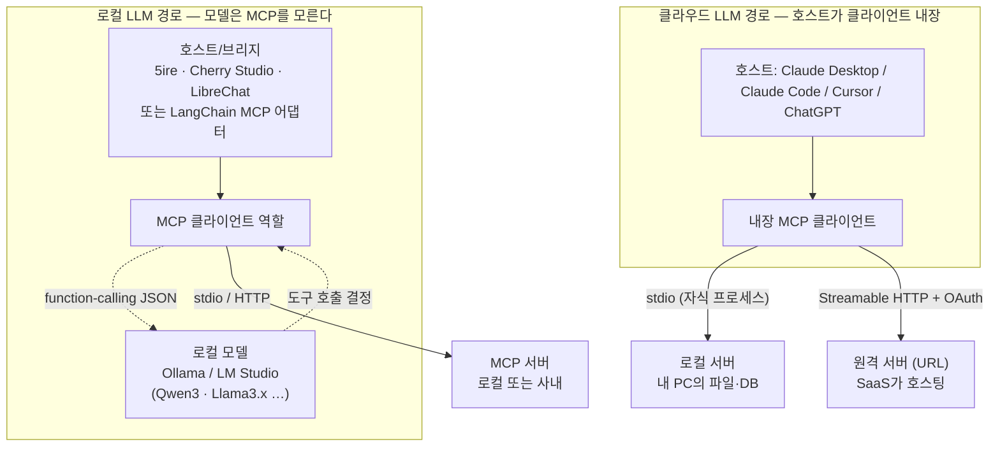
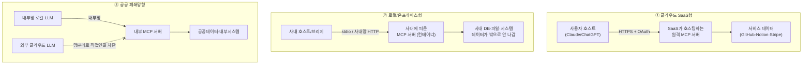

## 0. 써봤지만 안 만들어 본 사람의 질문

[1부](/building-with-ai/mcp-01-protocol-architecture/)는 MCP(Model Context Protocol, AI 모델이 외부 도구·데이터에 접근하는 표준 프로토콜)의 골격을 봤다. 호스트·클라이언트·서버 셋, JSON-RPC 전송, 서버가 노출하는 세 프리미티브(도구·리소스·프롬프트)다. [2부](/building-with-ai/mcp-02-build-and-secure/)는 서버를 직접 만들고, 보안과 생태계를 다뤘다. 그 두 글은 "만드는 사람" 쪽이다.

이 글은 반대편이다. MCP를 써보긴 했는데 만들어 본 적은 없는 실무자의 질문에 답한다. 정리하면 네 가지다.

1. "어떤 서비스에 MCP가 있다"는 게 정확히 무슨 뜻인가.
2. 내가 쓰는 LLM이 클라우드 LLM(Claude·ChatGPT)이냐 로컬 LLM(Ollama로 띄운 모델)이냐에 따라 연결이 어떻게 달라지나.
3. 만드는 일(코딩)과 운영하는 일(인프라)은 뭐가 다른가.
4. 실제로 누가 서버를 어디에 두고 운영하나 — SaaS, 사내 온프레미스, 공공 폐쇄망.

1·2부에서 정의한 개념(프리미티브가 무엇인지, 전송이 왜 둘인지)은 다시 풀지 않는다. 필요하면 위 링크를 본다.

> **MCP에서 사람이 정하는 건 두 가지다. 서버를 어디에 둘지, 그리고 그 서버에 무엇을 노출하고 누구를 연결할지. 코드는 도구가 짜 주지만 이 경계는 사람이 긋는다.**

## 1. "이 서비스에 MCP가 있다"는 말의 뜻

GitHub에 MCP가 있다, Notion에 MCP가 있다는 말을 자주 본다. 이 말은 한 문장으로 풀린다. **그 서비스가 자기 기능을 MCP 서버로 노출했다**는 뜻이다.

지금까지 외부 서비스에 프로그램으로 접근하려면 그 서비스의 REST API를 읽고, 인증 방식을 맞추고, 요청·응답 포맷을 코드로 처리해야 했다. 서비스마다 그 작업을 새로 했다. MCP 서버는 이 작업을 서비스 제공자가 한 번 해서 표준 인터페이스로 내놓은 것이다. GitHub가 "이슈 검색", "PR 조회", "파일 읽기" 같은 기능을 MCP 도구로 정의해 서버로 띄워 두면, 나는 그 서버에 클라이언트를 연결만 하면 된다. GitHub API 문서를 읽을 필요가 없다.

실제 GitHub MCP Server를 예로 들면, 도구를 통째로 주지 않고 용도별로 쪼갰다. 원격 서버는 기능 묶음(toolset)마다 별도 URL을 준다. 그래서 코드 작업만 할 거면 그 toolset URL만, 이슈만 다룰 거면 또 다른 URL만 연결한다. URL 끝에 `/readonly`를 붙이면 그 묶음에서 읽기 도구만 남고 쓰기 도구가 전부 비활성화된다. 읽기 전용 모드는 다른 설정보다 우선하는 강제 필터라, 쓰기를 명시적으로 요청해도 막힌다. 2025년 12월에는 `X-MCP-Tools` 헤더로 개별 도구 단위까지 켜고 끄는 기능이 추가됐다.

여기서 사용자가 하는 일은 명확하다. 서버를 만드는 게 아니라 **어떤 서버에 붙고, 그 서버에서 어디까지 권한을 열지 고르는 일**이다. 코드 toolset만 읽기 전용으로 붙일지, 이슈까지 쓰기 권한으로 열지가 사용자의 결정이다.

## 2. 내 LLM은 어떻게 MCP에 연결되나

이게 가장 헷갈리는 지점이다. "MCP 서버에 LLM을 연결한다"고 하지만, 정확히는 LLM이 직접 서버에 붙는 게 아니다. 1부에서 본 대로 서버에 붙는 건 **클라이언트**이고, 클라이언트는 **호스트** 안에 들어 있다. LLM은 그 호스트가 부리는 모델일 뿐이다. 그래서 질문은 둘로 갈린다. 내 호스트가 MCP 클라이언트를 내장했는가, 그리고 서버는 내 PC에서 도는가 원격에 있는가.

### 2-1. 두 전송: 로컬 stdio와 원격 Streamable HTTP

서버가 어디서 도느냐는 1부에서 본 두 전송으로 갈린다.

- **로컬 stdio**: 호스트가 서버 프로그램을 같은 머신에서 자식 프로세스로 직접 실행한다. 둘은 표준 입출력(stdin/stdout)으로 JSON-RPC 메시지를 주고받는다. 세션은 그 프로세스가 사는 동안만 존재한다. 내 PC의 파일·DB를 다루는 서버가 여기 해당한다. 네트워크를 안 타니 인증이 단순하고, 데이터가 밖으로 안 나간다.
- **원격 Streamable HTTP**: 서버가 URL로 호스팅되고, 클라이언트가 그 주소에 HTTP로 접속한다. 하나의 엔드포인트가 POST와 GET을 받고, 길게 끄는 응답은 SSE(Server-Sent Events, 서버가 클라이언트로 이벤트를 흘려보내는 단방향 스트림)로 흘린다. 초기화 때 서버가 `Mcp-Session-Id`를 발급해 세션을 명시한다. SaaS가 호스팅하는 서버, 사내망 HTTP 서버가 여기다.

핵심 차이는 세션과 상태다. stdio는 프로세스 수명이 곧 세션이라 한 PC 한 사용자에 묶인다. 원격 HTTP는 세션을 헤더로 명시하므로 여러 사용자가 동시에 붙는다. 게다가 Streamable HTTP는 무상태(stateless)로도 돌 수 있어서, 매 요청을 독립으로 처리하면 서버 인스턴스를 여러 개 띄워 로드밸런서 뒤에 두고 어느 인스턴스가 받아도 된다. Cloud Run·Lambda 같은 서버리스에 올리기 좋은 형태다. stdio 서버는 이게 안 된다. 그래서 "여러 사람이 쓰는 서비스를 MCP로 노출"하려면 사실상 원격 HTTP + 무상태 설계로 간다.


*그림. 클라우드 LLM은 호스트가 MCP 클라이언트를 내장해 서버에 바로 붙는다. 로컬 LLM은 모델 자체가 MCP를 모르므로, 중간의 호스트/브리지가 클라이언트 역할을 맡아 도구를 function-calling으로 모델에 물린다.*

### 2-2. 클라우드 LLM 쪽: 호스트가 클라이언트를 내장

Claude·ChatGPT 같은 범용 클라우드 LLM을 쓸 때는 대개 클라이언트를 신경 쓸 일이 없다. Claude Desktop, Claude Code, Cursor, ChatGPT 데스크톱 같은 호스트가 MCP 클라이언트를 이미 내장하고 있기 때문이다. 사용자는 그 호스트 설정에 서버를 등록만 한다.

2부에서 본 로컬 서버 등록(`command`·`args`로 stdio 프로세스를 띄우는 방식)과 달리, 원격 SaaS 서버는 URL과 인증으로 등록한다. 형태는 이렇다.

```json
// 호스트 설정에 원격 MCP 서버를 등록하는 예 (개념 형태)
{
  "mcpServers": {
    "github": {
      "type": "http",
      "url": "https://api.githubcopilot.com/mcp/",
      "headers": { "Authorization": "Bearer <OAuth로 받은 토큰>" }
    }
  }
}
```

여기서 사람이 한 일은 URL을 적고 인증을 거는 것뿐이다. 토큰 발급·검증의 실제 흐름은 2부 2절에서 본 OAuth 2.1이다. Claude Desktop의 커넥터 UI처럼 "연결" 버튼 한 번으로 OAuth 동의 화면을 띄우고 토큰을 받아 넣어 주는 호스트도 많아서, JSON을 직접 안 만질 때도 있다.

### 2-3. 로컬 LLM 쪽: 모델은 MCP를 모른다, 중간에 다리가 필요하다

여기가 핵심이다. Ollama나 LM Studio로 내 PC에 띄운 모델은 MCP를 모른다. 2026년 4월 기준으로도 Ollama 자체에는 MCP 클라이언트가 내장돼 있지 않다. 모델은 그저 "도구 목록을 받으면 함수 호출 JSON을 뱉는다"는 function-calling(모델이 호출할 함수와 인자를 구조화된 JSON으로 출력하는 능력)만 할 줄 안다. MCP 서버와 대화하는 일, 즉 `tools/list`로 도구 목록을 받고 `tools/call`로 호출하고 결과를 돌려받는 일은 모델이 못 한다.

그래서 중간에 다리가 필요하다. 이 다리가 MCP 클라이언트 역할을 대신 맡아, MCP 서버에서 받은 도구 정의를 모델이 알아듣는 function-calling 포맷으로 바꿔 넣어 주고, 모델이 "이 도구를 이 인자로 부르겠다"고 JSON을 뱉으면 그걸 받아 실제 MCP 서버를 호출한 뒤 결과를 다시 모델에 먹인다. 이 왕복을 에이전트 루프로 돌린다. 다리는 크게 세 종류다.

첫째, **MCP 클라이언트를 내장한 데스크톱/웹 호스트**다. 5ire, Cherry Studio, LibreChat이 대표적이다. 셋 다 OpenAI·Anthropic 같은 클라우드 모델과 Ollama·LM Studio의 로컬 모델을 같이 붙이면서 MCP 서버도 등록할 수 있다. 사용자 입장에서는 Claude Desktop과 비슷한 모양인데, 모델을 로컬로 바꿔 끼울 수 있는 게 다르다. Cherry Studio는 Windows·Mac·Linux 데스크톱이고 Ollama·LM Studio 로컬 모델을 지원한다. LibreChat은 자체 호스팅하는 ChatGPT 스타일 웹앱이라 사내에 올려 쓰기 좋다.

둘째, **Ollama 앞에 붙는 전용 브리지**다. Ollama는 OpenAI 호환 REST API(`/api/chat`)에 `tools` 파라미터를 받는데, 이건 OpenAI function-calling 포맷이지 MCP가 아니다. 이 둘을 잇는 게 브리지다. Go로 짠 단일 바이너리 MCPHost, Ollama API 앞에 얹혀 여러 MCP 서버의 도구를 매 요청에 자동으로 합쳐 넣는 파이썬 프록시 ollama-mcp-bridge 같은 것들이 있다. 2026년 3월에는 llama.cpp가 내장 웹 UI에 MCP 클라이언트를 직접 합쳐서, 외부 브리지 없이 GGUF 모델로 MCP 도구를 쓸 수 있게 됐다.

셋째, **프레임워크의 MCP 어댑터**다. 직접 에이전트를 코딩할 때 쓴다. LangChain의 `langchain-mcp-adapters`가 MCP 도구를 LangChain 도구로 자동 변환해, 어떤 LLM(클라우드든 로컬이든)을 쓰는 에이전트든 MCP 서버의 도구를 그대로 끌어다 쓰게 해 준다. 여러 MCP 서버를 한꺼번에 묶는 `MultiServerMCPClient`도 있다. LlamaIndex에도 MCP를 도구로 끌어오는 통합이 있다. 이 경우는 만드는 쪽에 가깝지만, 로컬 모델에 MCP를 물리는 다리라는 점은 같다.

여기서 따라오는 제약 하나. 로컬 모델이 다 되는 게 아니다. function-calling을 제대로 하려면 모델 능력이 받쳐 줘야 하고, 현장 경험상 14B 이상이 실용 하한으로 통한다. Qwen3 계열, Llama 3.1/3.3, Mistral, Hermes 3, GLM-4 등이 도구 호출을 지원한다. 작은 모델은 도구 설명을 잘못 읽거나 인자 JSON을 틀리게 뱉어서, 다리를 깔아도 도구가 헛돈다.

## 3. 만드는 일(코딩) vs 운영하는 일(인프라)

MCP를 실무에 올릴 때 일은 두 덩어리다. 코딩과 인프라 운영이다. 둘을 섞으면 "서버를 만들면 끝"이라고 착각한다.

코딩 쪽은 2부에서 본 그대로다. 도구를 정의하고(함수 + 데코레이터), 입력 스키마를 타입으로 선언하고, 핸들러 로직을 짠다. FastMCP 기준으로 도구 하나는 함수 하나에 데코레이터 한 줄이었다. 이 부분은 짧고, Claude Code 같은 코딩 에이전트가 거의 자동으로 짜 준다.

운영 쪽은 다르다. 그 서버를 실제로 굴리고 지키는 일이라 항목이 많다.

| 운영 항목 | 무엇을 정하나 | 비고 |
|---|---|---|
| 호스팅 위치 | stdio 로컬이냐, 원격 HTTP냐, 어느 인프라(서버리스·VM·컨테이너·온프레미스) | 무상태 HTTP면 서버리스·다중 인스턴스 가능 |
| 인증·시크릿 | OAuth 2.1 리소스 서버 구성, API 키·토큰 보관 | 2부 2절. 시크릿을 서버 코드에 박지 않는 게 기본 |
| 네트워크 경계 | 어느 망에 두나, 방화벽·바인딩 주소 | `0.0.0.0` 바인딩이 사내망 무단 접속(NeighborJack)을 부른다. `localhost` 기본 |
| 상태·확장 | 세션을 둘지(stateful) 말지(stateless), 인스턴스 몇 개 | stateless가 수평 확장에 유리 |
| 격리 | 서버를 컨테이너에 가두기 | 한 서버가 뚫려도 피해 범위(blast radius)를 그 컨테이너로 한정 |
| 모니터링·로깅 | 도구 호출·인자·결과 감사 로그 | 사고 후 재구성, 이상 호출 탐지 |
| 게이트웨이 | 클라이언트와 서버 사이 중앙 관문 | 2부 4절. 검증·정책·로깅을 한 곳에서 |
| 가용성 | 다운 시 대처, 헬스체크 | 원격 서버일수록 중요 |

2026년 엔터프라이즈 MCP 보안 논의의 결론이 거의 다 운영 쪽이다. 가장 큰 위험은 과도한 권한과 감사 로그 부재의 조합이라는 지적이 반복된다. 기본 설정의 MCP 서버가 공유 자격증명을 쓰고 컨테이너 격리가 없으면, 한 서버가 뚫렸을 때 연결된 모든 시스템에 닿고 무슨 일이 있었는지 복기할 로그도 없다. 그래서 "각 서버를 최소 권한으로 자기 컨테이너에 가두라"가 단일 권고로 가장 많이 나온다. 이건 코드의 문제가 아니라 배치의 문제다.

## 4. 누가 어디에 두고 운영하나 — 세 가지 인프라 사례

같은 MCP라도 "누가 서버를 호스팅하나 / 데이터가 어디 있나 / 어떤 LLM이 붙나 / 보안 경계가 어디인가"가 사례마다 다르다. 세 형태로 나뉜다.


*그림. 세 인프라 형태. 데이터가 어디 있고 보안 경계가 어디 그어지는가가 형태를 가른다. 공공 폐쇄망은 외부 클라우드 LLM 직접 연결이 막혀(점선 X) 내부에 로컬 LLM과 MCP 서버를 같이 둔다.*

### 4-1. 클라우드 SaaS형 — 서비스가 원격으로 직접 호스팅

서비스 제공자가 자기 기능을 원격 MCP 서버로 띄워 두고, 사용자는 URL과 OAuth로 붙는다. 인프라는 전부 SaaS가 관리한다. 2025~2026년 이 형태가 폭발했다.

대표 사례가 여럿이다. GitHub MCP Server는 toolset별 URL로 코드·이슈·PR을 노출한다. Atlassian은 Jira·Confluence를 원격 MCP로 냈고, Notion·Stripe·Asana·Linear·Intercom·PayPal·Sentry·Block·Webflow가 줄줄이 원격 서버를 올렸다. 이들 상당수가 Cloudflare Workers 위에 호스팅됐다는 점이 눈에 띈다. Cloudflare는 원격 MCP 서버를 OAuth로 보호되는 Streamable HTTP 엔드포인트로 Workers에 배포하는 길을 열어 뒀고, OAuth Provider 라이브러리로 인가 서버 쪽까지 제공한다. Anthropic이 Asana·Atlassian·Block·Intercom·Linear·PayPal·Sentry·Stripe·Webflow와 함께 Cloudflare 기반 원격 서버를 낸 게 이 형태의 출발점이었다. 이들이 공통으로 수렴한 모양은 Streamable HTTP + OAuth 2.1(대상 바인딩 포함) + 관리형 호스팅이다.

이 형태에서 사용자가 하는 일은 "어떤 SaaS 서버에 붙고, OAuth로 어떤 스코프를 동의할지"뿐이다. 데이터는 SaaS 쪽에 있고, 인프라 걱정은 없다. 대신 사내 기밀 데이터를 다루는 작업에는 안 맞는다. 데이터가 외부 서비스를 거치기 때문이다.

### 4-2. 로컬/온프레미스형 — 데이터가 밖으로 안 나간다

사내 DB, 파일시스템, 내부 시스템처럼 밖으로 내보낼 수 없는 데이터를 다룰 때다. MCP 서버를 사내에 띄운다. 개인 PC면 stdio 로컬 실행, 여럿이 쓰면 사내망 HTTP 서버다. 데이터가 회사 인프라 경계 안에 머문다.

운영 항목이 여기서 다 살아난다. 자체 호스팅 게이트웨이를 두면 트래픽·실행·자격증명 처리가 전부 회사 인프라 경계 안에 남아서, 외부 처리 제약이 강한 조직에 맞는다. 격리도 중요하다. 서버를 컨테이너에 가두면 뚫려도 그 컨테이너만 피해를 본다. 바인딩 주소도 신경 써야 한다. 서버가 `0.0.0.0`으로 모든 인터페이스에 열리면 같은 사내망의 누구나 접속해 명령을 던질 수 있는 NeighborJack이 생긴다. 기본은 `localhost`다. 여기에 로컬 LLM을 붙이면(2-3절의 다리로) 모델 추론까지 사내에 가둘 수 있어서, 데이터도 추론도 밖으로 안 나가는 구성이 된다. 이게 폐쇄망으로 가는 길이다.

### 4-3. 공공 폐쇄망 / G-Cloud형 — 외부 LLM을 못 붙이는 환경

한국 공공 부문은 망분리·보안 요건 때문에 외부 클라우드 LLM에 사내 데이터를 직접 붙이기 어렵다. 행정·공공기관은 국가정보자원관리원의 G-클라우드 같은 인프라를 쓰고, 국가정보원 주도의 보안 프레임워크가 적용된다. 2025년 발표된 N2SF(National Network Security Framework)는 망이 아니라 업무 중요도를 기준으로 보안 등급(C/S/O)을 나눠 등급별로 접근 가능한 클라우드·기술·네트워크 수준을 차등 적용하는 방향으로 망분리 정책을 손보고 있다. 디지털플랫폼정부위원회는 2025년 4월 「공공부문 초거대 AI 도입·활용 가이드라인 2.0」을 배포했다.

이런 환경에서 MCP를 쓰는 그림은 4-2의 온프레미스형을 더 닫은 형태가 된다. 외부 클라우드 LLM 직접 연결이 막힌 폐쇄망 안에, 로컬 LLM과 내부 MCP 서버를 같이 둔다. MCP 서버가 공공데이터·내부 시스템을 감싸고, 로컬 LLM이 2-3절의 다리를 거쳐 그 도구를 호출한다. 데이터도 모델도 망 안에 머문다. 다만 구체적인 도입 사례·구성은 기관마다 다르고 공개된 게 적어, 여기서는 일반적인 구조까지만 적는다. 특정 기관이 이 구성을 운영 중이라고 단정할 근거는 내게 없다.

### 4-4. 세 형태 비교

| 구분 | ① 클라우드 SaaS형 | ② 로컬/온프레미스형 | ③ 공공 폐쇄망형 |
|---|---|---|---|
| 누가 서버를 호스팅·운영 | 서비스 제공자(SaaS) | 우리 조직(사내) | 우리 조직(폐쇄망 내부) |
| 데이터 위치 | SaaS 쪽 | 사내 인프라 | 망 안, 외부 유출 차단 |
| 붙는 LLM | 클라우드 LLM(Claude·ChatGPT) | 클라우드 또는 로컬 LLM | 내부망 로컬 LLM |
| 전송 | 원격 Streamable HTTP + OAuth | stdio 또는 사내망 HTTP | 내부망 HTTP/stdio |
| 보안 경계 | OAuth 스코프·SaaS 책임 | 사내망·컨테이너 격리 | 망분리·보안등급(N2SF 등) |
| 대표 사례 | GitHub·Notion·Stripe·Atlassian·Asana(Cloudflare 호스팅 다수) | 사내 DB·파일시스템 서버 | G-Cloud 기반 내부 구성(일반론) |
| 안 맞는 경우 | 사내 기밀 데이터 | 외부 협업·관리 부담 | 외부 SaaS 도구 활용 |

> **데이터가 밖으로 나가도 되는가, 이 한 질문이 세 형태를 가른다. 나가도 되면 SaaS형이 가장 편하고, 못 나가면 온프레미스로, 법·망 요건까지 걸리면 폐쇄망 안에 로컬 LLM과 서버를 같이 가둔다.**

## 5. 사람에게 남는 일

이 글의 어느 항목도 사람이 코드를 짜야 풀리는 문제가 아니다. 원격 서버 등록 JSON, OAuth 핸들러, Ollama 브리지 설정, 컨테이너 배포 파일은 Claude Code 같은 코딩 에이전트가 자동으로 짜 준다. "GitHub MCP를 읽기 전용으로 Claude Code에 붙여 줘", "이 사내 DB 서버를 컨테이너에 가둬 localhost에만 열어 줘" 같은 지시면 절차는 도구가 처리한다.

자동화되지 않는 건 경계를 긋는 결정이다. 1절에서 GitHub toolset을 읽기 전용으로 열지 쓰기까지 열지는 사용자가 정했다. 4절에서 데이터가 밖으로 나가도 되는지가 SaaS형이냐 폐쇄망이냐를 갈랐다. 2-3절에서 로컬 LLM에 다리를 놓을지 말지, 어떤 모델이 도구 호출을 감당하는지도 사람이 판단했다. MCP는 도구를 붙이는 일을 함수 하나만큼, 서버에 연결하는 일을 URL 하나만큼 쉽게 만들었다. 쉬워진 자리에서 사람에게 남는 일이 또렷해진다.

서버를 어디에 둘지(SaaS·사내·폐쇄망), 무엇을 노출하고 무엇을 막을지(toolset·읽기전용·스코프), 누구를 연결할지(클라우드 LLM·로컬 LLM·다리), 데이터 경계를 어디에 그을지. 도구가 코드를 대신 짜고 인프라를 대신 배포할 때, 사람은 그 시스템이 무엇에 닿고 무엇을 못 닿게 할지 정의하고, 실제로 그 경계대로 도는지 검증하는 자리에 선다.

## 출처

- Cloudflare — Build and deploy Remote MCP servers to Cloudflare: https://blog.cloudflare.com/remote-model-context-protocol-servers-mcp/
- Cloudflare — MCP Demo Day (10 leading AI companies): https://blog.cloudflare.com/mcp-demo-day/
- Cloudflare Agents docs — Build a Remote MCP server: https://developers.cloudflare.com/agents/guides/remote-mcp-server/
- Atlassian — Introducing Atlassian's Remote MCP Server: https://www.atlassian.com/blog/announcements/remote-mcp-server
- GitHub — github/github-mcp-server (공식): https://github.com/github/github-mcp-server
- GitHub MCP Server — remote-server.md (toolset URL·readonly·헤더): https://github.com/github/github-mcp-server/blob/main/docs/remote-server.md
- GitHub Changelog — tool-specific configuration (X-MCP-Tools, 2025-12-10): https://github.blog/changelog/2025-12-10-the-github-mcp-server-adds-support-for-tool-specific-configuration-and-more/
- Model Context Protocol — Transports (2025-11-25): https://modelcontextprotocol.io/specification/2025-11-25/basic/transports
- TrueFoundry — MCP Transport: Stdio vs Streamable HTTP: https://www.truefoundry.com/blog/mcp-stdio-vs-streamable-http-enterprise
- MorphLLM — Ollama MCP: Connect Local LLMs to Any MCP Server (2026): https://www.morphllm.com/ollama-mcp
- ChatForest — Using MCP with Local LLMs: Ollama, LM Studio: https://chatforest.com/guides/mcp-with-local-llms/
- jonigl/ollama-mcp-bridge (GitHub): https://github.com/jonigl/ollama-mcp-bridge
- patruff/ollama-mcp-bridge (GitHub): https://github.com/patruff/ollama-mcp-bridge
- LangChain — langchain-mcp-adapters (GitHub): https://github.com/langchain-ai/langchain-mcp-adapters
- LangChain Docs — Model Context Protocol (MCP): https://docs.langchain.com/oss/python/langchain/mcp
- Glama — MCP Clients (5ire·Cherry Studio·LibreChat 등): https://glama.ai/mcp/clients
- CherryHQ/cherry-studio (GitHub): https://github.com/CherryHQ/cherry-studio
- Stacklok — MCP Security Best Practices for Enterprise (2026): https://stacklok.com/blog/mcp-security-best-practices-what-every-enterprise-team-needs-to-know-in-2026/
- MintMCP — Best MCP Gateways for Self-Hosted Deployments 2026: https://www.mintmcp.com/blog/mcp-gateways-self-hosted-deployments
- 디지털플랫폼정부위원회 — 공공부문 효과적·안전한 AI 도입 지원(가이드라인 2.0, 2025-04): http://dpg.go.kr/DPG/contents/DPG02020000.do?schM=view&id=20250416111508521337&schBcid=press
- ZDNet Korea — 135억원 'G-클라우드' 확장(2025-07): https://zdnet.co.kr/view/?no=20250717103850
- 디지털마켓 — 책임 있는 공공부문 생성형 AI 도입 대응 전략(N2SF 등): https://www.digitalmarket.kr/web/board/BD_board.view.do?domainCd=2&bbsCd=1030&bbscttSeq=20251001172836143

*※ 제품·전송·사례 수치는 위 출처가 제시한 값이다. 공공 폐쇄망 구성(4-3)은 G-Cloud·N2SF·가이드라인 2.0이라는 공개 사실 위에 그린 일반적 구조이며, 특정 기관의 운영 사례를 단정한 것이 아니다. 로컬 모델 14B 하한은 출처들이 제시한 실용 기준선이다.*
