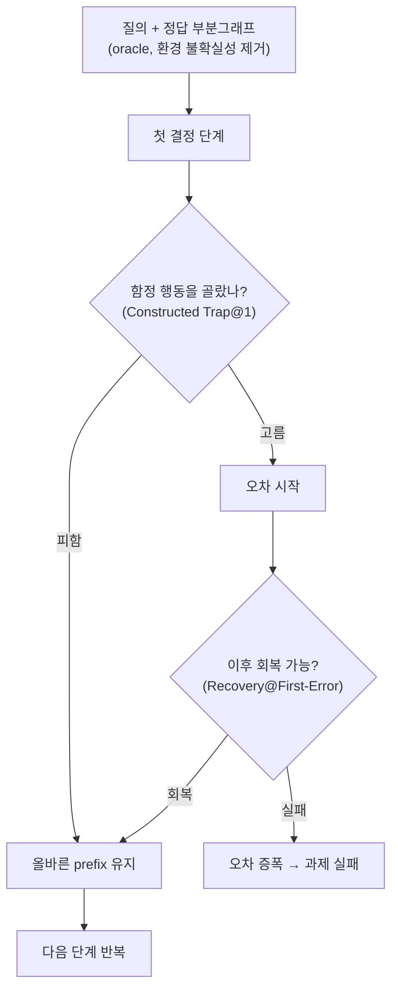
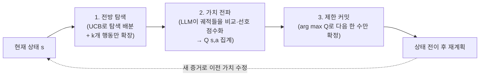

## TL;DR

추론(reasoning)을 잘하는 모델이 왜 장기 계획(long-horizon planning)에서 무너지는가. 이 논문은 그 원인을 "능력 부족"이 아니라 정책의 모양에서 찾는다. step-by-step 추론은 매 단계 점수가 가장 높은 행동을 고르는 **탐욕(greedy) 정책**으로 수렴하는데, 이건 짧은 과제에는 충분해도 긴 과제에서는 초반의 근시안적 선택(myopic commitment)이 되돌릴 수 없게 누적된다. 저자들은 결정론적·구조화된 환경(주로 지식그래프 QA)에서 이걸 수치로 분리해 보였다. 첫 결정에서 "겉보기 좋지만 장기적으로 나쁜 함정"을 단일 추론은 55.6%나 고르고, 한 번 틀리면 5.4%만 회복한다. 해법으로 제안한 FLARE(전방 탐색 + 가치 전파 + 제한 커밋)를 붙이면 LLaMA-8B가 표준 추론의 GPT-4o를 자주 앞선다.

> **추론은 "지금 이 한 수를 잘 두는" 능력이고, 계획은 "이 수가 다섯 수 뒤에 무슨 결과를 낳는지 미리 보는" 능력이다. 둘은 같은 게 아니다.**

- 제목: Why Reasoning Fails to Plan: A Planning-Centric Analysis of Long-Horizon Decision Making in LLM Agents
- 저자: Zehong Wang, Fang Wu, Hongru Wang, Xiangru Tang 외 11인 (소속은 arXiv 페이지에 미표기)
- 제출: 2026-01-29 · arXiv: [2601.22311](https://arxiv.org/abs/2601.22311)

## 1. 무엇을 분석한 연구인가 (1축)

이 논문은 새 모델을 자랑하는 글이 아니다. **기존 LLM 에이전트가 왜 긴 계획에서 실패하는지를 진단**하고, 그 진단에 맞춘 최소한의 처방(FLARE)을 붙여 가설을 검증하는 구조다.

핵심 주장은 한 문장이다. step-by-step 추론은 사실상 **단계별 탐욕 정책(step-wise greedy policy)**을 만든다. 매 단계에서 "지금 가장 그럴듯한 행동"을 점수로 고르는데, 짧은 과제에서는 이게 정답과 거의 일치한다. 그런데 긴 과제에서는 초반 행동이 나중에야 드러나는 결과(delayed consequence)를 책임져야 한다. 단계별 점수는 그 미래를 보지 못하므로, 국소적으로는 최적이지만 전역적으로는 틀린 선택을 초반에 내리고, 그 오차가 시간이 갈수록 증폭된다.

비교 대상으로 쓴 계획 전략은 네 가지다.

| 전략 | 설명 |
|---|---|
| Single step | 매 단계 점수 최고 행동 1개 선택 (탐욕 추론) |
| Beam search | 폭(width)을 넓혀 여러 후보를 동시에 유지 |
| Lookahead | 얕은 전방 탐색 + 롤아웃 평가 |
| FLARE (제안) | 전방 탐색 + 가치 전파 + 제한 커밋을 한 모델에 통합 |

백본 모델은 LLaMA 3.1 8B를 기본으로 두고, LLaMA 70B·GPT-4o mini·GPT-4o를 같은 프레임워크에서 계획 전략만 바꿔가며 비교했다.

## 2. 어떤 과제·벤치마크로 (2축)

문제를 깨끗하게 분리하려고 **결정론적이고 구조가 보장된 환경**을 골랐다. 핵심은 지식그래프 질의응답(KGQA)이다.

- **CWQ** (Complex WebQuestions): 다중 홉(multi-hop) 그래프 순회. 최단 경로 길이 분포가 다양해 horizon을 조절하기 좋다.
- **WebQSP** (WebQuestions SP): KB-QA 시맨틱 파싱.
- **GrailQA**: 일반화(generalization)를 3단계로 테스트.
- **ALFWorld**: 도구 호출(discrete tool call)로 목표를 달성하는 장기 과제. 도메인을 바꿔 강건성을 본다.

KGQA를 고른 이유가 중요하다. 각 질의에 **정답 부분그래프(oracle solution subgraph)가 보장된 설정**을 써서 환경 쪽 불확실성을 없앴다. 그러면 모델이 틀리는 게 "환경이 어려워서"가 아니라 "에이전트의 결정 메커니즘 때문"임을 분리할 수 있다. 계획 실패의 원인을 모델 내부로 좁히기 위한 장치다.

## 3. 어떤 실험·측정 (3축)

성능만 보면 "왜 실패하는지"가 안 보인다. 이 논문이 좋은 건 **실패의 해부용 지표**를 따로 설계한 점이다.

*그림. 측정 지표가 추적하는 흐름. 첫 결정에서 '겉보기 좋지만 장기적으로 나쁜 함정'을 고르는 비율, 첫 오차가 나는 위치, 오차 후 회복 확률을 따로 잰다. (출처: 논문 Figure 1·2 구조 재구성, arXiv:2601.22311)*

측정한 핵심 지표는 다음과 같다.

- **정확도(Hits@1)**: 최종 정답률.
- **Constructed Trap@1**: 첫 결정 단계에서 함정(국소 최적·전역 손해) 행동을 고르는 비율. 낮을수록 좋다.
- **First-Error Step**: 궤적에서 첫 오차가 몇 번째 단계에 나오는가. 높을수록(늦을수록) 좋다.
- **Recovery@First-Error**: 첫 오차 이후 회복해 정답에 도달하는 확률. 높을수록 좋다.
- **token 효율 / 예산-성능 트레이드오프**: 같은 token으로 얼마나 정확한가.

이 지표 묶음이 "추론은 잘하는데 계획은 못한다"를 정량화한다. 정확도 한 숫자로 뭉개지 않고, 어디서 무너지는지를 단계별로 드러낸다.

## 4. FLARE — 진단에 맞춘 처방 (4축: 방법 구성)

진단이 "초반 탐욕 커밋"이면 처방은 "미래를 보고, 결과를 초반 결정에 되먹이고, 함부로 확정하지 않기"다. FLARE(Future-aware Lookahead with Reward Estimation)는 세 부품으로 이걸 한 모델에 담는다.

*그림. FLARE의 세 구성요소와 재계획 루프. 다음 한 수만 확정하고 상태가 바뀌면 다시 계획해, 궤적 단위 증거가 초반 결정값을 되돌릴 수 있게 한다. (출처: 논문 방법부 재구성, arXiv:2601.22311)*

- **전방 탐색(Explicit Lookahead)**: 현재 상태에서 탐색 트리를 유지하고 UCB 공식으로 시뮬레이션을 배분한다. 가치 추정 Q(s,a)와 탐색항의 균형이다. 단, 확장은 실행 가능한 k개 행동으로 제한(action pruning)해 비용을 누른다.
- **가치 전파(Value Propagation)**: 각 시뮬레이션 궤적에 누적 보상을 매긴다. 단계별 보상을 그냥 더하는 게 아니라, LLM이 여러 궤적 후보를 **비교해 선호 기반 점수**를 준다. 그 상태-행동을 지나는 모든 시뮬레이션의 결과를 모아 Q(s_t, a_t)로 집계한다. 비슷한 궤적은 메모리(최대 M개)에 캐싱해 평가 비용을 분할상환한다.
- **제한 커밋(Limited Commitment, receding-horizon)**: 한 번에 다음 행동 하나만 arg max Q(s,a)로 확정하고, 상태가 바뀌면 다시 계획한다. 오프라인에서 전체 계획을 미리 굳혀버리는 취약함을 피하고, 나중에 모은 궤적 증거로 앞 행동의 가치를 고칠 수 있게 한다.

세 부품 모두 새 발명은 아니다. MCTS 계열에서 익숙한 조각들이다. 이 논문의 기여는 발명이 아니라 **진단과 처방의 정합성**에 있다. "탐욕 커밋이 문제"라는 진단에 정확히 대응하는 최소 구성을 붙여 가설을 입증한다.

## 5. 핵심 결과·수치 (5축)

### 정확도 — 작은 모델 + FLARE가 큰 모델 + 단일 추론을 넘는다

LLaMA-8B 기준 Hits@1 (단위 %):

| 데이터셋 | Single Step | Beam | Lookahead | FLARE |
|---|---|---|---|---|
| CWQ | 46.9 | 51.3 | 52.7 | **58.1** |
| WebQSP | 73.8 | 77.1 | 77.9 | **85.6** |
| GrailQA | 71.7 | 75.4 | 74.6 | **80.9** |

전 조건 평균으로도 Single Step 59.8 → FLARE 71.8(CWQ), 78.2 → 89.9(WebQSP), 76.5 → 87.8(GrailQA)로 올라간다. GPT-4o mini에 FLARE를 붙이면 CWQ에서 단일 추론 51.9% → 69.9%다. 초록의 주장("LLaMA-8B + FLARE가 GPT-4o + 표준 추론을 자주 앞선다")은 이 표들 위에 선다. 즉 **계획 전략을 바꾸는 것이 모델 크기를 키우는 것만큼 또는 그 이상으로 효과적**일 수 있다는 신호다.

기존 KGQA 프레임워크(ToG·PoG)에 얹어도 일관되게 오른다. 예: PoG에 FLARE를 결합하면 CWQ 75.0→78.8, WebQSP 87.3→93.9, GrailQA 84.7→92.0.

### 실패의 해부 — "왜" 무너지는가의 수치

데이터셋 전반을 모은 계획 동역학:

| 지표 | Single Step | Beam | Lookahead | FLARE |
|---|---|---|---|---|
| Constructed Trap@1 (↓) | 55.6% | 71.9% | 23.6% | **17.8%** |
| First-Error Step (↑) | 1.6 | 2.0 | 2.8 | **3.2** |
| Recovery@First-Error (↑) | 5.4% | 11.4% | 22.4% | **29.7%** |

읽는 법이 이 논문의 알맹이다. 단일 추론은 **첫 결정에서 절반 넘게(55.6%) 함정을 고른다.** 그리고 한 번 틀리면 **5.4%만 회복**한다. 초반에 잘못 꿰면 거의 못 돌아온다는 뜻이다.

흥미로운 건 Beam search다. 정확도는 single step보다 약간 높지만, 함정 선택률은 오히려 **71.9%로 더 나쁘다.** 폭을 넓혀 여러 후보를 들고 가도 그 후보들이 다 같은 단계별 점수로 줄세워지면, 근시안이 줄기는커녕 그럴듯한 함정에 더 몰린다. "후보를 늘리는 것"과 "미래를 보는 것"은 다르다는 증거다.

FLARE는 함정 선택을 17.8%로 누르고, 첫 오차를 더 뒤로 미루며(3.2단계), 오차 후 회복을 약 30%까지 끌어올린다.

### horizon이 길어질수록 (Figure 1)

단일 추론은 horizon이 길어질수록 정확도가 가파르게 무너진다. 2-홉 질의에서 약 75%였던 정확도가 6홉 이상에서 약 35%로 내려간다(single step). Beam은 같은 붕괴를 약간 미룰 뿐이다. FLARE는 horizon이 길어져도 70%대 정확도를 유지한다. **"추론은 잘하는데 계획은 못한다"가 정확히 horizon 길이에 따라 벌어진다**는 그림이다.

### 도구 환경에서도 (ALFWorld, Figure 4)

KGQA만의 현상이 아니다. 도구 호출 환경에서도 ReAct 61.3% → ReAct+Beam 66.7% → **ReAct+FLARE 77.8%**로 올랐다.

### 비용은 공짜가 아니다 (Table 4, ablation)

FLARE 전체 구성은 74.9% 정확도에 21k token. 여기서 action pruning을 빼고 같은 성능을 내려면 token이 **61k로 약 3배** 든다. 즉 **k개 행동만 확장하는 가지치기가 비용을 누르는 핵심**이고, 궤적 메모리는 중복 평가를 줄인다. 전방 탐색은 본질적으로 token을 더 쓰는 방법이고, FLARE의 설계 상당 부분이 그 비용을 어떻게 깎느냐에 들어가 있다.

## 6. 우리는 이걸 어떻게 활용하면 좋을까 (6축: 실무 함의)

에이전트를 만드는 입장에서 가져갈 것은 FLARE라는 구현체보다 **"추론 ≠ 계획"이라는 진단**과, 그 진단이 가리키는 가드레일의 모양이다.

**1) "더 똑똑한 모델"이 장기 계획을 자동으로 풀어주지 않는다.** 단일 추론으로 굴리면 GPT-4o라도 첫 결정에서 함정에 빠지고 못 돌아온다. 우리 에이전트가 멀티스텝 과제에서 "초반에 한 번 삐끗하면 끝까지 헛도는" 양상을 보인다면, 그건 프롬프트를 더 정교하게 짜서 풀 문제가 아니라 **정책 구조(planning loop)를 바꿔야 할 문제**일 수 있다.

**2) 후보를 늘리는 것과 미래를 보는 것을 구분하라.** Beam search가 함정 선택률을 오히려 키운 결과(71.9%)는 경고다. 같은 단계별 점수로 후보만 여럿 들고 가는 방식(예: 샘플 여러 개 뽑아 best-of-n)은 근시안을 못 고친다. 결과를 시뮬레이션해 초반 결정에 **되먹이는 구조**라야 효과가 있다.

**3) 한 번에 다 확정하지 말고 재계획하라(limited commitment).** 에이전트가 전체 계획을 한 번에 길게 뱉고 그대로 실행하면, 도중에 모은 정보로 앞 계획을 못 고친다. 다음 한 수만 확정하고 상태가 바뀌면 다시 계획하는 receding-horizon이 회복력(Recovery 5.4%→29.7%)의 핵심이다.

**4) 가드레일을 "되돌릴 수 있는 지점"에 배치하라.** First-Error Step·Recovery 지표가 말하는 건, 실패가 초반에 비가역적으로 굳는다는 점이다. 그렇다면 우리 에이전트에도 **초반 결정에 체크포인트와 롤백**을 두는 게 후반에 검증을 몰아두는 것보다 효과적이다. 첫 분기에서 "겉보기 점수만 높은 행동"을 거르는 장치가 가장 값지다.

**5) 비용을 잊지 마라.** 전방 탐색은 token을 더 쓴다(ablation에서 가지치기 없으면 3배). 모든 호출에 트리 탐색을 깔 수는 없다. "여기는 장기 horizon이라 계획이 필요하다 / 여기는 단발성이라 단일 추론이면 충분하다"를 가르는 라우팅이 실무의 진짜 설계점이다.

> **장기 과제를 다루는 에이전트의 진짜 설계점은 "모델을 키울까"가 아니라 "초반 결정에 미래를 되먹이고, 함부로 확정하지 않고, 되돌릴 수 있게 만들까"다. 추론을 잘하는 모델일수록 이 구조 없이는 자기 확신으로 더 빨리 함정에 박힌다.**

이 글에서 내가 한 일은 코드 작성이 아니라 논문 검증이다. 수치를 출처에서 직접 확인하고, 우리 에이전트 설계에 옮길 함의로 추렸다. 도구가 초안을 거들어도 "이 숫자가 맞는가, 우리 문제에 어떻게 닿는가"를 판단하는 건 사람의 자리다.

---

## 출처

- Wang, Z., Wu, F., Wang, H., Tang, X. et al., "Why Reasoning Fails to Plan: A Planning-Centric Analysis of Long-Horizon Decision Making in LLM Agents", arXiv 2601.22311 (2026-01-29), https://arxiv.org/abs/2601.22311
- HTML 전문: https://arxiv.org/html/2601.22311
- PDF: https://arxiv.org/pdf/2601.22311

*※ 수치는 위 arXiv 초록·HTML 전문 기준이다. Hits@1(CWQ 46.9→58.1 등), 계획 동역학(Trap@1 55.6/71.9/23.6/17.8%, Recovery 5.4/11.4/22.4/29.7%), ALFWorld(61.3→77.8%), ablation(21k→61k token)은 LLaMA-8B 기본 설정 등에서 보고된 값이며 모델·구현에 따라 달라질 수 있다. horizon별 정확도(2홉 ~75% → 6홉 ~35%)는 Figure 1의 그래프 판독값이라 근사치다. 저자 소속은 arXiv 페이지에 표기돼 있지 않아 미기재했다.*
