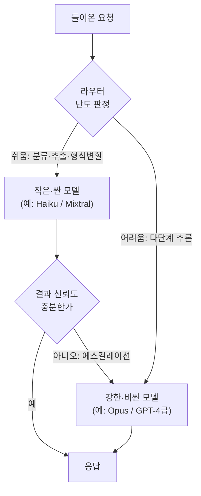

## 0. 곱셈으로 늘어나는 청구서

에이전트는 한 번 묻고 한 번 답하는 챗봇이 아니다. 목표를 받으면 생각하고, 도구를 부르고, 결과를 보고 다시 생각한다. 이 루프가 한 작업에 수 차례 돈다. 루프 한 바퀴마다 LLM 호출이 최소 한 번씩 들어가고, 호출마다 누적된 맥락 전체를 다시 입력으로 읽힌다. 토큰·지연·비용이 더하기가 아니라 곱하기로 늘어난다.

형제 글에서 멀티에이전트가 채팅 대비 약 15배의 토큰을 쓴다고 짚었다. 그 15배는 "더 똑똑해서"가 아니라 상당 부분 "토큰을 더 태워서" 나온 성능이다. 에이전트를 데모에서 운영으로 옮기는 순간, 이 곱셈이 그대로 청구서와 응답 시간으로 돌아온다. 평가·관측을 다룬 글에서 비용과 지연을 평가 축으로 짧게 언급했는데, 이 글은 그 축을 "어떻게 줄이는가"로 끌고 내려간다.

> **에이전트에서 정확도는 만들 수 있는지를 정하고, 비용과 지연은 운영할 수 있는지를 정한다. 데모는 정확도로 통과하지만 서비스는 비용·지연으로 죽는다.**

먼저 무엇을 줄이는지부터 숫자로 못 박는다. 그다음 프롬프트 캐싱, 모델 라우팅, 시맨틱 캐싱, 배치·스트리밍, 컨텍스트 압축을 실제 할인율과 함께 본다. 마지막에 추론 엔진 쪽 기법을 짧게 얹는다.

## 1. 무엇을 재는가 — 비용·지연 지표

줄이려면 먼저 재야 한다. 에이전트 운영에서 보는 지표는 네 가지다.

- **토큰/요청**: 입력 토큰 + 출력 토큰. 비용은 거의 여기 비례한다. 에이전트는 루프마다 누적 맥락을 다시 읽으므로 입력 토큰이 빠르게 부풀고, 비용의 대부분이 입력 쪽에서 난다.
- **TTFT(Time To First Token)**: 요청이 도착해 첫 토큰이 나올 때까지의 지연. 네트워크 + 큐 대기 + 프리필(prompt 처리)로 쪼개진다. 사용자가 체감하는 "반응이 왔다"의 순간이다.
- **TPOT(Time Per Output Token)**: 첫 토큰 이후 토큰 하나당 평균 생성 시간. 디코드 단계의 속도다. TPOT의 역수가 초당 생성 토큰 수(TPS)다.
- **$/작업**: 한 작업(에이전트가 한 목표를 끝낼 때까지)에 든 총 비용. 토큰/요청 × 루프 횟수 × 단가의 합. 사용자 입장에서 진짜 단위는 토큰이 아니라 이거다.

MLCommons는 대화형 서비스의 목표선을 TTFT 500ms 이하, TPOT 30ms 이하(초당 약 33토큰, 사람이 읽는 속도)로 잡는다. 이 분해가 중요한 이유는 기법마다 다른 지표를 건드리기 때문이다. 프롬프트 캐싱은 프리필을 줄여 TTFT와 입력 비용을 같이 낮추고, 스트리밍은 총 시간은 그대로 두고 체감 TTFT만 당긴다. 스펙 디코딩은 TPOT를 낮춘다. 무엇이 느린지 모르고 손대면 엉뚱한 데를 고친다.

## 2. 프롬프트 캐싱 — 같은 앞부분을 다시 계산하지 않는다

에이전트 프롬프트는 앞부분이 거의 똑같다. 시스템 프롬프트, 도구 정의, 예시(few-shot), 긴 문서가 매 호출 앞에 그대로 붙고 뒤에 짧은 새 질문만 바뀐다. 캐싱이 없으면 이 긴 앞부분을 매번 처음부터 다시 계산한다(프리필). 프롬프트 캐싱은 이 앞부분(prefix)을 처리한 결과(KV 캐시)를 저장해 두고, 다음 호출이 같은 앞부분으로 시작하면 다시 계산하지 않고 꺼내 쓴다.

세 제공자의 정책과 할인율은 다음과 같다. 수치는 각 제공자 문서와 2026년 가격 정리 자료로 확인했다.

| 제공자 | 캐시 적중 입력가 | 절감 | 캐시 쓰기 비용 | 유지 시간(TTL) | 작동 방식 |
|---|---|---|---|---|---|
| Anthropic (Claude) | 표준 입력의 0.1배 | 약 90% | 5분 TTL 1.25배 / 1시간 TTL 2.0배 | 5분(연장 시 1시간) | 명시적(`cache_control`로 캐시 구간 지정) |
| OpenAI | 표준 입력의 0.5배 | 50% | 추가 비용 없음 | 5~10분(최대 1시간) | 자동(1,024토큰 이상 프롬프트, 코드 변경 불필요) |
| Google Gemini | 표준 입력의 약 0.1배(2.5+) | 약 90%(2.0은 75%) | 명시 캐시는 시간당 저장료 별도 | 모델/모드별 | 암시(기본 켜짐) + 명시(opt-in) |

Anthropic은 캐시 적중 시 입력 토큰을 표준의 10%만 받는다(약 90% 절감). 긴 프롬프트에서는 지연도 최대 85% 줄어든다고 명시한다. 대신 처음 캐시를 쓸 때는 5분 TTL 기준 표준 입력의 1.25배를 받으므로, 같은 앞부분을 두 번 이상 재사용할 때라야 이득이다. 에이전트 루프는 정확히 그 조건(같은 시스템 프롬프트·도구 정의를 수십 번 재사용)에 들어맞는다.

OpenAI는 1,024토큰을 넘는 프롬프트에 자동으로 적용된다. 캐시된 입력 토큰을 50% 깎고, 별도 설정도 추가 요금도 없다. 적중 조건은 앞부분이 글자 그대로 같아야 한다는 점이다(prefix 일치). 그래서 자주 바뀌는 내용(타임스탬프, 사용자 ID)은 프롬프트 앞이 아니라 뒤에 두는 게 캐시 적중률을 좌우한다.

아래 코드를 보이는 목적은, 캐싱이 "어디까지가 고정 앞부분이고 어디부터가 변하는 부분인가"를 사람이 선을 긋는 일이라는 점을 드러내는 것이다. Anthropic은 그 선을 `cache_control`로 명시한다.

`agent/llm_client.py` (Anthropic 명시적 캐싱 예시)

```python
import anthropic

client = anthropic.Anthropic()

resp = client.messages.create(
    model="claude-opus-4-1",
    max_tokens=1024,
    system=[
        {
            "type": "text",
            "text": LONG_SYSTEM_PROMPT + TOOL_DEFINITIONS,  # 매 루프 똑같은 긴 앞부분
            "cache_control": {"type": "ephemeral"},          # ← 여기까지를 캐시 구간으로 못 박는다
        }
    ],
    messages=conversation,  # 루프마다 바뀌는 짧은 대화만 캐시 구간 뒤에 둔다
)
# 첫 호출: 앞부분을 캐시에 쓴다(표준 입력의 1.25배)
# 이후 5분 내 같은 앞부분 호출: 그 부분은 표준 입력의 0.1배만 청구 (약 90% 절감)
```

도구가 자동으로 캐시 위치를 정해 주지는 않는다. OpenAI는 자동이지만, "무엇을 앞에 고정하고 무엇을 뒤로 뺄지"의 프롬프트 구조 자체는 사람이 설계한다. 캐싱이 잘 먹는 프롬프트와 안 먹는 프롬프트의 차이는 거의 전부 이 배치에서 갈린다.

## 3. 모델 라우팅 — 쉬운 건 싼 모델, 어려운 것만 강한 모델

모든 호출에 가장 강한(=가장 비싼) 모델을 쓸 이유는 없다. 에이전트가 다루는 단계 중 상당수는 분류, 형식 변환, 짧은 추출처럼 작은 모델로 충분한 일이다. 어려운 추론만 강한 모델에 보내고 나머지를 싼·작은 모델로 돌리면 정확도를 거의 지키면서 비용을 크게 깎는다. 이게 모델 라우팅(또는 캐스케이드)이다.

대표 사례가 UC Berkeley·Anyscale 등이 낸 RouteLLM(ICLR 2025)이다. 쿼리를 먼저 라우터에 통과시켜 약한 모델로 처리 가능한지 판단하고, 어려운 것만 강한 모델로 보낸다. 강한 모델을 GPT-4, 약한 모델을 Mixtral 8x7B로 둔 실험에서 MT-Bench 기준 비용을 85% 이상 줄이면서 GPT-4 성능의 95%를 유지했다(MMLU 45% 절감, GSM8K 35% 절감). 절감폭이 벤치마크마다 다른 건, 쉬운 질문 비중이 높은 작업일수록 라우팅 이득이 크다는 뜻이다.



*그림. 라우터가 난도를 먼저 판정해 쉬운 요청은 싼 모델로 보내고, 어려운 것만 강한 모델로 올린다. 캐스케이드는 싼 모델을 먼저 돌려 보고 신뢰도가 낮으면 강한 모델로 다시 올린다.*

라우팅에는 두 방식이 있다. 하나는 위 그림처럼 보내기 전에 난도를 예측해 한쪽으로 보내는 방식(RouteLLM), 다른 하나는 캐스케이드로 일단 싼 모델에 보내고 답의 신뢰도가 낮으면 강한 모델로 다시 올리는 방식이다. 캐스케이드는 라우터 예측이 틀려도 복구되지만, 어려운 질문은 두 번 호출되어 그만큼 손해다.

아래 코드를 보이는 목적은, 라우팅의 핵심이 "분기 조건을 사람이 정의한다"는 점을 드러내는 것이다. 무엇을 쉬움으로 볼지가 곧 비용·정확도 트레이드오프를 정하는 자리다.

`agent/router.py` (난도 기반 모델 라우팅 분기)

```python
CHEAP_MODEL = "claude-haiku-4"     # 분류·추출·짧은 변환용
STRONG_MODEL = "claude-opus-4-1"   # 다단계 추론용

def route(task: dict) -> str:
    # 분기 조건 자체가 비용·정확도 정책이다 — 도구가 아니라 내가 정한다
    if task["type"] in ("classify", "extract", "format"):
        return CHEAP_MODEL                     # 정형·단순 작업은 싼 모델로
    if task["estimated_steps"] <= 1 and task["input_tokens"] < 2000:
        return CHEAP_MODEL                     # 짧고 단일 단계면 싼 모델로
    return STRONG_MODEL                        # 그 외 어려운 추론만 강한 모델로

model = route(current_task)
resp = client.messages.create(model=model, ...)
```

이 분기를 잘못 그으면 비용은 줄지만 어려운 작업이 싼 모델로 새어 정확도가 떨어진다. 그래서 라우팅은 켜는 것보다 경계선을 어디에 긋고 검증하느냐가 전부다.

## 4. 시맨틱 캐싱 — 같은 의미의 질문은 한 번만 답한다

프롬프트 캐싱이 "글자가 같은 앞부분"을 재사용한다면, 시맨틱 캐싱은 "의미가 같은 질문"을 재사용한다. 들어온 질문을 임베딩(문장을 벡터로 바꾼 것)으로 만들어, 과거 질문 벡터들과의 유사도가 임계치를 넘으면 그때 저장해 둔 답을 LLM 호출 없이 바로 돌려준다. 대표 구현이 오픈소스 GPTCache다.

효과는 질문이 얼마나 겹치느냐에 달렸다. "GPT Semantic Cache" 연구(arXiv 2411.05276)는 질문을 Redis에 임베딩 캐싱해 카테고리별로 캐시 적중률 61.6~68.8%, LLM API 호출을 최대 68.8% 줄였다고 보고한다. 적중 시에는 LLM을 아예 안 부르니 비용이 0이고 지연도 임베딩 조회 수준으로 떨어진다.

다만 위험이 프롬프트 캐싱과 다르다. 프롬프트 캐싱은 앞부분이 글자로 같아야 적중하므로 틀린 답을 줄 일이 없다. 시맨틱 캐싱은 "비슷해 보이지만 사실 다른" 질문에 옛 답을 줄 수 있다(거짓 적중). 임계치를 너무 느슨하게 잡으면 적중률은 오르지만 오답이 새고, 너무 빡빡하게 잡으면 안전하지만 적중률이 떨어진다. 위 연구가 거짓 적중을 막아 양성 적중 정확도 97% 이상을 유지했다고 밝힌 것도 이 임계치 관리가 핵심이라는 뜻이다. 가격·재고처럼 시점에 따라 답이 바뀌는 질문에는 시맨틱 캐시를 쓰면 안 된다.

## 5. 배치와 스트리밍 — 급하지 않은 건 싸게, 급한 건 빨리 느껴지게

비용과 체감 지연은 다른 손잡이로 줄인다.

**배치(Batch) API**는 실시간이 아니어도 되는 대량 작업을 절반값에 처리한다. OpenAI Batch API와 Anthropic Message Batches API 모두 입력·출력 토큰을 표준의 50%로 깎고, 대신 24시간 안에 완료를 보장한다(대개 1~6시간 내 완료). 에이전트가 밤사이 문서 수천 건을 분류·요약하는 식의 비대화형 작업이면, 같은 일을 그냥 절반값에 끝낸다. Anthropic은 배치당 최대 10만 요청, OpenAI는 JSONL 파일 업로드 방식이라는 차이가 있다.

**스트리밍**은 비용이 아니라 체감 지연을 건드린다. 응답을 다 만든 뒤 한 번에 주는 대신 토큰을 생성되는 대로 흘려보낸다. 총 생성 시간은 그대로지만 사용자가 첫 글자를 보는 시점(체감 TTFT)이 크게 앞당겨진다. 1초간 빈 화면을 보는 것과, 0.2초에 글자가 흐르기 시작하는 것은 같은 총 시간이라도 다르게 느껴진다. 에이전트의 중간 사고 과정이나 긴 답변을 보여줄 때 특히 효과가 크다.

| 기법 | 주로 줄이는 것 | 대표 수치 | 적용 조건 |
|---|---|---|---|
| 프롬프트 캐싱 | 입력 비용 + TTFT | Anthropic 약 90% / OpenAI 50% / Gemini(2.5+) 약 90% | 긴 앞부분(시스템·도구·문서)을 반복 재사용 |
| 모델 라우팅 | $/작업 | RouteLLM MT-Bench 85%+ 절감, 품질 95% 유지 | 쉬운 작업 비중이 높을 때 |
| 시맨틱 캐싱 | 호출 수(비용·지연) | 호출 최대 68.8% 감소(적중률 의존) | 질문이 자주 겹치고 답이 시점에 안 바뀔 때 |
| 배치 API | 토큰 비용 | 입력·출력 50% 할인 | 24시간 내 끝나도 되는 비대화형 대량 작업 |
| 스트리밍 | 체감 TTFT | 첫 글자 표시 시점 단축(총 시간 불변) | 대화형 UI, 긴 응답 |
| 컨텍스트 압축 | 입력 토큰/루프 | 작업·압축률 의존(미확인) | 메모리·RAG가 긴 맥락을 매 루프 싣을 때 |

## 6. 컨텍스트 압축 — 매 루프 싣는 토큰을 줄인다

에이전트 비용의 큰 줄기는 루프마다 누적 맥락을 통째로 다시 입력으로 읽힌다는 점이다. 메모리 글에서 다뤘듯, 대화가 길어지고 RAG로 긴 문서를 끌어올수록 매 호출의 입력 토큰이 선형으로 분다. 여기서 줄일 수 있는 건 "정말 이번 단계에 필요한 토큰만 싣는가"이다.

방법은 세 가지다. 첫째, 오래된 대화를 통째로 들고 가지 말고 요약본으로 갈음한다(과거 N턴은 한 단락 요약으로 압축). 둘째, RAG에서 검색 청크 수와 청크 길이를 필요한 만큼으로 줄인다 — 상위 20개를 무조건 넣는 대신 재순위(rerank) 후 상위 3~5개만 싣는다. 셋째, 도구 결과 중 다음 단계에 안 쓰일 원본(긴 JSON, 전체 HTML)은 요약·발췌해 보관한다. 압축률과 그에 따른 절감폭은 작업마다 달라 일반화된 수치를 못 박기 어렵다(정확한 절감율 미확인). 다만 방향은 분명하다. 캐싱이 "앞부분을 싸게"라면, 압축은 "뒷부분을 짧게"다.

압축에는 비용이 따라온다. 요약 자체가 LLM 호출이라 토큰을 쓰고, 압축하다 다음 단계에 필요한 정보를 떨어뜨리면 에이전트가 헛돈다. 그래서 무엇을 버려도 되는지는 작업을 아는 사람이 정해야 한다.

## 7. 추론 엔진 쪽 — 스펙 디코딩과 KV 캐시

위 기법들이 "API를 어떻게 부르는가"라면, 모델을 직접 서빙할 때는 엔진 안쪽에서도 지연을 줄인다.

**스펙 디코딩(speculative decoding)**은 작고 빠른 초안 모델이 토큰 여러 개를 미리 제안하고, 크고 정확한 본 모델이 그것들을 한 번에 병렬 검증하는 방식이다. 본 모델이 토큰을 하나씩 만드는 대신 초안 5~8개를 한꺼번에 확인하니, 출력이 바뀌지 않으면서 TPOT가 줄어든다. 구글의 원 논문이 번역·요약에서 2~3배, NVIDIA가 H200에서 처리량 3.6배 향상을 보고했고, 초안 수용률이 80%를 넘으면 2~4배까지 빨라진다. 지금은 vLLM·SGLang·TensorRT-LLM 같은 서빙 엔진에 표준으로 들어가 있다.

**KV 캐시**는 자기회귀 생성에서 이미 계산한 토큰들의 키·밸류 행렬을 저장해, 다음 토큰을 만들 때 앞 토큰들을 다시 계산하지 않게 한다. 프롬프트 캐싱이 이 KV 캐시를 호출 사이에 보존하는 것의 상위 개념이다. 둘 다 "한 번 계산한 걸 다시 계산하지 않는다"는 같은 원리에 서 있다.

이 둘은 API만 쓰는 입장에서는 직접 켜고 끄는 손잡이가 아니다. 다만 왜 어떤 모델·엔드포인트가 같은 모델인데도 더 빠른지를 설명해 준다. 자체 서빙으로 내려가면 그때 직접 만지는 영역이 된다.

## 8. 사람에게 남는 일

캐싱 설정, 라우터 학습, 배치 제출, 압축 요약은 도구가 자동으로 한다. 코딩 에이전트에게 "이 프롬프트에 캐시 구간을 잡고, 분류 작업은 싼 모델로 라우팅하라"고 지시하면 그 코드는 도구가 짠다. 그럴수록 사람의 일은 코드를 짜는 데서 정책을 정하는 데로 옮겨간다.

어디까지를 고정 앞부분으로 잡아 캐싱할지, 어떤 작업을 "쉬움"으로 분류해 싼 모델에 보낼지, 시맨틱 캐시의 유사도 임계치를 어디에 둘지, 무엇을 압축해 버려도 되고 무엇은 끝까지 들고 가야 하는지. 이 결정들은 전부 비용을 깎는 대신 정확도나 신선도를 내주는 거래다. 임계치를 1%만 느슨하게 해도 캐시 적중률은 오르지만 오답이 샌다. 라우터 경계선을 잘못 그으면 어려운 작업이 싼 모델로 새어 결과가 무너진다.

도구는 내가 그어 준 경계선대로 최적화하지, 그 경계선을 어디에 둘지는 묻지 않으면 정해 주지 않는다. 비용·지연을 줄이는 시대에 사람에게 남는 일은, 작업마다 정확도·신선도를 얼마나 내주고 비용을 얼마나 깎을지 그 트레이드오프를 정의하는 능력과, 깎은 뒤에도 결과가 여전히 합격인지 검증하는 능력이다.

---

## 출처

- Anthropic, "Prompt caching", https://platform.claude.com/docs/en/build-with-claude/prompt-caching
- OpenAI, "Prompt Caching in the API", https://openai.com/index/api-prompt-caching/
- ofox.ai, "Anthropic vs OpenAI Prompt Caching 2026: Cost Math + 3 Cache-Miss Fixes", https://ofox.ai/blog/prompt-caching-cost-math-anthropic-vs-openai-2026/
- Tech Jacks Solutions, "Slashing Gemini API Costs With Context Caching (2026)", https://techjacksolutions.com/ai-tools/google-gemini/gemini-context-caching-cost-optimization/
- Google Cloud, "Context caching overview", https://docs.cloud.google.com/gemini-enterprise-agent-platform/models/context-cache/context-cache-overview
- LMSYS Org, "RouteLLM: An Open-Source Framework for Cost-Effective LLM Routing", https://www.lmsys.org/blog/2024-07-01-routellm/
- RouteLLM (arXiv 2406.18665), "Learning to Route LLMs with Preference Data", https://arxiv.org/pdf/2406.18665
- "GPT Semantic Cache: Reducing LLM Costs and Latency via Semantic Embedding Caching" (arXiv 2411.05276), https://arxiv.org/abs/2411.05276
- OpenAI, "Batch API guide", https://developers.openai.com/api/docs/guides/batch
- Respan, "Anthropic Message Batches API: 50% Off Async Jobs (2026)", https://www.respan.ai/articles/anthropic-message-batches-api
- PremAI, "Speculative Decoding: 2-3x Faster LLM Inference (2026)", https://blog.premai.io/speculative-decoding-2-3x-faster-llm-inference-2026/
- Anyscale Docs, "Understand LLM latency and throughput metrics", https://docs.anyscale.com/llm/serving/benchmarking/metrics
- TianPan.co, "LLM Latency Decomposition: Why TTFT and Throughput Are Different Problems", https://tianpan.co/blog/2026-03-10-llm-latency-decomposition-ttft-vs-throughput
