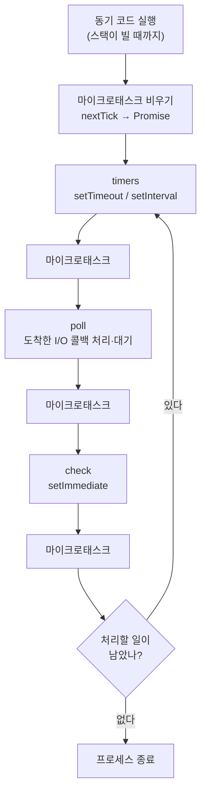

## 0. 한 줄 정의

**Node.js** — 자바스크립트를 브라우저 밖(서버·명령줄 도구)에서 실행하는 런타임. 구글이 크롬을 위해 만든 V8 자바스크립트 엔진을 가져다, 그 위에 파일·네트워크 같은 바깥세상과 통하는 기능을 붙였다.

자바스크립트는 원래 웹페이지 안에서만 돌았다. 버튼을 누르면 색이 바뀌고, 입력을 검사하고, 화면을 고치는 언어. 2009년에 라이언 달(Ryan Dahl)이 V8 엔진을 브라우저에서 떼어 내 독립 실행 환경으로 묶었다. 그게 Node.js다. 이때부터 자바스크립트로 웹 서버를 돌리고, 파일을 읽고, 명령줄 도구를 만들 수 있게 됐다.

여기까지가 쉬운 정의다. 이 글은 거기서 멈추지 않고, Node.js가 실제로 어떻게 한 개의 스레드로 수천 개 요청을 처리하는지, 그리고 그 구조가 어디서 무너지는지까지 내려간다.

## 1. 엔진과 런타임은 다르다

먼저 헷갈리는 두 단어를 갈라 둔다.

**V8**은 엔진이다. 자바스크립트 소스 코드를 기계어로 컴파일해서 실행하는 부분. 변수, 함수, 반복문 같은 언어 자체의 계산을 담당한다. 브라우저 안에도 이 V8이 들어 있다.

그런데 V8 혼자서는 파일을 읽지도, 네트워크 요청을 받지도 못한다. 그건 언어의 일이 아니라 바깥세상(운영체제)의 일이기 때문이다. 브라우저에서는 그 바깥일을 브라우저가 대신 해 줬다(`fetch`, `setTimeout`, DOM 같은 것들은 전부 브라우저가 제공한 기능이지 자바스크립트 언어 자체가 아니다).

**Node.js**는 브라우저가 하던 그 "바깥세상 연결" 역할을 대신한다. V8을 품고, 거기에 파일 시스템·네트워크·타이머 같은 기능을 C/C++로 구현해 붙였다. 이 바깥일 처리의 심장이 **libuv**라는 C 라이브러리다. libuv가 운영체제의 비동기 I/O를 추상화하고, 뒤에서 설명할 이벤트 루프와 스레드 풀을 굴린다.

```
[ 자바스크립트 소스 ]
        │
   ┌────┴─────┐
   │   V8     │  ← 코드를 기계어로 컴파일·실행 (언어 계산)
   └────┬─────┘
        │
   ┌────┴─────┐
   │  libuv   │  ← 파일·네트워크·타이머 (바깥세상 I/O, 이벤트 루프)
   └──────────┘
        │
   [ 운영체제 ]
```

브라우저든 Node.js든 자바스크립트 언어 자체(V8)는 똑같다. 다른 건 그 언어가 무엇과 통할 수 있느냐다. 브라우저는 DOM과 통하고, Node.js는 파일·소켓과 통한다.

## 2. 첫 코드 — 서버 한 줄

Node.js가 설치돼 있으면 다음 파일을 `node server.js`로 실행하는 것만으로 웹 서버가 뜬다. 이 코드를 보이는 목적은, 외부 프레임워크 없이 Node.js 자체가 네트워크를 직접 다룬다는 걸 보여주기 위함이다.

```javascript
// server.js — Node 내장 http 모듈만으로 띄우는 최소 웹 서버
const http = require('node:http');

const server = http.createServer((req, res) => {
  res.end('안녕, 브라우저 밖의 자바스크립트');   // 요청이 올 때마다 이 함수가 실행됨
});

server.listen(3000);   // 3000번 포트에서 요청을 기다림
```

`createServer`에 넘긴 함수는 지금 당장 실행되지 않는다. **요청이 도착할 때마다** Node가 대신 불러 준다. 이 "어떤 일이 생기면 그때 이 함수를 실행해 달라"는 등록 방식이 Node.js 동작의 전부라고 해도 된다. 그리고 그 "그때 실행"을 누가 어떤 순서로 관리하느냐가 이벤트 루프다.

## 3. 핵심 — 단일 스레드인데 어떻게 동시에 많은 요청을 받나

Node.js의 자바스크립트 코드는 **한 개의 스레드**에서 돈다. 스레드란 명령을 한 줄씩 순서대로 실행하는 일꾼 한 명이라고 보면 된다. 일꾼이 하나뿐인데 수천 명이 동시에 접속하는 서버를 어떻게 감당하나. 보통 서버 언어(자바·PHP 등)는 요청 하나에 일꾼(스레드) 하나를 붙인다. Node는 그러지 않는다.

비밀은 **논블로킹 I/O(non-blocking I/O)**다. 파일을 읽거나 DB에 질의하는 일은 디스크·네트워크가 응답할 때까지 시간이 걸린다. 일꾼이 그 앞에서 멍하니 기다리면(블로킹) 다른 손님을 못 받는다. Node는 기다리지 않는다. "다 되면 이 함수를 불러 줘"라고 운영체제(libuv)에 맡겨 두고, 곧장 다음 손님에게 간다. 결과가 준비되면 그제야 등록해 둔 함수가 실행된다.

같은 일을 막는 방식(동기)과 안 막는 방식(비동기)으로 써 보면 차이가 분명하다.

```javascript
const fs = require('node:fs');

// 동기 — 파일을 다 읽을 때까지 이 줄에서 일꾼이 멈춘다(그동안 아무것도 못 함)
const data = fs.readFileSync('big.log');
console.log('읽기 끝');

// 비동기 — 읽기를 맡겨 두고 즉시 다음 줄로 간다. 다 읽히면 콜백이 실행됨
fs.readFile('big.log', (err, data) => {
  console.log('읽기 끝');   // 나중에, 준비됐을 때 실행
});
console.log('이 줄이 먼저 찍힌다');
```

두 번째 방식에서는 `'이 줄이 먼저 찍힌다'`가 `'읽기 끝'`보다 먼저 출력된다. 파일을 읽으라고 시켜만 놓고 일꾼은 멈추지 않고 다음 줄로 갔기 때문이다. 손님 하나가 오래 걸리는 주문을 해도 주방(libuv)에 넘기고 다음 손님을 받는 식당. 일꾼이 한 명이어도 응대가 끊기지 않는 이유다.

## 4. 이벤트 루프 — 준비된 일을 꺼내 실행하는 순서

그럼 "다 되면 불러 줘"라고 맡긴 함수들은 누가, 언제 실행하나. 이벤트 루프(event loop)다. 일꾼(메인 스레드)이 동기 코드를 다 처리하고 나면, 이벤트 루프가 빙글빙글 돌면서 "이제 준비된 콜백 없나?"를 단계별로 확인하고 꺼내 실행한다. libuv가 이 루프를 돌린다.

이벤트 루프는 한 바퀴 안에서 정해진 **단계(phase)**를 순서대로 거친다. 핵심만 추리면 이렇다.

- **timers**: `setTimeout`·`setInterval`로 예약한 콜백 중 시간이 된 것을 실행. (주의: 타이머는 "최소" 지연을 보장할 뿐 정확한 시각이 아니다)
- **poll**: 가장 중요한 단계. 도착한 I/O 결과(파일·네트워크 응답)의 콜백을 여기서 실행하고, 할 일이 없으면 새 I/O가 올 때까지 잠깐 여기서 대기한다.
- **check**: `setImmediate`로 등록한 콜백을 실행. poll 직후에 돈다.

그리고 이 단계들 사이사이에 **마이크로태스크(microtask)**가 끼어든다. `Promise`의 `.then`/`async-await`의 뒷부분, 그리고 `process.nextTick`이 여기 속한다. 마이크로태스크는 다음 단계로 넘어가기 전에 먼저 비워진다. 우선순위는 `process.nextTick`이 가장 높고, 그다음이 Promise다.



*그림. 이벤트 루프 한 바퀴. 각 단계 사이마다 마이크로태스크 큐(nextTick·Promise)를 먼저 비우고 다음 단계로 넘어간다. 콜백·Promise·async-await가 실제로는 이 루프 위에서 순서가 정해진다.*

콜백, Promise, `async/await`는 문법만 다를 뿐 전부 이 루프 위에서 "준비되면 실행될 함수"를 등록하는 방식이다. `async/await`는 Promise를 사람이 읽기 쉽게 쓴 설탕 문법이고, Promise는 콜백 지옥을 정리한 형태다. 바닥에는 늘 이 이벤트 루프가 있다.

## 5. 단일 스레드의 함정 — CPU가 무거우면 전부 멈춘다

논블로킹 모델에는 분명한 약점이 있다. 일꾼이 한 명뿐이라는 사실은 그대로다. I/O 대기는 운영체제에 맡길 수 있지만, **계산 자체가 무거운 일**(이미지 변환, 큰 데이터 파싱, 암호 연산, 복잡한 반복문)은 맡길 데가 없다. 그 계산이 도는 동안 일꾼은 그 줄에 묶이고, 이벤트 루프는 멈춘다. 그동안 들어온 모든 요청이 대기열에 쌓여 응답이 끊긴다. 이게 "이벤트 루프를 막는다(blocking the event loop)"는 말이다.

```javascript
// 이 핸들러가 도는 5초 동안 서버는 다른 어떤 요청에도 응답하지 못한다
app.get('/heavy', (req, res) => {
  let sum = 0;
  for (let i = 0; i < 5e10; i++) sum += i;   // CPU를 5초간 점유 → 이벤트 루프 정지
  res.send(String(sum));
});
```

자바스크립트가 느려서가 아니다. 일꾼이 한 명이라 그 한 명이 계산에 붙들리면 손님 응대 자체가 멈추는 구조 때문이다. 우회로는 두 가지다.

- **worker_threads**: 한 프로세스 안에 별도 스레드를 만들어 무거운 계산을 떠넘긴다. 메인 스레드(이벤트 루프)는 계속 요청을 받는다. 스레드끼리 같은 프로세스 메모리를 공유해 메모리 부담이 작다. CPU 바운드 작업에 적합하다.
- **cluster**: 아예 프로세스를 CPU 코어 수만큼 복제해 요청을 코어별로 분산한다. 멀티코어 서버를 다 쓰려는 용도. 한 클러스터의 각 워커가 내부에서 다시 worker_threads를 쓰기도 한다.

핵심 판단은 이거다. 작업이 I/O 대기 위주(웹 API, DB 조회)면 Node의 기본 모델이 강하다. 작업이 CPU 계산 위주면 worker_threads로 빼거나, 애초에 다른 도구를 고려한다.

## 6. npm과 node_modules — 생태계의 빛과 그림자

Node.js를 깔면 **npm**(Node Package Manager)이 함께 온다. 남이 만든 코드 묶음(패키지)을 받아 쓰는 도구다. 프로젝트 루트의 `package.json`에 어떤 패키지가 필요한지 적고 `npm install`을 하면, 그 패키지와 그 패키지가 또 필요로 하는 패키지들이 줄줄이 `node_modules` 폴더에 깔린다.

여기에 현실의 두 얼굴이 있다.

빛은 압도적인 생태계다. 거의 모든 흔한 문제에 누군가 만들어 둔 패키지가 있다. 그림자는 그 의존성이 폭발한다는 점이다. `package.json`에 직접 적은 의존성이 30개여도, 그것들이 의존하는 것까지 따라오면 `node_modules`에는 1,500개 안팎의 패키지가 깔리는 일이 흔하다. 디스크 수백 MB를 먹는 `node_modules`가 "블랙홀보다 무겁다"는 농담이 괜히 도는 게 아니다.

더 심각한 건 공급망 보안이다. 패키지는 설치 시점에 `preinstall`·`postinstall` 스크립트로 임의 코드를 실행할 수 있다. 그래서 인기 패키지의 관리자 계정이 탈취되면, 그걸 의존하는 수많은 프로젝트가 한꺼번에 감염된다. 2026년에도 실제 사고가 이어졌다. 3월에는 가장 많이 내려받는 패키지 중 하나인 axios가 자격증명 탈취로 오염됐고, 4월에는 npm 등에서 악성 패키지 1,700여 개가 적발됐다(국가 배후 공격으로 분류).

> **npm 생태계의 거래 조건: 남의 코드를 거의 공짜로 가져다 쓰는 대신, 내가 직접 적지 않은 수천 개의 코드를 내 프로젝트에서 실행하게 된다는 위험을 떠안는다.**

방어책으로는 `package-lock.json`을 엄격히 따르는 `npm ci`로 설치하기, 갓 올라온 패키지를 며칠 묵힌 뒤 설치하도록 `.npmrc`에 `min-release-age`를 두기, 그리고 설치 단계를 pnpm처럼 의존성을 명시적으로 격리하는 도구로 바꾸기 등이 쓰인다.

## 7. 모듈 — require와 import의 실제 혼란

코드를 파일별로 나눠 서로 가져다 쓰는 방식을 모듈 시스템이라 한다. Node에는 역사적으로 두 가지가 공존한다. 이 둘이 섞일 때 입문자가 가장 많이 막힌다.

| | CommonJS (CJS) | ES Modules (ESM) |
|---|---|---|
| 가져오기 | `const x = require('x')` | `import x from 'x'` |
| 내보내기 | `module.exports = ...` | `export ...` |
| 로딩 | 동기(아무 데서나 호출 가능) | 비동기(원칙적으로 파일 최상단) |
| 기본 제공 변수 | `__dirname`, `__filename` 있음 | 기본 제공 안 됨(`import.meta`로 대체) |
| 파일 표시 | 기본값(`.cjs`로 명시) | `.mjs` 또는 `package.json`에 `"type": "module"` |

혼란의 핵심은 둘 사이 호환이 **비대칭**이라는 점이다. ESM이 CommonJS 패키지를 `import`하는 건 Node가 알아서 다리를 놓아 준다. 반대로 CommonJS에서 ESM 패키지를 `require`하면 전통적으로 `ERR_REQUIRE_ESM` 오류가 났다. 그래서 "분명 잘 만든 패키지인데 import만 하면 깨진다"는 호소가 끊이지 않았다.

다만 Node 22 LTS부터는 조건이 맞으면 CommonJS에서 ESM을 `require`하는 게 가능해졌다(이게 그동안 CommonJS를 못 버리던 가장 큰 이유였다). 2026년 기준으로 새 프로젝트는 ESM이 표준이지만, CommonJS는 사라지지 않았고 기존 코드 곳곳에 남아 있다. 그래서 둘을 다 만나게 된다.

## 8. 경쟁자 — Deno와 Bun (2026 기준)

Node.js가 만든 "서버에서 도는 자바스크립트"라는 자리를 노리는 런타임이 둘 있다. 둘 다 V8을 쓰지는 않는다는 점부터 다르다(Bun은 JavaScriptCore 엔진을 쓴다).

| | Node.js 24 (LTS) | Deno 2 | Bun 1.2 |
|---|---|---|---|
| 강점 | 압도적 호환성·안정성 | 보안(권한 모델), 기본 TypeScript | 속도, 올인원(번들러·테스트·패키지매니저 내장) |
| 단순 HTTP 처리량* | ~72,100 req/s | ~98,300 req/s | ~125,400 req/s |
| 콜드 스타트* | ~45ms | ~28ms | ~8ms |
| 기본 메모리* | ~40MB | — | ~18MB |
| npm 호환 | 기준 | 거의 완전(2.0에서 전환) | 높음 |

*수치는 특정 합성 벤치마크 기준이며 매체마다 다르다. 같은 출처에서, DB·비즈니스 로직이 붙은 실제 앱으로 측정하면 세 런타임 모두 약 12,000 req/s 부근으로 비슷해진다고 보고됐다. 즉 합성 벤치마크의 격차가 실서비스에서 그대로 나타나지는 않는다.*

요약하면 2026년 현재 셋 다 프로덕션에 쓸 수 있다. Bun이 가장 빠르고, Deno가 보안 모델이 강하고, Node.js가 호환성·생태계에서 가장 안전한 선택이다. 새로 시작하는 도구라면 Bun의 속도가 매력적이지만, 오래 굴러가야 할 서버라면 검증된 Node가 여전히 기본값이다.

## 9. 언제 쓰고 언제 안 쓰나

Node.js는 I/O가 많고 계산은 가벼운 일에 강하다. 웹 API 서버, 실시간 채팅, 여러 외부 API를 모아 중계하는 서버, 그리고 명령줄 자동화 도구가 잘 맞는다. 반대로 무거운 수치 계산·영상 인코딩·대규모 데이터 변환이 주가 되는 일은 한 개의 이벤트 루프가 발목을 잡으니, worker_threads로 빼거나 처음부터 다른 도구를 고른다.

> **Node.js = 브라우저 밖으로 나간 자바스크립트.** 한 줄 정의는 쉽지만, 그 뒤에는 V8과 libuv의 분업, 한 개의 스레드로 수천 요청을 받는 논블로킹 이벤트 루프, 그리고 그 루프가 CPU 계산에 막히는 함정, npm 의존성의 무게, 모듈 시스템의 비대칭 호환이 줄줄이 따라온다.

쉬운 입구로 들어와 이 구조까지 알면, "왜 Node 서버가 갑자기 느려졌지", "왜 import만 하면 깨지지", "node_modules가 왜 이렇게 무겁지" 같은 실제 문제를 한 단계 깊게 읽을 수 있다.

## 출처

- [The Node.js Event Loop | Node.js Learn](https://nodejs.org/learn/asynchronous-work/event-loop-timers-and-nexttick)
- [Don't Block the Event Loop (or the Worker Pool) | Node.js Learn](https://nodejs.org/learn/asynchronous-work/dont-block-the-event-loop)
- [Node.js — Previous Releases (LTS 일정)](https://nodejs.org/en/about/previous-releases)
- [Node.js | endoflife.date](https://endoflife.date/nodejs)
- [Node 22 vs Node 24 in 2026: LTS Support, Breaking Changes — PkgPulse](https://www.pkgpulse.com/guides/nodejs-22-vs-nodejs-24-2026)
- [ESM vs CommonJS in 2026 — Node.js Module Interop | Webcoderspeed](https://webcoderspeed.com/blog/scaling/esm-to-cjs-interop-2026)
- [CommonJS vs. ES Modules | Better Stack Community](https://betterstack.com/community/guides/scaling-nodejs/commonjs-vs-esm/)
- [Why npm supply chain attacks keep happening | DEV Community](https://dev.to/alanwest/why-npm-supply-chain-attacks-keep-happening-and-how-to-harden-your-installs-97p)
- [Supply Chain Compromise Impacts Axios Node Package | CISA](https://www.cisa.gov/news-events/alerts/2026/04/20/supply-chain-compromise-impacts-axios-node-package-manager)
- [Bun vs Deno vs Node.js in 2026: Benchmarks, Code, and Real Numbers | DEV Community](https://dev.to/jsgurujobs/bun-vs-deno-vs-nodejs-in-2026-benchmarks-code-and-real-numbers-2l9d)
- [Bun vs Deno vs Node.js 2026: Real Benchmarks Mislead | byteiota](https://byteiota.com/bun-vs-deno-vs-node-js-2026-real-benchmarks-mislead/)
- [Inside Node.js: V8, libuv, the Event Loop & Thread Pool | DEV Community](https://dev.to/rohith_nag/inside-nodejs-a-deep-dive-into-v8-libuv-the-event-loop-thread-pool-5fcn)
