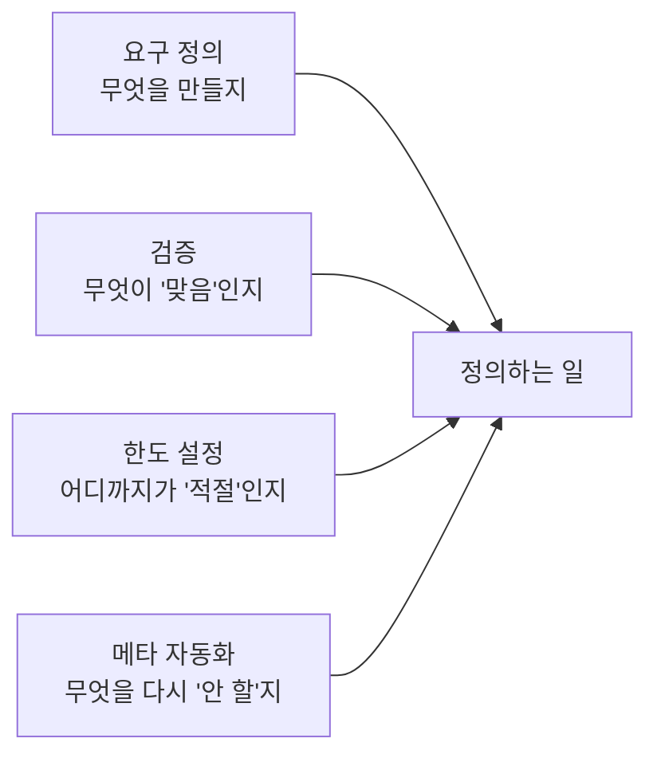

## 0. 안 쓰면 이상한 시대

요 며칠 Figma와 Blender를 도구에 직접 붙여 봤다. MCP로 연결하니, 만들고 싶은 화면을 말로 설명하면 디자인이 그려지고, 장면을 말하면 3D가 빚어졌다. 한참을 만지다 든 생각은 감탄이 아니라 당혹이었다. **"이걸 안 쓰는 게 이상한 시대구나."**

예전 같으면 디자인 툴을 익히고, 3D 소프트웨어의 단축키를 외우고, 한참을 연습해야 손에 잡혔을 일들이다. 그 진입 장벽이 거의 사라졌다. 손이 아니라 말로, 숙련이 아니라 의도로 결과가 나온다.

> **실행의 가격이 0에 가까워지면, 비싸지는 건 따로 있다. 무엇을 만들지 아는 일, 그리고 그것을 정확히 말하는 일.**

이 글은 그 "비싸진 것"이 무엇인지를 한 회차씩 들여다보겠다는 약속이다.

## 1. 병목이 옮겨갔다

만드는 일에는 늘 병목이 있었다. 오래된 병목은 "만들 줄 아는가"였다. 코드를 짤 줄 알아야, 디자인을 할 줄 알아야, 모델링을 할 줄 알아야 결과물이 나왔다. 그래서 우리는 만드는 기술을 배웠다.

그 병목이 도구 쪽으로 넘어갔다. 이제 만드는 일의 상당 부분은 도구가 한다. 그러면 병목은 사라지는 게 아니라 자리를 옮긴다. 새 병목은 **"무엇을 만들지 아는가", 그리고 "그것을 도구가 알아들을 만큼 정확히 말할 수 있는가"** 다.

나는 이걸 머리로 안 게 아니라 손으로 겪었다. 도구에게 원하는 걸 설명하다가 자꾸 막혔다. 결과가 어긋날 때 들여다보면, 도구가 못 만든 게 아니라 내가 제대로 정의하지 못한 경우가 더 많았다. 만들 능력이 모자란 게 아니라, **말할 능력이 모자랐다.** 차라리 그동안 책을 더 읽고 더 정확히 생각하는 연습을 해둘걸, 하는 후회가 그때 들었다.

## 2. 나는 무엇이 아니고, 무엇인가

먼저 분명히 해둔다. 나는 개발자가 아니다. 디자이너도 아니다. IT 전문가도 아니다. 이 분야를 업으로 깊게 파 온 사람들은 같은 도구로 나보다 훨씬 멀리 갈 것이다.

그런데도 이 글들을 쓰는 이유가 있다. 아이디어가 있고, 무엇을 하고 싶은지 정의할 수 있다면, 나머지는 도구가 해주는 시대가 정말로 왔는지 — 그걸 전문가가 아닌 사람이 직접 확인하고 싶어서다.

> **이 블로그는 "정의할 수 있으면 뭐든 가능한 시대"를 비전문가가 직접 검증하고 기록에 남기는 과정이다.**

전문가의 깊이를 흉내 내려는 게 아니다. 전문가가 아니어도 어디까지 가능한지, 그 경계가 어디인지를 정직하게 적어 두려는 것이다. 가능했던 것도, 막혔던 것도 그대로 남긴다.

## 3. 정의하는 일은 철학이다

학생 때 철학은 "정의를 내리는 일"이라고 배웠다. 어떤 개념을 붙들고 "그래서 이게 정확히 무엇인가"를 끝까지 따지는 일.

오래전 열역학을 파다가 철학에 닿은 적이 있다. 엔트로피라는 양을 따라가다 보니 어느 순간 물리의 문제가 아니라 "질서란 무엇이고 정보란 무엇인가"라는 정의의 문제가 되어 있었다. 과학이 깊어지면 철학으로 샌다는 말을 그때 몸으로 알았다. 흥미로운 건, AI를 들여다볼 때 같은 감각이 또 온다는 것이다. 엔트로피라는 단어는 열역학에서 정보이론으로 그대로 건너갔고, AI는 결국 그 정보의 불확실성을 줄이는 기계다. 깊이 들어가면 또 "이게 무엇인가"를 정의하는 자리에 선다.

그러니 도구가 실행을 다 해주는 시대에 사람에게 남는 "정의하는 일"은, 거창하게 말하면 철학이다. 무엇을 만들지 정의하는 것은 곧 무엇이 좋은 것인지, 무엇이 맞는 것인지를 정의하는 일이기 때문이다.

## 4. 네 가지가 사실 하나였다

이 블로그의 지난 시리즈는 도구와 일하며 "사람에게 남는 일"을 네 가지로 정리하고 끝났다. 요구 정의력, 검증력, 한도 설정력, 메타 자동화 설계력.

이번에 다시 보니 넷이 따로가 아니었다. 전부 "정의하는 일"의 변주였다.

*그림. 지난 시리즈의 네 능력은 모두 '무엇을 ~로 정의하는가'의 변주다. 한 뿌리로 모인다.*

검증은 "무엇이 맞음인지"를 정의하는 일이고, 한도 설정은 "어디까지가 적절인지"를 정의하는 일이고, 메타 자동화는 "무엇을 다시 하지 않을지"를 정의하는 일이다. 네 능력이 정의력 하나로 모인다. 이 시리즈는 그 한 뿌리를 내 경험으로 파보려 한다.

## 5. 이 시리즈의 약속

앞으로 한 회차에 하나씩, 내가 실제로 겪은 일에서 개념 하나를 정의하고 결론 하나를 남기겠다. 열역학에서 철학으로 샜던 기억, 도구를 직접 붙여 보고 든 생각, 발표자료 한 장의 배치를 정하며 한 고민, 도구에게 설명하다 막힌 순간, 그리고 내가 "이건 맞다"고 착각했다가 뒤집은 사건까지.

거창한 결론을 미리 약속하지는 않겠다. 다만 정직하게 검증하고 기록하겠다. 마지막 회차에서 그 결론들을 모아, "정의하는 사람"이란 무엇인지를 정의해 보겠다. 그게 이 시리즈의 약속이다.

실행이 공짜가 된 시대에, 비싸진 것은 정의하는 일이다. 그 일은 전문가만의 것이 아니다. 그래서 전문가가 아닌 내가 해보려 한다.
