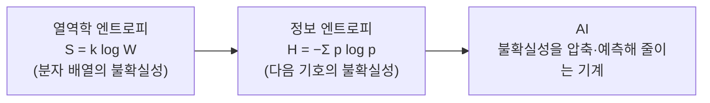

## 0. 공식 하나가 두 분야에 똑같이 있다

학생 때 열역학을 배우다 한 번 멈칫한 적이 있다. 엔트로피라는 양을 따라가다 보니, 어느 순간 이게 물리량인지 철학 개념인지 헷갈렸다. "무질서의 정도"라고 배웠는데, 그러면 질서란 무엇이고 무질서란 무엇인지를 먼저 정해야 했다. 물리 문제를 풀고 있었는데 정의의 문제 앞에 서 있었다.

한참 뒤에야 그게 우연이 아니란 걸 알았다. 같은 "엔트로피"라는 이름이 전혀 달라 보이는 두 분야에 똑같이 박혀 있었다. 열역학과 정보이론이다.

> **엔트로피는 열역학에서 정보이론으로 이름을 그대로 들고 건너갔다. 그리고 그 둘을 잇는 다리 위에 지금의 AI가 서 있다.**

## 1. 같은 모양의 두 식

볼츠만의 열역학 엔트로피는 `S = k log W` 다. 어떤 거시 상태를 만들 수 있는 미시 배열의 수(W)가 많을수록 엔트로피가 크다. 경우의 수가 많다는 건 그만큼 "어디에 있는지 모른다"는 뜻이다.

클로드 섀넌이 1948년 정보의 불확실성을 재는 양을 만들었을 때, 그 식은 `H = −Σ p log p` 였다. 모양이 볼츠만의 것과 같다. 전해지는 일화로, 섀넌이 이 양을 뭐라 부를지 폰 노이만에게 물었더니 "엔트로피라고 불러라, 아무도 엔트로피가 진짜 뭔지 모르니 논쟁에서 늘 유리할 것이다"라고 답했다고 한다. 농담 같지만 핵심을 찌른다. 두 엔트로피는 같은 것을 잰다. **불확실성의 양이다.**

열역학에서는 "분자가 어디 있는지 모르는 정도", 정보이론에서는 "다음에 무엇이 올지 모르는 정도". 단위와 맥락은 다르지만 재는 대상이 같다.

## 2. AI는 그 불확실성을 줄이는 기계다

여기서 AI로 한 걸음만 더 가면 된다. 언어 모델이 하는 일은 "다음에 올 토큰의 불확실성을 줄이는 것"이다. 학습이란 데이터의 엔트로피를 모델 안으로 압축하는 과정이고, 추론이란 그 압축된 것으로 다음을 예측해 불확실성을 줄이는 일이다. 그래서 AI를 깊이 들여다보면 또 엔트로피가 나온다. 열역학에서 만난 그 양이, 정보이론을 거쳐 AI의 한복판에 다시 있다.

*그림. 같은 '불확실성의 양'이 열역학 → 정보이론 → AI로 이름을 들고 건너간다.*

## 3. 깊이 들어가면 정의의 문제가 된다

내가 멈칫했던 지점으로 돌아온다. 엔트로피를 끝까지 따라가면 결국 "질서란 무엇인가", "정보란 무엇인가", "안다는 건 무엇인가"를 정의해야 했다. 과학이 깊어지면 철학으로 샌다는 말은 이걸 두고 하는 말 같다. 측정하고 계산하던 사람이, 어느 깊이부터는 "이게 정확히 무엇인가"를 정의하는 사람이 된다.

> **과학이 깊어지는 지점은 계산이 어려워지는 지점이 아니라, "이게 무엇인가"를 다시 정의해야 하는 지점이다.**

AI도 같다. 모델을 더 키우고 더 빠르게 만드는 일의 안쪽에는 "지능이란 무엇인가", "이해란 무엇인가", "맞다는 건 무엇인가"라는 정의의 문제가 깔려 있다. 그 정의를 누가 내리느냐가, 이 도구를 쓰는 사람과 휘둘리는 사람을 가른다.

## 4. 그래서 이 기억을 1편에 둔다

이 시리즈의 척추는 "실행이 공짜가 되면 비싸지는 건 정의하는 일이다"였다. 그 정의하는 일이 왜 철학인지를, 나는 거창한 이론이 아니라 오래전 열역학 수업에서 멈칫했던 그 순간으로 설명할 수 있다. 깊이 들어가면 결국 정의의 문제가 된다는 것. 그걸 한 번 몸으로 겪어 본 사람은, 도구가 답을 빠르게 내주는 시대에도 "그래서 이게 정확히 무엇을 묻는 문제냐"를 먼저 세울 수 있다.

이번 회차에서 정의한 건 이거다. **정의하는 일은 과학이 깊어진 자리에서 시작된다.** 다음 회차에서는 그 자리가 책상 위 도구 앞에서 어떻게 나타났는지를 적겠다.
