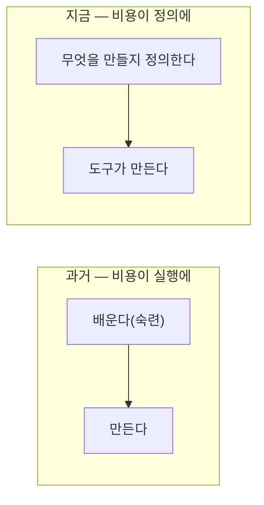

## 0. 말로 했더니 그려졌다

Figma와 Blender를 도구에 직접 붙여 봤다. MCP(Model Context Protocol, 도구를 모델에 연결하는 표준)로 이으니, 내가 만들고 싶은 화면을 글로 설명하면 디자인이 그려지고, 장면을 말하면 3D가 빚어졌다. Unity도 같은 방식으로 붙여 봤다.

처음 든 감정은 신기함이었는데, 곧 당혹으로 바뀌었다. 이걸 익히는 데 원래 얼마가 들었어야 하는지를 아니까. 디자인 툴의 패널과 단축키, 3D 소프트웨어의 좌표와 모디파이어. 그 진입 장벽이 통째로 사라진 자리에서, 나는 손이 아니라 말로 결과를 얻고 있었다.

> **"이걸 안 쓰는 게 이상하다." 도구를 직접 붙여 본 날 든 생각은 감탄이 아니라 그 한 줄이었다.**

(도구별로 어떻게 연결하고 무엇에 쓰는지의 구체적인 방법은 별도 시리즈에서 따로 다루겠다. 이 글은 그걸 붙여 보고 든 생각에 관한 것이다.)

## 1. 실행의 가격이 떨어졌다

예전에 무언가를 만드는 비용은 대부분 "실행"에 있었다. 만들 줄 아는 손, 그 손을 만드는 시간. 디자인을 하려면 디자인을 배워야 했고, 3D를 만들려면 3D를 배워야 했다. 그 배움의 비용이 곧 진입 장벽이었다.

도구가 그 실행을 대신하기 시작하면서 가격이 떨어졌다. 0이 된 건 아니지만, 비전문가가 "한번 해볼까" 할 수 있는 수준까지 내려왔다. 화면 하나, 장면 하나를 만드는 데 드는 비용이 숙련의 문제에서 의도의 문제로 바뀌었다.

*그림. 비용의 무게중심이 '실행(배워서 만든다)'에서 '정의(무엇을 만들지 정한다)'로 옮겨갔다.*

## 2. 그러면 무엇이 사람을 가르나

실행이 싸지면, 결과물의 차이는 실행 솜씨에서 안 나온다. 같은 도구를 쓰는 두 사람의 차이는 "무엇을 만들기로 했는가"에서 난다. 더 정확히는, **무엇을 원하는지 알고, 그것을 도구가 알아들을 만큼 정확히 말할 수 있는가**에서 난다.

직접 붙여 보며 그걸 체감했다. 막연하게 "예쁘게 해줘"라고 하면 막연한 게 나왔다. "이 정보를 위에, 이건 작게, 이 흐름을 강조"라고 정확히 말할수록 원하는 데 가까워졌다. 도구는 내 실행력을 대신해 줬지만, 내 의도를 대신 정해 주진 않았다. 의도가 흐릿하면 결과도 흐릿했다.

> **도구는 "어떻게 만들지"를 가져갔다. "무엇을 만들지"는 그대로 사람에게 남았다.**

## 3. 그래서 아이디어가 비싸졌다

여기서 이 시리즈의 척추와 만난다. 실행이 공짜에 가까워지면, 비싸지는 건 아이디어와 그것을 정의하는 능력이다. 만들 줄 아는 게 귀하던 시대가 있었고, 이제는 만들 가치가 있는 걸 알아보고 정확히 말하는 게 귀한 시대다.

이건 전문가만의 이야기가 아니다. 오히려 비전문가에게 더 직접적이다. 나는 디자이너가 아니어서 예전 같으면 디자인을 시작도 못 했겠지만, 지금은 "무엇을 보여주고 싶은가"만 분명하면 도구가 나머지를 한다. 막히는 건 도구의 실행력이 아니라 내 정의력이다.

이번 회차에서 정의한 건 이거다. **실행의 가격이 0에 가까워지면, 아이디어를 정의하는 일이 전부가 된다.** 그 정의가 가장 또렷하게 시험되는 자리 중 하나가 "무엇을 어디에 둘 것인가"였다. 다음 회차는 그 이야기다.
