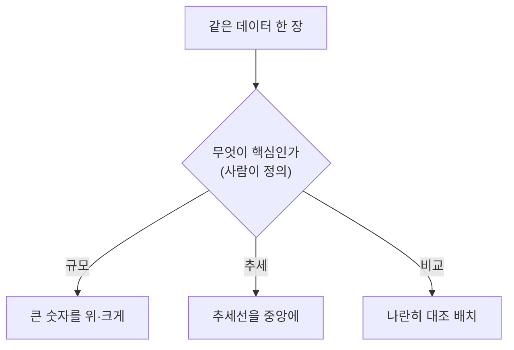

## 0. 도구가 다 해주는데 내가 막힌 지점

공개된 데이터를 발표자료로 정리하는 일을 한동안 했다. 슬라이드를 코드와 도구로 만드는 작업이었는데, 도구는 정말 많은 걸 해줬다. 표를 그리고, 색을 맞추고, 정렬을 잡고, 정해 둔 템플릿에 요소를 앉혔다. 손으로 하던 일은 거의 도구가 가져갔다.

그런데 내가 자꾸 멈추는 지점이 있었다. "이 장에서 무엇을 위에 둘까. 무엇을 크게, 무엇을 작게 둘까. 이 숫자를 강조할까, 이 흐름을 강조할까." 도구는 이걸 안 정해 줬다. 정확히는, 내가 정해 주기 전에는 그럴듯하지만 밋밋한 배치를 내놓았다.

> **도구는 예쁘게 배치한다. 무엇을 강조할지는 안 정해 준다. 그 자리가 사람의 자리였다.**

## 1. 의미적 레이아웃은 미감이 아니다

배치를 "디자인 감각"의 문제로 여기기 쉽다. 막상 해보면 아니었다. 한 장에서 무엇을 위에 두고 무엇을 키울지는, 결국 **무엇이 더 중요한지를 정하는 일**이었다. 그건 미감이 아니라 판단이다. 더 정확히는 우선순위의 정의다.

같은 데이터 한 장이라도, "규모가 핵심"이라고 정하면 큰 숫자가 맨 위로 가고, "변화 추세가 핵심"이라고 정하면 추세선이 중앙을 차지한다. 배치가 달라지는 이유는 도구의 솜씨가 달라서가 아니라, 내가 무엇을 핵심으로 정의했느냐가 달라서다. 레이아웃은 그 정의가 화면에 드러난 모양이다.

*그림. 배치는 미감이 아니라 "무엇이 핵심인가"의 정의가 화면에 드러난 결과다. 핵심을 다르게 정의하면 같은 데이터도 다르게 놓인다.*

## 2. 템플릿을 적용한다는 것도 판단이었다

정해 둔 템플릿에 내용을 앉히는 일도 단순 작업처럼 보였는데, 아니었다. "이 내용은 어느 틀에 맞는가"를 매번 판단해야 했다. 이 정보는 표가 맞나 카드가 맞나, 이건 한 장에 넣을 일인가 두 장으로 나눌 일인가. 템플릿은 선택지를 주지만, 이 내용에 어느 선택지가 맞는지는 정해 주지 않았다. 그것도 정의의 문제였다. 이 내용이 무엇인지를 먼저 정해야 어느 틀에 맞는지가 나왔다.

## 3. 도구가 잘할수록 또렷해지는 것

흥미로운 건, 도구가 배치를 잘할수록 이 판단의 자리가 더 또렷해졌다는 점이다. 도구가 못 그리던 시절에는 "어떻게 그리지"에 시간을 다 썼다. 도구가 잘 그리게 되자 그 시간이 비었고, 그 빈자리에 "그래서 무엇을 강조할 건데"라는 질문만 남았다. 실행이 사라진 자리에 판단이 도드라졌다.

> **도구가 실행을 잘할수록, 사람이 무엇을 정의했는지가 결과에 더 적나라하게 드러난다.**

밋밋한 발표자료와 또렷한 발표자료의 차이는 이제 도구 솜씨의 차이가 아니다. 만든 사람이 "무엇이 핵심인지"를 얼마나 분명히 정의했는지의 차이다.

## 4. 그래서 배치는 판단이다

이번 회차에서 정의한 건 이거다. **배치는 미감이 아니라 판단이고, 그 판단은 "무엇이 핵심인가"의 정의다.** 발표자료 한 장을 어디에 둘까를 고민하는 일은, 작게 보면 디자인이지만 크게 보면 우선순위를 정의하는 연습이었다.

도구가 실행을 가져간 시대에, 발표자료 한 장조차 결국 "나는 무엇을 가장 중요하다고 보는가"를 묻는다. 다음 회차에서는 그 정의를 도구에게 말로 옮기다 막혔던 이야기를 하겠다. 무엇이 핵심인지 알아도, 그걸 정확히 말하지 못하면 도구는 못 알아들었다.
