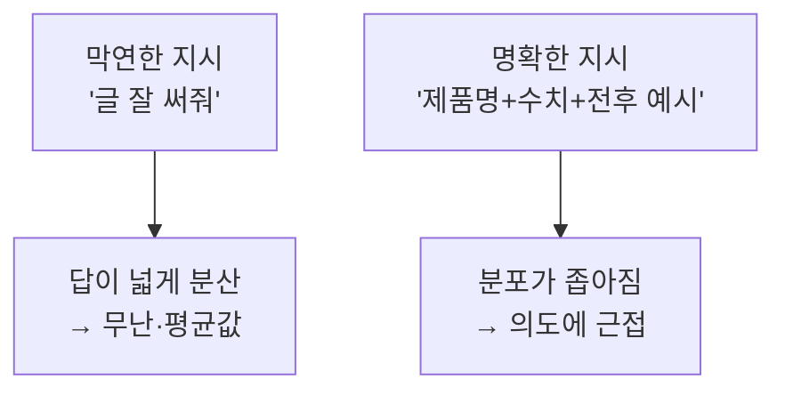

## 0. 도구는 멀쩡한데 결과가 어긋났다

도구에게 일을 시키다 자꾸 같은 자리에서 막혔다. 결과가 내가 원한 것과 어긋날 때, 처음엔 도구가 부족한 줄 알았다. 그런데 어긋난 결과를 들여다보면 대개 도구는 내가 시킨 그대로를 정확히 해냈다. 어긋난 건 내 지시였다. 내가 머릿속으로 원한 것과, 입으로 말한 것이 달랐다.

> **도구가 못 만든 게 아니었다. 내가 제대로 정의하지 못한 거였다.**

이게 이 시리즈에서 가장 아팠던 깨달음이다. 만들 능력이 모자란 줄 알았는데, 말할 능력이 모자랐다.

## 1. "글이 얕다"는 막연한 말

이 블로그를 만들며 정확한 예를 겪었다. 어느 날 내가 쓴 글들이 마음에 안 들었다. 도구에게 "글이 얕다, 깊이가 없다"고 했다. 막연한 지적이었고, 결과도 막연하게만 조금 나아졌다.

내가 원한 걸 정확히 풀어 말하고 나서야 결과가 바뀌었다. "하드웨어를 설명할 때는 실제 제품명과 스펙 수치를 넣어라", "비유만 쓰지 말고 그 앞에 실제 작동 원리를 먼저 설명해라", "쉽게 시작하되 실제 복잡함까지 끝까지 데려가라." 이렇게 말하자 글이 눈에 띄게 달라졌다. 도구가 그새 좋아진 게 아니다. 같은 도구, 같은 날. 달라진 건 내가 무엇을 원하는지를 얼마나 정확히 말했느냐뿐이었다.

## 2. 그래서 든 후회

여기서 오래된 후회가 떠올랐다. 이런 시대가 오기 전에 차라리 책을 더 읽어 둘걸. 처음엔 막연한 감상인 줄 알았는데 따져 보니 정확한 진단이었다. 도구가 실행을 다 해주는 시대에 내 병목은 실행이 아니라 정의다. 그리고 무언가를 정확히 정의하는 힘은 결국 읽고 생각하며 쌓은 언어에서 나온다.

> **만들 줄 아는 게 귀하던 시대에는 기술을 익히는 게 답이었다. 정확히 말하는 게 귀해진 시대에는 읽고 생각하고 쓰는 게 답이다.**

그래서 "나는 개발자가 아니라 못 만든다"는 점점 틀린 말이 되어 간다. 정확한 말은 "나는 아직 그걸 정확히 정의하지 못했다"이다. 앞은 능력의 문제고 뒤는 연습의 문제다. 이 블로그를 쓰는 것 자체가 그 연습이다. 막연한 생각을 글로 정의해 보는 일. 다음 회차에서는 한 번 내린 정의를 다시 내리지 않으려고 무엇을 했는지를 적겠다.

---

## 그래서 이걸 뭐라고 부르냐면

"도구에게 정확히 말해야 잘 작동한다"는 내 느낌의 정확한 이름은 **프롬프트 엔지니어링(prompt engineering)** 이다. 그리고 막연하면 왜 나쁜 답이 나오는지에는 분명한 메커니즘이 있다.

언어 모델은 다음에 올 토큰을 확률로 고르는 기계다. 지시가 막연하면 거기 이어질 수 있는 "그럴듯한 답"의 경우의 수가 넓게 퍼지고, 모델은 그 넓은 분포에서 가장 무난한 평균값을 고른다. 그래서 막연한 요청엔 틀리진 않지만 밋밋한 답이 나온다. 제약을 붙이면 이 분포가 좁아진다. "글 잘 써줘"는 출력이 수만 갈래지만 "제품명과 수치를 넣어라"는 그 공간을 확 좁혀, 내가 원하던 자리에 가깝게 떨어뜨린다. **정확히 정의한다는 건 모델이 고를 답의 분포를 내 쪽으로 좁히는 일**이다.

*그림. 같은 모델이라도 지시의 명확도가 출력 분포의 너비를 정한다.*

분포를 좁히는 기법들은 이름과 근거가 있다.

| 기법 | 무엇을 하나 |
|---|---|
| 구체성(specificity) | 형식·길이·포함 항목을 못 박음 |
| 역할 지정(role) | "너는 데이터 분석가다" 식 맥락 부여 |
| Few-shot 예시 | 입력-출력 예시 몇 개로 패턴을 시연 |
| Chain-of-Thought | "단계적으로 풀어라"로 추론을 끌어냄 |
| 출력 형식 지정 | 표/JSON 등 형태를 명시 |

빈말이 아니라는 건 수치로 나온다. Chain-of-Thought를 처음 보인 연구(Wei et al., 2022)에서 PaLM 540B는 GSM8K 수학 문제를 일반 few-shot으로 **17.7%**밖에 못 맞혔는데, "단계적으로 풀어라"를 더하자 **58.1%**로 뛰었다. 모델은 그대로다. 바뀐 건 지시의 구조뿐이다.

그러니 흔히 말하는 "요구 정의"가 도구와 일할 때는 곧 프롬프트 엔지니어링이다. "설명을 못 한다"는 재능의 문제가 아니라 익히면 느는 기법의 문제다. 다만 그 바탕에는 "내가 무엇을 원하는지 아는가"가 깔려 있다. 원하는 걸 모르면 어떤 기법으로도 못 좁힌다.

- 핵심 용어: 프롬프트 엔지니어링 · 출력 분포 좁히기 · few-shot · Chain-of-Thought · role
- 출처: [Wei et al., Chain-of-Thought, arXiv 2201.11903](https://arxiv.org/abs/2201.11903) · [Brown et al., GPT-3 Few-Shot, arXiv 2005.14165](https://arxiv.org/abs/2005.14165)
