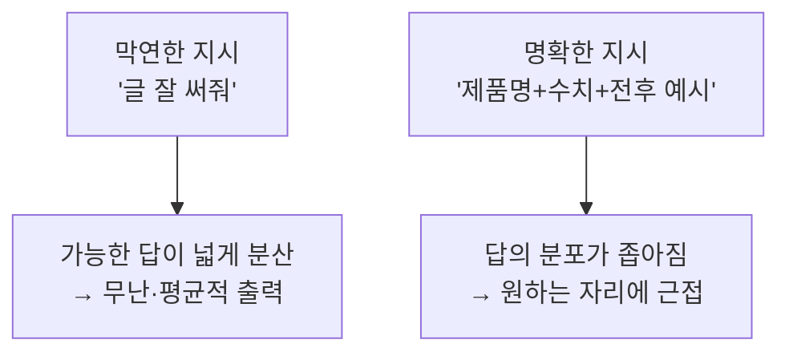

## 0. 도구는 멀쩡한데 결과가 어긋났다

도구에게 일을 시키다 자꾸 같은 자리에서 막혔다. 결과가 내가 원한 것과 어긋날 때, 처음엔 도구가 부족한 줄 알았다. 그런데 어긋난 결과를 들여다보면 대개 도구는 내가 시킨 그대로를 정확히 해냈다. 어긋난 건 내 지시였다.

이걸 "설명을 잘하자"는 감상으로 끝내면 일기다. 기술적으로 보면 이건 **프롬프트 엔지니어링(prompt engineering)** 의 문제다. 막연한 지시가 왜 나쁜 답을 부르는지에는 또렷한 메커니즘과, 그걸 다루는 정해진 기법들이 있다.

> **막연한 지시가 막연한 답을 부르는 건 도구가 게을러서가 아니다. 언어 모델의 작동 원리상 당연한 결과다.**

## 1. 왜 막연하면 나쁜 답이 나오는가 — 메커니즘

언어 모델은 다음에 올 토큰을 확률로 고르는 기계다. 지시가 막연하면, 그 지시에 이어질 수 있는 "그럴듯한 답"의 경우의 수가 넓게 퍼진다. 모델은 그 넓은 분포에서 가장 무난하고 평균적인 쪽을 고른다. 그래서 막연한 요청에는 틀리진 않지만 밋밋한, 누구에게나 할 법한 답이 나온다.

지시에 제약을 붙이면 이 분포가 좁아진다. "글을 잘 써줘"는 가능한 출력이 수만 갈래지만, "하드웨어를 설명할 때 실제 제품명과 스펙 수치를 넣어라"는 출력 공간을 확 좁힌다. 좁아진 만큼 내가 원하던 자리에 가깝게 떨어진다. **정의를 정확히 한다는 건, 모델이 고를 수 있는 답의 분포를 내가 원하는 쪽으로 좁혀 주는 일**이다.

*그림. 같은 모델이라도 지시의 명확도가 출력 분포의 너비를 정한다. 막연하면 넓게 퍼져 평균값이 나오고, 구체적이면 좁아져 의도에 닿는다.*

## 2. 그래서 정해진 기법이 있다 — 프롬프트 엔지니어링

"명확히 하라"는 막연한 조언이 아니다. 출력 분포를 좁히는 구체적 기법들이 이름과 근거를 갖고 정리돼 있다.

| 기법 | 무엇을 하나 | 분포를 좁히는 방식 |
|---|---|---|
| 구체성·제약(specificity) | 형식·길이·포함 항목을 못 박음 | 조건 밖 출력을 잘라냄 |
| 역할 지정(role) | "너는 데이터 분석가다" 식 맥락 부여 | 그 역할의 어투·관점으로 한정 |
| Few-shot 예시 | 입력-출력 예시 몇 개를 보여줌 | 원하는 패턴을 직접 시연해 모방시킴 |
| Chain-of-Thought | "단계적으로 풀어라"로 추론을 끌어냄 | 곧장 답하지 말고 중간 단계를 거치게 함 |
| 출력 형식 지정 | 표/JSON/마크다운 등 형태 명시 | 형태의 불확실성 제거 |

이게 빈말이 아니라는 건 수치로 나온다. Chain-of-Thought를 처음 보인 연구(Wei et al., 2022)에서, PaLM 540B 모델은 GSM8K 수학 문제를 일반 few-shot으로는 **17.7%**밖에 못 맞혔는데, "단계적으로 풀어라"는 지시를 더하자 **58.1%**로 뛰었다. 모델은 그대로다. 바뀐 건 지시의 구조뿐이다. Few-shot 프롬프팅 자체도 GPT-3 논문(Brown et al., 2020)이 "예시 몇 개만 보여주면 별도 학습 없이 따라 한다"를 보이며 자리 잡은 기법이다.

> **같은 모델, 같은 문제. 지시를 17.7%짜리에서 58.1%짜리로 바꾸는 건 모델이 아니라 사람이다.**

## 3. 내 사례 — "글이 얕다"에서 정확한 정의로

이 블로그에서 정확히 그걸 겪었다. 어느 날 내가 쓴 글들이 마음에 안 들어서 도구에게 "글이 얕다, 깊이가 없다"고 했다. 막연한 지시였고, 결과도 막연하게만 조금 나아졌다. 출력 분포를 거의 안 좁혔으니 당연한 결과다.

그다음 내가 한 건 위 표의 기법을 그대로 쓴 것이었다. 막연한 불만을 구체적 제약으로 바꿨다.

- (구체성) "하드웨어를 설명할 때는 반드시 실제 제품명과 스펙 수치를 넣어라."
- (순서·구조 지정) "비유만 쓰지 말고, 그 앞에 실제 메커니즘을 먼저 설명한 뒤 비유를 붙여라."
- (난이도 곡선 지정) "개념 글은 쉽게 시작하되 실제 복잡함까지 끝까지 데려가라."

도구의 성능이 그새 좋아진 게 아니다. 내가 출력 분포를 좁힐 제약을 정확히 정의한 것뿐이다. "글이 얕다"(분포 안 좁힘)와 "제품명·수치를 넣어라"(분포 좁힘)의 차이가, 밋밋한 글과 또렷한 글의 차이로 그대로 나왔다.

## 4. 요구 정의 = 프롬프트 엔지니어링

여기서 이 시리즈의 단어와 만난다. 흔히 "요구 정의"라 부르는 것이, 도구와 일할 때는 곧 프롬프트 엔지니어링이다. 둘은 같은 일의 다른 이름이다. 무엇을 원하는지 정확히 정해서, 모델이 고를 답의 분포를 그쪽으로 좁히는 일.

그래서 "나는 설명을 못 한다"는 막연한 자책도 정확히 다시 정의할 수 있다. 그건 재능의 문제가 아니라 **기법의 문제**다. 출력 분포를 좁히는 방법(구체성·역할·예시·단계 유도·형식 지정)은 배우고 연습하면 는다. 막막한 "잘 말하기"가 아니라, 이름 붙은 도구 상자다.

물론 이 기법들의 바탕에는 결국 "내가 무엇을 원하는지 아는가"가 깔려 있다. 원하는 걸 모르면 어떤 기법으로도 못 좁힌다. 그래서 프롬프트 엔지니어링의 절반은 기법이고, 절반은 자기 의도를 먼저 정의하는 일이다. 읽고 생각하며 쌓은 언어가 그 절반을 받친다.

## 5. 그래서 못 만든 게 아니라 못 정의한 것이다

이번 회차에서 정의한 건 이거다. **도구와 일하다 막히는 많은 순간은 실행의 한계가 아니라 정의의 한계이고, 그 정의를 다루는 기술이 프롬프트 엔지니어링이다.** 막연하면 모델은 넓은 분포의 평균을 돌려주고, 정확히 정의하면 그 분포가 좁아져 의도에 닿는다.

"나는 개발자가 아니라 못 만든다"는 점점 틀린 말이 된다. 정확한 말은 "나는 아직 그걸 충분히 좁혀 정의하지 못했다"이다. 앞은 능력의 문제고, 뒤는 익히면 되는 기법의 문제다. 다음 회차에서는 한 번 내린 정의를 다시 내리지 않으려고 무엇을 했는지를 적겠다.

---

## 출처

- Wei et al., "Chain-of-Thought Prompting Elicits Reasoning in Large Language Models" (GSM8K 17.7%→58.1%, PaLM 540B), arXiv 2201.11903, https://arxiv.org/abs/2201.11903
- Brown et al., "Language Models are Few-Shot Learners" (GPT-3, few-shot), arXiv 2005.14165, https://arxiv.org/abs/2005.14165
- K2view, "Prompt Engineering Techniques (zero/few-shot·CoT·role·self-consistency)", https://www.k2view.com/blog/prompt-engineering-techniques/
