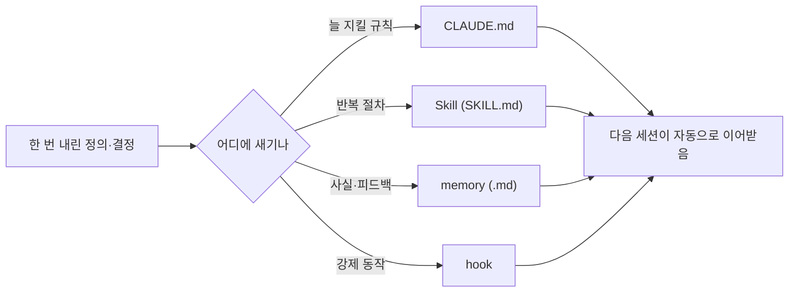

## 0. 도구는 어제를 기억하지 않는다

도구와 며칠 일해 보면 금방 벽에 부딪힌다. 어제 길게 설명해 합의한 규칙을, 오늘 새 대화에서 도구가 기억하지 못한다. 매번 처음부터 다시 설명해야 한다면, 자동화가 벌어준 시간을 설명에 도로 까먹는다.

그래서 한 가지 원칙을 세웠다. **한 번 한 일은 다시 하지 않는다.** 한 번 내린 결정, 한 번 정리한 절차, 한 번 합의한 규칙은 글로 적어 두고 다음이 이어받게 한다.

> **자동화는 시간을 벌어 준다. 그 시간을 다음으로 넘기는 건 기록이다. 기록 없는 자동화는 매번 1일차로 돌아간다.**

## 1. 적어 두지 않은 결정은 또 고민하게 된다

이걸 안 했을 때 어떤 일이 벌어지는지 겪었다. 어딘가 적어 두지 않은 결정은, 며칠 뒤 똑같은 고민을 처음부터 다시 하게 만들었다. 분명 전에 정했는데 왜 또 같은 자리에 있지, 하는 순간들. 그건 도구가 느려서가 아니라 내가 정의를 휘발시켰기 때문이었다.

그래서 규칙이 생길 때마다 문서에 박기 시작했다. "외부 이미지는 핫링크하지 말고 받아서 쓴다", "하드웨어는 제품명과 수치를 반드시 넣는다", "글 사이 링크는 이렇게 건다." 한 번 정한 건 다시 논쟁하지 않으려고 적어 둔 것이다. 핵심은 이걸 사람만 보는 게 아니라 도구도 본다는 점이다. 작업을 시작할 때 도구가 그 문서를 먼저 읽으면, 어제 합의한 정의가 오늘 그대로 적용된다.

## 2. 무엇을 다시 하지 "않을지"를 정하는 일

이건 일을 자동화하는 게 아니라, 일을 정의하는 일 자체를 다시 하지 않도록 만드는 것이다. 그리고 이것도 정의의 문제다. 앞 회차들이 "무엇을 할지"의 정의였다면, 이건 "무엇을 한 번 정하고 다시는 안 건드릴지"의 정의다. 한 번 옳게 정해 둔 것은 다시 묻지 않는다. 그래야 새로 정의할 가치가 있는 것에 힘을 쓸 수 있다.

> **메타 자동화는 "무엇을 다시 하지 않을지"를 정의하는 일이다. 기록이 그 정의를 다음으로 넘긴다.**

이 블로그 자체가 그 장치다. 결정을 글로 공개하면 그 정의가 흩어지지 않는다. 다음 회차에서는 그렇게 새긴 정의가 "맞는지"를 어떻게 확인했는지, 내가 맞다고 착각했다 뒤집은 사건을 적겠다.

---

## 그래서 이걸 뭐라고 부르냐면

"나중을 위해 기록해 두는 게 중요하다"는 내 느낌은, Claude Code에서는 정해진 **장치**로 구현된다. 모델은 대화(컨텍스트 창)가 끝나면 그 안을 잊으므로, 정의를 사람 머릿속이 아니라 도구가 읽는 파일에 새겨야 다음 세션이 이어받는다. 장치는 네 가지다.

| 장치 | 형식 | 새기는 것 | 언제 작동 |
|---|---|---|---|
| `CLAUDE.md` | 지침 파일 | 늘 지킬 규칙 | 세션 시작 시 자동 주입 |
| 스킬(Skill) | 폴더 + `SKILL.md` | 반복 작업의 절차 | 작업이 맞을 때만 본문 로드 |
| 메모리(memory) | `.md` 묶음 | 세션 간 남길 사실·피드백 | 관련될 때 불러옴 |
| 훅(hook) | `settings.json` 스크립트 | 꼭 매번 일어나야 할 동작 | 특정 이벤트에 자동 실행 |

가장 강력한 건 **스킬**이다. 폴더 하나에 `SKILL.md`를 두고, 맨 위 frontmatter의 `description`이 "언제 이걸 불러올지"를 정한다.

```markdown
---
name: pptx-deck
description: 16:9 발표자료 PPT를 코드로 만들 때 사용. 표지·본문 레이아웃
  헬퍼와 카드 자동정렬 규칙을 적용한다.
---
1. 표지는 ... (절차)
2. 본문 카드는 글자 수에 맞춰 높이 자동 조정 ...
```

한 번 이렇게 절차를 적어 두면, 다음부터는 "발표자료 만들어줘" 한마디에 도구가 description을 보고 이 스킬을 스스로 불러와 같은 규칙으로 만든다. 절차를 매번 다시 설명할 필요가 없다.



*그림. 정의의 성격에 따라 새기는 장치가 다르다. CLAUDE.md는 항상 지킬 규칙, 스킬은 반복 절차, 메모리는 사실·피드백, 훅은 강제 동작.*

CLAUDE.md와 스킬·메모리가 "부탁"(읽고 따라 주길 기대)이라면, 훅은 "보장"이다. 꼭 매번 같은 방식으로 일어나야 하는 동작(저장 후 포매팅, 커밋 전 검사)은 모델의 선의가 아니라 코드로 강제한다. 정해진 시점에 정해진 코드가 무조건 실행된다.

그러니 "기록하자"의 정확한 기술 표현은 이거다. **무엇을 다시 정의하지 않을지를 정하고, 그 성격에 맞는 장치(CLAUDE.md·스킬·메모리·훅)에 새기는 것.** 무엇을 어느 장치에 둘지 분류하는 일 자체가 사람이 내리는 정의다.

- 핵심 용어: `CLAUDE.md` · 스킬(`SKILL.md`, description 기반 로딩) · 메모리 · 훅(보장 vs 부탁)
