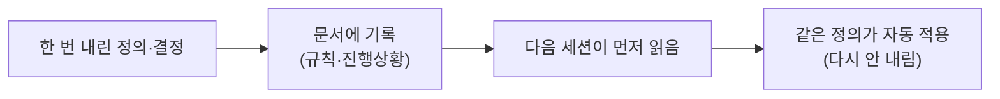

## 0. 도구는 어제를 기억하지 않는다

도구와 며칠 일해 보면 금방 부딪히는 벽이 있다. 어제 길게 설명해 합의한 규칙을, 오늘 새 대화에서 도구가 기억하지 못한다. 매번 처음부터 다시 설명해야 한다면, 자동화가 벌어준 시간을 설명하는 데 도로 까먹는다.

> **도구가 빨라도, 같은 정의를 매일 다시 내려야 한다면 남는 게 없다.**

그래서 한 가지 원칙을 세웠다. **한 번 한 일은 다시 하지 않는다.** 한 번 내린 결정, 한 번 정리한 절차, 한 번 합의한 규칙은 글로 적어 두고 다음이 이어받게 한다.

## 1. 결정을 글로 굳혀 두기

이 블로그를 운영하며 규칙이 생길 때마다 문서에 박았다. "외부 이미지는 핫링크하지 말고 받아서 쓴다", "하드웨어는 제품명과 수치를 반드시 넣는다", "글 사이 링크는 특정 태그를 쓰지 말고 경로로 건다". 한 번 정한 건 다시 논쟁하지 않으려고 적어 둔 것이다.

핵심은 이걸 사람만 보는 게 아니라 도구도 본다는 점이다. 작업을 시작할 때 도구가 그 문서를 먼저 읽으면, 어제 합의한 정의가 오늘 그대로 적용된다. 기록이 사람과 도구 사이의 기억 역할을 한다.

*그림. 결정을 기록으로 굳히면, 다음 작업이 그 정의를 이어받는다. 같은 일을 다시 하지 않는다.*

## 2. 무엇을 다시 하지 "않을지"를 정하는 일

이걸 메타 자동화라고 부른다. 일을 자동화하는 게 아니라, **일을 정의하는 일 자체를 다시 하지 않도록 자동화**하는 것이다. 그리고 이것도 결국 정의의 문제다. "무엇을 한 번 정하고 다시는 안 건드릴 것인가"를 정하는 일이기 때문이다.

흥미로운 건 방향이 반대라는 점이다. 앞 회차들의 정의가 "무엇을 할지"였다면, 이건 "무엇을 다시 안 할지"의 정의다. 한 번 옳게 정해 둔 것은 다시 묻지 않는다. 그래야 새로 정의할 가치가 있는 것에 힘을 쓸 수 있다.

> **메타 자동화는 "무엇을 다시 하지 않을지"를 정의하는 일이다. 기록이 그 정의를 다음으로 넘긴다.**

## 3. 기록이 없으면 매번 처음으로 돌아간다

이 원칙이 없을 때 어떤 일이 벌어지는지도 겪었다. 어딘가 적어 두지 않은 결정은, 며칠 뒤 똑같은 고민을 처음부터 다시 하게 만들었다. 분명 전에 정했는데 왜 또 같은 자리에 있지, 하는 순간들. 그건 도구가 느려서가 아니라 내가 정의를 휘발시켰기 때문이었다.

자동화는 시간을 벌어 준다. 그런데 그 시간을 다음으로 넘기는 건 기록이다. 기록 없는 자동화는 매번 1일차로 돌아간다. 빠른 도구를 매일 새로 가르치는 일만큼 허무한 게 없다.

## 4. 그래서 기록이 정의를 다음으로 넘긴다

이번 회차에서 정의한 건 이거다. **메타 자동화는 "무엇을 다시 정의하지 않을지"를 정하는 일이고, 그걸 가능하게 하는 건 기록이다.** 한 번 내린 정의를 글로 굳혀 두면, 그 정의는 다음 작업으로, 다음 사람으로, 다음 도구로 넘어간다.

이 블로그 자체가 그 장치다. 결정을 글로 공개하면 그 정의가 흩어지지 않는다. 다음 회차에서는 그 정의가 "맞는지"를 어떻게 확인했는지, 그리고 내가 맞다고 착각했다가 뒤집은 사건을 적겠다. 정의를 내리는 것만큼 중요한 게, 그 정의가 맞는지 검증하는 일이었다.
