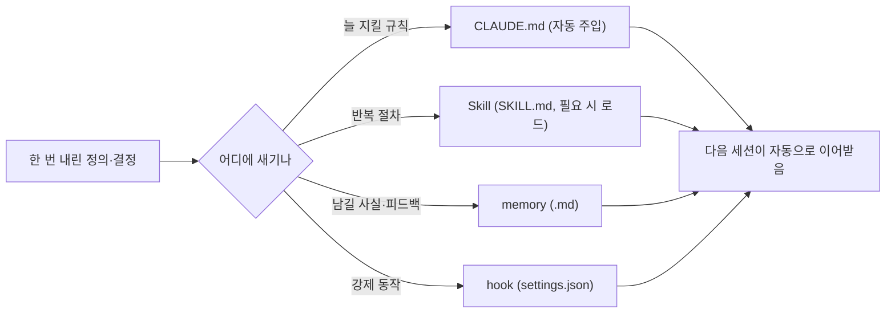

## 0. 도구는 어제를 기억하지 않는다

도구와 며칠 일해 보면 금방 벽에 부딪힌다. 어제 길게 설명해 합의한 규칙을, 오늘 새 대화에서 도구가 기억하지 못한다. 모델은 대화(컨텍스트 창)가 끝나면 그 안의 내용을 잊는다. 매번 처음부터 다시 설명해야 한다면, 자동화가 벌어준 시간을 설명에 도로 까먹는다.

"그러니 기록하자"로 끝내면 일기다. 중요한 건 **무엇에 어떻게 새기느냐**다. Claude Code에는 한 번 내린 정의를 다음 세션이 자동으로 이어받게 하는 구체적인 장치가 있다. CLAUDE.md, 스킬(Skill), 메모리(memory), 훅(hook). 이 글은 그 장치 이야기다.

> **"기록하자"는 감상이고, "어느 장치에 어떻게 새기느냐"가 기술이다. 정의를 사람 머릿속이 아니라 도구가 읽는 파일에 새겨야 다음으로 넘어간다.**

## 1. 네 가지 장치 — 무엇을 어디에 새기나

| 장치 | 형식 | 새기는 것 | 언제 작동 |
|---|---|---|---|
| `CLAUDE.md` | 프로젝트/사용자 지침 파일 | 늘 지켜야 할 규칙 | 세션 시작 시 자동으로 컨텍스트에 주입 |
| 스킬(Skill) | 폴더 + `SKILL.md` | 반복 작업의 절차·노하우 | 작업이 그 스킬과 맞을 때만 본문 로드 |
| 메모리(memory) | `.md` 파일 묶음 | 세션 간 남길 사실·피드백 | 관련될 때 불러와 참고 |
| 훅(hook) | `settings.json`의 스크립트 | "꼭 매번 일어나야 할 동작" | 특정 이벤트(저장·커밋 등)에 자동 실행 |

핵심 차이는 "로딩 방식"이다. CLAUDE.md는 매번 전부 읽히니 항상 지킬 핵심 규칙만 둔다. 스킬은 평소엔 이름과 한 줄 설명(description)만 떠 있다가 작업이 맞을 때만 펼쳐지니, 무거운 절차를 잔뜩 등록해도 컨텍스트가 가볍다.

## 2. 스킬 — 절차를 한 번 정의하면 다시 안 짠다

가장 강력한 장치는 스킬이다. 스킬은 폴더 하나에 `SKILL.md`를 두는 구조고, 그 맨 위 frontmatter의 `description`이 "언제 이걸 불러올지"를 정한다.

이 코드를 보이는 목적은, "한 번 정리한 절차"가 어떻게 파일 한 장으로 굳는지를 보이기 위해서다.

```markdown
---
name: pptx-deck
description: 16:9 발표자료 PPT를 코드로 만들 때 사용. 표지·본문·마무리 레이아웃
  헬퍼와 카드 자동정렬 규칙을 적용한다.
---
1. 표지는 ... (절차)
2. 본문 카드는 글자 수에 맞춰 높이 자동 조정 ...
```

한 번 이렇게 절차를 적어 두면, 다음부터는 "발표자료 만들어줘" 한마디에 도구가 description을 보고 이 스킬을 스스로 불러와 같은 규칙으로 만든다. 발표자료 만드는 법을 매번 다시 설명할 필요가 없다. **절차를 한 번 정의해 파일로 굳히는 일** — 그게 스킬이다.

## 3. CLAUDE.md와 메모리 — 규칙과 사실을 이어붙이기

스킬이 "절차"라면, CLAUDE.md는 "늘 지킬 규칙"이다. 이 블로그에는 규칙이 생길 때마다 문서에 박았다. "외부 이미지는 핫링크하지 말고 받아서 쓴다", "하드웨어는 제품명과 수치를 반드시 넣는다". 세션이 시작될 때 이 파일이 자동으로 도구의 컨텍스트에 들어가므로, 어제 합의한 정의가 오늘 그대로 적용된다.

메모리는 한 발 더 간다. 세션을 넘어 남겨야 할 사실·피드백을 `.md` 파일로 적고, 관련될 때 도구가 불러온다. 이 블로그도 "글이 얕으면 안 된다 — 제품·수치로 깊이를 확보하라"는 피드백을 메모리에 새겨, 다음 세션이 그 교훈을 잊지 않게 했다. 사람의 피드백이 한 번으로 끝나지 않고 장치에 남는다.



*그림. 정의의 성격에 따라 새기는 장치가 다르다. 늘 지킬 규칙은 CLAUDE.md, 반복 절차는 스킬, 사실·피드백은 메모리, 강제 동작은 훅. 네 장치가 다음 세션으로 정의를 넘긴다.*

## 4. 훅 — 부탁이 아니라 보장

규칙을 글로 적어 둬도, 모델이 매번 지킬 확률이 높을 뿐 100%는 아니다. "꼭 매번 같은 방식으로 일어나야 하는 동작"은 부탁이 아니라 코드로 강제해야 한다. 그게 훅이다. 저장 직후 포매터를 돌리거나, 커밋 전 검사를 거치게 하는 식으로, 정해진 시점에 정해진 코드가 무조건 실행된다. 같은 점검을 매번 손으로 하지 않으려고 한 번 걸어 두는 장치다.

> **부탁(프롬프트)은 확률을 높이고, 훅은 보장을 만든다. 둘 다 "다시 안 할 일"을 장치에 새기는 방식이다.**

## 5. 그래서 메타 자동화는 "안 할 일"의 정의다

이 네 장치가 하는 일은 결국 하나다. **무엇을 다시 정의하지 않을지를 정하고, 그걸 도구가 읽는 파일에 새기는 것.** 일을 자동화하는 게 아니라, 일을 정의하는 일 자체를 다시 하지 않도록 자동화하는 것이다.

그리고 이것도 정의의 문제다. 앞 회차들이 "무엇을 할지"의 정의였다면, 이건 "무엇을 한 번 정하고 다시는 안 건드릴지"의 정의다. 무엇을 CLAUDE.md에 둘지(늘 지킬 것), 무엇을 스킬로 굳힐지(반복 절차), 무엇을 훅으로 강제할지(보장할 것). 이 분류 자체가 사람이 내리는 정의다.

이번 회차에서 정의한 건 이거다. **메타 자동화는 "다시 안 할 일"을 정하고 그것을 장치(CLAUDE.md·스킬·메모리·훅)에 새기는 일이다.** 기록이 없으면 매번 1일차로 돌아가고, 장치에 새긴 정의는 다음 세션·다음 사람·다음 도구로 넘어간다. 다음 회차에서는 그렇게 새긴 정의가 "맞는지"를 어떻게 확인했는지, 내가 맞다고 착각했다 뒤집은 사건을 적겠다.
