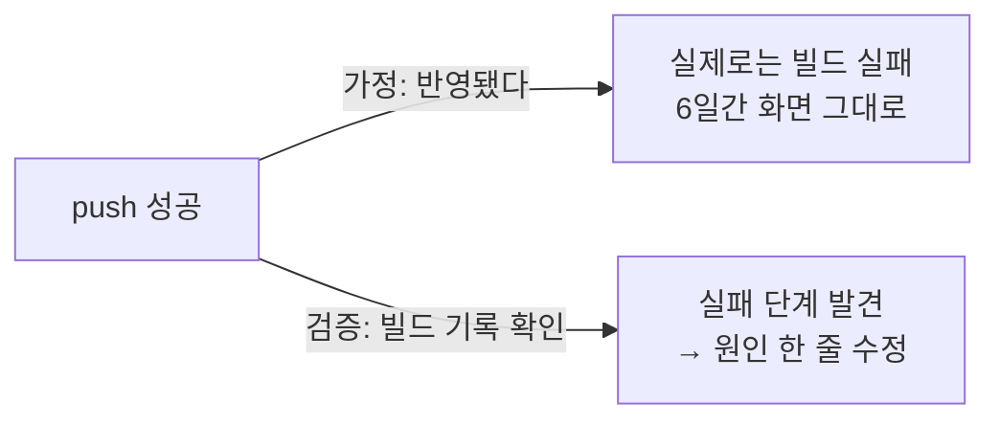

## 0. 확신에 차서 틀렸다

이 블로그를 운영하다 두 번, 확신에 차서 틀렸다. 둘 다 "맞다고 생각한 것"과 "실제로 맞는 것" 사이의 거리를 보여준 사건이라 기록해 둔다. 정의하는 일만큼 중요한 게, 그 정의가 맞는지 확인하는 일이었다.

> **추측은 아무리 그럴듯해도 검증이 아니다. 그리고 그 둘을 구분하는 일이 사람에게 남는다.**

## 1. "발행 자동화가 멈췄다"는 6일짜리 착각

매일 글을 자동 발행하도록 예약 작업(cron)을 걸어 뒀다. 어느 날부터 발행이 안 되는 것처럼 보였고, 도구는 "자동화가 멈췄다"고 단정했다. 나도 그 말을 며칠 받아들였다. 그럴듯했으니까. 그 며칠 동안 "멈춘 자동화"를 전제로 손으로 발행을 메웠다.

뒤늦게 실제로 확인해 봤다. 예약 작업의 실행 기록을 직접 조회하니, **자동화는 매일 정상으로 돌고 있었다.** 멈춘 게 아니었다. 우리가 매번 발행 대기열을 손으로 비워 둬서, 자동화가 돌 시각엔 발행할 게 없어 그냥 지나갔던 것뿐이다. "멈췄다"는 건 관찰이 아니라 추측이었고, 그 추측을 며칠간 사실로 믿었다.

기록을 한 줄 직접 들여다본 5분이, 6일짜리 착각을 끝냈다.

## 2. 사이트가 6일간 안 바뀌는데 아무도 몰랐다

더 뼈아픈 두 번째. 글을 열심히 써서 저장소에 올렸다. 올리는 작업(push)은 매번 성공했다. 그래서 "됐다"고 가정했다. 그런데 정작 사이트 화면은 6일째 그대로였다.

원인은 글 하나에 들어간 잘못된 링크 한 줄이었다. 그 한 줄 때문에 사이트를 새로 짓는 빌드가 매번 실패하고 있었다. push는 성공했지만 빌드는 깨졌고, 그래서 글은 올라갔는데 화면엔 안 보였다. "push 성공 = 반영 완료"라는 가정이 6일을 가린 것이다.

이번에도 끝낸 건 직접 확인이었다. 빌드 기록을 열어 보니 "실패"가 줄줄이 찍혀 있었고, 실패한 단계를 따라가니 그 링크 한 줄이 나왔다. 고치고 다시 올리니 밀려 있던 글이 한 번에 다 떴다.

*그림. 같은 'push 성공'에서, 가정은 6일을 가렸고 검증(빌드 기록 확인)은 원인을 찾았다.*

## 3. 검증은 "맞음"을 정의하는 일이다

두 사건의 공통점은 분명하다. 그럴듯한 가정을 사실로 착각했다는 것. 그리고 둘 다 "실제 기록을 직접 본다"는 단순한 행위로 끝났다는 것.

여기서 검증이 무엇인지가 드러난다. 검증은 "맞는지 느끼는 일"이 아니라 **"무엇을 맞음으로 칠지 정하고, 그 증거를 직접 보는 일"**이다. 발행이 "됐다"는 건 push가 성공한 게 아니라 사이트 화면에 떠야 맞음이다. 자동화가 "돈다"는 건 그래야 할 것 같은 게 아니라 실행 기록에 성공이 찍혀야 맞음이다. 맞음의 기준을 정확히 정의하지 않으면, 그럴듯한 추측이 그 자리를 대신 차지한다.

> **검증은 맞음의 기준을 정의하고 그 증거를 직접 확인하는 일이다. 기준이 흐리면 추측이 검증인 척 들어앉는다.**

## 4. 도구가 빠를수록 검증이 중요해진다

도구는 빠르고 확신에 차 있다. "멈췄다", "됐다"를 망설임 없이 말한다. 그 확신이 사람의 검증을 대신하지는 못한다. 오히려 도구가 빠를수록, 틀린 가정도 빠르게 굳는다. 6일을 가린 두 사건 모두, 도구의 확신을 사람이 받아들이고 검증을 미룬 시간이었다.

그래서 검증은 도구가 가져갈 수 없는 사람의 자리다. 무엇을 맞음으로 칠지 정하고, 증거를 직접 보겠다고 고집하는 일. 이건 기술이 아니라 태도에 가깝다.

이번 회차에서 정의한 건 이거다. **검증은 맞음을 정의하고 증거를 직접 보는 일이며, 추측은 그것이 아니다.** 다음 회차는 종결이다. 지금까지 회차마다 내린 정의들을 모아, "정의하는 사람"이란 무엇인지를 정의해 보겠다.
