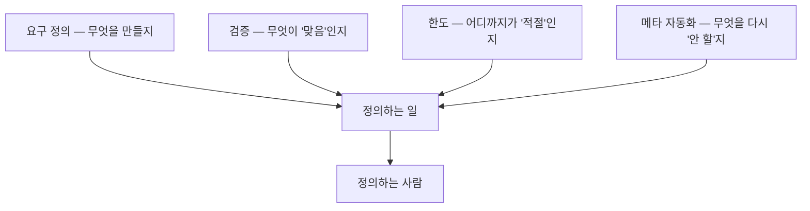

## 0. 회차마다 같은 자리로 돌아왔다

이 시리즈는 따로 떨어진 경험 여섯 개로 시작했다. 오래전 열역학 수업, 도구를 직접 붙여 본 날, 발표자료 한 장의 배치, 도구에게 설명하다 막힌 순간, 기록으로 결정을 굳힌 일, 확신에 차서 틀린 두 사건. 소재는 제각각인데, 회차를 닫을 때마다 같은 단어로 끝났다. **정의.**

> **무엇을 만들지, 무엇이 맞는지, 어디까지가 적절한지, 무엇을 다시 안 할지. 전부 "정의하는 일"이었다.**

## 1. 여섯 회차의 정의를 모으면

각 회차가 남긴 한 줄을 모아 본다.

| 회차 | 겪은 일 | 정의한 것 |
|---|---|---|
| 1 | 열역학→철학 | 과학이 깊어지면 "이게 무엇인가"를 정의하는 자리가 된다 |
| 2 | 도구 직접 붙여보기 | 실행이 공짜가 되면 아이디어를 정의하는 일이 전부다 |
| 3 | 발표자료 배치 | 배치는 미감이 아니라 "무엇이 핵심인가"의 정의다 |
| 4 | 설명하다 막힘 | 못 만든 게 아니라 못 정의한 것이다(언어화=요구 정의) |
| 5 | 기록으로 굳히기 | 메타 자동화는 "무엇을 다시 안 할지"의 정의다 |
| 6 | 확신에 차서 틀림 | 검증은 "맞음"을 정의하고 증거를 직접 보는 일이다 |

지난 9편 시리즈가 끝에서 정리했던 "사람에게 남는 네 가지"(요구 정의·검증·한도·메타 자동화)와 겹친다. 이번 시리즈는 그 넷이 사실 한 뿌리였음을 경험으로 다시 확인한 셈이다.

*그림. 네 능력은 모두 '~을 정의하는 일'이고, 한 뿌리로 모인다. 그 뿌리에 선 사람이 '정의하는 사람'이다.*

## 2. 그래서 "정의하는 사람"이란

이제 시리즈 제목을 정의할 수 있다. 정의하는 사람은 도구를 가장 잘 다루는 사람도, 가장 많이 아는 사람도 아니다. **무엇을 만들지, 무엇이 맞는지, 어디까지 할지, 무엇을 다시 안 할지를 정확히 정하는 사람**이다.

철학이 정의를 내리는 일이라면, 도구가 실행을 다 가져간 시대에 사람에게 남는 일은 그 자체로 철학적이다. 거창해서가 아니라, 결국 "이게 무엇인가", "무엇이 좋은 것인가", "무엇이 맞는 것인가"를 정하는 일이기 때문이다. 그 정의를 누가 내리느냐가, 도구를 부리는 사람과 도구에 휘둘리는 사람을 가른다.

## 3. 비전문가에게 더 그렇다

나는 개발자가 아니고 디자이너도, IT 전문가도 아니다. 시리즈를 시작할 때 그렇게 밝혔다. 여섯 회차를 지나며 그 사실이 약점이 아니라는 걸 봤다. 실행을 도구가 하는 시대에는, 전문 기술이 없어도 정의할 수 있으면 결과가 나온다. 막히는 건 기술의 부족이 아니라 정의의 흐림이었고, 정의는 기술이 아니라 생각과 언어에서 나온다.

> **정의할 수 있으면 뭐든 가능한 시대다. 그리고 정의하는 능력은 전문가의 전유물이 아니다.**

물론 일에 파묻혀 모든 걸 만들어 볼 수는 없다. 손은 하나고 시간은 짧다. 그래서 이 블로그는 다 해보겠다는 기록이 아니라, "정의할 수 있으면 가능하더라"를 비전문가가 직접 확인하고 남기는 기록이다.

## 4. 닫으며

이 시리즈가 내린 결론은 한 줄이다. **실행이 공짜가 된 시대에 사람에게 남는 마지막 일은, 정의하는 일이다.** 그 일은 전문가만의 것이 아니고, 거창한 재능도 아니다. 무엇을 원하는지 정확히 알고 정확히 말하는 연습이다. 읽고, 생각하고, 쓰면 길러진다.

그래서 다음에 또 막히면, 나는 "내가 못 만든다"고 하지 않으려 한다. 대신 이렇게 물을 것이다. "나는 이걸 정확히 정의했는가." 그 질문 앞에 서는 사람이, 이 시리즈가 말한 정의하는 사람이다.
