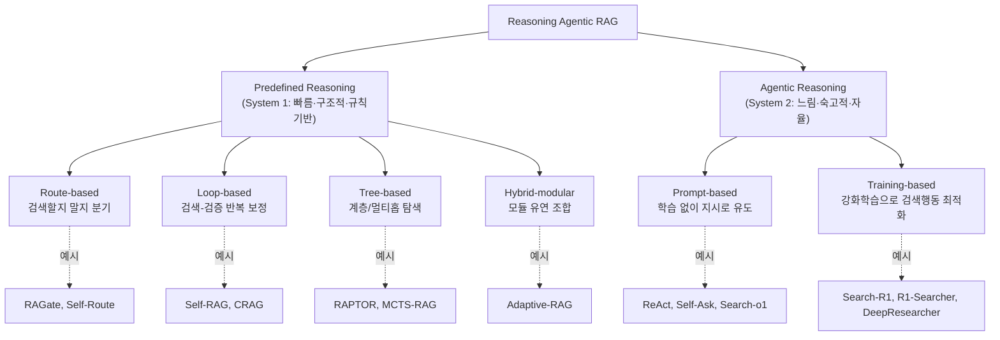

## TL;DR

RAG가 "검색 → 붙여넣기 → 생성"이라는 고정 파이프라인에서, **추론이 검색을 운전하는** Reasoning Agentic RAG로 옮겨가고 있다. 이 서베이는 그 방법들을 두 갈래로 가른다. 하나는 **predefined reasoning(사전정의 추론, System 1)** — 사람이 미리 짜둔 모듈 경로를 따라 검색을 보강하는 방식이고(Self-RAG·CRAG·RAPTOR·Adaptive-RAG 등), 다른 하나는 **agentic reasoning(에이전트 추론, System 2)** — 모델이 추론 도중 언제·무엇을·어떻게 검색할지 스스로 정하는 방식이다(ReAct·Search-o1·Search-R1·DeepResearcher 등). 전자는 빠르고 통제 가능하지만 정해진 길을 못 벗어나고, 후자는 유연하지만 비싸고 불안정하다. 실무에서 둘 중 무엇을 쓸지는 "내 작업이 정형 절차인가, 열린 탐색인가"로 갈린다.

> **이전의 RAG는 검색이 먼저고 추론이 나중이었다. Reasoning Agentic RAG는 순서를 뒤집는다 — 추론이 검색을 호출한다.**

- 제목: Reasoning RAG via System 1 or System 2: A Survey on Reasoning Agentic Retrieval-Augmented Generation for Industry Challenges
- 저자: Jintao Liang, Gang Su, Huifeng Lin, You Wu, Rui Zhao, Ziyue Li (소속은 arXiv 페이지에 미표기)
- arXiv: [2506.10408](https://arxiv.org/abs/2506.10408) (2025-06-12 제출)

이 글은 앞서 발행한 [RAG 고급 검색 정리](/building-with-ai/rag-advanced-retrieval/)와 에이전트 시리즈(agent-01~09), [GraphRAG 정리](/)의 학술적 뒷배경에 해당한다. 앞 글들이 "어떻게 만드는가"였다면, 이 서베이는 "지금 학계가 이 분야를 어떻게 분류하고 있는가"를 잡아준다.

## 1. 무엇을 정리한 서베이인가

먼저 이 논문이 푸는 문제부터. 초기 RAG는 정적 파이프라인이다. 질문이 들어오면 한 번 검색하고, 가져온 문서를 프롬프트에 붙여 답을 만든다. 잘 구조화된 단발 질의에는 충분하다. 그런데 실제 업무 질의는 그렇지 않다. 여러 문서에 흩어진 사실을 모아 종합해야 하고(multi-document synthesis), 한 번 검색으로는 부족해 추가 검색이 필요하며, 추론 사슬이 길어질수록 중간에 "이건 모르는 사실"이라는 지식 공백이 드러난다.

서베이의 주장은 명료하다. 이 한계를 넘으려고 분야가 **의사결정과 적응형 도구 사용을 검색 과정 안에 직접 심는** 방향으로 이동했고, 그것이 Reasoning Agentic RAG다. 논문은 이 흐름의 방법들을 모아 분류 체계를 세우고, 대표 기법을 짚고, 남은 연구 과제를 제시한다. 별도의 벤치마크 수치 비교 섹션은 두지 않는다 — taxonomy와 방법론 정리에 무게가 실린 서베이다.

논문 구성은 6장이다: Introduction / Related Work / Predefined Reasoning / Agentic Reasoning / Future Research Directions / Conclusions. 3장과 4장이 분류 체계의 두 기둥이다.

## 2. 분류 체계

핵심 발상은 인지과학의 이중 처리 이론(dual-process theory)을 빌려온 것이다. 사람의 사고를 빠르고 자동적인 System 1과 느리고 숙고적인 System 2로 나눈 카너먼의 틀을, 논문은 RAG에 대응시킨다.

> **인용**: "Predefined reasoning resembles System 1 thinking: fast, structured, and efficient... agentic reasoning aligns more closely with System 2 thinking: slow, deliberative, and adaptive." (논문 §Introduction)

*그림. 서베이의 두 패러다임과 세부 분류, 각 칸의 대표 기법. (출처: 논문 Figure 1 및 §3~§4 재구성, arXiv:2506.10408)*

두 패러다임의 성격 차이를 표로 정리하면 이렇다.

| 구분 | Predefined Reasoning (System 1) | Agentic Reasoning (System 2) |
|---|---|---|
| 누가 흐름을 정하나 | 사람이 미리 설계한 모듈 경로 | 모델이 추론 중 스스로 결정 |
| 검색 시점·횟수 | 파이프라인에 고정 | 동적 (필요할 때 필요한 만큼) |
| 통제·예측 가능성 | 높음 | 낮음 |
| 유연성 | 낮음 (정해진 길 밖은 못 감) | 높음 (열린 환경 대응) |
| 비용·지연 | 낮고 일정 | 높고 가변 |
| 대표 약점 | 설계된 경로에 갇힘 | 도구 사용 일관성·일반화 불안정 |

## 3. 대표 기법·시스템

분류 칸을 채우는 구체 기법들이다. 이름만 나열하면 의미가 없으니, 각 칸이 "검색을 어떻게 다루는가"로 묶어 본다.

### 3-1. Predefined Reasoning — 정해진 길을 따라 보강

- **Route-based (검색할지 말지 분기)**: 모든 질의에 검색을 거는 게 아니라, 맥락·확신도를 보고 검색을 켤지 끌지 분기한다. RAGate, Self-Route가 예시다. 모델이 이미 아는 질문에 불필요한 검색을 막아 비용·노이즈를 줄이는 장치다.
- **Loop-based (검색-검증 반복)**: 한 번 검색하고 끝내지 않고, 가져온 문서의 적합성을 평가해 부족하면 다시 검색하는 보정 루프를 돈다. **Self-RAG**(모델이 스스로 "검색이 필요한지", "가져온 근거가 답을 뒷받침하는지"를 토큰으로 자기평가), **CRAG**(Corrective RAG, 검색 결과 품질을 매겨 나쁘면 웹 검색 등으로 교정)가 대표다.
- **Tree-based (계층·멀티홉)**: 문서나 추론 단계를 트리로 조직해 멀티홉 질의를 푼다. **RAPTOR**(문서를 재귀적으로 요약해 트리로 쌓고 상·하위 노드를 함께 검색), MCTS-RAG(몬테카를로 트리 탐색을 추론에 결합)가 있다.
- **Hybrid-modular (모듈 조합)**: 위 방식들을 질의 난이도에 따라 유연하게 갈아끼운다. **Adaptive-RAG**가 예시로, 쉬운 질의는 검색 없이, 단순 질의는 단발 검색, 복잡 질의는 멀티스텝으로 경로를 바꾼다.

핵심은 이 모든 "분기·반복·트리·조합"이 **사람이 미리 설계한 구조**라는 점이다. 모델은 그 구조 안의 한 부품으로 동작한다.

### 3-2. Agentic Reasoning — 모델이 검색을 호출한다

여기서는 구조가 고정돼 있지 않다. 모델이 추론하다가 "지금 검색이 필요하다"고 판단하면 스스로 검색 도구를 부른다. LRM(Large Reasoning Model, o1·DeepSeek-R1처럼 긴 사고 사슬에 특화된 모델)의 등장이 이 흐름을 밀어 올렸다.

- **Prompt-based (학습 없이 지시로)**: 모델을 추가 학습시키지 않고, 프롬프트와 지시 따르기 능력만으로 도구 사용을 유도한다. **ReAct**(Reason+Act, 생각-행동-관찰을 번갈아 출력해 검색과 추론을 엮음), **Self-Ask**(스스로 하위 질문을 만들어 답해 나감), **Search-o1**(o1류 추론 모델의 사고 흐름 중간에 검색을 끼워 넣음)이 대표다. 구현이 쉽지만 복잡한 도구 사용 시나리오에서 동작이 들쭉날쭉하다.
- **Training-based (강화학습으로 검색 행동 최적화)**: 검색을 언제·어떻게 부를지를 강화학습으로 직접 학습시킨다. **Search-R1**, **R1-Searcher**(R1류 추론 모델에 검색 능력을 RL로 부여), **DeepResearcher**(실제 웹 환경에서 검색 에이전트를 end-to-end RL로 훈련)가 예시다. 프롬프트 방식보다 안정적이지만 보상 설계와 학습 비용이 든다.

### 3-3. 산업 구현 프레임워크

논문은 표(Table 2)로 오픈소스 구현체도 정리한다. 확인되는 이름은 DeepSearcher, RAGFlow, Haystack, Langchain-Chatchat, LightRAG, R2R, FlashRAG다. 학술 기법이 어떤 실전 도구로 내려오는지를 잇는 부분이다.

## 4. 산업 적용 과제 — 왜 어려운가

서베이가 짚는, 기본 RAG가 실무에서 깨지는 지점들이다.

- **여러 문서 종합(multi-document synthesis)**: 답에 필요한 정보가 여러 출처에 흩어져 있어, 검색만으로는 안 되고 일관된 종합이 필요하다.
- **멀티모달**: 대부분의 RAG는 텍스트 전용이라 이미지·표·도면 같은 비텍스트 입력을 그대로 다루지 못한다.
- **복잡 추론**: 다단계 문제 풀이, 적응형 정보 획득, 도구를 동원한 종합이 필요한 질의.
- **추론 중 지식 공백**: 사고 사슬이 길어질수록 중간에 모델이 모르는 사실이 드러나고, 그 시점에 검색이 들어가야 한다.
- **현실의 잡음**: 노이즈가 많고 비정형이며 끊임없이 바뀌는 웹 환경.
- **긴 컨텍스트의 lost-in-the-middle**: 긴 입력의 가운데에 놓인 정보가 양 끝보다 주목을 덜 받는 문제.

이 목록이 곧 "왜 정적 파이프라인을 넘어 추론·에이전트가 필요한가"의 근거다.

## 5. 평가·한계

이 서베이는 별도의 정량 벤치마크 비교 섹션을 두지 않는다. 대신 각 패러다임의 구조적 한계를 짚는다.

- **Predefined의 한계**: 미리 설계된 실행 경로에 묶여 유연성이 떨어진다. 설계자가 예상 못 한 질의 형태는 처리하기 어렵다.
- **Agentic·Prompt-based의 한계**: 복잡한 도구 사용 상황에서 성능이 일관되지 않다.
- **공통 난제**: 새 질의, 처음 보는 도구, 바뀌는 환경에 대한 견고한 일반화가 여전히 큰 숙제다. lost-in-the-middle도 미해결로 남는다.

향후 방향으로는 결과만이 아니라 과정을 보는 세밀한 보상 함수(process-oriented reward), 검색 효율 개선, 동적 환경 일반화, 정교한 도구 구성 능력을 든다.

여기서 주의할 점. 이건 서베이라 직접 실험한 수치가 아니라 **분류와 정성적 정리**다. "어느 방법이 몇 % 더 낫다"를 이 논문에서 기대하면 안 된다. 그 비교는 각 원논문과 별도 벤치마크의 몫이다.

## 6. 우리는 이걸 어디에 쓸까

내가 RAG나 에이전트를 만들 때 이 분류가 실제로 주는 것은 **선택의 좌표축**이다. 새 기법 이름을 외우는 게 아니라, 내 작업을 두 축 위 어디에 놓을지를 먼저 정하는 일이다.

**먼저 물어야 할 것: 이 작업은 정형 절차인가, 열린 탐색인가.** 답이 정해진 경로로 나오는 작업 — 예컨대 "사내 규정 문서에서 해당 조항을 찾아 요약" — 은 predefined로 충분하다. 경로가 고정돼 있으니 통제·비용·재현성이 다 유리하다. 반대로 "이 주제로 흩어진 자료를 찾아 종합 분석" 같은 열린 탐색은 검색 횟수와 순서를 미리 못 정한다. 여기서 agentic이 값을 한다.

**predefined부터 시작하는 게 보통 옳다.** 분류표를 보면 agentic이 더 "똑똑해" 보이지만, 비용·지연·불안정성이 따라온다. 대부분의 실무 질의는 Route-based(검색 켤지 말지)와 Loop-based(부족하면 한 번 더) 정도로 상당히 해결된다. Self-RAG·CRAG가 노리는 "불필요한 검색 막고, 나쁜 검색 결과를 교정"은 비용 대비 효과가 분명하다. agentic은 predefined로 안 풀리는 게 확인됐을 때 올라가는 단계다.

**agentic을 쓸 거면 prompt-based부터.** ReAct·Search-o1처럼 학습 없이 프롬프트로 도구 호출을 유도하는 방식이 진입장벽이 낮다. Search-R1·DeepResearcher 같은 training-based는 안정성을 얻는 대신 강화학습 인프라와 보상 설계가 필요하다 — 자체 모델을 굴리는 팀이 아니면 과한 투자다.

**한계를 미리 인지하고 설계한다.** 서베이가 공통 난제로 짚은 lost-in-the-middle과 일반화 불안정은 내가 만든 시스템에도 그대로 온다. 긴 문서를 한 번에 밀어넣기보다 검색·청킹으로 핵심만 올리고, 처음 보는 질의 형태에서 에이전트가 엉뚱한 도구를 부르는 경우를 검증 루프로 걸러야 한다.

여기서 도구 사용자의 일이 어디에 자리 잡는지가 드러난다. Claude Code 같은 코딩 에이전트로 RAG 파이프라인 코드를 짜는 건 점점 쉬워진다. 하지만 **내 작업을 이 두 축 위 어디에 놓을지 정하는 일**, 그리고 **agentic 시스템이 자율적으로 내린 검색 결정이 맞는지 검증하는 일**은 자동화되지 않는다. 이 서베이의 분류는 그 판단을 내릴 때 펼쳐 보는 지도다.

> **분류표를 외우는 게 아니다. 내 작업이 정형 절차인지 열린 탐색인지 먼저 가르고, predefined로 시작해 안 되는 만큼만 agentic으로 올라간다. 자율 검색의 결정을 검증하는 건 끝까지 사람 몫이다.**

---

## 출처

- Liang, J., Su, G., Lin, H., Wu, Y., Zhao, R., Li, Z., "Reasoning RAG via System 1 or System 2: A Survey on Reasoning Agentic Retrieval-Augmented Generation for Industry Challenges", arXiv:2506.10408, 2025-06-12, https://arxiv.org/abs/2506.10408
- HTML 전문: https://arxiv.org/html/2506.10408v1

*※ 본문의 분류 체계(System 1/2, route/loop/tree/hybrid, prompt/training-based), 대표 기법 이름(Self-RAG·CRAG·RAPTOR·Adaptive-RAG·ReAct·Self-Ask·Search-o1·Search-R1·R1-Searcher·DeepResearcher 등), 산업 구현 프레임워크 목록은 모두 위 arXiv 본문(Figure 1, §3~§4, Table 2) 기준이다. 저자 소속은 arXiv 페이지에 표기되지 않아 미확인. 이 논문은 정량 벤치마크 비교를 제시하지 않는 서베이이며, 개별 기법의 성능 수치는 각 원논문을 확인해야 한다.*
