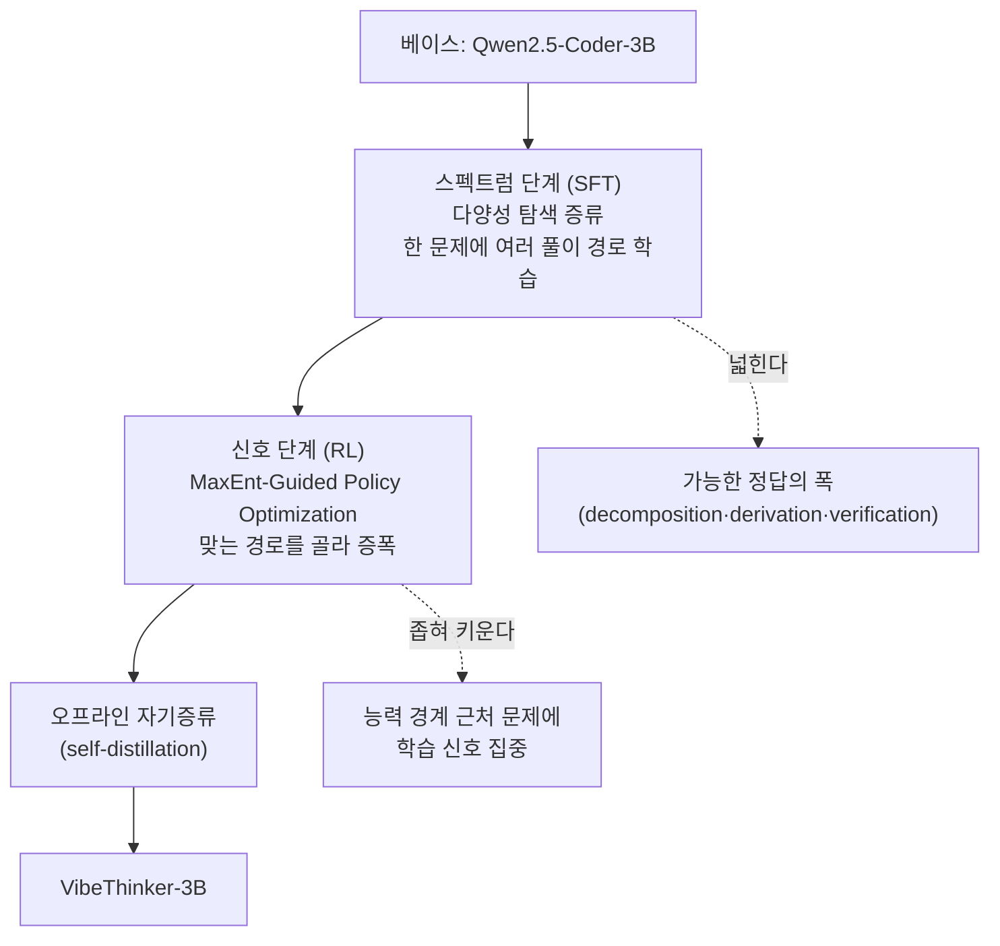

## TL;DR

VibeThinker-3B는 파라미터 3B짜리 작은 밀집(dense) 모델이다. Qwen2.5-Coder-3B를 베이스로 후처리(post-training)만으로, 수학·코딩처럼 정답을 채점할 수 있는 "검증 가능한 추론(verifiable reasoning)" 과제에서 AIME26 94.3, LiveCodeBench v6 Pass@1 80.2를 찍는다. DeepSeek V3.2·GLM-5·Gemini 3 Pro 같은 수백 배 큰 모델과 같은 성능대에 들어간다. 비결은 SFT를 "정답의 다양성을 넓히는 단계", RL을 "그중 맞는 경로를 증폭하는 단계"로 분리한 Spectrum-to-Signal 방식이다. 다만 이 강함은 정답을 자동 채점할 수 있는 좁은 영역에 한정되고, 일반 지식 과제에서는 여전히 큰 모델에 밀린다. 저자들은 이걸 "추론은 작은 코어로 압축되지만, 지식은 넓은 파라미터 면적을 요구한다"는 가설로 정리한다.

> **추론 능력은 작은 코어에 압축할 수 있다. 하지만 세상의 사실을 다 담는 일은 파라미터 면적을 요구한다 — 작은 모델이 강한 영역과 약한 영역이 갈리는 이유다.**

- 제목: VibeThinker-3B: Exploring the Frontier of Verifiable Reasoning in Small Language Models
- 저자: Sen Xu, Shixi Liu, Wei Wang 외 (Weibo AI)
- arXiv: [2606.16140](https://arxiv.org/abs/2606.16140) (2026-06-15) · 가중치/코드 MIT 라이선스로 공개

내가 이 논문을 고른 이유는 두 가지다. 우리 블로그 독자가 관심을 두는 온디바이스·로컬 추론과 정확히 맞닿아 있고(3B면 소비자용 GPU 한 장, VRAM 6~7GB대에 올라간다), 공개 직후 벤치마크 수치를 두고 논쟁이 붙은 화제작이기 때문이다. 작은 모델이 큰 모델을 "이겼다"는 주장은 늘 의심하고 봐야 한다. 그래서 수치 자체보다 그게 어떤 조건에서 성립하는지를 따져 보는 게 이 글의 목적이다.

## 무엇을 한 연구인가

이 논문이 던지는 질문은 단순하다. 추론 능력을 끝까지 밀어붙이려면 모델이 꼭 커야 하는가. 보통 강한 추론 모델이라고 하면 DeepSeek R1(671B), GPT-5, Gemini 3 Pro처럼 수백 GB짜리를 떠올린다. VibeThinker-3B는 그 반대편에서 출발한다. 베이스 모델을 처음부터 학습시키지 않고, 이미 공개된 3B 모델(Qwen2.5-Coder-3B)에 후처리만 얹는다.

핵심 주장은 "작은 모델은 큰 모델의 싸고 못한 대체재가 아니라, 특정 능력대에서는 큰 모델과 같은 성능에 도달하는 별개의 경로"라는 것이다. 단, 그 '특정 능력'이 무엇인지가 이 논문의 전부라고 봐도 된다. 바로 **검증 가능한 추론**, 즉 정답을 기계적으로 채점할 수 있는 수학 경시·코딩 문제다. AIME 같은 수학 시험이나 LeetCode 제출은 맞았는지 틀렸는지가 명확하다. 이 영역에서는 모델이 외워 둔 사실의 양보다, 풀이 경로를 탐색하고 제약을 만족시키고 오류를 교정하는 능력이 성패를 가른다. 저자들은 이 능력이 작은 파라미터에 압축될 수 있다고 본다.

## 데이터와 세팅

베이스는 Qwen2.5-Coder-3B다. 추론 능력을 통째로 처음부터 학습하는 게 아니라, 이미 코딩·수학 사전지식을 가진 3B 모델을 후처리로 갈아 넣는 방식이다. 직전 작업인 VibeThinker-1.5B가 Qwen2.5-Math-1.5B에서 출발한 것과 같은 계열의 접근이다.

평가는 정답 채점이 가능한 과제에 집중한다.

| 벤치마크 | 성격 | VibeThinker-3B |
|---|---|---|
| AIME26 | 미국 수학경시 | 94.3 (테스트타임 스케일링 시 97.1) |
| HMMT25 | 수학경시 | 89.3 |
| IMO-AnswerBench | 국제수학올림피아드형 | 76.4 |
| LiveCodeBench v6 | 코딩 Pass@1 | 80.2 |
| 미공개 LeetCode 콘테스트 | OOD 일반화(수락률) | 96.1% |
| IFEval | 지시 준수 | 93.4 |

여기서 IFEval 93.4가 한 가지를 말해 준다. 추론을 극단으로 끌어올렸다고 해서 "시키는 대로 따르는" 기본기가 무너지지는 않았다는 것이다. 추론 특화 후처리가 일반 통제력을 깎아먹는 흔한 부작용을 피했다는 근거로 제시된다.

직전 1.5B 버전의 후처리 비용은 H800 GPU 3,900시간, 시간당 2달러 대여가 기준으로 약 7,800달러였다(VentureBeat 보도, arXiv 2511.06221). 3B 버전 논문에는 정확한 GPU 시간이나 비용이 적혀 있지 않다. 즉 "7,800달러로 거대 모델을 이겼다"는 자주 인용되는 수치는 **1.5B 버전의 것**이고, 3B의 비용은 논문에 미공개다. 이 구분을 흐리는 인용이 많아 여기 명시해 둔다.

## 방법과 학습

학습의 뼈대는 Spectrum-to-Signal Principle(SSP, 스펙트럼에서 신호로)이다. SFT(지도 미세조정)와 RL(강화학습)이 흔히 하나의 정답 경로를 따라 같은 방향으로 모델을 좁히는 데 반해, SSP는 둘의 역할을 일부러 분리한다.

*그림. 정답의 폭을 먼저 넓히고(SFT) 그중 맞는 경로를 증폭하는(RL) 두 단계 구조.*

스펙트럼 단계(SFT)는 모델이 **하나의 풀이로 수렴하지 않게** 한다. 한 문제에 대해 여러 후보 추론 경로(분해 방식·유도 경로·검증 전략)를 샘플링해 증류하고, 도메인별 전문가 모델을 병합해 출력 다양성을 유지한다. 정답을 좁혀 외우게 하는 보통의 SFT와 정반대 방향이다. 일부러 답의 스펙트럼을 넓게 펴 둔다.

신호 단계(RL)는 그 넓은 후보 중에서 맞는 경로에 힘을 싣는다. 여기 쓰인 게 MaxEnt-Guided Policy Optimization(MGPO)이다. MGPO는 지금 모델의 **능력 경계 근처에 있는 문제**를 골라 학습 신호를 준다. 정답률이 0에 가까운(너무 어려운) 문제나 1에 가까운(이미 다 푸는) 문제는 배우는 게 거의 없으니 가중치를 낮추고, 맞는 풀이와 틀린 풀이가 섞여 나오는 중간 난도 문제에 가중치를 높인다. 사람도 이미 다 아는 문제나 손도 못 대는 문제보다, 반쯤 풀리는 문제에서 가장 빨리 는다. 그 직관을 정답률 분포에 대한 가중으로 구현한 것이다.

마지막으로 오프라인 자기증류(self-distillation)로 마무리한다.

## 핵심 결과와 수치

가장 눈에 띄는 비교를 추려 본다. 같은 벤치마크에서 VibeThinker-3B와 거대 모델을 나란히 둔 수치다.

| 벤치마크 | VibeThinker-3B (3B) | 비교 모델 |
|---|---|---|
| AIME26 | 94.3 | Gemini 3 Pro 91.7 |
| HMMT25 | 89.3 | GPT-5 high 88.3 / Gemini 3 Pro 97.5 |
| IMO-AnswerBench | 76.4 | DeepSeek R1 0528(671B) 60.8 / Gemini 3 Pro 83.1 |

AIME26에서는 Gemini 3 Pro를 앞서고, IMO-AnswerBench에서는 671B짜리 DeepSeek R1을 76.4 대 60.8로 크게 앞선다. 200분의 1 크기 모델이 같은 수학 채점에서 더 높은 점수를 내는 셈이다. 반대로 HMMT25에서는 Gemini 3 Pro(97.5)에 한참 밀린다. 즉 "모든 추론에서 이긴다"가 아니라, **벤치마크마다 갈린다.** 평균을 내서 "거대 모델급"이라 말할 수는 있어도, 항목별로 보면 거대 모델이 더 강한 칸도 분명히 있다.

테스트타임 스케일링(claim-level reliability assessment, 추론 시 더 많은 후보를 뽑아 신뢰도를 평가하는 방식)을 켜면 AIME26이 94.3에서 97.1로 오른다. 추론 시점에 연산을 더 써서 점수를 끌어올리는 흔한 기법이고, 학습이 끝난 모델 자체의 한계는 94.3 쪽으로 읽는 게 맞다.

## 한계

저자들이 직접 인정하는 약점이 핵심이다. 이 모델이 강한 곳은 정답을 채점할 수 있는 검증 가능한 추론에 한정된다. **지식 집약(knowledge-intensive) 과제에서는 여전히 큰 모델에 못 미친다.** 저자들은 이를 Parametric Compression-Coverage Hypothesis(파라미터 압축-커버리지 가설)로 정리한다. 검증 가능한 추론은 방대한 사실 암기보다 탐색·제약 만족·오류 교정·다단계 합성이 핵심이라 작은 코어로 압축이 되지만, 개방형 지식·롱테일 사실·개념 연관은 넓은 파라미터 면적을 요구한다는 것이다. 그래서 3B 모델이 수학에서는 거대 모델을 따라잡으면서도 지식 과제에서는 격차가 남는다.

검증 측면의 한계도 짚어야 한다. Sebastian Raschka는 공개 직후(2026-06-17) 노트에서 "모델이 아직 매우 새롭고, 벤치마크 수치가 사실이라기엔 너무 좋을 수도 있다"며 며칠간 실사용으로 확인이 필요하다고 적었다(출처: 그의 블로그). 작은 모델이 특정 벤치마크에서 거대 모델을 추월했다는 주장은, 학습 데이터에 평가 문제와 유사한 내용이 섞였을 가능성(오염)을 늘 의심해야 한다. 이 논문이 OOD 일반화로 내세우는 미공개 LeetCode 콘테스트 수락률 96.1%는 그 의심에 대한 답으로 제시된 수치다. 학습 이후에 새로 나온 문제에서도 통한다는 근거이긴 하나, 수학 경시 벤치마크 전반의 오염 여부까지 가려 주지는 않는다.

마지막으로, 헤드라인으로 자주 도는 "7,800달러"는 1.5B 버전의 후처리 비용이고 3B 비용은 미공개라는 점, 그리고 이 모든 성능이 정답 채점이 가능한 좁은 과제군에 한정된다는 점을 분리해서 받아들여야 한다.

## 실무 함의 — 작은 모델을 쓸 때 사람이 해야 하는 일

이 논문을 읽고 내가 다시 확인한 건, 모델 크기 선택이 곧 "무엇을 시킬지"의 선택이라는 점이다. VibeThinker-3B는 정답을 채점할 수 있는 좁은 과제에서 강하고, 그 밖에서는 약하다. 그렇다면 3B를 로컬에 띄워 쓸 때 사용자가 해야 하는 일은, 모델을 믿는 것이 아니라 **자기 과제가 검증 가능한 종류인지부터 판별하는 것**이다. 수식 계산·코드 생성처럼 결과를 자동으로 채점·실행해 확인할 수 있는 일이라면 3B로 충분할 수 있다. 반면 사실 질의·도메인 지식·롱테일 정보가 핵심이라면, 같은 3B를 들고 와도 답이 그럴듯하게 틀린다.

이 판별은 도구가 대신 해 주지 않는다. 나는 Claude Code로 자동화를 만들 때, 모델이 만든 결과를 어떻게 검증할지(테스트로 돌릴지, 채점기로 거를지, 사람이 확인할지)를 먼저 설계한다. VibeThinker가 강한 영역과 약한 영역이 갈리는 이유 자체가 "채점이 되느냐"에 있다는 사실은, 그대로 우리 작업 설계 원칙이 된다. 검증 경로를 만들 수 있는 과제는 작은 모델로 싸게 자동화하고, 검증 경로가 없는 과제는 모델 크기를 키워도 안심할 수 없으니 사람의 확인을 끼워 넣는다.

작은 모델이 거대 모델을 따라잡는 흐름이 의미 있는 건, 그래서 비용이 싸진다는 결론이 아니다. 어떤 일을 기계가 자동 채점할 수 있게 정의하는 능력, 그리고 채점이 안 되는 일을 가려내 사람의 검증을 배치하는 능력 — 모델이 작아질수록 그 두 가지를 사용자가 더 분명히 해야 한다.

> **모델이 작아져 싸게 돌릴 수 있게 될수록, 사용자가 잘해야 하는 일은 그대로다. 무엇을 검증 가능한 형태로 정의할지, 그리고 채점이 안 되는 일에 누가 책임지고 확인할지를 정하는 것.**

## 출처

- 논문: [VibeThinker-3B: Exploring the Frontier of Verifiable Reasoning in Small Language Models (arXiv 2606.16140)](https://arxiv.org/abs/2606.16140)
- 선행 작업: [Tiny Model, Big Logic: VibeThinker-1.5B (arXiv 2511.06221)](https://arxiv.org/abs/2511.06221)
- 가중치: [WeiboAI/VibeThinker-3B (Hugging Face)](https://huggingface.co/WeiboAI/VibeThinker-3B) · 코드: [WeiboAI/VibeThinker (GitHub)](https://github.com/WeiboAI/VibeThinker)
- 1.5B 후처리 비용 보도: [VentureBeat — VibeThinker-1.5B $7,800 post-training budget](https://venturebeat.com/ai/weibos-new-open-source-ai-model-vibethinker-1-5b-outperforms-deepseek-r1-on)
- 공개 직후 평가: [Sebastian Raschka — VibeThinker-3B Post-Training Notes](https://sebastianraschka.com/blog/2026/vibethinker-3b-post-training.html)

*수치 주의: 본문 벤치마크 수치는 arXiv 2606.16140 초록과 본문, 비교 모델 수치는 같은 논문의 비교표에서 확인한 값이다. 후처리 비용 7,800달러는 1.5B 선행 버전(2511.06221)의 값이며 3B 버전의 비용은 논문에 미공개다. 일부 비교 모델의 동일 벤치마크 점수는 논문에 표기되지 않아 비교에서 제외했다.*
